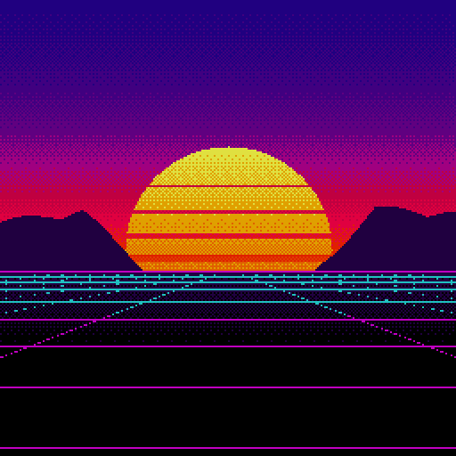

# «Закат» — демка для ПЭВМ «Вектор-06Ц»

Эксперимент с Opus 5. 36 минут раздумий с доступом к файлам Базиса.

Промпт: Напиши простенькую демку с картинкой и музыкой на AY для персонального компьютера Вектор-06ц. Полная свобода самовыражения.

Первый результат дал rom в 64 килобайта.
Вторым промптом: А давай сделаем минимальный ром, со сжатыми данными, распаковкой картинки куда надо.



Картинка 256×256 в 16 цветах, анимация палитры и трёхголосая музыка на музыкальном сопроцессоре AY-3-8910.

Готовый образ — `demo.rom`, **4276 байт**, грузится с адреса 0100h.
Все данные лежат в нём упакованными и разворачиваются на старте: картинка — сразу в видеопамять, палитра и музыка — в буферы в ОЗУ.
Распаковка занимает около секунды, на это время экран гасится чёрной палитрой, чтобы не показывать мусор.

## Как запустить

Файл `.rom` понимают все эмуляторы «Вектора»: [v06x](https://github.com/svofski/vector06sdl), [Emu80](https://github.com/vpyk/emu80v4), эмулятор [Дмитрия Целикова](https://bashkiria-2m.narod.ru/).

Например:

```
v06x --rom demo.rom
```

Для звука нужен включённый AY (порты 14h/15h).
Без платы AY на реальной машине картинка и анимация палитры работают, но играть будет нечему — демка не использует встроенный таймер ВИ53.

## Как собрать

```
python3 build.py
```

Скрипт рисует картинку, сочиняет музыку, сжимает всё это, собирает `demo.asm` ассемблером [v6asm](https://github.com/parallelno/v6asm) и складывает результат в `demo.rom`.
Промежуточные блобы попадают в `build/` и подставляются в исходник через `.incbin`.
Готовый `demo.rom` тут же прогоняется в [v6emul](https://github.com/parallelno/v6emul): картинка, которую демка развернула в видеопамять, сверяется с эталоном из `art.py`.

Нужны `v6asm`, `v6emul` и python3 с numpy и PIL.
Без `v6emul` сборка проходит, просто пропускает проверку.

Самотест упаковщика:

```
python3 lz.py --selftest         # упаковщик: разворот туда-обратно
```

## Из чего состоит

| файл | что делает |
| --- | --- |
| `demo.asm` | сама демка на ассемблере i8080 |
| `lz.py` | LZSS-упаковщик под распаковщик из `demo.asm` |
| `art.py` | рисование картинки, упаковка в битпланы, кадры анимации палитры |
| `music.py` | сочинение мелодии и рендер в дамп регистров AY |
| `build.py` | сборка `demo.rom` и `preview.png` |

## Раскладка образа

```
0100h..02EDh   код, 494 байта (из них распаковщик 109)
02EEh..11B3h   упакованные данные, 3782 байта:
                 картинка  32768 -> 2387   (7.3%)
                 палитра    1600 ->  123   (7.7%)
                 музыка    10752 -> 1272  (11.8%)
--- на этом образ кончается, дальше только ОЗУ ---
11B4h..41F3h   буферы: 100 кадров палитры и 768 кадров музыки
8000h..FFFFh   видеопамять, картинка разворачивается прямо в неё
```

Упакованные данные лежат ниже буферов, а распаковщик всегда пишет выше, чем читает, — затереть себе источник он не может.
Это проверяется прямо на сборке: в конце `demo.asm` стоят `.if`/`.error`, которые роняют ассемблер, если раскладка поехала или буферы заехали в видеопамять.
Количество кадров палитры и музыки `build.py` кладёт в `build/sizes.asm`, а `demo.asm` подключает его через `.include` - у этих чисел ровно один источник правды.

## Как это устроено

**Видеопамять.**
4 битплана по 8 КБ: `8000h`, `A000h`, `C000h`, `E000h`.
Внутри плана адрес — `(x >> 3) * 256 + (255 - y)`, бит 7 байта — самый левый пиксель восьмёрки.
План `8000h` даёт бит 3 индекса цвета, `A000h` — бит 2, `C000h` — бит 1, `E000h` — бит 0.

**Палитра.**
16 регистров, байт цвета — `bbgggrrr` (красный и зелёный по 3 бита, синий 2).
Индекс программируемого цвета кладётся в порт 2 (порт B ППИ, он же цвет бордюра), значение — в порт 0Ch.
Растр защёлкивает запись только в бордюре, поэтому вся палитра перезаписывается сразу после кадрового прерывания процедурой `colorset` — она целиком взята из [FastPalProg 2.1](../fast_pal_prog/) [Ивана Городецкого](../../authors/ivagor) (2018), где расстановка команд и задержек уже выверена по тактам.
Менять что-либо внутри неё нельзя.

**Анимация.**
Кадры палитры посчитаны заранее и лежат таблицей: каждый кадр демка просто берёт следующие 16 байт.
Полосы солнца переливаются от жёлтого к оранжевому, сетка «дышит».
Все оттенки солнца заведомо желтее самого жаркого неба, иначе на части фаз диск сливался бы с закатом.

**Упаковка.**
Свой LZSS: поток управляющих битов, 1 — литерал, 0 — ссылка назад двумя байтами (13 бит смещения, 3 бита длины; длина 3..9, а при коде 7 длина лежит в отдельном байте, ноль в котором означает конец потока).
Разбивка 13/3 выбрана замером на этих самых данных: окна в 4 КБ не хватает, потому что вторая половина музыки повторяет первую на расстоянии 5376 байт, а трёх бит на длину достаточно — длинные ссылки всё равно требуют отдельного байта.
Против варианта 12/4 это минус 8.5% при том же размере распаковщика.

Распаковщик занимает 109 байт.
Ссылки копируются побайтно вперёд, поэтому ссылка может наезжать сама на себя — это и даёт RLE для длинных однотонных кусков.
`lz.compress` при каждой упаковке разворачивает результат эталонной распаковкой на Python и сверяет с исходником, так что рассинхрон упаковщика и формата поймается на сборке, а не на экране.

**Музыка.**
Мелодия сочиняется на Python и рендерится в подкадровый дамп: 14 байт (регистры 0..13) на каждый из 768 кадров.
Проигрыватель на «Векторе» — это цикл из 14 пар `out 15h` / `out 14h`, никакой логики трекера в асме нет.
Регистр 13 (форма огибающей) при любой записи перезапускает огибающую, поэтому в дампе он помечен значением 0FFh = «не писать» во всех кадрах, кроме тех, где спад баса надо начать заново.

Гармония — Am–F–C–G дважды, 125 BPM.
Канал A — арпеджио, канал B — мелодия, канал C — бас на огибающей и хай-хэт шумом между долями.

Периоды тона считаются для тактовой AY 1.7734 МГц (как на платах Саттарова и харьковской).
v06x моделирует 1.75 МГц, разница — четверть полутона на всю пьесу, на слух не ловится.

## Проверка

Демка проверена сквозным прогоном в эмуляторе v06x ([svofski/vector06sdl](https://github.com/svofski/vector06sdl)):

```
v06x --rom demo.rom --max-frame 320 --save-frame 100 --save-frame 150 --record-audio out.wav
```

- снятые кадры совпали с ожидаемым рендером `preview.png` **попиксельно** (0 расхождений из 65536) на разных фазах анимации — это разом проверяет и раскладку видеопамяти, и палитру, и распаковщик: ошибись он хоть в одном байте, картинка бы поехала;
- кадры, снятые через каждые 100 кадров экрана, попадают на одну и ту же фазу палитры — демка не теряет кадров;
- до 51-го кадра экран полностью чёрный, картинка и музыка стартуют одновременно на 51-м — распаковка укладывается в секунду и мусора не показывает;
- в записи звука бас идёт по нотам прогрессии (отклонение меньше трети полутона, в пределах разрешения БПФ), а шумовые всплески хай-хэта приходятся ровно на строки 2, 6, 10, 14 такта.

## История версий

**1.0.1** (2026-08-26) - сборка переведена на ассемблер [v6asm](https://github.com/parallelno/v6asm), проверка готового образа - на [v6emul](https://github.com/parallelno/v6emul).
Свой ассемблер на python убран, проверки раскладки памяти переехали из `build.py` прямо в `demo.asm` как `.if`/`.error`.
`demo.rom` не изменился: собранный новым тулчейном образ совпал со старым бит в бит.
Исходники обеих версий лежат в `source.7z` по папкам `1.0.0/` и `1.0.1/`.

**1.0.0** (2026-08-15) - первый выпуск, сборка своим ассемблером на python.
