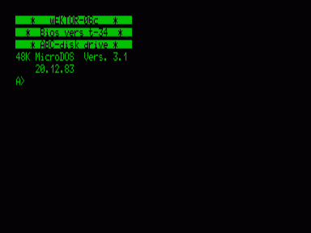

Поддерживает работу с дисками A,B (дисководы), C (квазидиск).
В архиве несколько вариаций ОС, а также загрузочные системные образы дисков в форматах EDD и FDD
См. также [Файловый менеджер CO](../co).

