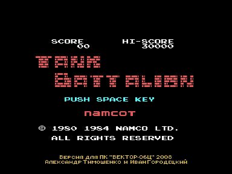
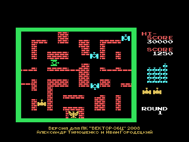

Tank Battalion — аркадная игра, выпущенная Namco в 1980 г. В 1984 г. портирована на MSX под оригинальным названием. В 1985 г. портирована на приставку NES под названием Battle City. В 2008 году версия для MSX была дизассемблирована, рекомпилирована с кода процессора Z80 в код КР580ВМ80А и адаптирована на ПК «Вектор-06Ц» (версия 1.0 — 19.08.2008).
Демонстрировалась на ежегодной выставке $CC08.

Игрок, управляя танком, должен уничтожить на каждом уровне по 20 танков противника, которые появляются в верхней части экрана. Танки противника в свою очередь пытаются уничтожить игрока и его штаб (обозначается на карте в виде орла).

