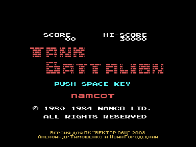
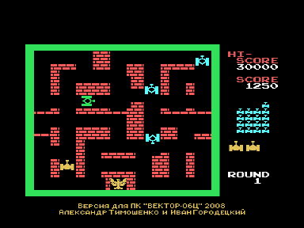

Tank Battalion — аркадная игра, выпущенная Namco в 1980 г.
В 1984 г. портирована на MSX под оригинальным названием.
В 1985 г. портирована на приставку NES под названием Battle City.
В 2008 году версия для MSX была дизассемблирована, рекомпилирована с кода процессора Z80 в код КР580ВМ80А и адаптирована на ПК «Вектор-06Ц» (версия 1.0 — 19.08.2008).
Демонстрировалась на ежегодной выставке $CC08.

Игрок, управляя танком, должен уничтожить на каждом уровне по 20 танков противника, которые появляются в верхней части экрана.
Танки противника в свою очередь пытаются уничтожить игрока и его штаб (обозначается на карте в виде орла).
Вектористы, наверное, помнят замечательные адаптации игрушек с MSX, выполненные на ПО "Счетмаш" в конце 80х - начале 90х.
Потом были не менее хорошие адаптации со спектрума, но оставалось еще много интересных игрушек с MSX, ждавших своего часа.
И вот, почти 20 лет спустя, мы представляем Вам конверсию игры TANK BATTALION, выполненную в лучших традициях векторовских программистов-адаптаторов.

Игра работает на обычном Векторе с КР580, не требует квазидиска.
Звук выводится через Sound Tracker или R-Sound 2.
Если у Вас нет таких плат, то на "железном" Векторе можно будет дать ушам отдых, а все современные эмуляторы Вектора поддерживают AY.

Управление в игре - курсор, пробел, для паузы нужно нажать "P" (латинская П)

Авторы адаптации:
Рекомпиляция игры с z80 на КР580 - Александр Тимошенко, г. Чернигов, Украина, timsoft@mail.ru, vector06c.narod.ru
Эмуляция MSX BIOS и железа MSX на Векторе, оптимизация - Иван Городецкий, г. Уфа, Россия, iig1@mail.ru

Версия 1.0 - 19.08.2008
- Первая версия

Версия 1.1 - 28.08.2008
- Добавлен режим паузы
- "Косметические изменения"

Версия 1.2 - 29.08.2008
- Немного увеличена скорость для ситуаций, когда на экране много спрайтов
- Улучшена "эстетика" игрового процесса

Версия 1.4 - 27.10.2008
- Еще немного улучшена "эстетика" игрового процесса
- Другой упаковщик, файл игры стал короче
- Изменен логотип

