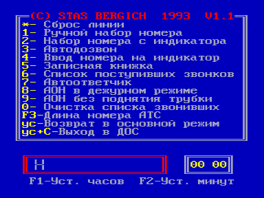

Телекоммуникационная система TELECOM V1200

Назначение:

— установление  связи  и  передача цифровой информации между вычислительными машинами по выделенным и коммутируемым телефонным линиям.

— автоматиченское определение номера и использование компьютера в качестве телефона с богатыми сервисными возможностями.

Состав пакета:

AON10.COM, AON11.COM — программа секретарь &ndash; АОН

VSND.COM —  программа для передачи файлов по телефонной линии.

VRCV.COM — программа для приема файлов по телефонной линии.

DIAL.COM — осуществляет набор номера и связывает двух абонентов.

OFFLINE — отключает модем от телефонной  линии.

ONLINE — подключает модем к телефонной линии.

IS.COM — основной блок информационной системы.

SMODEM.COM — сервисная  программа для  работы  модема, включающая все перечисленные утилиты. Интерфейс системы аналогичен оболочке ASC.COM. Программа оснащена телефонным справочником и возможностью автодозвона по межгороду. Программа снабжена помощью и очень удобна в работе.

