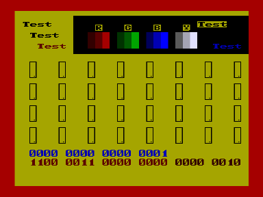
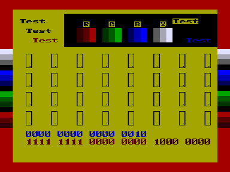

Тест технологического прогона.
Предназначен для проверки основных узлов ПЭВМ в течение длительного времени.
В архиве стандартная и упакованная версии.

См. также [РП «Тестовые программные средства»](../test_kirov).

