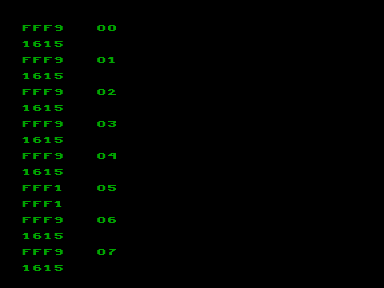
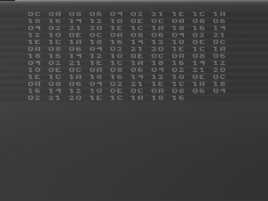

Тесты, которые использовались для отладки эмуляции ВИ53 посредством сравнения результатов, полученных на реальном Векторе (см. скриншоты) и в эмуляторах.

О тесте tst8253:

«Тест третьего режима таймера: загружается (только младший байт) число 33, цикл опроса составляет 64 такта, т.е. 32 тика таймера, таким образом каждая следующая итерация попадает на следующий тик таймера.

Целиков Дмитрий

[http://bashkiria-2m.narod.ru/](http://bashkiria-2m.narod.ru/) 07/10/2009»

См.также [chkvi53](../chkvi53)

