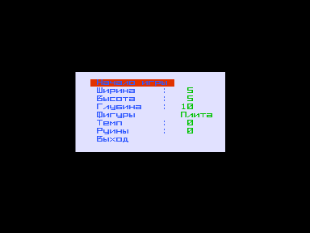
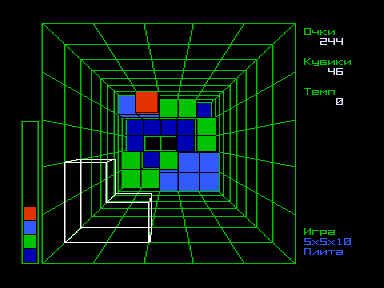

Аналог игры Block Out на IBM PC.
Игра отличается от классического тетриса только еще одним лишним измерением.
Теперь их не два, а целых три!

Имеется три набора фигур: Плита &ndash; плоские фигуры с количеством кубиков от 1 до 4; Основа &ndash; все возможные фигуры с количеством кубиков от 1 до 4; Страх &ndash; все возможные фигуры с количеством кубиков от 1 до 5.
Цель игры состоит в том, чтобы как можно дольше не засыпаться или набрать наибольшее количество очков.
Есть возможность заполнить стакан до определенной высоты случайно сгенерированным содержимым.
Можно задавать любые размеры стакана.
В игре 9 скоростей.

Для мастеров: попробуйте сыграть в  (3x3x6, Страх). Авторский рекорд &ndash; около 28000.

Кнопки меню:

    ↑, ↓ &ndash; лазить по строкам;

    ←, → &ndash; менять значения;

    ВК &ndash; выбор пункта меню.

Кнопки игры:

    ↑, ↓, ←, → &ndash; движение фигуры в плоскости экрана;

    J, F &ndash; вращение в перпендикулярной вертикальной плоскости в обе стороны;

    C, Y &ndash; вращение в перпендикулярной горизонтальной плоскости в обе стороны;

    U, W &ndash; вращение в плоскости экрана в обе стороны;

    Пробел &ndash; сброс фигуры;

    АР2 &ndash; выход в меню.

Строки меню:

    Начало игры -- сами, надеюсь, поняли;

    Ширина -- ширина стакана;

    Высота  -- высота стакана;

    Глубина -- глубина стакана;

    Фигуры  -- набор фигур (Плита, Основа, Страх);

    Темп -- скорость падения фигур;

    Руины -- высота случайного заполнения стакана;

    Выход -- выход в DOS.

Игра и исходники предоставлены автором в 2008 году.

Программа полностью написана на языке BDS C v1.50 с подключенными к нему драйверами устройств от Basic v2.5.
Вставок на ассемблере нет, поэтому игра несколько тормизит.
Игра является демонстрацией возможностей языка BDS C v1.50.

Диск загрузочный.
Для загрузки с диска в эмуляторе [http://bashkiria-2m.narod.ru/](http://bashkiria-2m.narod.ru/) удерживая F1+F2, однократно нажать F11.
После загрузки программы нажать F12.

См. также [Тетрис](../).

