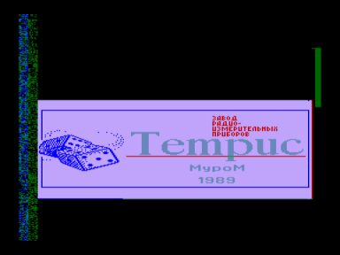
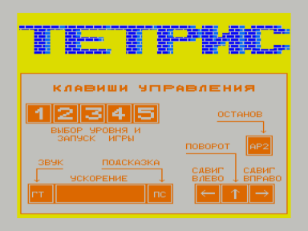

Игра «Тетрис».
Входит в состав ПО базовой кассеты ПК «Криста-2».

См. также: [Тетрис](../tetris)

Файлы:
- A03-Tetris.wav — формат «Криста-2» (с заставкой)
- A03-Tetris.rom — для запуска с адреса 100h

Файлы получены из wav c оригинальной кассеты (оцифровал fan):
http://sblive.narod.ru/ZX-Spectrum/Krista2/Krista2.htm

