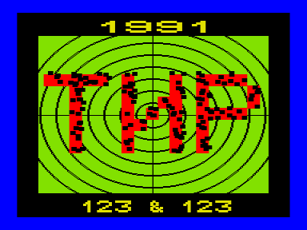
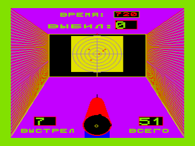

Играющий находится в тире.
Управление сводится к спуску курка в момент, когда пьяно блуждающий прицел находится в наиболее благоприятном положении.

В архиве две несильно различающихся версии игры.
Одна не содержит никаких признаков авторской подписи, вторая называет авторами Голубева Е.В. и Голубева А.В. из Кирова.

