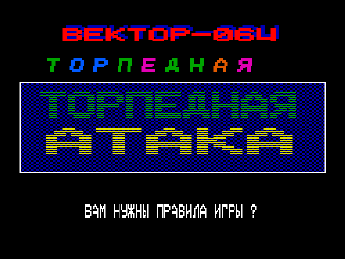
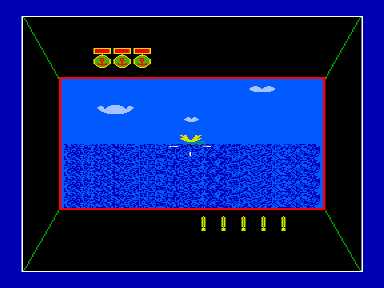

Игра "ТОРПЕДНАЯ АТАКА" со стандартной базовой кассеты

КАПИТАН!  ВЫ НАЗНАЧАЕТЕСЬ КОМАНДИРОМ ПОДВОДНОЙ ЛОДКИ.
ПОСТАРАЙТЕСЬ ПОТОПИТЬ КОРАБЛИ НЕПРИЯТЕЛЯ.
УПРАВЛЕНИЕ ПРИЦЕЛОМ ОСУЩЕСТВЛЯЕТСЯ КЛАВИШАМИ `ВЛЕВО`-`ВПРАВО`, УСКОРЕННОЕ ПЕРЕМЕЩЕНИЕ ПРИЦЕЛА ПРИ ОДНОВРЕМЕННОМ НАЖАТИИ КЛ.`СС` ИЛИ КЛ.`РУС`, ПУСК ТОРПЕДЫ ПРОИЗВОДИТСЯ КЛ.- `ВВЕРХ`.
ВАШ БОЕКОМПЛЕКТ СОСТОИТ ИЗ 10 ТОРПЕД.

TORATAK1 - оригинальная версия

TORATAK2 - модифицированная версия, добавлена инициализация видео и звука

*.CAS - кассетный файл

*.BAS - дисковый файл

*.LST - листинг

Для запуска в эмуляторе "Башкирия-2М":

1. Удерживая F3, нажать F11

2. Произойдет загрузка Бейсик 2.5

3. Нажать F12

4. Набрать команду CLOAD""

5. Выбрать в дилоговом окне файл toratak2.cas

6. После загрузки запустить выполнить команду RUN

