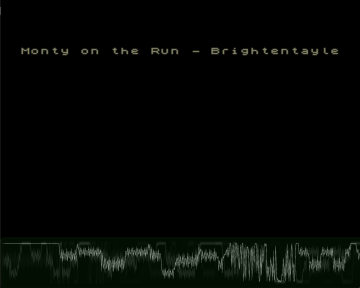

Адаптация для Вектора биперного движка Tritone.

Автор оригинальной версии для ZX Spectrum — [Александр Семенов / Shiru](../../authors/shiru)

v1 27.08.2021-16.09.2021

v2 20.09.2021 - Увеличена громкость, улучшена четкость, уменьшен шум.

v3 02.10.2021 - Не свистит, зато хрустит. Звук несколько тише и глуше. При зацикливании мелодии РУС/ЛАТ инвертируется.

v4 09.10.2021 - Улучшилось качество звука, он теперь не такой глухой.

Полные названия и авторы музыки:

balamons.rom - BaladinahMonstra (Raphaelgoulart)

citadel.rom - The Citadel (Brightentayle)

hvvua.rom - Hvvua (Strobe)

jttip.rom - Just The Tip (Brink)

mlady.rom - M'Lady (Brink)

monty.rom - Monty on the Run (Brightentayle)

rt8416dr.rom - RT-8416 Droid (Strobe)

trimer.rom - Triton and Mermaid (Mister BEEP)

