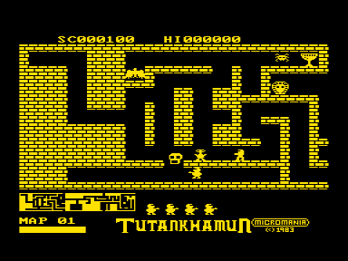
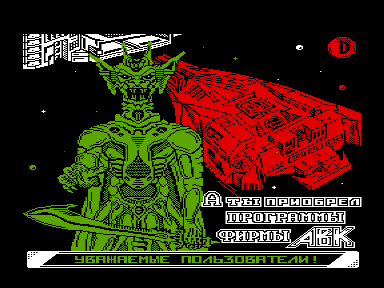

Разграбление гробницы Тутанхамона.
Порт игры на популярную тему со Спектрума.
Хорошо сделанная лабиринтная ходилка в стиле ранних 80-х: поведение врагов и сюжет напоминают игру Pharaoh's Curse на Atari.

Оригинал был опубликован Micromania в 1983-м году.
Предположительно игра была перенесена на Специалист в 1989 году И.П.Лукиным из Барнаула и затем перенесена на Вектор в Волгограде в 1992 году.

Версия tutunkh2 сожержит intro со скроллом (автор — Куропятников Михаил).

