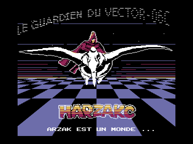

Арзак — это планета, это система.
Но, в то же время, даже прежде всего, это — человек.
Его царство — бескрайняя Пустыня «Б», в центре которой он парит на своем белом птероиде.

Пустыня «Б» в Векторе-06ц. Существует ли она на самом деле?

Второе место на [Undefined Summer 2022](../).

https://github.com/svofski/v06c-arzak

Presented at Undefined Summer 2022

Music: Scalesman^MC - Melody in the air

Requirements:

Plain Vector-06C, no kvaz required.

AY on ports $14/$15 for music.

Just some code doodles that conveniently clumped up together to become a little intro.
Probably my first v06c demo piece that does not involve hardware scrolling and is not strictly frame-locked.

Files:

arzak.rom

arzak.wav - AY on ports 14,15 (Combodevice etc)

arzak-rs.rom

arzak-rs.wav - AY on PU (R-Sound)

