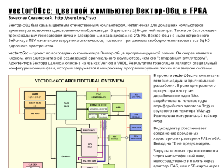

vector06cc — проект по воссозданию компьютера Вектор-06ц в программируемой логике.
Он скорее является клоном, или альтернативной реализацией оригинального компьютера, чем его «аппаратным эмулятором».
Архитектура Вектора целиком описана на языках Verilog и VHDL.
Результатом трансляции является специальный конфигурационный файл, который загружается в микросхему программируемой логики при запуске системы

[http://svofski.github.io/vector06cc/](http://svofski.github.io/vector06cc/)

Проспект подготовлен для компьютерного фестиваля

CHAOS CONSTRUCTIONS `2008 30-31 августа, Санкт-Петербург

