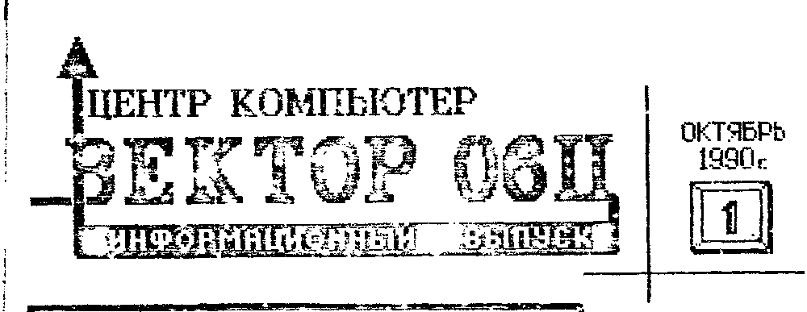
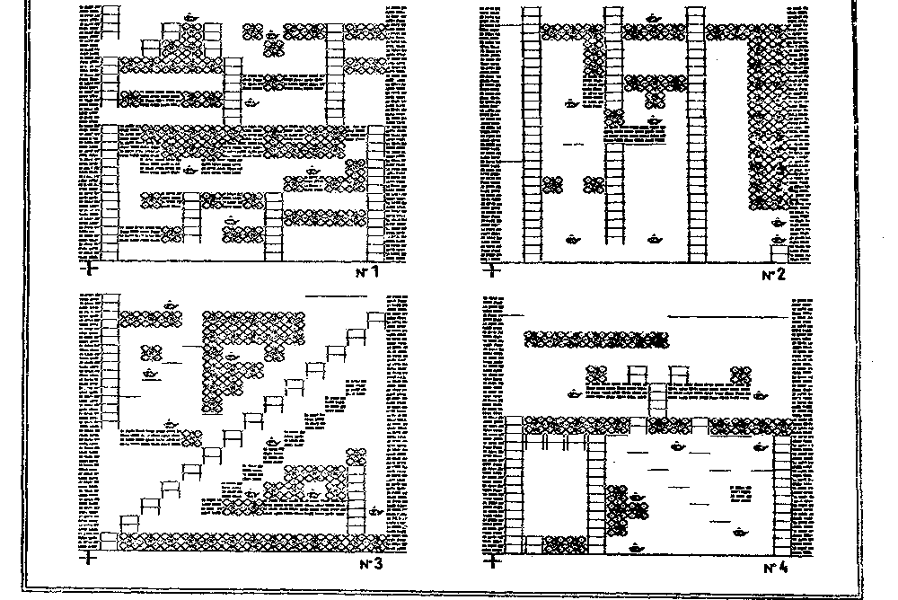

> В этом году планируется выпустить еще 1 или 2 номера ИВ.
> Чтобы подписаться на них достаточно направить письмом два подписанных конверта по адресу:
> 277060, Кишинев, а/я 3555, Центр КОМПЬЮТЕР, ИНФО.
>
> Подписка на эти номера ИВ бесплатная.

## От редакции

Информационный выпуск (ИВ) по компьютеру "Вектор-06Ц", первый номер которого Вы держите в руках, задумывался для того, чтобы ответить на многочисленные вопросы абонентов Центра КОМПЬЮТЕР.
Но, учитывая информационный голод всех, кто приобщается к миру компьютеров с помощью ВЕКТОРа-06Ц, малое количество публикаций по ВЕКТОРУ и общую отсталость в области компьютерной грамотности, мы значительно расширили сферу интересов ИВ.
Здесь будут печататься новости о разработке программ и устройств для ВЕКТОРа-06Ц, описания самого компьютера, работа с ним и с конкретными программами, реклама, отзывы, объявления и др.

Во многом мы расчитываем на помощь самих читателей.
Поэтому будем регулярно публиковать вопросы из нашей почты.

Надеемся, что ИВ окажется для Вас интересным и полезным, поможет полностью раскрыть богатые возможности компьютера ВЕКТОР-06Ц и внесет свой скромный вклад в наиважнейшее дело компьютеризации нашей страны.

## Вопросы читателей

- Как подключить ВЕКТОР-06Ц к телевизору через антенный вход?
- В какой степени переносимы на ВЕКТОР-06Ц программы с компьютеров Радио-86РК и Микроша?
- Как переключаться в режим 512x256 точек на экране и обратно в режим 256x256?
- Каков физический формат записи на магнитную ленту программ в формате загрузчика?

Уважаемые пользователи компьютера ВЕКТОР-06Ц.
Просим всех кто имеет ответы на представленные вопросы написать нам.
Самые точные и подробные ответы будут опубликованы.

## Директивы "О" и "К" Монитора-отладчика

### Директива "О"

Стандартный формат:

```
O>m,n,s
```

где `m` - начальный блок;
`n` - количество блоков;
`s` - смещение.

Параметр "S" определяет количество блоков, на которые сместится в сторону старших адресов ОЗУ при последующей загрузке, выгружаемая в данный момент информация.

Пример 1.
В ОЗУ с адреса 100Н (блок 1) находится программа, занимающая, допустим, 19 блоков.
Если мы хотим, чтобы она загружалась с магнитной ленты по адресу 500Н (блок 5), то выгружать её на магнитофон следует со смещением 5-1=4 блока (смещение 400Н).
Формат:

```
O>1,#19,4
```

(символ # - десятичный параметр)

Пример 2.
В ОЗУ с адреса 0100Н расположена программа объемом 6 блоков, которая оператором ORG addr организована для работы с начального адреса 0000Н.
Переместить её в эту область из монитора невозможно, так как монитор использует область 0000Н-00FFH.
Программу следует выгрузить на магнитофон с таким смещением, чтобы она при последующей загрузке загружалась и работала с начального адреса 0000Н.
В данном случае смещение должно быть "-1 блок", но смещение нельзя вводить со знаком "минус".
Нужно воспользоваться смещением FFH, так как в данном случае -1H=FFH.
Выгружаем программу на магнитофон:

```
O>1,#19,FF
```

Загружаться с МЛ эта программа будет по адресу 0000Н.

Примечание.
Под "блоком" здесь понимается 256 байт информации (на карте начальной загрузки обозначается одним закрашенным прямоугольником).

### Директива "К"

Директива "К" в Мониторе-отладчике позволяет выводить через драйвер вывода на дисплей любые символы (в том числе и управляющие).

Для выхода из этого режима необходимо нажать УС+Ц или F4.

Использование этой директивы позволяет пользователю просмотреть полный набор символов знакогенератора или передать через драйвер вывода на дисплей управляющую последовательность, при помощи которой можно переустановить таблицу знакогенератора и др.
Управляющие последовательности приведены в приложении 2 к описанию Монитора-отладчика.
Для ввода кода необходимо нажать клавишу с соответствующим кодом.
Например, если необходимо ввести код 1ВН, то надо нажать F2 или одновременно УС+А, для ввода 50Н необходимо нажать клавишу Р (Р латинское) и т.д.

Директива "К" позволяет пользователю проверить действие управляющих последовательностей с тем, чтобы использовать их в своих программах, работающих под управлением Монитора-отладчика.

## Внешние устройства

Значительно увеличить возможности компьютера и упростить работу с ним позволяет применение внешних устройств (ВУ).
В настоящее время из ВУ для ВЕКТОРа-06Ц разработаны квазидиск, адаптер дисковода и модуль ППЗУ.
Опишем подробнее каждое из них.

### Квазидиск

КВАЗИДИСК (электронный диск) - дополнительное ОЗУ ёмкостью 256 Кбайт.
Выполнен квазидиск в виде двусторонней печатной платы размером 140x150 мм.
Память организована на 32 корпусах микросхем (м/с) К565РУ5.
Квазидиск подключается к ВЕКТОРу-06Ц через системную шину ("длинный" 90-контактный разъем на задней стенке компьютера).
Питание осуществляется от компьютера через тот же разъем.

Для работы с квазидиском используется операционная система МикроДОС (аналог операционной системы CP/M).
МикроДОС и сервисные программы позволяют записывать программы на квазидиск, копировать, переименовывать, запускать их с квазидиска и т.д.
Уточним, что на квазидиске можно одновременно хранить много программ (файлов).
Информация на нем хранится до выключения питания и не пропадает при выполнении программ, перезапуске компьютера и т.д.

Если вы запускаете с квазидиска какую-либо программу, не рассчитанную на работу с МикроДОСом, т.е. в конце которой отсутствует возврат в МикроДОС (а такими являются, например, все игры, Электронные кубики, Эмулятор РК, Микроша и др.), то для выхода из нее вновь необходимо для продолжения работы вновь загружать МикроДОС.
Чтобы избежать постоянной длительной загрузки МикроДОСа с ленты разработана загрузка с самого квазидиска.

С учетом этого работа с квазидиском выглядит следующим образом:
После включения компьютера с квазидиском производится загрузка с магнитофона программы МикроДОС.
Затем запускается МикроДОС и с ленты в квазидиск загружаются все необходимые файлы.
В дальнейшем Вы работаете с загруженными программами, например текстовым редактором, ассемблером, отладчиком и т.д.
Вы можете запустить свою отлаженную программу, игру или другую программу, выйдя из которой необходимо загрузить МикроДОС заново.
Это можно сделать загрузкой с МЛ самого МикроДОСа (что отнимает много времени) или загрузкой с МЛ короткой программы, которая быстро загружает МикроДОС с квазидиска.
Если заменить в ВЕКТОРе-06Ц микросхему ПЗУ (556РТ5) на специальный загрузчик (м/с 556РТ7), то загрузка МикроДОСа с квазидиска будет производиться автоматически при нажатии клавиш ВВОД+БЛК.

Для работы в МикроДОСе имеются следующие программы: текстовые редакторы, макроассемблер, отладчик, программы для обмена с МЛ во всех форматах записи, программы копирования файлов и др.
Центр "Компьютер" располагает схемой квазидиска в виде распечатки на одном листе.
Она предоставлена центру одним из разработчиков квазидиска.
Эта схема несколько трудна для чтения, но снабжена исчерпывающей информацией и свободна от ошибок.
Стоимость схемы - 3 руб.

### Адаптер дисковода

АДАПТЕР ДИСКОВОДА - представляет собой модуль на основе контроллера КР1818ВГ93, собранный на печатной плате размером 140x150 мм.
Адаптер расчитан на подключение одного или двух дисководов типа TEAC (Япония).
Адаптер подключается к 90-контактному разъему ВЕКТОРа-06Ц, через который и получает питание.
Питание же дисководов осуществляется от дополнительного блока питания.

Для работы с дисководами имеется специальная версия МикроДОСа которая для своего функционирования требует наряду с дисководами наличия квазидиска.
Ёмкость одной дискеты - до 800 Кбайт.

Стоимость схемы адаптера дисковода - 3 руб.

Центр КОМПЬЮТЕР планирует поставку программного обеспечения для поддержки квазидиска и дисковода.

### Модуль ППЗУ (МППЗУ)

МОДУЛЬ ППЗУ (МППЗУ) - модуль начальной загрузки с внешнего ПЗУ.
Представляет собой небольшую плату, содержащую от одной до 4-х м/с ППЗУ типа 573РФ6 (2764) ёмкостью 8 Кбайт каждая.
В микросхемы может быть прошита любая (но только одна) программа в кодах (можно Бейсик, Монитор, МикроДОС, Тетрис и т.д.; нельзя Ассемблер, программу на Бейсике, Драйверы Устройств и т.д.).
МППЗУ подключается к 30-контактному разъему.

Загрузка с МППЗУ возможна двумя способами:

а) Без переделки ВЕКТОРа-06Ц.
При этом в начале с магнитофона загружается короткая программа, после запуска которой происходит моментальная загрузка большой программы с ППЗУ.

б) С заменой м/с ПЗУ внутри компьютера.
В этом случае загрузка происходит моментально при нажатии клавиши ВВОД+БЛК.

МППЗУ позволяет значительно упростить и ускорить работу с компьютером при отсутствии дисковода.
Центр "Компьютер" предлагает комплект документации для самостоятельного изготовления МППЗУ (стоимость комплекта 15 руб), а также принимает заказы на поставку готовых МППЗУ (сроки поставки и стоимость готовых модулей будет сообщены после сбора заказов).

Для подключения к ВЕКТОРу-06Ц принтера (печатающего устройства) никаких дополнительных устройств не требуется.
Нужно только изготовить кабель для подключения к 30-контактному разъему компьютера.
Схема этого кабеля приведена в тесте матричного печатающего устройства в программе Тесты Устройств.

Кроме описанных ВУ сейчас разрабатываются: плата подключения двух джойстиков, программатор для "прожига" м/с типа РТ и РФ и другие устройства.
По мере их готовности мы дадим дополнительную информацию.

## Некоторые ячейки в Бейсике v2.5

В интерпретаторе языка БЕЙСИК v2.5 выделены специальные ячейки (обращение к которым производится операторами PEEK и POKE), использование которых повышает эффективность программ на БЕЙСИКе.

Начиная с ячейки 0 расположен знакогенератор.
На каждый символ отводится 5 байт (символ с кодом 0 расположен в ячейках 0-4, с кодом 1 - в ячейках 5-9 и т.д.).
Таймер - ячейки 768, 769, 770.
Сдвиг экрана - ячейка 771.
Счетчики нот при исполнении музыки - ячейки 772, 773, 774, 775.

Подробности использования этих ячеек в следующих номерах ИВ.

## Адреса портов компьютера ВЕКТОР-06Ц

Порт доступа к узлу сопряжения с магнитофоном, к клавиатуре, с сдвигающим регистром, к счетчику скроллинга экрана и к динамику (м/с D30): регистр управляющего слова (РУС) - 00, порт A - 03, порт B - 02, порт C - 01.

Порт доступа к внешним устройствам (м/с D27, выходит на 30-контактный разъем "ПУ"): РУС - 04, A - 07, B - 06, C - 05.

Таймер (м/с D29): запись кода режима - 08, счетчик 0 - 0B, счетчик 1 - 0A, счетчик 2 - 09.

Установка таблицы цветности - порт 0C.

## Несколько экранов для ЙЕТИ

Предлагаем Вашему вниманию несколько игровых экранов для программы ЙЕТИ.
Вы можете самостоятельно набрать их с помощью встроенного в эту игру редактора.

Если это представляет интерес для наших читателей, мы могли бы и в дальнейшем печатать новые экраны, как разработанные у нас, так и присылаемые другими пользователями ВЕКТОРа-06Ц.



## Кишиневское отделение СП "Дельфин" и Кишиневское ПО "Счетмаш"

Осуществляют совместное производство и поставку комплектов учебной вычислительной техники на базе БПЭВМ ВЕКТОР-06Ц, объединенных в локальную вычислительную сеть.

Технические характеристики комплекта учебной вычислительной техники (КУВТ) "ВЕКТОР":

- Предназначен для оснащения кабинетов ВТ и информатики в школах, ПТУ, средних специальных учебных заведений и т.д.
Применяется с целью формирования у учащихся знаний об устройстве и функционировании современной вычислительной техники, основ программирования, умений и навыков решения задач с помощью ЭВМ.

- КУВТ "ВЕКТОР" включает в себя рабочее место преподавателя (РМП) и до 20 рабочих мест учащихся (РМУ), объединенных между собой локальной вычислительной сетью (ЛВС).

- РМП состоит из БПЭВМ ВЕКТОР-06Ц, блока расширения, включающего в себя 2 НГМД и электронный диск, видеомонитора и печатающего устройства.

- РМУ состоит из БПЭВМ ВЕКТОР-06Ц и видеомонитора.
Дополнительно в состав РМУ может входить накопитель на магнитной ленте (кассетный магнитофон).

- КУВТ обеспечивает управление с РМП одновременной загрузкой программ во все РМУ с НГМД, записью и считыванием индивидуальных программ учащихся, выводом различных текстов и графической информации на ПУ, а также автономную работу РМУ с использованием накопителя на магнитной ленте.
Скорость передачи данных по ЛВС 56 Кбод.

- В состав программного обеспечения КУВТ "ВЕКТОР" входят:
  - программные средства, поддерживающие функционирование ЛВС;
  - интерпретатор языка БЕЙСИК-СЕТЬ;
  - система программирования на ассемблере;
  - текстовый редактор;
  - комплект учебных и игровых программ.

Заявки направлять по адресу:

> 277001, ул. Тигина, 65, КО СП "ДЕЛЬФИН"
> Телетайп: 163338 СКАЛА
>
> Справки по телефону: 22-84-36

## Кишиневский Центр Компьютер

- высылает наложенным платежом программное обеспечение компьютера ВЕКТОР-06Ц на магнитофонных кассетах типа МК60.
Все программы проходят 100%-й контроль качества записи.
Все предлагаемые программы приобретены у авторов.
Каталог высылается бесплатно.

- высылает наложенным платежом документацию на внешние устройства для компьютера ВЕКТОР-06Ц.

- приобретает у авторов разнообразные программы для компьютера ВЕКТОР-06Ц.
Для этого автор предоставляет Центру предлагаемую программу.
Центр КОМПЬЮТЕР со своей стороны гарантирует, что до заключения договора программа не будет копироваться и распространяться.
После анализа программы автору сообщаются замечания (если таковые есть), по устранению которых следует договоренность об оплате и условиях передачи.
В основном используется разовая оплата при покупке программы.
Однако, по желанию автора, возможна оплата в виде процентов от реализации программы.

- принимает заказы от предприятий и кооперативов на КОМПЬЮТЕРНУЮ РЕКЛАМУ!

По заявке рекламодателя изготавливается рекламная программа, которая помещается на кассеты с программным обеспечением компьютера ВЕКТОР-06Ц.
Кассеты направляются многочисленным заказчикам в сотни городов по всему Советскому Союзу.

Стоимость рекламы - самая доступная (от 300 до 5000 руб.).
Качество - высокое.
Эффективность - максимальная.
В отличие от других видов реклам действие компьютерной рекламы не ограничено моментом выхода в эфир или дней выпуска газеты.

Компьютерная реклама - это новинка, а новое привлекает внимание!

Простейший (и самый дешевый) вид компьютерной рекламы - небольшая программа на БЕЙСИКе.
Самый действенный вид - это изготовление игровой программы, в оформление которой включена реклама заказчика.
В этом случае Ваша реклама будет появляться на экранах столько раз, сколько раз тысячи пользователей Вектора будут запускать эту игру.
С этой игрой Ваша реклама будет переходить от пользователя к пользователю, попадать в игровые залы, школы, институты и предприятия.
Учтите, что в компьютерные игры играют все кто имеет такую возможность!

Мы изготавливаем любые виды компьютерной рекламы.
Заказывайте то, что соответствует Вашим потребностям и Вашим возможностям.
Благодаря контактам с лучшими программистами и внимательной работе с заказчиком, рекламные продукты, изготовленные Центром КОМПЬЮТЕР будут отвечать всем Вашим нуждам.

Наш адрес: 277060, г. Кишинев, а/я 3556, Центр КОМПЬЮТЕР.

Телефон 24-22-18.

## Для тех, кто программирует на ассемблере

### Программа двоичного умножения

Способ: умножение в столбик, начиная со старшего разряда, со сдвигом влево.

```
MPL: LXI H,0
     MVI B,8
L1:  DAD H
     RAL
     JNC DEC
     DAD D
DEC: ACI 0
     DCR B
     JNZ L1
     RET
```

Регистры: B - счетчик;
DE - первый множитель;
A - второй множитель;
HL - произведение.

Вызов программы: `CALL MPL`

От редакции:

1. При использовании программы следует учитывать, что точное произведение однобайтового числа на двухбайтовое в общем случае должно занимать 3 байта.
Т.е. при умножении больших чисел эта программа дает округленный результат.

2. Алгоритм программы не изменится, если метку DEC: перенести с команды ACI 0 на следующую за ней команду DCR B, но при этом умножение будет выполняться несколько быстрее.

## Опечатки в описании языка ПАСКАЛЬ

- стр. 23: есть FUNC, должно быть FUNC. (в скане различие между написаниями неразборчиво - вероятно, речь о разных начертаниях буквы "C" - латинской и кириллической)
- стр. 47, подпункт г): есть `O,0,nn,0`, должно быть `O>1,nn,0`

Князев В.А., г. Ленинград

## Где купить ВЕКТОР-06Ц?

Компьютер ВЕКТОР-06Ц можно приобрести по почте через Роспосылторг.

> Адрес для заказов:
> 111126, г. Москва Е126, ул. Авиамоторная, 50
> Центральная База Роспосылторга.

## В следующих номерах Информационного выпуска

- работа с экранными областями и управление цветом в БЕЙСИКе v2.5;
- начало цикла статей по техническому описанию компьютера ВЕКТОР-06Ц;
- подключение ВЕКТОРа-06Ц к телевизорам четвертого поколения,

и др.

> Принимаем для публикации любые материалы, касающиеся компьютера ВЕКТОР-06Ц.
> Готовы предоставить свои страницы для рекламы.
> Публикуем также отзывы, объявления и т.п.
>
> Ждем Ваших писем по адресу:
> 277060, г. Кишинев, а/я 3555, Центр КОМПЬЮТЕР, ИНФО.
