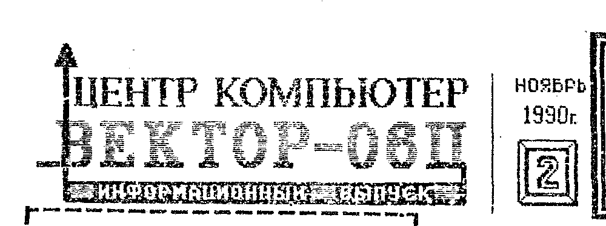
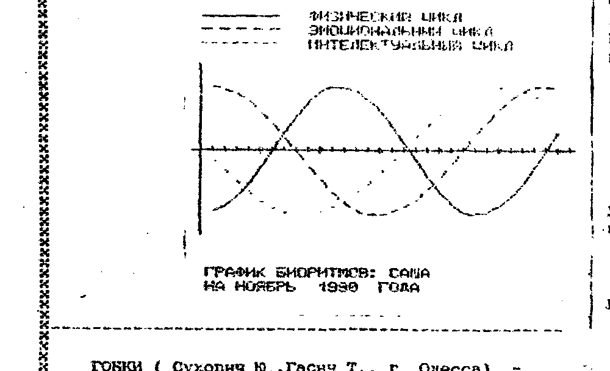
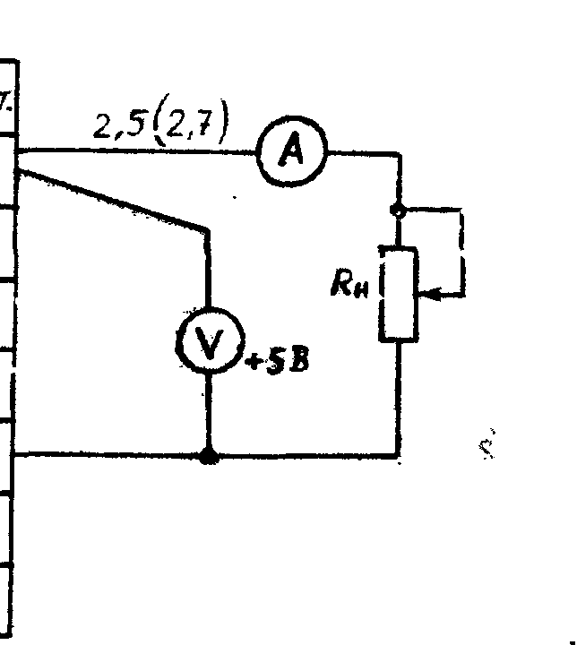
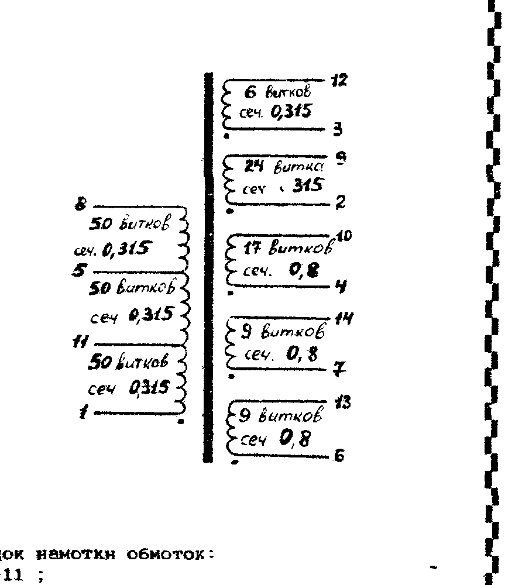
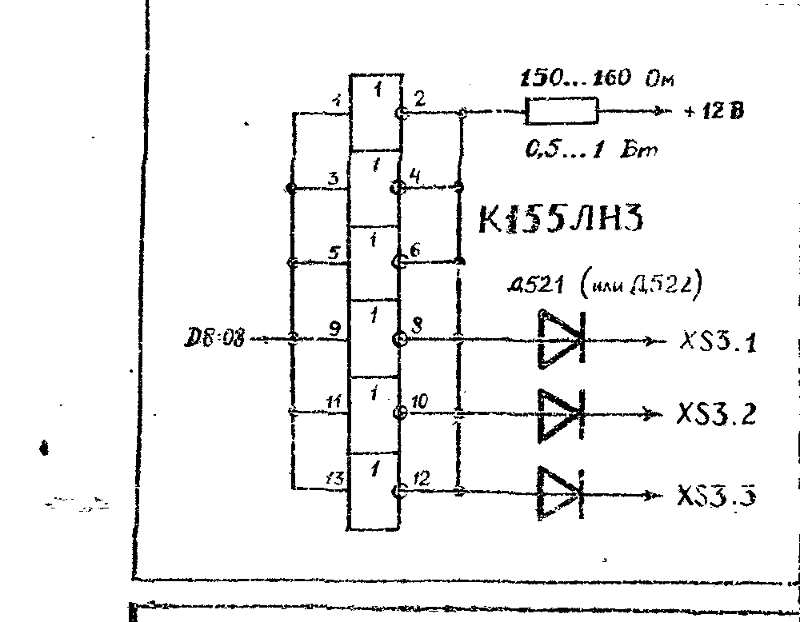

> По многочисленным просьбам читателей, начинаем печатать техническое описание компьютера «Вектор-06Ц».
> Первую статью из этой серии читайте на 3 странице.

> Уважаемый товарищ!
>
> С нового года подписка на ИВ платная.
> Подписаться можно начиная с любого месяца на 1, 2, 3, 4, 5, или 6 номеров сразу.
> Стоимость одного номера ИВ - 1 руб. 30 коп.
> Для подписки необходимо:
> - перечислить почтовым переводом необходимую сумму на р/с 1700563 в ОПЕРУ жилсоцбанка г. Кишинёв;
> - направить в наш адрес подписные конверты (в соответствии с заказываемым количеством номеров) и указать следующие данные из квитанции об оплате: сумма перевода, почтовый индекс отделения связи, дата перевода, номер квитанции.

## Вопросы

- Как подключить «Вектор-06Ц» к различным видеомониторам?
- Можно ли подключить к «Вектору-06Ц» печатающее устройство «КОНСУЛ-260.1» и если можно то как?
- Как использовать функцию USR в Бейсике v 2.5 (желательно с примерами)?
- Если на «Векторе-06Ц» программы для радиолюбителей коротковолновиков?
- Как подключить «Вектор-06Ц» к цветным ламповым телевизорам (разных марок)?

## Новые программы на Бейсике

Предлагаем Вашему вниманию следующие программы на языке Бейсик:

КОСТИ (Сухович Ю., Гасич Т., г. Одесса) - компьютерная версия издавна популярной игры в кости.
Играют двое.
Поочередно бросают кости (кубики).
Цель игры - используя выпадающие комбинации, набрать как можно больше очков.

БИОРИТМЫ (Сухович Ю., Гасич Т., г. Одесса) - программа напечатает ваши биоритмы на любой месяц любого года и календарь.

ГОНКИ (Сухович Ю., Гасич Т., г. Одесса) - динамичная игра.
Задача - по трассам-лабиринтам (с возрастающей сложностью) провести автомобиль, изображенный в плане прямоугольником, не вылетев за пределы трассы.
Программа подсчитывает время, затраченное на прохождение трассы.

ЛАБИРИНТ (Флейдерман И., г. Кишинёв) - (не путать с лабиринтом, входящим в 9 выпуск ПО, поставляемого Центром «КОМПЬЮТЕР») - классическая задача на выход из лабиринта.
Лабиринт строится случайным образом.
Имеется три уровня сложности.
Движение организовано с помощью подпрограммы в кодах.

Вы можете заказать любую программу (или несколько) из них.
Стоимость записи одной программы - 3 руб. (без стоимости пересылки).
Запись производится на кассету заказчика.
Для заказа надо перечислить необходимую сумму (из расчета 3 руб. за каждую программу + 2 руб. за пересылку) почтовым переводом на р/с 1700563 в ОПЕРУ жилсоцбанка г. Кишинёва.
Затем направить в наш адрес (277060, г. Кишинёв, а/я 3556, Центр «КОМПЬЮТЕР», ИНФО) магнитофонную кассету и заявку, в которой указать:

1. Требуемые программы (название, автор, номер ИВ в котором публиковалась).
2. Данные из квитанции об оплате: номер, дату, почтовый адрес предприятия связи, сумму (саму квитанцию сохраните у себя).
3. Подробный домашний адрес.

Рекомендуем кассеты присылать новые и хорошо упаковывать, чтобы при пересылке не бились корпуса.

Примечания.

1. Центр «КОМПЬЮТЕР» берет на себя только распространение программ и за их содержание ответственность не несёт.
Вопросы по программам переадресовываются непосредственно авторам.
2. Возможна дозапись заказываемых программ на выпуски программного обеспечения, высылаемого Центром «КОМПЬЮТЕР».

## Блок питания

В БПЭВМ «Вектор-06Ц» используется импульсный источник питания с частотой преобразования 20-30кГц.
Блок питания (БП) выдает три напряжения: +5В; -5В; +12В.
Номинальные токи нагрузки соответственно 2,5А; 50мА; 100мА.
Ток пик по каналу +5В - 2,8А.

Ниже приведены наиболее частые неисправности БП и рекомендации по правильному применению в составе БПЭВМ «Вектор-06Ц»:

В импульсном трансформаторе применяется сердечник замкнутый М200НМ-9Ш8x8-II, который при неосторожном обращении с БП может треснуть или расколоться из-за своей хрупкости.
Признаком того, что сердечник расколол­ся является то, что частота преобразования уменьшается до звуковой (слышен свист) и увеличивается нестабильность выходного напряжения.
Если сердечник всё таки расколол­ся, то его можно склеить и использовать в дальнейшем.

Часто выходит из строя транзистор КТ838А(VT3).
Новый устанавливаемый транзистор КТ838А должен иметь β ≥ 7,5 (при Jк=70 мА).

Как правило, выход из строя транзистора КТ838А, приводит к выходу из строя других элементов: VT1 (КТ313Б), VT2 (КТ630Е), VD2 (КД212А), VD5 (КЦ522Б), R6 (С2-23-2-220 кОм), R7 (С2-23-0.25-1 кОм), R8 (С2-10-2 Ом).

Вместо отказавшего транзистора КТ838А можно использовать транзисторы КТ912А, КТ826Б, КТ839А.
Вместо транзистора КТ630Е можно использовать КТ683Е.

Следует обратить внимание на то, что в настоящее время выпускается два варианта БПЭВМ «Вектор-06Ц» - с герконовой клавиатурой и с ёмкостной.
Номинальные токи, потребляемые этими машинами, различны.
В связи с этим, а также с учетом допустимой по ТУ нестабильности выходных напряжений БП на практике часто оказывается, что при потребляемом компьютером токе выходные напряжения БП значительно отличаются от допустимых.

Поэтому, для обеспечения стабильной работы БПЭВМ, рекомендуется выставить номинальные токи и напряжения, используя следующую схему измерений:

| Цепь | Конт. |
| --- | --- |
| +5В | 07 |
| 0В | 01 |
| -5В | 02 |
| +12В | 05 |
| 0В | 06 |
| +5В | 03 |
| -5В | 04 |

Для БПЭВМ «Вектор-06Ц» с герконовой клавиатурой при помощи реостата Rн (R = 10 Ом) необходимо установить ток Jном=2,5А.
Напряжение при этом регулируется с помощью потенциометра RP1.
Для этой цели в корпусе БП сбоку в нижней части имеется специальное круглое отверстие диаметром 2,5 мм.
Таким образом регулировка производится до тех пор, пока амперметр будет показывать 2,5А, а вольтметр +5В.

Аналогичную регулировку необходимо произвести для БПЭВМ «Вектор-06Ц» с ёмкостной клавиатурой.
В данном случае Jном должен быть 2,7А.
При этом может оказаться, что по каналу +12В вместо 12В имеется 13-14В.
В этом случае необходимо произвести следующую доработку:

1. Отрезать проводник, идущий от 4 вывода трансформатора TV1 к «+» диода VD10(КД212А).
2. Взять изолированный провод сечением 0,315-0,5, припаять один конец к 4 выводу трансформатора и намотать на каркас TV1 1-2 витка в сторону, противоположную основной намотке.
Второй вывод провода припаять к «+» VD10.

В случае отказа трансформатора можно легко намотать его самому.
С этой целью ниже приведена схема катушки трансформатора:

Порядок намотки обмоток:

1. 1-11;
2. 6,7-13,14 - в 2 провода;
3. 2-9;
4. 11-5;
5. 4-10;
6. 5-8;
7. 3-12.

Все обмотки необходимо друг от друга изолировать.
Намотка в ряд, по возможности - виток к витку.

## Как перейти в режим 256x256 точек?

Переключение в режим 256x256 точек на экране и обратно осуществляется четвертым битом порта B микросхемы D30.

В общем случае, работа с портом B сводится к программированию цветов палитры, опроса состояния клавиатуры и задания цвета бордюра и режима числа отображаемых точек по горизонтали.
Программирование цветов палитры (порт работает на вывод) и опрос состояния клавиатуры (порт работает на вывод) производится по прерыванию (во время кадрового синхроимпульса), в результате чего работа порта не отображается на экране телевизора.
В остальное время биты 0-3 порта, настроенного на вывод, определяют один из шестнадцати цветов бордюра; бит 4 определяет графический режим (0 - 256x256 точек, 1 - 512x256 точек); бит 7 управляет работой реле включения магнитофона (0 - магнитофон выключен).

Н. Балтпурвин, г. Харьков

## Техническое описание Вектора-06Ц

### Аннотация

Настоящее техническое описание предназначено для изучения работы машины вычислительной электронной цифровой персональной бытовой (БПЭВМ) «Вектор-06Ц» и её составных частей.

В настоящем техническом описании приводятся назначение и технические характеристики, дается описание структуры и принципов функционирования БПЭВМ и её составных частей.

### 1. Назначение и технические данные

Персональная бытовая ЭВМ «Вектор-06Ц» предназначена для диалогового режима работы с высокой степенью интерактивности и может быть использована в системе образования, сфере обслуживания, личном использовании, а также для создания диалоговых информационно-справочных систем, для выполнения вычислительных работ, для сбора, обработки и хранения информации, а также в других областях управленческой, производственной и научной деятельности.

БПЭВМ «Вектор-06Ц» работает совместно с бытовым кассетным магнитофоном.
Объём информации, записываемой на стандартную кассету типа МК-80:

1. не менее 0,512 Мбайт при фазовой модуляции (скорость обмена 1500-2400 бод);
2. не менее 0,36 Мбайт при частотной модуляции (скорость обмена 1200 бод).

Средства отображения информации на экране телевизора обеспечивают:

1. отображение алфавитно-цифровой информации с возможностью изменения количества символов в строке до 80 и числа строк на экране до 25;
2. загружаемый знакогенератор ёмкостью до 256 символов;
3. отображение символов в инверсном виде или на фоне цветного прямоугольника, контрастирующего с цветом символа;
4. метод отображения знаков матричный (матрица произвольного размера);
5. количество одновременно отображаемых цветов - произвольные 16 из 256 цветовой палитры;
6. количество цветов фона - до 256;
7. возможность задания до 256 цветов границы экрана;
8. одновременное отображение алфавитно-цифровой и графической информации;
9. возможность создания многопланового изображения (количество планов - до 4);
10. аппаратная поддержка вертикального сдвига отображаемой информации;
11. количество отображаемых точек 256x256 при 16 цветах из 256 цветовой палитры и 512x256 при четырех цветах или 256x256 и 512x256 в монохромном режиме (1 цвет фона и 1 цвет изображения - любые из 256 цветовой палитры).

БПЭВМ «Вектор-06Ц» обеспечивает возможность подключения дополнительных устройств внешней памяти (накопитель на гибком магнитном диске либо эмулятор дисковой памяти емкостью не менее 256Кбайт) и печатающего устройства.

### 2. Устройство и работа

В БПЭВМ «Вектор-06Ц» используется общая оперативная память для микропроцессора и контроллера графического дисплея объёмом 64 Кбайта.
Объём экранного СЗУ, при числе адресуемых точек изображения 256x256 и 16-и цветах, равен 32 Кбайт.
Согласно принятой в данной БПЭВМ архитектуре и принципу функционирования экранного ОЗУ (байтовая организация, и одновременное считывание 4х байтов), микропроцессор и контроллер дисплея обращаются к ОЗУ по принципу «режима разделения времени» и высший приоритет - у контроллера дисплея.

Блок системный конструктивно состоит из двух частей:

1. модуль электронный (МЭ) системный;
2. модуль клавиатуры.

Модуль электронный системный состоит из следующих функциональных узлов:

1. узел синхронизации;
2. дисплейный узел;
3. центральный процессор;
4. узел управления;
5. узел начальной загрузки и запуска;
6. параллельный программируемый интерфейс и таймер;
7. ОЗУ;
8. узел сопряжения с магнитофоном.

2.1. Узел синхронизации служит для формирования ряда синхронизирующих сигналов и состоит из следующих устройств:

1. задающий генератор опорной частоты.
Собран на кварцевом резонаторе Z1,D31.1,D31.2.
Формирует импульсы CO с частотой 12 МГц;
2. делитель опорной частоты D35 - двоичный счетчик.
Через каждые 83,3 нс на его выходе меняется кодовая комбинация сигналов C1,C2,C3,C4, последовательно принимая 16 значений от 0000 до 1111;
3. формирователь синхроимпульсов F1, F2, тактирующих процессор КР580ВМ80А - D33.1, D33.4, D81.1, D81.2, D81.6, R9, R10.

Сигналы С1...С4 поступают в узел управления - на формирователь временных диаграмм системного электронного модуля (D36): C1 тактирует сдвиговые регистры дисплейного узла; C3 тактирует таймер; C4 поступает на счетчики позиций экрана.

2.2. Узел дисплея обеспечивает считывание информации из ОЗУ в сдвиговые регистры D45...D48, скроллинг экрана, переключение режима дисплея, сопряжение БПЭВМ с цветным или черно-белым телевизором.

Узел дисплея состоит из следующих устройств:

1. счетчик горизонтальных позиций экрана (СГП)-D23.4, D5.2, D4;
2. счетчик вертикальных позиций экрана (СВП)-D5.1, D6, D7, D15.4, D22.4;
3. формирователь сигналов строчной, кадровой и вспомогательных частот - D31.3, D3.1, D3.2, D16.2, D21.1, D22.3;
4. счетчик адреса текущей строки отображения - D24, D25;
5. таблица цветов и ЦАПы - D32, D39, D389, D61, R15 - R37;
6. сдвиговые регистры;
7. переключатель режима - D40.

СГП с коэффициентом пересчёта 48 формирует длительность строки растра и коды пяти младших разрядов адресных входов ОЗУ при обращении к нему контроллера дисплея.

При этом каждая телевизионная строка длительностью 48x1,33мкс = 64 мкс делится на следующие интервалы:

- разрешение отображения информационной части строки растра - 32x1,33 мкс = 43 мкс;
- запрет отображения в начале и в конце строки растра (бордюр) - по 4 x 1,33 = 5,2 мкс;
- строчный синхроимпульс - 8x1,33 мкс = 10,4 мкс.

Продолжение в следующем номере.

## Снятие видимости обратного хода луча

Если на Вашем телевизоре при работе с «Вектором-06Ц» видны косые цветные полосы (линии обратного хода строчной развертки), вызванные модификацией модуля цветности и модуля строчной развертки, то от них можно избавиться доработкой компьютера.
Потребуется установить дополнительно м/с К155ЛН3 (на плате «Вектора-06Ц» имеются свободные посадочные места под добавочные м/с), три диода и один резистор.
Схема доработки изображена ниже.

## Лучшая программа года

Уважаемые пользователи компьютера «Вектор-06Ц», Центр «Компьютер» проводит опрос с целью изучения популярности программ и планирования новых разработок.

Просим Вас ответить на следующие вопросы.

1. Какие три игровые программы из имеющихся на «Векторе-06Ц» нравятся Вам более всего (первое, второе и третье место)?
2. Какие три прикладные программы нравятся Вам более всего (первое, второе и третье место)?
3. Какие ещё программы Вы хотели бы иметь (игровые, прикладные, учебные; в кодах, на Бейсике; можно указать конкретные программы).

Письма с ответами направляйте по адресу:

> 277060, г. Кишинёв
> а/я 3556
> Центр «Компьютер», ИНФО

В Центр «КОМПЬЮТЕР» пришло много писем с пометкой ИНФО.
Они содержали отзывы, пожелания, ответы на вопросы и др.
Благодарим всех наших корреспондентов, которые значительно помогают нам в подготовке ИВ.
Надеемся и в дальнейшем на активность и помощь наших читателей.

## Центр «Компьютер» предлагает: новое программное обеспечение

Выпуск 11. Стоимость 28 руб.

### Содержание

| Программа | Тип |
| --- | --- |
| ROTORS (игра) | ROM |
| ХИМИЯ (обучающая игра) | ROM |
| ВЕРТОЛЕТ (игра) | ROM |
| ОХ, МУМИЯ (игра) | ROM |

ROTORS - уже знакомые по игре PAIRS персонажи в увлекательной игре должны совместить одинаковые картинки в один ряд по вертикали, горизонтали или диагонали, после чего этот ряд «переворачивается».
Цель игры - перевернуть все картинки, избегая встреч со «сторожами» и «чертиками».

ХИМИЯ - игра, которая не только интересна, но и полезна, т.к. является своеобразным учебным пособием по химии.
Управляя «Химиком» и собирая на различных «этажах» химические элементы, нужно составить формулу заданного вещества.

ВЕРТОЛЕТ - динамическая игра: управляя вертолётом, Вы должны разбомбить как можно больше наземных целей (сброс бомбы - клавиша ПРОБЕЛ).
Навстречу летят вертолёты противника, которые стремятся сбить Вас.
Для борьбы с ними у Вас есть пулемёт (клавиша ТАБ).

ОХ, МУМИЯ - Вы путешествуете внутри Египетских пирамид, где Вас поджидают находки и опасности...

Все программы защищены от копирования.
Программы записанные на кассете МК-60, направляются наложенным платежом.
Заказы высылайте по адресу:

> 277060, г. Кишинёв
> а/я 3556
> Центр «Компьютер»

Разработан новый универсальный начальный загрузчик для БПЭВМ «Вектор-06Ц».
Он даёт возможность загружаться не только с магнитофона, но и с модуля ППЗУ, квазидиска и дисковода.
Для нового загрузчика используется микросхема К556РТ7 или К573Р42.
Центр «Компьютер» производит прошивку м/с новым начальным загрузчиком.
Стоимость записи на м/с заказчика (плюс рекомендации по замене м/с в БПЭВМ «Вектор-06Ц») 15 руб.
Желающим оснастить свой компьютер новым загрузчиком следует отправить по адресу 277060, г. Кишинёв, а/я 3556 Центр «Компьютер» микросхему (если отправляете м/с серии 556, то вышлите 2 шт., т.к. они имеют низкий процент «прожигаемости»).
Оплата производится наложенным платежом.

Для предприятий и кооперативов:

- разрабатываем и устанавливаем рекламно-компьютерные комплексы;
- изготавливаем компьютерную рекламу;
- размещаем рекламу.

> Принимаем для публикации любые материалы, касающиеся компьютера ВЕКТОР-06Ц.
> Готовы предоставить свои страницы для рекламы.
> Публикуем также отзывы, объявления и т.д.
>
> Ждем Ваших писем по адресу:
> 277060, г. Кишинёв, а/я 3556,
> Центр «Компьютер», ИНФО.
