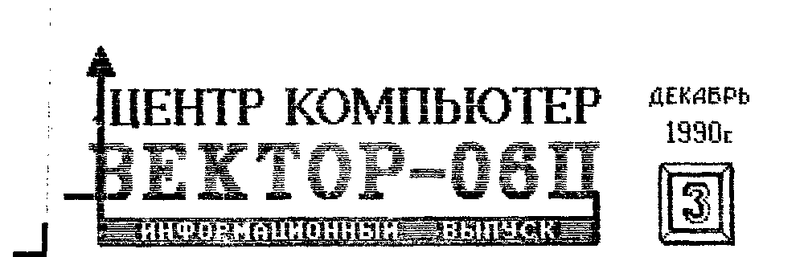
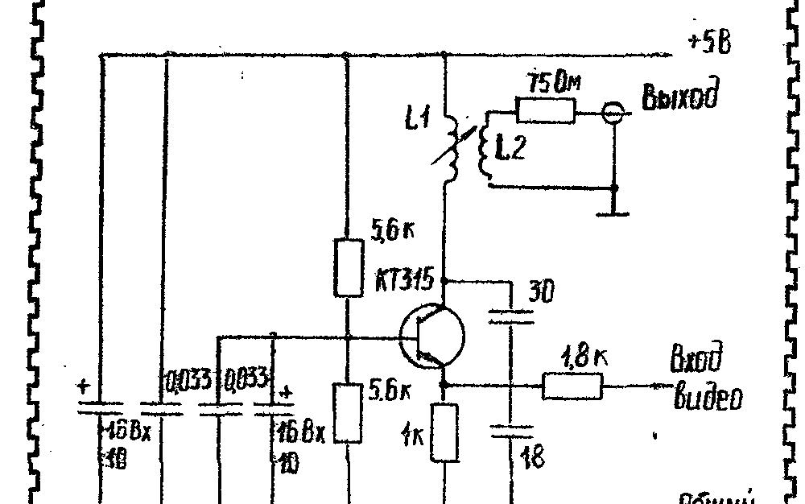
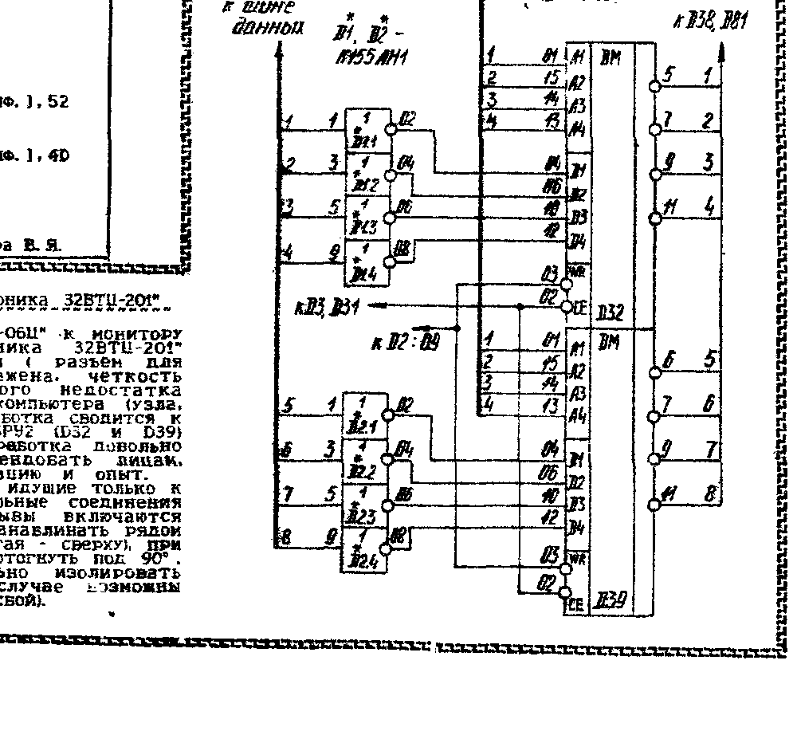
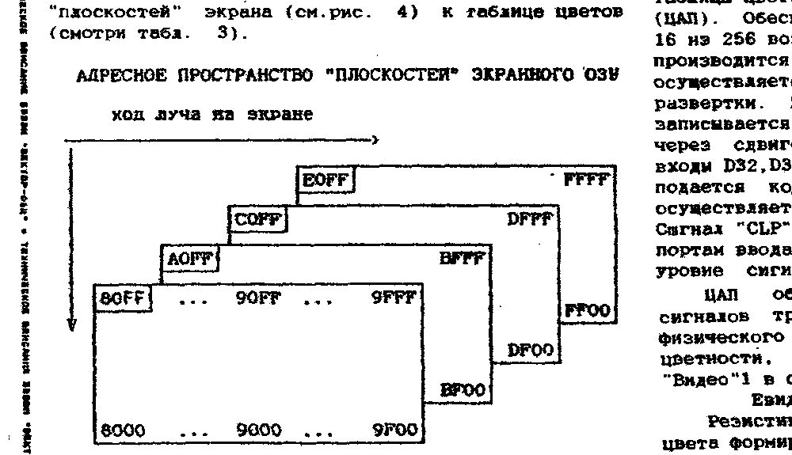

## Дорогие друзья!

Сотрудники Центра "КОМПЬЮТЕР" поздравляют Вас с наступающим Новым Годом!
Желаем Вам счастья и успехов!
Каким будет новый 1991 год?
Этого не знает ни политик, ни экономист, ни мы с Вами.
Но технический прогресс ничто не остановит.
И совершенно очевидно, что в 1991 году компьютеры ещё больше войдут в нашу жизнь.
Наш небольшой коллектив приложит все усилия, чтобы поддержать тех, кто участвует в процессе компьютеризации в области персональных компьютеров - техников, программистов, пользователей.
А потому всех призываем к сотрудничеству с нами.
Центр "КОМПЬЮТЕР" ждёт Вас в 1991 году!

> Уважаемый товарищ!
>
> С нового года подписка на ИВ платная.
> Подписаться можно начиная с любого месяца на 1, 2, 3, 4, 5, или 6 номеров сразу.
> Стоимость одного номера ИВ - 1 руб. 30 коп.
> Для подписки необходимо:
> - перечислить почтовым переводом необходимую сумму на р/с 1700563 в ОПЕРУ Жилсоцбанка г. Кишинёва;
> - направить в наш адрес подписанные конверты (на каждом конверте желательно написать номер заказываемого ИВ) и указать следующие данные из квитанции об оплате: сумма перевода, почтовый индекс отделения связи, дата перевода, номер квитанции.
> Можно заказывать также прошедшие номера ИВ.

## В вашу программотеку

Предлагаем Вашему вниманию следующие программы на языке Бейсик.
После каждой программы проставлено число - это оценка данной программы в десятичной системе, на субъективный взгляд сотрудников Центра Компьютер.

**МАКСИТ** (Лупов, г. Киров) (7) - увлекательная логическая игра, распространённая в США.
Правила: на экране поле, заполненное цифрами.
Одна из цифр выделена мигающим указателем.
Игрок может выбрать любую цифру из того горизонтального ряда, в котором расположен указатель.
После того как цифра выбрана, она удаляется и Ваши очки увеличиваются на выбранную цифру.
Курсор остаётся на месте выбранной цифры и ход передаётся компьютеру, который может выбирать цифры только из вертикального ряда.
Задача - набрать большее количество очков, чем соперник.

**ЧЕЛОВЕЧКИ** (Лупов, г. Киров) (4) - программа ставит Вам задачу - дополнить логический ряд, состоящий из различных человечков (толстых, худых, с кепкой и без и т.д.).

**КОСМИЧЕСКИЙ МУСОРЩИК** (Лупов, г. Киров) (5) - необходимо навести прицел на блуждающий в космическом пространстве осколок астероида и взорвать его.

**СЛАЛОМ** (Лупов, г. Киров) (6) - динамичная игра.
Лыжник движется по трассе, усеянной ёлками.
Задача - проехать как можно дальше не врезавшись в дерево.

**БИЗНЕС** (Флейдерман, г. Кишинёв) (9) 5 руб - игра для деловых людей.
Компьютерный аналог известной экономической игры "Менеджер".
Игра состоит из двух частей.

**СЛОВАРЬ** (Дашковский, г. Черновцы) (9) 7 руб - программа, позволяющая занести до (неразборчиво в скане) пар слов.
Имеет поиск нужного слова (время поиска не более 3 сек.).
Позволяет заносить не только слова но и словосочетания и, таким образом, организовывать толковые словари или словари фраз.
Программа может также проэкзаменовать Вас по набранным словам.

Программа состоит из 3-х частей: 1-я часть - на Бейсике, которая после запуска требует запустить собственно словарь; 2-я часть - бланк словаря, пустая программа, в которую можно внести любой словарь; 3-я часть - избранный англо-русский словарь.

**МУЗЫКАЛЬНЫЙ РЕДАКТОР** (Дашковский, г. Черновцы) (9) - позволяет ввести ноты с листа, прослушать музыку, получить символьную строку в ММЯ, а также выгрузить её в виде строк Бейсика для подключения к собственной программе с помощью оператора MERGE.

Вы можете заказать любую программу (или несколько) из них.
Стоимость записи одной программы (кроме программ БИЗНЕС и СЛОВАРЬ - 3 руб.) без стоимости пересылки.
Запись производится на кассету заказчика.
Для заказа надо перечислить необходимую сумму (из расчёта 3 руб. за каждую программу + 2 руб. за пересылку) почтовым переводом на р/с 1700563 в ОПЕРУ Жилсоцбанка г. Кишинёва.
Затем направить в наш адрес (277060, г. Кишинёв, а/я 3556, Центр "КОМПЬЮТЕР", ИНФО) магнитофонную кассету и заявку, в которой указать:

1. Требуемые программы (название, автор, номер ИВ в котором публиковалась).
2. Данные из квитанции об оплате: номер, дату, почтовый адрес предприятия связи, сумму (саму квитанцию сохраните у себя).
3. Подробный домашний адрес.

Рекомендуем кассеты присылать новые и хорошо упаковывать, чтобы при пересылке не бились корпуса.

Примечания.

1. Центр "КОМПЬЮТЕР" берёт на себя только распространение программ и за их содержание ответственность не несёт.
Вопросы по программам переадресовываются непосредственно авторам.
2. Возможна дозапись заказываемых программ на выпуски программного обеспечения, высылаемого Центром "КОМПЬЮТЕР".

## Физический формат записи на МЛ программ в формате загрузчика

Вначале передаётся преамбула: 4 серии блоков (25 нулей и 25 код 55Н).
Затем передаются информационные блоки.
Каждый блок начинается с серии: 16 нулей, 4 байта - 55Н, 1 байт - Е6Н, 1 байт - 0, 30 байт - заголовок блока (включает идентификатор "NODISC00", имя файла и расширение - 11 байт, дата - 6 байт, начальный адрес загрузки программы, количество блоков, остаток блоков для передачи), 1 байт - контрольная сумма.
Каждый передаваемый блок состоит из 8 подблоков, каждый из которых, в свою очередь, имеет свой собственный заголовок: 4 байта - 0, 1 байт - Е6Н, 1 байт - счётчик (при двойной записи для первого блока 80...87, для второго - 88...8F), 1 байт - контрольная сумма заголовка блока.
Затем следуют 32 байта собственно информации и 1 байт контрольная сумма.
Пример записи на ленту (программа COPY V 1.1):

```
Преамбула:

00,00, ... 00,55,55, ... 55,
00,00, ... 00,55,55, ... 55,
00,00, ... 00,55,55, ... 55,
00,00, ... 00,55,55, ... 55,

1 блок:

(1-я      00,00,00,00,00,00,00,00,00,00,
 копия    00,00,00,00,00,00,55,55,55,55,
 блока)   E6,00,00,00,00,
          NODISC00260987COPY_V11COM,00
          00,00,09,09,D0

подблоки  00,00,00,00,E6,80,D0,[32 байта инф.],0A
          00,00,00,00,E6,81,D0,[32 байта инф.],30
          00,00,00,00,E6,82,D0,[32 байта инф.],B2
          00,00,00,00,E6,83,D0,[32 байта инф.],B2
          00,00,00,00,E6,84,D0,[32 байта инф.],65
          00,00,00,00,E6,85,DC,[32 байта инф.],94
          00,00,00,00,E6,86,D0,[32 байта инф.],38
          00,00,00,00,E6,87,D0,[32 байта инф.],C2

(2-я      00,00,00,00,00,00,00,00,00,00,
 копия    00,00,00,00,00,00,55,55,55,55,
 блока)   E6,00,00,00,00,
          NODISC00260987COPY_V11COM,00
          00,00,09,09,D0
          00,00,00,00,E6,88,D0,[32 байта инф.],12

          00,00,00,00,E6,8F,D0,[32 байта инф.],CA

2 блок:

(1-я      00,00,00,00,00,00,00,00,00,00,
 копия    00,00,00,00,00,00,55,55,55,55,
 блока)   E6,00,00,00,00,
          NODISC00260987COPY)_V11COM,00
          00,00,09,09,D0
          00,00,00,00,E6,80,D0,[32 байта инф.],52

          00,00,00,00,E6,87,D0,[32 байта инф.],4D

и так далее...
```

г. Овидиополь, Забара В.Я.

## Подключение к телевизору через антенный вход

Подключение "Вектора-06Ц" к телевизору через антенный вход с цветным изображением требует сложной схемы или применения специальных интегральных м/с.
Однако в чёрно-белом варианте подключение возможно с помощью достаточно простой схемы, приведённой ниже.



L1 - 10 витков ПЭЛ-0,5.
L2 - 2 витка ПЭЛ-0,5.
Катушка намотана на пластмассовом каркасе диаметром 8 мм от катушки ПЧ телевизоров с сердечником СЦР или из аллюминия.
Для питания +5В делается отвод от кабеля питания компьютера.
Сигнал возникает на разных каналах телевизионного приёмника.
Для оптимального изображения необходимо переключением каналов и вращением подстроечного сердечника выбрать канал с наиболее устойчивым изображением и достаточной контрастностью.
Для соединения блока с ПК можно использовать провода в несколько метров.
ВЧ кабель должен быть по возможности коротким.
Саму схему желательно собрать достаточно жёстко в металлической коробке.
Примечание.
Автор готов по заказу изготовить готовый блок.
Стоимость блока 40 руб.
Заказы направлять в адрес Центра "КОМПЬЮТЕР".

г. Кишинёв, Золочевский В.Е.

## Подключение к монитору "Электроника 32ВТЦ-201"

При подключении БПЭВМ "Вектор-06Ц" к монитору цветного изображения "Электроника 32ВТЦ-201" изображение получается инверсным (разъём для "БК-0010-01"), цветопередача искажена, чёткость снижается.
Для устранения этого недостатка необходимо произвести доработку компьютера (узла, формирующего первичные цвета).
Доработка сводится к включению перед микросхемами К155РУ2 (D32 и D39) инверторов К155ЛН1 (см. рис.).
Доработка довольно сложна, поэтому её можно рекомендовать лицам, имеющим соответствующие квалификацию и опыт.

На плате перерезаются дорожки идущие только к выводам 4,6,10,12 м/с К155РУ2 (остальные соединения необходимо сохранить).
В разрывы включаются инверторы.
Корпус позволяет их устанавливать рядом с м/с D32 и D39 (одна снизу, другая - сверху), при этом выводы инверторов необходимо отогнуть под 90°.
После этого необходимо тщательно изолировать места соединений, в противном случае возможны неприятности (в лучшем случае - сбой).



## Техническое описание

СВП экрана производит счёт в три этапа:

1) от 0 до 280.
При высоком уровне сигнала на 3,4,8 разрядах СВП, D6 устанавливается в исходное (нулевое) состояние;
2) от 289 до 312.
При высоком уровне сигнала на тех же разрядах D6 устанавливается в нулевое состояние;
3) от 321 до 328.
При коде 328 (высокий уровень сигнала на 3,6,8) СВП устанавливается в исходное (нулевое) состояние.

Суммарный коэффициент пересчёта составляет 312.
При этом длительность кадра составляет 312x64 мкс = 19,968 мс.
Из них: 258x64=18,4 мс - отображение информационных строк растра; по 16x64 мкс = 1,02 мс - верхний и нижний бордюры; 24x64мкс= 1,5 мс - кадровый синхроимпульс.

Счётчик адреса текущей строки отображения формирует байт адреса ячеек ОЗУ, хранящих информацию о текущей строке растра.
Соответствие между 8 разрядами адреса байтов из "плоскостей" экранного ОЗУ и номером информационной строки растра приведено в таблице 2.

Таблица 2

| Байт адреса | Номер строки растра |
| --- | --- |
| FF | 0 |
| FE | 1 |
| FD | 2 |
| ... | ... |
| 01 | 254 |
| 00 | 255 |

Таблица 3. Таблица плоскостей экранного ОЗУ

| Адресное простр-во плоскости | Номер плоскости | Сдвигающий регистр |
| --- | --- | --- |
| E000-FFFF | 0 | D48 |
| C000-DFFF | 1 | D47 |
| A000-BFFF | 2 | D46 |
| 8000-9FFF | 3 | D45 |

Запись в сдвигающие регистры разрешается сигналом "WVR", тактирование - сигналом "CVR".
Информация об одной точке на экране в режиме 256x256 хранится в одноимённых битах плоскостей экранного ОЗУ.
Так, например, информация о первых восьми точках растра хранится в байтах 80FF, A0FF, C0FF, E0FF, а о последних восьми точках - в байтах 9F00, BF00, DF00, FF00.
В режиме 512x256 информация о чётной точке растра хранится в плоскостях три и два, а о нечётной - в плоскостях нуль, один.

Значение весовых коэффициентов в математическом цвете (коде, поступающем на адресные входы таблицы цветов) у битов из плоскостей экрана следующее:
- в режиме 256x256 (16 цветов) у плоскостей 0,1,2 и 3 соответственно 1, 2, 4, 8;
- в режиме 512x256 (4 цвета) у плоскостей 0,1, 2 и 3 соответственно 1, 2, 1, 2.

Переключатель режима обеспечивает работу контроллера в режимах "256x256" или "512x256".
В режиме "256x256" через порт-02 РВ-4 выдаётся сигнал низкого уровня на входы D33.2 и D33.4, т.е. одновременное прохождение всех четырёх битов, описывающих одну точку растра, через D40.
В режиме 512x256 высокий уровень сигнала с РВ4 на входы D33.2, D33.4 обеспечивает поочерёдное прохождение двух пар битов (пара соседних точек растра) через D40.1,D40.4 и D40.3,D40.2 в интервал времени, за который отображается одна точка в режиме "256x256".

Управление режимами дисплея и управление заданием цвета фона рабочей и нерабочей области экрана осуществляется через порт 02-РВ (0...3) и переключатель режимов, что позволяет:
- перевести дисплей из режима 256x256 в режим 512x256 путём разделения плоскостей экрана на две пары;
- установить объём памяти дисплея (объём экранного ОЗУ) равным 8,16,24 и 32 Кбайт, изменяя содержимое таблицы цветов, т.е. отобразить информацию соответственно из одной, двух, трёх, четырёх плоскостей экранного ОЗУ.

Таблица цветов преобразовывает математический цвет (информация, хранимая в экранном ОЗУ) в физический цвет (сигнал, поступающий с выходов таблицы цветов на цифро-аналоговые преобразователи (ЦАП)).
Обеспечивает задание количества цветов до 16 из 256 возможных.
Изменение содержимого таблицы производится программно.
Запись таблицы цветов осуществляется во время обратного хода кадровой развёртки.
При этом в порт 02-РВ (0...3) записывается код математического цвета, который через сдвиговые регистры поступает на адресные входы D32,D39.
На вход данных этих микросхем подаётся код физического цвета, запись которого осуществляется по низкому уровню сигнала "CLP".
Сигнал "CLP" становится активным при обращении к портам ввода-вывода с адресами 0С...0F при низком уровне сигнала "ЗПВВ" (сигнал записи в порт).

Запись в счётчик адреса экранного ОЗУ осуществляется по сигналу "WVA", а содержимое декрементируется сигналом "S32" через каждые 64 мкс и через мультиплексор адреса поступает (в момент обращения контроллера дисплея) на адресные входы ОЗУ.
Таким образом, обеспечение обращения к ячейкам экранного ОЗУ осуществляется путём записи байта адреса в счётчик D24,D25 через порт-03 в момент начала вывода на экран нового кадра и дальнейшего уменьшения его содержимого на единицу с частотой строчного синхроимпульса.
Это позволяет в значительной степени ускорить скроллинг экрана, используя возможность программного обращения к счётчику адреса регенерации.

Сдвигающие регистры обеспечивают приём четырёх параллельных кодов из экранного ОЗУ и преобразования их в последовательные и приём информации через последовательные входы в режиме сдвига вправо, при отображении бордюра или во время обратного хода кадровой развёртки.
Через сдвигающие регистры осуществляется подключение "плоскостей" экрана (см. рис. 4) к таблице цветов (смотри табл. 3).



ЦАП обеспечивает формирование аналоговых сигналов трёх основных цветов - R,G,B по коду физического цвета, выбираемому из таблицы цветности, и формирует сигнал синхронизации "Видео" в соответствии с соотношением:

```
Евидео = 0,3ER + 0,6EG + 0,1EB
```

Резистивная матрица на основе кода физического цвета формирует по восемь уровней сигналов "R", "G" и четыре уровня сигнала "B".
Потенциометром R35 осуществляют регулировку уровня чёрного и размах видеосигнала.

## Исправления и дополнения к инструкции по Бейсику v2.5

1. В руководстве по Бейсику в приложении 1 ошибочно указаны коды некоторых операторов:

LLIST есть D8, должно быть DB;
FOR есть B1, должно быть 81.

2. Бейсик v2.5 понимает ещё один оператор, отсутствующий в описании: AT (код C8).
Он работает аналогично оператору CUR, но в некоторых случаях его использование удобнее, например если необходимо в одном операторе PRINT несколько раз менять положение курсора.
Пример использования оператора AT:

```
PRINT AT 15,10; "МЕСТО"; AT 1,2; "БАЙТ"
```

на экране пишет слово "МЕСТО", начиная со знакоместа с координатами по горизонтали 15, по вертикали 10 и слово "БАЙТ" с координатами 1,2.

г. Никополь, Чернявский Ю.В.

> ВНИМАНИЕ!
>
> По многочисленным заявкам схемы адаптера дисковода и квазидиска будут опубликованы в ИВ в 1991 г.
> Поэтому заявки на эти схемы наложенным платежом выполняться не будут.

## Внешние устройства для "Вектора-06Ц"

Центр "Компьютер" постоянно пытается организовать производство внешних устройств для компьютера "Вектор-06Ц".
Попытка выпускать модули ППЗУ по цене 75 руб. не увенчалась успехом из-за сложностей с комплектацией и стоимости м/с РФ.

В настоящее время ещё одна организация предложила свои услуги по изготовлению внешних устройств, но при условии достаточно большого количества заказов.
В связи с этим мы просим всех пользователей компьютера "Вектор-06Ц", которые хотели бы приобрести перечисленные ниже ВУ, написать нам.
Писать желательно на открытках и указать конкретно какие ВУ и в каком количестве Вы готовы приобрести, а для модуля ППЗУ указать какую программу прошить.

| Устройство | Цена |
| --- | --- |
| Квазидиск (256 Кбайт) | 1000 руб. |
| Адаптер дисковода | 350 руб. |
| Модуль ППЗУ | 150 руб. |
| Блок расширения | 2000 руб. |

Блок расширения - законченное устройство, включающее квазидиск ёмкостью 64 Кбайт (при наличии м/с 565РУ5 пользователь может самостоятельно нарастить ёмкость до 256 Кбайт), адаптер дисковода, один накопитель на ГМД и блок питания.
Цены ориентировочные.

При наличии достаточного количества желающих будет организовано производство ВУ, о чём будут извещены все, кто написал нам.
Просьба откликнуться как можно быстрее.
Те, кто раньше отправят открытки, будут пользоваться приоритетом при поставке готовых изделий.

> ОБЪЯВЛЕНИЯ
>
> П.1. Продаю "Вектор-06Ц".
> Толя.
> Обращаться в Центр "КОМПЬЮТЕР".
>
> П.2. Продаю квазидиск.
> Володя.
> Обращаться через Центр "КОМПЬЮТЕР".
>
> К.1. Куплю цветной телевизор Ц-51.
> Предлагать только в Кишинёве.
> Звонить по тел. 47-61-49.

> Просим наших корреспондентов указывать полностью имя и отчество, что необходимо для выплаты гонораров за материалы, помещённые в ИВ.

> Принимаем для публикации любые материалы, касающиеся компьютера "ВЕКТОР-06Ц".
> Готовы предоставить свои страницы для рекламы.
> Публикуем также отзывы, объявления и т.д.

## Предлагаем!

Выпуск М-1.
Стоимость 58 руб.

### Содержание

| Компонент | Тип |
| --- | --- |
| МикроДОС (v3.1, BIOS v2.0) | ROM |
| DIR.COM | DOS |
| PIP.COM | DOS |
| LOADASM.COM | DOS |
| SAVEASM.COM | DOS |
| LOADMON.COM | DOS |
| SAVEMON.COM | DOS |
| LOADBAS.COM | DOS |
| LOADBAS.COM (так в оригинале, по смыслу - вероятно SAVEBAS.COM) | DOS |
| LOADROM.COM | DOS |
| SAVEROM.COM | DOS |
| MARGO.COM | DOS |
| MARGO.HLP | DOS |
| MAC.COM | DOS |
| SID.COM | DOS |
| Наладочный тест квазидиска (2 раза) | ROM |
| Тест квазидиска (2 раза) | ROM |

Выпуск М-1 предназначен для наладки и использования квазидиска.
В состав выпуска входят:
- два теста, которые позволяют наладить и проверить квазидиск;
- МикроДОС (версия для квазидиска);
- программы для работы с файлами;
- средства обмена с магнитной лентой в форматах ASM, MON, BAS, ROM;
- текстовый редактор;
- макроассемблер;
- символьный отладчик.

Выпуск поставляется с описанием.

В Центре "КОМПЬЮТЕР" разработана инструкция для самостоятельной наладки квазидиска.
Стоимость инструкции 18 руб.

> Заказы выполняются наложенным платежом.
> Адрес для заявок: 277060, а/я 3556, Центр "КОМПЬЮТЕР".

## Руководителям предприятий и кооперативов

Работать в новых условиях без новых технологий невозможно!
Кадровый учёт и расчёт зарплаты должны выполнять компьютеры.
Для этого Вам нужны универсальные пакеты прикладных программ

**"КАДРЫ"**

**"ЗАРПЛАТА"**

Пакеты функционируют на персональных компьютерах типа IBM PC/XT/AT.
Поставку этих пакетов, а также разработку программного обеспечения любого уровня сложности для любых типов ЭВМ, производит Кишинёвский Центр "КОМПЬЮТЕР".

> Телефон 24-22-18.

## Вопросы

1. Как производить ввод/вывод на внешние устройства в Паскале? (По компилятору Паскаля принимаются любые статьи, освещающие любые вопросы его работы и использования.)
2. Как подсчитывается контрольная сумма?
3. Каковы адреса подпрограмм монитора?
4. Как подключить принтер (различных типов)?
5. Как на Бейсике v2.5 сыграть мелодию, занимающую более 127 символов?

> Ждём Ваших писем по адресу:
> 277060, г. Кишинёв, а/я 3556
> Центр "КОМПЬЮТЕР", ИНФО
