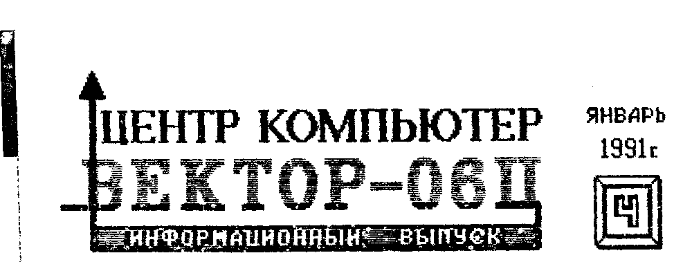
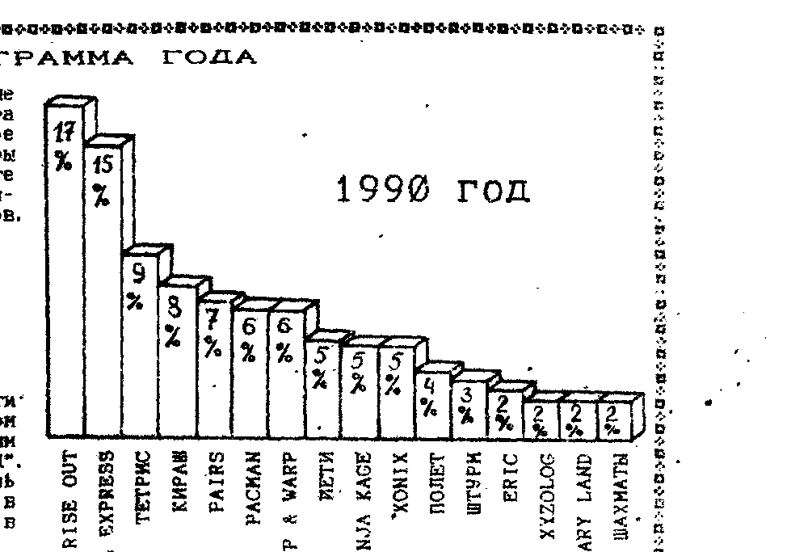
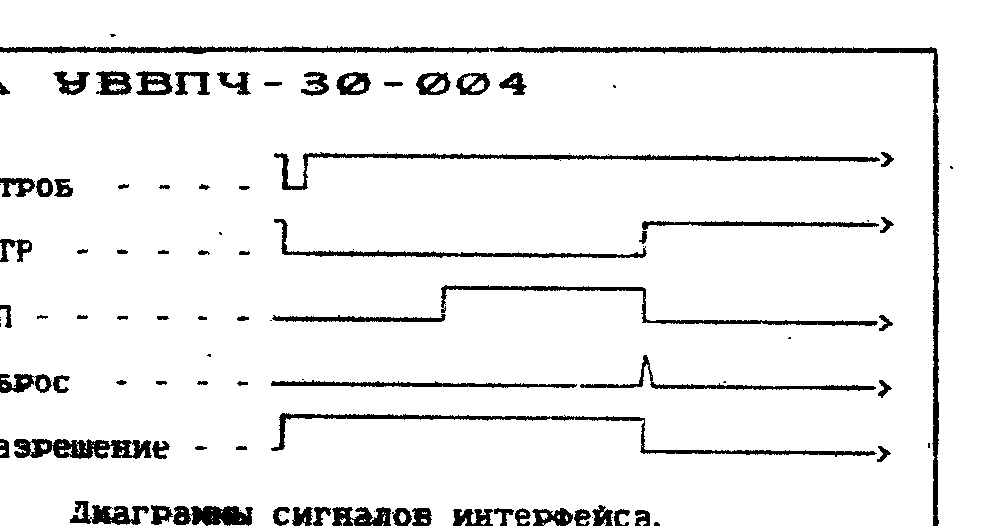
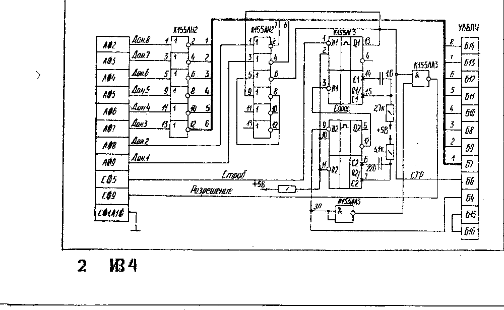
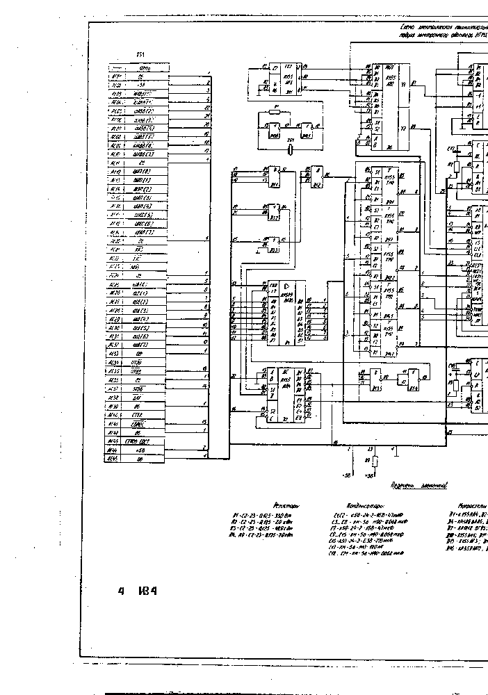
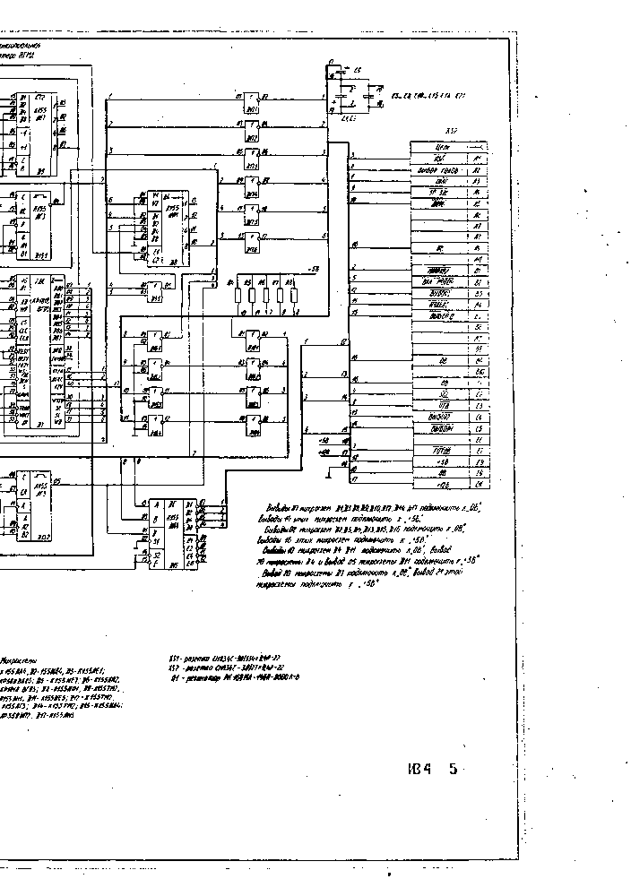
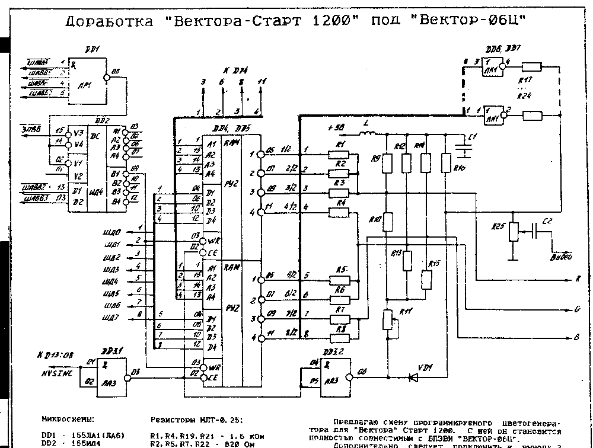
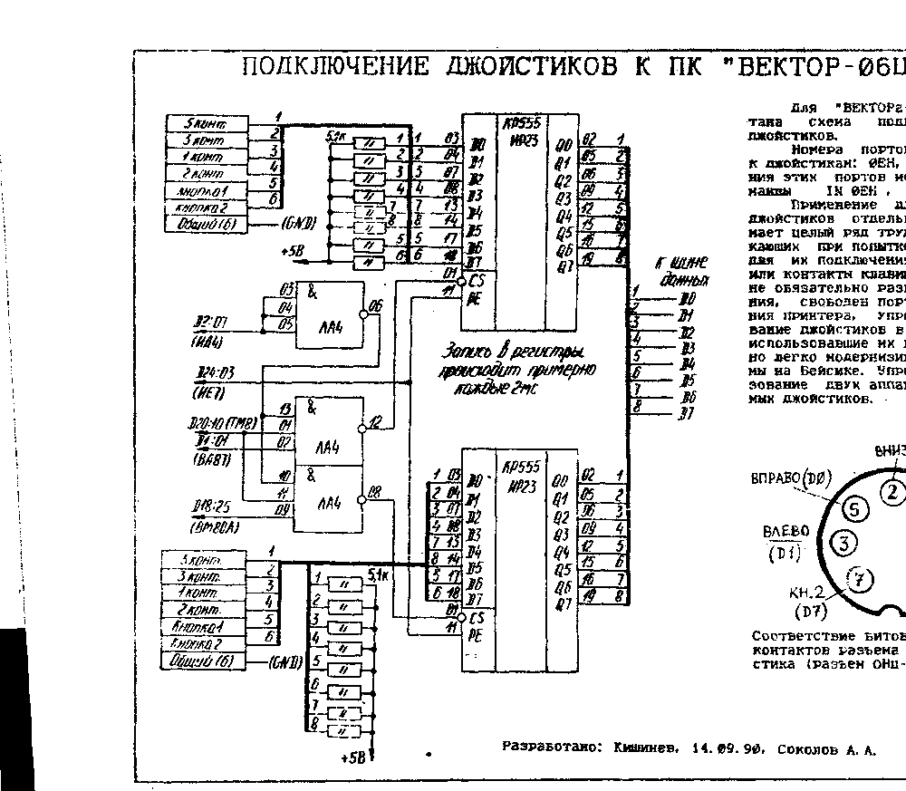
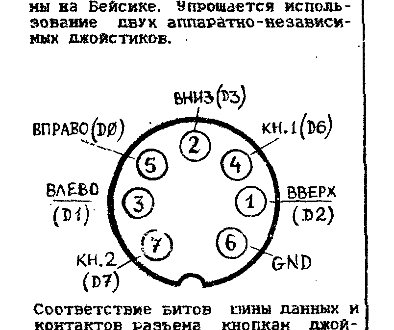

## Вопросы

1. Как правильно использовать функцию @SPIC в "Драйверах Устройств"?
2. Можно ли использовать в квазидиске м/с КР565РУ7 вместо КР565РУ5?
3. Как в программу Бейсик включить подпрограмму табл.8 статьи Т. Иванова "Терминал передачи данных" из ж-ла "РАДИО" №5 за 1990г.?

> ВНИМАНИЕ!
>
> Уважаемые абоненты Центра "КОМПЬЮТЕР".
> Первой новостью в Новом году для нас стало известие о повышении налогов и увеличении стоимости почтовых отправлений.
> Несмотря на это Центр "КОМПЬЮТЕР" нашёл возможность сохранить цены программного и информационного обеспечения на уровне 1990 года.
> Однако расходы за пересылку, которые по сих пор Центр брал на себя, отныне будут взиматься с заказчика.
> Также приносим свои извинения читателям ИВ за задержку с выходом ИВ №4.

## Лучшая программа года

По результатам опроса определились самые популярные в 1990 году игровые программы компьютера "ВЕКТОР-06Ц".
С большим отрывом первое и второе место заняли адаптированные с ПК YAMAHA игры RISE OUT и СТОП (ITA EXPRESS).
На третьем месте одна из самых первых на "ВЕКТОРе-06Ц", но по-прежнему очень популярная игра ТЕТРИС (автор - Пажитнов, адаптация - Гамбарин).
Итак:

Первое место: **RISE OUT**

Второе место: **ITA EXPRESS**

Третье место: **ТЕТРИС**

В области прикладных программ определённости нет.
Это связано во-первых с малым количеством прикладных программ, а во-вторых, с очень широким диапазоном потребностей пользователей "ВЕКТОРа-06Ц".
Следует отметить лишь пакет программ "Самоучитель программирования на Бейсике", который упоминался в письмах чаще всего и который ставили в качестве примера и образца для подражания.
Что касается потребности в новых программах, то в результате опроса стало ясно, что нужно всё, с небольшим уклоном в сторону прикладных программ.

## В вашу программотеку

ДЫХАНИЕ (Золочевский, г. Кишинев) (5) - научит и облегчит выполнение упражнений дыхательной гимнастики по Стрельниковой.

ПОКОС (Луппов, г. Киров) (8) - увлекательная динамичная игра.
Комбайн, двигаясь без остановки, собирает урожай.
Задача - скосить всё поле, не вылетев за его пределы, не наехав на камень и подбирая дополнительные топливные баки.

РЕДАКТОР ЗГ (Лапушнер, г. Кишинев) (6) - прикладная программа, позволяющая изменить символы знакогенератора в Бейсике v2.5, записать изменения на ленту (т.к. при загрузке Бейсика с ленты восстанавливается стандартный знакогенератор), и считать с ленты.
Используется для изменения шрифтов в графических и текстовом редакторах на Бейсике.

PC-ILLUSTRATOR v5.3 (Ковешников, г. Кишинев) (8) - графический редактор на Бейсике.
Состоит из 6 файлов: 1) Описание, 2) Основная часть, 3) Текстовая часть, 4-6) 3 различных шрифта.
Стоимость 10 руб.

PC-PICTURE v1.0 (Ковешников, г. Кишинев) (10) - новый графический редактор с богатыми возможностями.
Имеет режимы "лупа", "маска", "перо" и др.
Поставляется с описанием.
Стоимость 10 руб.

КАПИТАЛ ШОУ (Макринский, Кишинев) (10).
В этой компьютерной версии нет призов, а в остальном всё как у В. Листьева в популярной телеигре "Поле чудес".

М-EDITOR (Ковешников, г. Кишинев) (5) - текстовый редактор на Бейсике.

ИППОДРОМ (Перевалов, г. Кишинев) (5) - не отходя от компьютера вы можете сделать ставки, поболеть за свою лошадь и выиграть, если, конечно, повезет.

Маркировка диодов (Василенко, г. Кишинев) (6) - программа для распознавания типа диодов по их цветной маркировке.

Полярные координаты (Ротарь, г. Кишинев) (7) - Вы можете наблюдать на своем экране связь чисел и гармонии.
Программа рисует графические узоры в полярных координатах по различным формулам.

Все предлагаемые программы написаны на Бейсике.
Стоимость записи каждой программы, за исключением графических редакторов, 3 руб.

> ВНИМАНИЕ!
>
> Во многих письмах наши заказчики указывали, что предварительная оплата доставляет больше неудобств, чем оплата наложенным платежом.
> В связи с этим мы переходим на оплату наложенным платежом выборочной записи (также как и готовых выпусков), а в остальном условия приобретения программ из раздела "В ВАШУ ПРОГРАММОТЕКУ" остаются такими же как ранее (см. ИВ №3).

## Адреса подпрограмм монитора

| № | Стандартные подпрограммы монитора | Адрес | Входные параметры | Выходные параметры |
| --- | --- | --- | --- | --- |
| 1 | Ввод символа с клавиатуры | 7803H / F803H | нет | A - введенный код |
| 2 | Ввод байта с магнитофона | 7806H / F806H | A=FF - с поиском синхробайта; A=00 - без поиска синхробайта | A - введенный байт |
| 3 | Вывод символа на экран | 7809H / F809H | C - выводимый код | нет |
| 4 | Запись байта на магнитофон | 780CH / F80CH | C - выводимый код | нет |
| 5 | Вывод символа на принтер | 780FH / F80FH | C - выводимый код | нет |
| 6 | Опрос статуса клавиатуры | 7812H / F812H | нет | A=00 - не нажата; A=FF - нажата |
| 7 | Распечатка байта в HEX-виде | 7815H / F815H | A - выводимый код | нет |
| 8 | Вывод сообщения на экран | 7818H / F818H | HL - адрес начала сообщения (сообщение заканчивается нулевым байтом) | нет |
| 9 | Ввод кода нажатой клавиши | 781BH / F81BH | нет | A=FF - не нажата; A="код клавиши" |

При работе монитор поддерживает сохранение системных переходов:

- 00 JMP 'монитор'
- 05 JMP 'эмулятор' в ДОС
- 28 JMP RST5 (программа обработки прерываний по команде RST 5)
- 38 JMP PRER (программа обработки прерываний по команде RST 7. Данные прерывания инициализируются системой каждые 20 мсек)

Адрес 'монитор' соответствует началу таблицы переходов на стандартные подпрограммы.
Адрес 'эмулятор' соответствует начальному адресу в ОЗУ монитора-отладчика.

Примечание.
Адреса подпрограмм в таблице даны в двух вариантах для двух вариантов загрузки монитора-отладчика.

Соколов А., г. Кишинев

## Подключение принтера УВВПЧ-30-004

Незамчный принтер УВВПЧ-30-004 имеет интерфейс ИРПР и, для того, чтобы он работал с компьютером "ВЕКТОР-06Ц" необходимо собрать согласователь интерфейсов.
Схема согласователя состоит из инвертора шины данных и расширителя сигнала строба.
Саму схему можно собрать как на отдельной плате и поместить в компьютер, так и разместить непосредственно на плате разъема, соединяющего компьютер с принтером.
На схеме изображен именно этот вариант.
При работе с принтером необходимо учитывать особенности УВВПЧ, в частности то, что код КОИ-8 принтера и "ВЕКТОРа-06Ц" различны.

## Техническое описание

> Продолжение. Начало в ИВ2, ИВ3.

2.3. Центральный процессор БПЭВМ выполнен на базе микропроцессора (МП) КР580ВМ80А и предназначен для выполнения следующих функций:

1) вычисление адресов операндов и команд;
2) содержательной обработки операндов;
3) обмена информацией с другими устройствами (узлами);
4) реакции на воздействие с клавиатуры и устройств пользователя, подсоединенных к параллельному программируемому интерфейсу.

Двунаправленные шинные формирователи D1, D19 обеспечивают буферизацию шины данных и старшего байта адреса.

2.4. Узел управления обеспечивает формирование временной диаграммы работы системного электронного модуля, обращение к устройствам ввода-вывода, оперативному запоминающему устройству, формирование всех внутренних и внешних управляющих сигналов.
Состоит из следующих устройств:

1) формирователь временной диаграммы системного блока D36, D23.2, D23.3;
2) регистр состояния - D22.1, D20, D26.1, D15.2, D15.3, D16.1, D22.2, D23.1, D21.2, D15.1, D16.3;
3) дешифратор адресов устройств ввода-вывода - D10.1, D2.

Формирователь временной диаграммы (ФВД) выполнен на ПЗУ, содержимое которого представлено в таблице 4.

Таблица 4. Содержимое ПЗУ

| Адрес | Сброс обращения | Запись в сдвиг.Рг | W | MX2 | MX1 | CAS0 | RAS | RES | Код |
| --- | --- | --- | --- | --- | --- | --- | --- | --- | --- |
| 00-07 | X | X | X | X | X | X | X | X | XX |
| 08 | 1 | 0 | 0 | 1 | 1 | 0 | 0 | 1 | 99 |
| 09 | 1 | 0 | 0 | 1 | 1 | 0 | 0 | 1 | 99 |
| 0A | 1 | 0 | 0 | 1 | 1 | 0 | 0 | 1 | 99 |
| 0B | 1 | 1 | 0 | 1 | 1 | 0 | 0 | 1 | D9 |
| 0C | 1 | 1 | 0 | 1 | 1 | 0 | 0 | 0 | D9 |
| 0D | 1 | 0 | 0 | 1 | 1 | 0 | 0 | 0 | 98 |
| 0E | 1 | 0 | 0 | 1 | 1 | 0 | 1 | 1 | 9B |
| 0F | 1 | 0 | 0 | 1 | 1 | 0 | 1 | 1 | 9B |
| 10 | 0 | 0 | 0 | 0 | 1 | 0 | 1 | 1 | 05 |
| 11 | 0 | 0 | 0 | 0 | 1 | 1 | 0 | 1 | 0D |
| 12 | 0 | 0 | 1 | 0 | 1 | 0 | 0 | 1 | 09 |
| 13 | 0 | 0 | 0 | 0 | 0 | 1 | 0 | 1 | 21 (неразборчиво в скане) |
| 14 | 0 | 0 | 0 | 0 | 1 | 1 | 1 | 1 | 07 |
| 15 | 0 | 0 | 0 | 0 | 1 | 0 | 1 | 1 | 17 |
| 16 | 0 | 0 | 0 | 1 | 0 | 1 | 0 | 1 | 15 |
| 17 | 0 | 0 | 0 | 1 | 1 | 1 | 0 | 1 | 1D |
| 18 | 1 | 0 | 0 | 1 | 1 | 1 | 0 | 1 | 9D |
| 19-1F | 0 | 0 | 0 | 0/1 | 0/1 | 1 | 1 | 1 | 07 |

По состоянию адресных линий А10...А11 и сигнала ЗПВВ активизируется один из сигналов выбора переферийных БИС или сигнал записи в таблицу цветности, а выбор адресата внутри БИС обеспечивается линиями младших разрядов адреса А8, А9.

Таблица 5. Назначение выходных сигналов ПЗУ

| Номер вывода | Наим. сигнала | Назначение сигнала |
| --- | --- | --- |
| 01 | RES | Сброс регистра состояния |
| 02 | RAS | Сигнал выбора строк |
| 03 | CAS 0 | Разрешение выборки формирователя сигналов CAS для ИМС ОЗУ |
| 04-05 | MX1-MX2 | Управляющие сигналы мультиплексора |
| 06 | | Разрешение записи в сдвиг. регистры |
| 07 | W | Разрешение записи в ОЗУ |
| 08 | | Распределение доступа к ОЗУ между контролером дисплея и ЦП |

Регистр состояния обеспечивает приём и хранение байта состояния микропроцессора и вырабатывает сигналы, управляющие работой программируемых интерфейсов ввода-вывода ("ЗПВЗ"), записью в ОЗУ ("ЗПЗУ"), чтением из ОЗУ ("ЧТЗУ"), направлением передачи данных через шинные формирователи - "DM".

Триггер прерывания D26.2 обеспечивает прерывание по коду RST7 во время обратных ходов кадровой развёртки.

Обращение к внутренним регистрам БИС таймера, внутренним регистрам параллельных программируемых интерфейсов ввода-вывода, таблице цветности (при записи в нее данных), осуществляется как к портам ввода-вывода.
Для дешифрации адресов портов используется восемь старших разрядов адреса (A8...A15), которые, при обращении к портам, равнозначны восьми младшим.

Распределение адресов портов приведено в табл.6, где знаком X обозначено безразличное значение (т.е. разряд не используется при дешифрации адреса данного порта).

Таблица 6. Адреса портов ввода-вывода

| Код адр.порта | 15 | 14 | 13 | 12 | 11 | 10 | 9 | 8 | Порт ввода-вывода |
| --- | --- | --- | --- | --- | --- | --- | --- | --- | --- |
| 00-03 | 0 | 0 | 0 | 0 | 0 | A1 | A0 | | Область адресов D30 |
| 04-07 | 0 | 0 | 0 | 0 | 1 | A1 | A1 | | Область адресов D27 |
| 08-0B | 0 | 0 | 0 | 1 | 0 | A1 | A0 | | Область адресов D29 |
| 0C-0F | 0 | 0 | 0 | 1 | 1 | X | X | | Таблица цветности. Сигнал на вход WR. |

2.5. Узел начальной загрузки и запуска используется для инициализации работы БПЭВМ путем выполнения программы "Загрузчик", записанной в ПЗУ D9 (см. прилож.).

Нажатие клавиши ВВОД формирует низкий уровень сигналов "Ввод" и "Сброс".
Сигнал "Ввод" записывается в триггер D17.1, который тактируется с частотой кадрового синхроимпульса, и стробирует запись сигнала "Ввод" в триггер D17.2.
КР580ВМ80А при этом устанавливается в исходное состояние (канал адреса переходит в нулевое состояние).

Для работы ПЗУ D9 микросхемами D10.1, D10.2, D16.4 резервируется адресное пространство от 0000 - 0FFF, т.е при начальной загрузке младшие 4 Кбайта ОЗУ недоступны микропроцессору для чтения.

> Продолжение на стр. 6.

## Схема электрическая принципиальная модуля электронного адаптера НГМД

Начало.

## Техническое описание

> Продолжение. Начало в ИВ2, ИВ3, ИВ4 (стр.3)

Трехканальный порт D30 предназначен для осуществления программного доступа к узлу сопряжения с магнитофоном, к клавиатуре, к сдвигающим регистрам, счетчику адреса текущей строки отображения, к динамической головке H1.
Необходимый режим работы D30 задается посредством записи в порт с адресом 00 кода управляющего слова.
Назначение разрядов трехканального порта D30 показано в таблице 8.

Таблица 8. Назначение разрядов трехканального порта D30

| Адр. порт | Разряд | При обратном ходе кадровой развертки | При отобр. информации |
| --- | --- | --- | --- |
| 03 | PA 0-7 | Код сканирования клавиатуры | младший байт адреса регенерации экрана |
| 02 | PB 0-3 | Адрес (математический цвет), поступающий на таблицу цветности при её записи | Считывание кода сканиров. клавиатуры |
| 02 | PB 4-7 | | Сигнал режима "256x256" или "512x256" на входы сдвиг. регистров |
| 01 | PC 0 | | Выходной сигнал на магнитофон |
| 01 | PC 1 | | Управление реле |
| 01 | PC 2 | | "СО" клавиатуры |
| 01 | PC 3 | | Управление светодиодом РУС |
| 01 | PC 4 | | Входной сигнал с магнитофона |
| 01 | PC 5 | | Клавиша ОС |
| 01 | PC 6 | | - " - УС |
| 01 | PC 7 | | - " - РУС/ЛАТ |

Трехканальный порт D27 предназначен для осуществления программного доступа к переферийным устройствам (печать, локальная сеть, внеш. ПЗУ и др.).
Необходимый режим работы D27 задается посредством записи в порт с адресом 04 кода управляющего слова.

Адресация каналов этой микросхемы следующая:

1) PA - порт с адресом 07
2) PB - порт с адресом 06
3) PC - порт с адресом 05

Все разряды каналов PA, PB, PC подключены к разъёму XS5.

2.7. Узел сопряжения с магнитофоном обеспечивает сопряжение бытового кассетного магнитофона с БПЭВМ.

Связь осуществляется через порт 01 - PC0 (выход на магнитофон) и PC4 (вход с магнитофона).
При записи на магнитную ленту очередной бит данных хранится на PC0 до записи следующего бита в этот порт.
С выхода PC0 закодированный бит данных через фильтр нижних и верхних частот R57, R76, R37, C58 поступает на вход магнитофона, а также через транзистор VT1, на динамическую головку H1.

При воспроизведении сигнал с линейного выхода магнитофона через фильтр нижних частот R38, R39, R47, C47,, C57 поступает на вход компаратора D82, на выходе которого формируется прямоугольный импульс с амплитудой около ±5В.
VD1 ограничивает отрицательную составляющую сигнала.
Далее считанный и сформированный сигнал поступает на PC4, работающий в режиме приема информации.
Реле K1 обеспечивает программное управление двигателем магнитофона, включение-выключение которого задается через порт 01-PC1.

2.8. Оперативное запоминающее устройство предназначено для приёма, хранения и передачи данных по запросу процессора или контроллера дисплея.
Электрическая принципиальная схема узла ОЗУ приведена в схеме электрической принципиальной системного модуля.

ОЗУ реализовано на микросхемах К565РУ8 емкостью 16Кх1 разряд и микросхемах К155РЕ3 и К155КП2.
В состав ОЗУ входят следующие устройства:

1) формирователь сигнала выборок линеек ОЗУ - D37;
2) мультиплексор адреса - D11-D14;
3) мультиплексор данных - D41-D44;
4) блок памяти - D49-D80.

Формирователь выборок линеек обеспечивает обращение к одной из четырех линеек ОЗУ (одна линейка - 16Кх8 раз - рядов) и формирование сигнала "CAS" для внешнего запоминающего устройства, подключенного к системной шине через разъём XS1.

При наличии низкого уровня сигнала "БЛК", поступающего из внешнего устройства, блокируется обращение к внутреннему ОЗУ, разрешается выдача сигнала ("CAS") для внешнего ОЗУ.

Таблица 9. Карта прошивки ПЗУ

| Адрес | Код | 8 | 7 | 6 | 5 | 4 | 3 | 2 | 1 |
| --- | --- | --- | --- | --- | --- | --- | --- | --- | --- |
| 00 | 30 | 0 | 0 | 1 | 1 | 0 | 0 | 0 | 0 |
| 01 | 30 | 0 | 0 | 1 | 1 | 0 | 0 | 0 | 0 |
| 02 | 30 | 0 | 0 | 1 | 1 | 0 | 0 | 0 | 0 |
| 03 | 30 | 0 | 0 | 1 | 1 | 0 | 0 | 0 | 0 |
| 04 | 0F | 0 | 0 | 0 | 0 | 1 | 1 | 1 | 1 |
| 05 | 0F | 0 | 0 | 0 | 0 | 1 | 1 | 1 | 1 |
| 06 | 0F | 0 | 0 | 0 | 0 | 1 | 1 | 1 | 1 |
| 07 | 0F | 0 | 0 | 0 | 0 | 1 | 1 | 1 | 1 |
| 08 | 30 | 0 | 0 | 1 | 1 | 0 | 0 | 0 | 0 |
| 09 | 30 | 0 | 0 | 1 | 1 | 0 | 0 | 0 | 0 |
| 0A | 30 | 0 | 0 | 1 | 1 | 0 | 0 | 0 | 0 |
| 0B | 30 | 0 | 0 | 1 | 1 | 0 | 0 | 0 | 0 |
| 0C | 3E | 0 | 0 | 1 | 1 | 1 | 1 | 1 | 0 |
| 0D | 3D | 0 | 0 | 1 | 1 | 1 | 1 | 0 | 1 |
| 0E | 3B | 0 | 0 | 1 | 1 | 1 | 0 | 1 | 1 |
| 0F | 37 | 0 | 0 | 1 | 1 | 0 | 1 | 1 | 1 |
| 10 | 30 | 0 | 0 | 1 | 1 | 0 | 0 | 0 | 0 |
| 11 | 30 | 0 | 0 | 1 | 1 | 0 | 0 | 0 | 0 |
| 12 | 30 | 0 | 0 | 1 | 1 | 0 | 0 | 0 | 0 |
| 13 | 30 | 0 | 0 | 1 | 1 | 0 | 0 | 0 | 0 |
| 14 | 3F | 0 | 0 | 1 | 1 | 1 | 1 | 1 | 1 |
| 15 | 3F | 0 | 0 | 1 | 1 | 1 | 1 | 1 | 1 |
| 16 | 3F | 0 | 0 | 1 | 1 | 1 | 1 | 1 | 1 |
| 17 | 3F | 0 | 0 | 1 | 1 | 1 | 1 | 1 | 1 |
| 18 | 30 | 0 | 0 | 1 | 1 | 0 | 0 | 0 | 0 |
| 19 | 30 | 0 | 0 | 1 | 1 | 0 | 0 | 0 | 0 |
| 1A | 30 | 0 | 0 | 1 | 1 | 0 | 0 | 0 | 0 |
| 1B | 30 | 0 | 0 | 1 | 1 | 0 | 0 | 0 | 0 |
| 1C | 3F | 0 | 0 | 1 | 1 | 1 | 1 | 1 | 1 |
| 1D | 3F | 0 | 0 | 1 | 1 | 1 | 1 | 1 | 1 |
| 1E | 3F | 0 | 0 | 1 | 1 | 1 | 1 | 1 | 1 |
| 1F | 3F | 0 | 0 | 1 | 1 | 1 | 1 | 1 | 1 |

Таймер представляет собой три программируемых шестнадцатиричных счётчика 0, 1, 2, которые вырабатывают на своих выходах импульсные сигналы.
Таймер реализован на микросхеме КР580ВИ53.
Все три счётчика модифицируются с частотой синхросерии C3=1,5Мгц.
Для программирования таймера используются команды обращения к портам ввода-вывода из области адресов таймера:

1) порт с адресом 0B - счётчик 0
2) порт с адресом 0A - счётчик 1
3) порт с адресом 09 - счётчик 2
4) порт с адресом 08 - запись кода режима.

Каждый счётчик имеет управляющий вход, разрешающий или запрещающий счет.
Все эти управляющие входы подключены к линии сигнала Сброс, это обеспечивает разрешение работы всех трех счётчиков при отсутствии нажатия клавиши СБРОС или ВВОД.
Выходы всех счётчиков через резисторы R55, R56 и транзистор VT1 подключены к динамической головке H1.

> Окончание в ИВ5.

## Доработка "Вектора-Старт 1200" под "Вектор-06Ц"

Предлагаю схему программируемого цветогенератора для "Вектора" Старт 1200.
С ней он становится полностью совместимым с БПЭВМ "ВЕКТОР-06Ц".
Дополнительно следует подключить к выводу 2 микросхем D70, D71, D72, D73 сигналы 164, 165, 166, 167 соответственно.
Блок подключается к разъему X5.
Выход 8 микросхемы D13 и выводы 3,6,8 и 11 м/с D74 припаяны к свободным контактам разъема X5 (A32, A33, A34, C32, C33).
Все остальные сигналы снимаются с разъема.

Микросхемы:

DD1 - 155ЛА1(ЛА6); DD2 - 155ИД4; DD3 - 155ЛА3; DD4, DD5 - 155РУ2; DD6, DD7 - 155ЛН1(ЛН3)

Диод VD1 KD522Б

Конденсаторы КМ-6: C1 - 0,1 мкФ; C2 - 1,0 мкФ

Резисторы МЛТ-0,25: R1, R4, R19, R21 - 1,6 кОм; R2, R5, R7, R22 - 820 Ом; R3, R6, R8, R10, R13, R15 - 430 Ом; R9, R12, R14, R16 - 68 Ом; R17, R23 - 5,1 кОм; R16, R20, R24 - 3,3 кОм

Переменные резисторы - любые: R11, R25 - 680 Ом

Новиков А.И., г. Бытевск (неразборчиво в скане - возможно другое название города)

## Некоторые тонкости работы с редактором-ассемблером

При работе с редактором-ассемблером могут возникнуть некоторые трудности, если редактируемый текст занимает в памяти адреса больше 5000Н.
При этом программа начинает ассемблироваться с ошибками, а в тексте при каждом повторном запуске редактора-ассемблера оказывается "мусор".
Происходит это из-за того, что при запуске программы директивой G100 всем регистрам микропроцессора присваивается определенное значение.
В частности регистр стека SP по умолчанию принимает значение 5000Н и ниже начинает записываться в область с 5000Н и ниже содержимое стека, стирая текст программы, если он там находится.

Чтобы этого не происходило, необходимо: сразу после того как вы загрузили с ленты редактор-ассемблер, ввести команду монитора XS, после чего набрать новое значение верхушки стека - E6EEH (если монитор занимает адреса 9400H-9FFFH, C000H-FFFFH) или 66EEH (если монитор занимает адреса 5400H-7FFFH).
Теперь при каждом запуске редактора-ассемблера, а также при запуске вашей отассемблированной программы регистру стека будет присваиваться адрес области, специально отведённой в мониторе под хранение данных стека.

Флейдерман И., г. Кишинев

> В руководстве программиста по монитору-отладчику на стр. 35 в таблице команд микропроцессора К580 имеются следующие ошибки:
>
> | Команда | Есть | Должно быть |
> | --- | --- | --- |
> | 75 | HLT | M, L |
> | 76 | M, M | HLT |
> | FE | SPI | CPI |
>
> Корольков Н.И., г. Липецк

## Возможности программы COPY

Почта ИВ показывает, что не все обладатели "Вектор-06Ц" полностью разобрались с работой копировщика.
В документации, поставляемой с "Вектором-06Ц" не описаны следующие возможности программы COPY:

- после загрузки копируемой программы можно изменить скорость её записи на ленту клавишами СС и УС.
Изменение скорости можно наблюдать по шкале в левом верхнем углу экрана.
- запись программы на МЛ можно производить не двойными, а одиночными блоками.
Для этого необходимо во время записи удерживать клавишу РУС/ЛАТ в нажатом состоянии.

## Подключение джойстиков к ПК "Вектор-06Ц"

Для "ВЕКТОРа-06Ц" разработана схема подключения двух джойстиков.

Номера портов для обращения к джойстикам: 0EH, 0FH.
Для чтения этих портов используются команды IN 0EH, IN 0FH.

Применение для подключения джойстиков отдельных портов снимает целый ряд трудностей, возникающих при попытке использовать для их подключения другие порты или контакты клавиш.
В частности не обязательно разрешать прерывания, свободен порт для подключения принтера, упрощается встраивание джойстиков в программы, не использовавшие их ранее.
Особенно легко модернизируются программы на Бейсике.
Упрощается использование двух аппаратно-независимых джойстиков.

Соответствие битов шины данных и контактов разъема кнопкам джойстика (разъем ОНЦ-КГ-4-7/16-В).

Разработано: Кишинев, 14.09.90, Соколов А.А.

## Подключение принтера "CONSUL-260"

Принтер "CONSUL-260" и другие модели можно подключить так, как описано в журнале "Радио" N12 за 1989 год, используя тот же программный драйвер.
При этом необходимо вывод БЛК/В1 разъема X1 соединить с общим проводом, резисторы R52, R53, R54 заменить на 10 кОм.
В мониторе для 1 области в ячейках FC32H, FC33H поставить адрес с которого оттранслирован драйвер.

Юшкетов В.Д., г. Слободской

> ОБЪЯВЛЕНИЯ
>
> П.3. Продаю адаптер дисковода и квазидиск.
> Ваня.
> Обращаться в Центр "КОМПЬЮТЕР".
>
> Р.1. Ремонтирую "Вектор-06Ц", устанавливаю новый начальный загрузчик и др.
> Обращаться каждую первую пятницу месяца с 14.00 до 17.00 в Центр "КОМПЬЮТЕР".
>
> Р.2. Отвечу всем желающим как подключить "Вектор-06Ц" к ламповому телевизору.
> Обращаться по адресу: 652870, г. Междуреченск, Кемеровской обл., ул. Дзержинского д.14, кв.12, Хусаинову Р.Н.

## Устройство прожига м/с на базе "Вектор-06Ц"

Центр "КОМПЬЮТЕР" планирует со 2-го квартала 1991г. приступить к выпуску устройств для программирования микросхем ПЗУ и ППЗУ.
Устройство будет работать под управлением БПЭВМ "ВЕКТОР-06Ц".

Программно-управляемый источник напряжения и другие схемные решения дают данному устройству следующие преимущества: программная перенастройка на практически любой тип м/с, соответствие алгоритма прожига техническим условиям для каждого конкретного типа м/с, высокие параметры импульсов прожига (крутые фронты, отсутствие выбросов на фронтах, и пр.) и др.

Программное обеспечение (ПО) для поддержки устройства разрабатывается в двух вариантах: для "пустой" машины и для работы с дисководом и (или) квазидиском под управлением МикроДОС.

Устройство будет обеспечивать "прожиг" м/с типа 155РЕ3, 556РТ, 573РФ.
По специальному заказу возможна разработка ПО для "прожига" других типов м/с (например, зарубежных типа 27256).

Вниманию заинтересованных организаций и отдельных лиц: Центр "КОМПЬЮТЕР" заключает договора на изготовление и поставку устройств программирования м/с ПЗУ и ППЗУ с соответствующим ПО.
Договора, подписанные до 1.04.91 заключаются на льготных условиях.
Возможна поставка устройств "прожига" как отдельно, так и в комплекте с БПЭВМ "ВЕКТОР-06Ц", квазидиском и дисководом.

> Принимаем для публикации любые материалы, касающиеся компьютера "ВЕКТОР-06Ц".
> Готовы предоставить свои страницы для рекламы.
> Публикуем также отзывы, объявления и т.д.
>
> Ждем Ваших писем по адресу:
> 277060, г. Кишинев, а/я 3556
> Центр "КОМПЬЮТЕР", ИНФО
