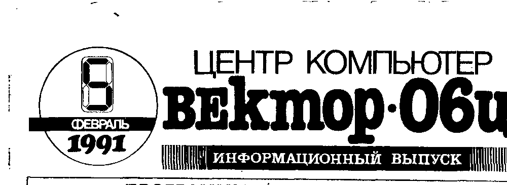
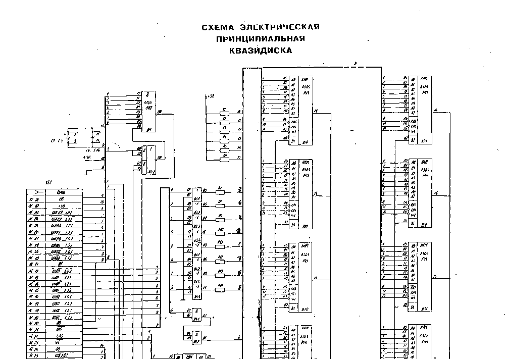
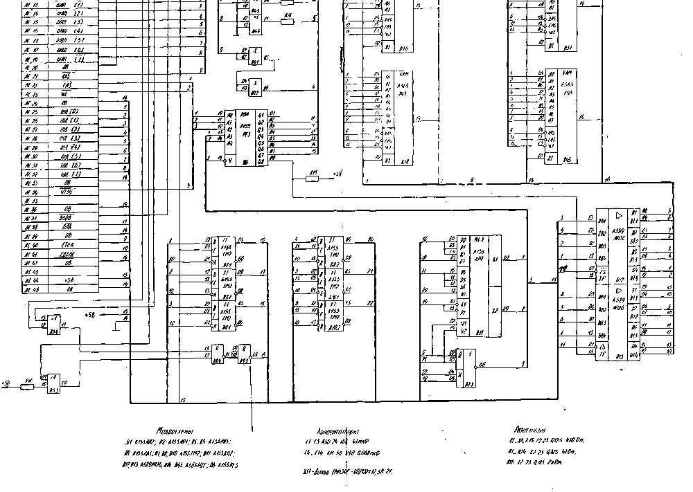

## От редакции

Дорогие друзья, этот номер ИВ практически полностью посвящен новым программам.
Это вызвано не только и не столько большим количеством новых игр, сколько появлением таких незаурядных программ, как графический редактор КАРАНДАШ и текстовый редактор RETEX, а также средств для работы с Бейсиком в МикроДОСе.

В связи с этим обещанное окончание публикации технического описания "ВЕКТОРа 06Ц" переносится на следующий номер ИВ.

Трудности в обеспечении кассетами и новые налоги не позволили нам оформить программное обеспечение в виде выпусков.
Надеемся, что выборочная запись новых программ создаст дополнительные трудности только нам и не сильно скажется на сроках выполнения заказов.

Итак, все программы, помещенные в этом информационном выпуске, поставляются в виде выборочной записи на кассетах заказчика.
Возможна запись на готовые выпуски или на чистые кассеты Центра.
В последнем случае к стоимости программ добавляется от 10 до 25 руб. в зависимости от типа кассеты.
При заказе просим указывать согласие на запись на импортные 90-минутные кассеты (имеющие большую вместимость и более высокую стоимость).

Ждем ваших заказов.

## Программы для работы на Бейсике v2.5 в МикроДОСе

При работе в МикроДОСе пользователи получают неоспоримые удобства и преимущества.
Но работа на Бейсике в МикроДОСе до сих пор была затруднена.
Этот недостаток устраняют две следующие программы:

1. RUN.COM - ДОСовский вариант БЕЙСИКа v2.5.
Позволяет запустить на выполнение программу на языке Бейсик, хранящуюся на квазидиске (или на дискете).
Формат команды: `RUN <имя>.BAS`.
По этой команде происходит загрузка Бейсика с квазидиска (дискеты), затем загрузка программы на Бейсике и ее автоматический запуск.
2. BT.COM - разработанная Соколовым А.А. программа для преобразования BAS-формата в текстовый формат и обратно.
Эта программа позволяет писать программу на Бейсике при помощи экранного текстового редактора (MARGO.COM), а также вносить изменения в ранее написанные программы.
Формат для преобразования BAS файла в текстовый: `BT_<имя>.BAS` - выходным файлом будет BT.TXT, для преобразования TXT-файла в бейсиковский: `BT_<имя>.TXT` - выходным файлом будет BT.BAS.
Для вывода простой подсказки необходимо ввести только `BT`.

Программа производит простой анализ содержимого входного файла на соответствие формата и, в случае обнаружения каких-либо ошибок, выводит нужное подсказывающее сообщение.
Поскольку программа не делает глубокого синтаксического анализа, программист должен соблюдать при написании программы известные несложные требования, предъявляемые к текстам программ на Бейсике.

Возможность обработки текста программы экранным редактором позволяет применить новые технологические приемы, которыми воспользоваться в Бейсике практически невозможно.
В качестве примера можно привести:

1. стирание ненужных кодов, слов и т.п. сразу по всему тексту программы;
2. замена по всему тексту одного имени на другое;
3. красивое оформление текста для вывода на печать.

Программы поставляются в формате МикроДОСа. Стоимость каждой 10 руб.

## В вашу программотеку

БАЗА АЛЬФА (Сухович, Гасич, г.Одесса) (9) - динамичная игра с развитым космическим сюжетом, стрельбой, взрывами и т.д.
Имеет несколько уровней, хорошо оформлена.

ФРУКТОВАЯ МАШИНА (RUSSER-SOFT, г.Кишинев) (8) - эта программа превратит ВЕКТОР-06Ц в очень популярный (на Западе) игровой автомат "ОДНОРУКИЙ БАНДИТ".

GRED (творческая группа 'CHS', г.Кишинев) (9) - программа предназначена для рисования графических изображений небольшого формата.
Используется для создания движущихся объектов, элементов заставок и рисунков при составлении программ.
Программа позволяет:

- поточечное рисование в режиме "лупа";
- три режима: 8x8 точек, 16x16 и 32x24;
- инвертирование изображения;
- запись и считывание с магнитной ленты (в режиме 32x24 точки);
- оцифровка изображения (т.е. выдача десятичных кодов для непосредственного использования в программе на БЕЙСИКе или кодах).

STADIC (творческая группа 'CHS', г.Кишинев) (9) - программа предназначена для широкого круга радиолюбителей.
Она производит расчет полупроводникового стабилизатора напряжения.
Пользователю предлагается задать входное напряжение, выходное напряжение и ток (5...15 В, 0,1...3 А) и выбрать желаемые типы транзисторов, все остальное выполнит "ВЕКТОР-06Ц": выдаст чертеж схемы, рассчитает номиналы резисторов, подберет стабилитрон, определит площадь радиатора.
При наличии принтера вся эта информация выводится на бумагу.
Программа учитывает оптимальные коэффициенты нагрузки для транзисторов, входящих в состав стабилизатора.

Маркировка стабилитронов (Василенко, г.Кишинев) (7) - программа для распознавания типа стабилитронов по их маркировке.

Все 5 программ в Бейсике. Стоимость каждой программы - 5 руб.

## Бейсик-Корвет

Версия языка БЕЙСИК для "ВЕКТОРа-06Ц", совместимая с БЕЙСИКом компьютера КОРВЕТ.
В отличие от гуляющей по стране копии этой программы, Центр "КОМПЬЮТЕР" поставляет исправленный вариант БЕЙСИК-КОРВЕТа, с правильно работающими операторами LLIST и LPRINT.
Поставляется с описанием в формате ROM без защиты от копирования.
Стоимость программы - 15 руб.

## Программа для проверки исправности транзисторов и диодов

С помощью программы "PNP", написанной Янушкевичем В.А. и Лебедевым В.С. (г.Кишинев), можно проверить исправность любого транзистора, диода, определить базу биполярного транзистора, анод и катод диода.
Транзисторы и диоды подключаются к ВЕКТОРУ-06Ц через разъем ПУ с помощью простейшего контактного устройства, содержащего три резистора (схема высылается вместе с программой).
Программа в формате ROM. Объем - 3 блока (768 байт). Стоимость 3 руб.

> ОБЪЯВЛЕНИЯ
>
> Р.3. Подключаем персональные компьютеры в цвете и со звуком к телевизорам любого типа 1, 2 и 3 поколений (для ламповых изготавливаем дополнительный блок).
> Обращаться по тел. 49-67-00 Сергей или 63-99-33 Руслан.
>
> К.2. Куплю блок питания для "ВЕКТОРа-06Ц". Просьба обращаться через Центр "КОМПЬЮТЕР". Олег.
>
> К.3. Куплю дисковод. Обращаться... в ЦЕНТР "КОМПЬЮТЕР". Дима.

## Схема электрическая принципиальная квазидиска

## Графический редактор Карандаш

Впервые широкому кругу пользователей "ВЕКТОРа-06Ц" предоставляется возможность для создания графических изображений любого качества и уровня сложности с использованием современных средств компьютерной графики.

Из возможностей графического редактора особо следует отметить:

- наличие удобного графического меню;
- количество цветов изображения - 16;
- "лупа" большого размера для поточечного рисования и проработки мелких объектов;
- новый алгоритм заливки (отличный от используемого в Бейсике v2.5), позволяющий заливать произвольные контуры не только чистым цветом, но и с использованием разнообразных масок.
Способ заливки, используемый в "КАРАНДАШЕ", предохраняет изображение от уничтожения при "вытекании" заливки через случайный разрыв в контуре;
- несколько режимов вывода на МЛ изображений целиком или фрагментами, в упакованном виде или в формате монитора.
Это позволяет компактно хранить создаваемые изображения, а также использовать их в различных программах;
- возможность работы как с клавиатурой, так и с джойстиком.

Графический редактор поставляется в формате загрузчика (ROM1) с защитой от копирования.
Записывается на ленту два (или более, по желанию заказчика) раза.
Стоимость - 25 руб.

## Внимание

Объявляется конкурс на лучший рисунок, созданный с использованием графического редактора "КАРАНДАШ".
Тема рисунков - произвольная: заставки к программам и портреты, рисунки из мультфильмов и классические пейзажи, и т.д.
Главный критерий - качество художественного исполнения.
Победителей ждут премии и призы.

Возврат кассет, пришедших на конкурс, гарантируется.
Авторов просят указывать названия рисунков, свой подробный адрес, а также полностью фамилию, имя и отчество, желательно и телефон.

## Текстовый редактор RETEX

RETEX - это новый полноэкранный редактор текстов ABLESoft для компьютера "ВЕКТОР-06Ц".

RETEX - это простое и удобное управление, высокая скорость в наборе текста, скроллинге, поиске, замене и всех других действиях.

RETEX - это высококачественный знакогенератор размером 8x12 пикселей, использующий полный комплект из 256 символов (русские и латинские, заглавные и прописные буквы, знаки и управляющие символы).

RETEX - это максимальная длина строки - 255, из них на экране 32 символа в строке, т.е. высокое качество изображения не только на мониторе, но и на любом бытовом телевизоре.

RETEX - это вывод на печатающее устройство и возможность ввода символов по их коду, что позволяет максимально использовать все возможности и шрифты принтера.

RETEX - это запоминание и копирование произвольно выбранных строк.

RETEX - это редактирование текстов объемом до 44 Кбайта, возможность записи и считывания их с магнитной ленты, простое и удобное объединение файлов.

RETEX - это малый объем программы (8 Кбайт), что позволяет при изготовлении модуля загрузки с ППЗУ обойтись только одной дефицитной и дорогостоящей микросхемой 573РФ6.

Для тех, кто программирует на Ассемблере, RETEX - это высококачественное средство для набора исходных текстов, не требующее никакой дополнительной аппаратуры (квазидиск, дисковод) и обладающее такими преимуществами, как высокая скорость обновления экрана, большой объем текстового буфера, наличие блоковых операций для копирования произвольных участков текста, поиск и замена, качественное изображение и др.
Файлы выводятся на ленту в формате ASM, что позволяет без переделки использовать их для ассемблирования программой Редактор-ассемблер.

**Редактор RETEX - это профессиональный уровень обработки текстов.**

Текстовый редактор RETEX поставляется в формате загрузчика (ROM1) с защитой от копирования.
Записывается на ленту два (или более, по желанию заказчика) раза.
Стоимость - 25 руб.

## Moon Bugs

"Лунные мухи" атакуют космический корабль на старте.
Ваша задача - маневрируя и отстреливаясь, "прикрывать" погрузку корабля.
Малейшая нерасторопность - и груз унесен мухами.
Игра динамична, имеет великолепную графику, несколько уровней с разными ландшафтами и нарастающей сложностью.

## Donkey Kong

Рабочий должен забраться на верхний этаж, нажать тумблер передвижного крана, проехать, зацепившись за крюк, остаток пути, чтобы перейти на следующий уровень.
Все это было бы не так трудно, если бы не пробравшаяся на стройку дикая обезьяна...

## Life

Весьма мощная реализация математической игры Дж. Конвея "Развитие" ("Жизнь").
Игровое пространство - 256x256 точек, смена поколений происходит менее чем за секунду, имеется "лупа", позволяющая рассматривать участки в увеличенном изображении, имеется набор стандартных фигур, и удобные средства для нанесения исходных колоний.

## Орган

Эта программа превратит клавиатуру "ВЕКТОРа-06Ц" в клавиши органа.
Вы сможете исполнить мелодию (доступны 3 октавы), программа запомнит то, что вы сыграли и воспроизведет в точности, причем сколько угодно раз.
ОРГАН - это не только простой музыкальный инструмент, но и весьма полезное средство для обучения музыкальной грамоте.

## Шашки, поддавки, уголки

Три программы в кодах, одного автора.
Эти программы позволят вам сразиться с "ВЕКТОРом-06Ц" в шашки, попытаться обставить его в поддавки, уголки.
Доска и шашки даны в графическом, разумеется, исполнении.

## Alibaba

Алибаба охраняет от разбойников мешки с сокровищами.
Разбойники стремятся пробраться к складу и "приделать ноги" мешкам.
Алибаба гоняется за разбойниками, а главарь разбойников гоняется за Алибабой.

## Putup

Улучшенный вариант известной игры из MSX Magazine, красиво адаптированный для "ВЕКТОРа-06Ц".
Вам вменяется в обязанность найти в старом подземелье волшебную лампу.
Для этого в комнате надо взять с полки ключ в виде ягодки и доставить его к лунке, чтобы появился выход в следующую комнату.
По пути можно прихватить разные фрукты и найти сюрприз, в том числе и дополнительную жизнь.
Но можно также упасть в огонь или в каменный мешок, откуда нет выхода, и встретиться с бродящими по подземелью всевозможными существами, самое страшное из которых появляется по истечении отведенного времени.
Однако эти существа не только опасны, а порой просто необходимы для преодоления трудных участков...

Все 9 описанных программ поставляются в формате загрузчика (ROM1) с защитой от копирования.
Записываются на ленту два (или более, по желанию заказчика) раза.
Стоимость каждой программы - 5 руб. 50 коп.

> Принимаем для публикации любые материалы, касающиеся компьютера "ВЕКТОР-06Ц", рекламу, отзывы, объявления и другую информацию.
>
> Наш адрес: 277060, г. Кишинев, а/я 3556, Центр "КОМПЬЮТЕР", ИНФО
