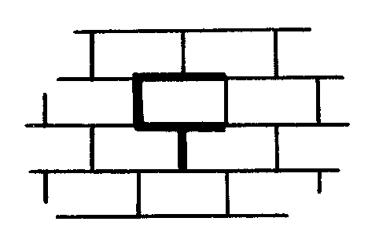
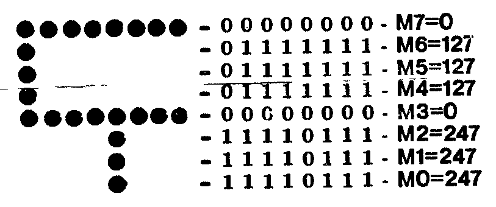

## Исключение экранных плоскостей в Мониторе

Программа Монитор-отладчик, в отличие от BASICa v2.5, не позволяет отключать экранные плоскости.
В Мониторе под экран задействованы всего две экранные плоскости 2 и 3.
Но иногда желательно освободить одну экранную плоскость, например, чтобы поместить туда какую-либо программу или данные.
Для этого необходимо:

1. в ячейке FBA1 изменить E0 на C0 (E0)
2. в ячейке FD84 изменить 06 на 04 (02)
3. в ячейке FBD1 изменить E0 на C0 (E0)
4. в ячейке FBDA изменить 3F на 1F (1F)
5. записать с ячейки 0100, следующую программу:

```
0100  21 00 EF      LXI   H,0EF00h
0103  01 20 A0(C0)  LXI   B,0A020h (0C020h)
0106  16 10         MVI   D,10h
0108  70            MOV   M,B
0109  23            INX   H
010A  15            DCR   D
010B  C2 08 01      JNZ   108h
010E  04            INR   B
010F  0D            DCR   C
0110  C2 06 01      JNZ   106h
0113  C3 00 00      JMP   0
```

Запустив программу директивой G, мы изменяем ячейки от EF00 до F0FF, исключая обращение к области, где расположена экранная плоскость 2.
При таком изменении работает экранная плоскость 3.

Аналогично можно исключить плоскость 3 и работать с плоскостью 2.
Необходимые для этого изменения приведены в скобках.

Для увеличения яркости можно установить белый цвет знаков директивой NC77.

Ю.Чернявский, г.Никополь

## Литература по МикроДОС

В последнее время значительно увеличилось число пользователей "ВЕКТОР-06ц", работающих с квазидиском или дисководом под управлением операционной системы МикроДОС.
Возрос интерес к ней и потребность в дополнительной информации.
ИВ будет публиковать различные материалы по этой важной теме, но, чтобы предупредить часть вопросов, приведем следующий список литературы:

- Глухов В.Н. и др. МикроДОС - адаптивная система программного обеспечения для 8-разрядных МикроЭВМ ("Микропроцессорные средства и системы" 1988 №4 с.33)
- МикроДОС: мобильная операционная система для микроЭВМ. (Серия "Методические материалы и документация по пакетам прикладных программ (Библиотека МикроДОС)", в.40 в 3-х частях. М.: МЦНТИ/МНИИПУ, 1985)
- Системные программы МикроДОС (Серия "Методические материалы и документация по пакетам прикладных программ (Библиотека МикроДОС)", в.45. М.: МЦНТИ/МНИИПУ, 1986)

## Как играть в Donkey Kong

По следам наших программ.

По причине отсутствия в игре инструкции мы приводим описание замысловатого управления.

Задача рабочего - забраться на верхний этаж, к стойке с тумблером крана.
Передвижение - клавишами `[←]`, `[→]`, прыжок - `[пробел]`, остановка - `[↓]`, а лазанье по лестницам - `[↑]`, `[↓]`.
Если нажать `[пробел]` несколько раз подряд, рабочий зависнет в прыжке на большее время.
По дороге наверх избегайте столкновений с катящимися и падающими бочками, падений вниз и ударов головой о лестницы и низкие перекрытия.
Когда вы добрались до тумблера, встаньте рядом с любой стороны и пробуйте включить кран клавишей `[↖]`.
Если крюк не начал двигаться, периодически щелкайте тумблером, пока на стройке не включат электроэнергию.

Когда кран включится, подойдите точно к краю панели, дождитесь, чтобы крюк подъехал достаточно близко, и зацепитесь клавишей (значок клавиши, неразборчиво в скане).
Далее надо еще удачно спрыгнуть, упредив удар о стенку, вовремя нажав клавишу `[↓]`.
Затем проделать оставшийся путь и упереться носом в блок с крюками.
В результате всего этого на блоке станет на один крюк меньше.
Сняв с блока все крюки, вы перейдете на следующий этаж.
Но если этот уровень надоел вам - просто нажмите `[С]` (значок клавиши, не вполне разборчиво в скане).

Останавливать программу надо клавишей `[E]` (END).

## В вашу программотеку

**БЛОК1** (Е.Пузанов, г.Кишинев) (8)

Программа представляет собой сборник из пяти игр: Ханойская башня, Перехватчик, Удав, Реверси, Мины.
То есть, купив и загрузив БЛОК1, вы вводите в компьютер сразу пять программ, играть в которые можно без перезагрузки!

**ТАРАКАНЬИ БЕГА** (В.Оленчук, г.Кишинев) (9)

Азартная игра, вкусно оформлена.
От 1 до 5 человек могут сделать ставки и испытать судьбу, которая представлена в виде тараканов, стремительно ползущих к финишу, обгоняя друг друга.
Имеется отдельная программа - описание.

**РАСЧЕТ ВЫПРЯМИТЕЛЯ** (А.Перевалов, пгт.Чимишлия) (4)

Рассчитывает силовой трансформатор и выпрямитель.
Имея эту программу и программу STADIC (ИВ№5), вы можете полностью доверить расчет блока питания компьютеру.

**РАСЧЕТ АФ** (Д.Скобич, г.Кишинев) (8)

Эта программа рассчитает и поможет вам сконструировать усилитель или фильтр на базе ОУ.
По заданным полосе пропускания, добротности, входному и выходному сопротивлению, другим параметрам компьютер выберет и нарисует вам оптимальный вариант электрической схемы, рассчитает ее параметры.
Программа защищена автором от копирования.

Все программы на BASICe.
Стоимость одной программы - 5 руб.

## Техническое описание

(Окончание. Начало в ИВ №№ 2-4)

Содержимое ПЗУ D37 приведено в табл.9.
Выборка ПЗУ осуществляется по сигналу "CAS0".
На адресные входы D37 подаются разряды A13, A14 от ЦП, сигнал "БЛК" от внешнего устройства и сигнал "MX2".

В адресном пространстве ОЗУ для хранения информации, выводимой на экран, отведена зона с адресами 8000-FFFF.
При обращении контроллера дисплея к ОЗУ считывается информация из старших 32 Кбайт.
Это реализовано подачей постоянного высокого уровня сигнала на вход 05 мультиплексора адреса.

Таблица 10. Сигналы системной магистрали.

| Обозн. линии | Назначение линий | Напр. перед. |
| --- | --- | --- |
| ШАВВ | Адр.шина для ус-в ввода-вывода | выход |
| ШАП | Мультиплексированная адр. шина для обращения к внешнему ОЗУ | выход |
| RAS | Сигнал выбора строки | выход |
| CAS | Сигнал выбора столбца | выход |
| ШД | Шина данных | вх/вых |
| ЗПЗУ | Сигнал записи в ОЗУ | выход |
| ЧТЗУ | Сигнал чтения ОЗУ | выход |
| ЧТВВ | Сигнал чтения из ус-ва ввода-вывода | выход |
| ЗПВВ | Сигнал записи в ус-во ввода-вывода | выход |
| БЛК | Блокировка от внешнего устройства | вход |
| СТЕК | Сигнал обращения к стеку | выход |
| Строб сост. | Сигнал, стробирующий запись байта состояния процессора | выход |
| +5В, 0В | Электрическое питание модулей расширения | выход |

Примечание.
Направление передачи указано относительно системного модуля.

Мультиплексор адреса D11...D14 управляется сигналами "MX1", "MX2".
При обращении контроллера дисплея к ОЗУ на входы D0,D1,D4,D5 мультиплексора подаются сигналы со счетчика горизонтальных позиций экрана и счетчика адреса текущей строки отображения.
При обращении ЦП к ОЗУ на входы D2,D3,D6,D7 подаются адресные разряды A0-A12, A15 шины адреса.
Разряды A13, A14 поступают на формирователь выбора линеек ОЗУ.

Кроме подаваемых на ОЗУ четырнадцати адресов, мультиплексированных по времени, мультиплексор адреса обрабатывает дополнительный восьмой разряд адреса, который выбирается из A13, A14, выдаваемых ЦП, и третьего разряда адреса, выдаваемого счетчиком адреса текущей строки отображения.
Восемь разрядов мультиплексированного адреса, поступающего на разъем XS1, предназначены для подключения внешнего динамического ОЗУ с организацией 64Кх1.

Мультиплексор данных обеспечивает передачу данных из банка ОЗУ на шинный формирователь D28.
Мультиплексирование данных управляется сигналами, поступающими с адресных выходов ЦП A13, A14.
В случае обращения к ОЗУ контроллера дисплея информация не передается на шину данных, а поступает на сдвигающие регистры.
Регенерация динамического ОЗУ выполняется во время обращения к памяти контроллера дисплея.
Период полной регенерации внутреннего ОЗУ составляет 256 мкс, а внешнего - 512 мкс.

2.9. Все основные узлы БПЭВМ связаны с ЦП через системную магистраль, содержащую 35 линий, наименование и назначение которых приведены в таблице 10.

Возможность наращивания аппаратных средств обеспечивается магистральной структурой БПЭВМ, наличием параллельного программируемого интерфейса и выводом системной магистрали на отдельный разъем XS1.

### Перечень сокращений и условных обозначений

| Обозначение | Расшифровка |
| --- | --- |
| БЛК | сигнал блокировки от внешнего устройства |
| ЗПЗУ | сигнал записи в ОЗУ |
| ЗПВВ | сигнал записи в устройство ввода-вывода |
| КСИ | кадровый синхроимпульс |
| ОЗУ | оперативное запоминающее устройство |
| ПЗУ | постоянное запоминающее устройство |
| ССИ | строчный синхроимпульс |
| СТЕК | сигнал обращения к стеку |
| СГП | счетчик горизонтальных позиций экрана |
| СВП | счетчик вертикальных позиций экрана |
| ШАВВ | шина адреса устройств ввода-вывода |
| ШАПО | шина адреса ОЗУ |
| ШДО | шина данных |
| ФВД | формирователь временной диаграммы |
| ЦП | центральный процессор |
| ЧТВВ | сигнал чтения с устройства ввода-вывода |
| ЧТЗУ | сигнал чтения из ОЗУ |
| CLR | сигнал разрешения записи в таблицу цвета |

## Подключение принтера МС-6312

Хочу поделиться опытом подключения принтера МС-6312.
Со стороны БПЭВМ желательно установить перемычку между контактами C01 и A10, а со стороны принтера - между контактами 24 и 25.
Необходимо использовать 11-жильный кабель, распаянный по следующей схеме:

| "ВЕКТОР-06Ц" | Сигнал | МС-6312 |
| --- | --- | --- |
| A02 | Данные 8 | 9 |
| A03 | Данные 7 | 8 |
| A04 | Данные 6 | 7 |
| A05 | Данные 5 | 6 |
| A06 | Данные 4 | 5 |
| A07 | Данные 3 | 4 |
| A08 | Данные 2 | 3 |
| A09 | Данные 1 | 2 |
| C05 | Строб | 1 |
| C09 | Готовность | 11 |
| C01 и A10 (перемычка) | Общий | 24, 25, 18 |

Кроме того, со стороны принтера обязательна установка перемычки между контактами 18 и 24 (или 25).
Кабель, изготовленный таким образом, обеспечивает обмен информацией между БПЭВМ и принтером по интерфейсу ИРПР-М.
Печатающее устройство "Электроника МС-6312" относится к типу "Роботрон", поэтому не требует инициализации оператором SCREEN 6,0, т.к. устанавливается автоматически при запуске Бейсика или Монитора.
Поскольку в применяемой версии Бейсика используется кодировка символов КОИ-7 НО/1, то есть совмещенный русско-латинский алфавит, прописные буквы, сразу после включения принтера необходимо установить набор символов КОИ-7 НО/1 с помощью оператора:

```
LPRINT CHR$(27)"R"CHR$(2)
```

Дальнейшее управление принтером осуществляется согласно описаний Бейсика и принтера.

А.Ирецкий, г.Ленинград

## BASIC

Этой подборкой статей мы начинаем новую рубрику, посвященную интерпретатору языка BASIC компьютера "ВЕКТОР-06ц".
Появление этой рубрики вызвано неожиданно большим количеством вопросов по BASICу.
Почта показывает, что иногда "бейсиколюб" со стажем не знает, как пользоваться клавишей [УС], а новичок, впервые запустивший BASIC, хочет немедленно разобраться с экранными плоскостями и использовать функцию USR.
Поэтому мы не стали делить материал на простой и сложный, а дали его общей "кучей".
Задавайте нам вопросы, делитесь информацией, и вместе с вами мы постараемся пробраться через дебри описаний, избежать ошибок и заглянуть в тайники BASIC.

### Клавиши, используемые для редактирования строк

| Клавиша | Действие |
| --- | --- |
| `[→]` | перемещение курсора на символ вправо |
| `[←]` | перемещение курсора на символ влево |
| `[↖]` | перемещение курсора на слово влево |
| СТР | перемещение курсора на слово вправо |
| `[↑]` | перемещение курсора в начало строки |
| `[↓]` | перемещение курсора в конец строки |
| ЗБ | удаление символа слева от курсора |
| F2 | удаление символа над курсором |

### Использование клавиши УС

**УС** Нажатие клавиши УС приостанавливает процесс выполнения программы на BASICe (или вывод строк программы по LIST), а ПРОБЕЛ или любой символьной клавиши - продолжает работу интерпретатора.
Благодаря этому можно осуществить пошаговый режим выполнения программы (или построчный вывод листинга), для чего, удерживая УС, нажимать ПРОБЕЛ.
Каждое нажатие ПРОБЕЛ будет вызывать выполнение одного оператора, после которого интерпретатор будет переходить в режим ожидания до следующего нажатия ПРОБЕЛ.

**УС+Ц (^C)** Нажатие клавиши Ц при нажатой клавише УС приводит к прерыванию выполнения программы (или вывода листинга) и выходу в непосредственный режим.
Настоятельно рекомендуем применять для останова программы ^C, а не СБР+БЛК, т.к. сброс изменяет некоторые установки (например, HIMEM) и может вызвать другие нежелательные последствия.

**УС+Е (^E)** Прерывает программу так же, как и ^C, но дополнительно выдает на экран номер строки, которая выполнялась в момент прерывания.
Использование ^E весьма полезно при отладке и редактировании программ, т.к. позволяет легко определить, какие строки отвечают за выполнение того или иного куска программы.
Для этого достаточно запустить программу, дождаться интересующего момента и нажать ^E.

При использовании УС, ^C и ^E следует помнить, что интерпретатор опрашивает клавишу УС только в промежутках между выполнениями операторов.
Поэтому приостанов или прерывание не происходит во время выполнения медленных операторов, таких, как PAUSE, PAINT и т.п.
Также УС, ^C и ^E не прерывают звучания уже запущенного оператора PLAY.
Если после нажатия ^C (или ^E) программа остановилась, но не появилось приглашение "=>" и курсор (и надпись с номером прерванной строки в случае ^E), значит, в программе имелись изменения цветов и (или) экранных плоскостей.
Чтобы сделать курсор видимым, надо вслепую дать все или какие-то из следующих команд:

```
SCREEN 2,15
COLOR 7,0
SCREEN 0,7,34
```

### Оператор SCREEN 3

Оператор SCREEN с режимом 3 устанавливает маску, которая влияет на результат выполнения оператора LINE с параметрами BF и BS (закрашенные прямоугольники и символы увеличенного размера).

Формат оператора:

```
SCREEN 3,M0[,M1[,M2...[,M7]]]
```

где M0 ... M7 - выражения в диапазоне 0...255.

Весь экран "ВЕКТОР-06ц" условно разбит на прямоугольники 8\*8 точек.
Каждый прямоугольник - это 8 байт.
Нижний байт каждого прямоугольника маскируется параметром M0, второй снизу - M1 и т.д.
Каждый бит маскирующего байта разрешает (1) или запрещает (0) менять цвет в этой точке.
Рассмотрим действие оператора SCREEN 3 на примере:

```
10 CLS
20 COLOR 6,0,0
30 SCREEN 3,247,247,247,0,127,127,127,0
40 PLOT 10,0,1
50 LINE 245,200,BF
```

Эта программа моментально рисует на экране кирпичную стену.
Посмотрим, как определялись значения параметров:





Оператор SCREEN 3 можно использовать для быстрого рисования небольших сложных изображений.
Для создания таких изображений как нельзя лучше подходит программа GRED (ИВ№5).
Эта программа позволяет нарисовать картинку, затем выдает десятичные значения байтов изображения, которые можно непосредственно использовать в качестве параметров оператора SCREEN 3.

### Использование 16-ричных значений

Для ввода и вывода значений в 16-ричном виде в BASICe v2.5 используются символы "&" и "@".
Их применение проиллюстрируем на примерах:

```
10 INPUT A : PRINT A
RUN
?&20
32
```

Здесь мы вводим 16-ричное число 20H, а получаем его 10-чный эквивалент 32.

```
POKE &8000,&FF,&F5
```

Здесь мы записываем, начиная с адреса 8000H, коды FFH, F5H.

```
PRINT @255
FF
```

Здесь десятичное число выводится в 16-ричном представлении.

```
10 A=&FE
20 B=2
30 PRINT @(A+B)
RUN
100
```

В этом примере показано выполнение смешанных действий с выводом результата в 16-ричном виде.

В.Князев, г.Ленинград

## Новые программы

### BASIC'M

Предлагаемая версия интерпретатора BASIC'M является расширением версии BASIC v2.5, совместима с последней и занимает такой же объем памяти.
Приводим краткое описание новых возможностей.

- **Названия строк.** Вместо того, чтобы запоминать номера строк, которые меняются при перенумерации, в BASIC'M предусмотрена возможность присвоения строкам текстовых меток (имен).
  При этом во всех операторах, обращающихся к соответствующим строкам, можно указать либо текстовую метку, либо номер.
- **Поиск параметров.** В BASIC'M предусмотрена возможность поиска и редактирования строк, содержащих заданную последовательность символов.
- **Перемещение блоков.** Возможен перенос выбранных строк программы на новое место.
  При этом автоматически меняются все обращения к номерам строк в программе (GOTO, GOSUB) в соответствии с их новым положением.
- **Трассировка.** В системе возможен режим, при котором после выполнения каждого оператора автоматически происходит обращение к отладочной подпрограмме на стандартном языке BASIC.
  Возможны арифметические операции с номерами строк как с числами.
  Управление режимом отладки можно осуществлять как с клавиатуры, так и программно.
- **Разделение экрана** на несколько окон.
- **Мерцание символов** с произвольным интервалом по времени и изменением цветов в фоновом режиме.
- **Вывод русских букв в негативе**, что позволяет отличить их от однотипных латинских букв.
- **Вывод текстов ускорен** в 1.5 - 3 раза с более плавным перемещением по экрану.
- **Операторы** ELSE, `RETURN<ном.строки>`
  Имеются другие дополнительные возможности.

Программа поставляется в виде выборочной записи.
Программа защищена от копирования.
Стоимость программы 20 руб.

### ТАНК

Танк должен уничтожить как можно больше штабов противника (отмечены флажками), преодолевая мины, отстреливаясь от танков и самоходных орудий противника.
На экране видна лишь часть местности.
Ориентироваться танку помогает радар.

### BLASTER

Летающие тарелки, выпускаемые вражеской космической базой, пикируют на ваш корабль.
Надо, уходя от столкновений с тарелками, сбивать их точными выстрелами.
Если вы продержитесь достаточно долго в периодически усложняющейся обстановке, то появится возможность взорвать и саму базу.

Программы ТАНК и BLASTER адаптированы под джойстик и поставляются в виде выборочной записи.
Стоимость каждой программы 5 руб.80 коп.
Программы защищены от копирования.

## Объявления

> Р.4 Программирую микросхемы ПЗУ следующих типов:
>
> а) 573РФ2, 573РФ4, 573РФ5, 573РФ6;
> б) иностранные 2716, 2764, 27128, 27256;
> в) 556РТ4, 556РТ5, 556РТ11, 556РТ16, 556РТ17, 556РТ18;
> г) 541РТ1, 155РЕ3.
>
> Имею все стандартные прошивки для компьютеров "ВЕКТОР-06ц", "Специалист", "РК-86", "ZX-Spectrum" и их варианты.
> Для "ZX-Spectrum" - русифицированные варианты ПЗУ, Турбо-ПЗУ, тест-ПЗУ, TR-DOS.
> Могу записать любую информацию по предоставленной заказчиком эталонной микросхеме.
> Программирование ПЗУ производится по новейшему алгоритму фирмы Intel с повышенной надежностью.
>
> Стоимость прошивки одной микросхемы типов а),б) - 15 руб, в) - 10 руб, г) - 5 руб.
>
> Заказы присылайте в адрес Центра "КОМПЬЮТЕР" с пометкой "НА ПРОШИВКУ".
> Прошитые м/с высылаются заказчику наложенным платежом.

> П.4 Продаю "ВЕКТОР-06ц", новый, по цене 1000р.
>
> Обращаться в Центр "КОМПЬЮТЕР". Леонид.

> К.4 Куплю принтер.
>
> Звонить по телефону 6-13-42 в г.Тирасполь.

> Объявления частных лиц по компьютерной тематике печатаются в ИВ бесплатно.
> Заказы принимаются письменно или по телефону 242-218.
> Реклама организаций, предприятий и кооперативов публикуется на договорных началах.

### Внедренческое предприятие ВИРТ

Вычислительные комплексы IBM PC.
Локальные вычислительные сети.
Программное обеспечение АСУ.
Издательская деятельность и реклама.
Информационные услуги.
Обучение и консультации.

Мы проведем независимую экспертизу приобретаемых вычислительных комплексов и программного обеспечения, найдем поставщика и окажем помощь в переговорах.

**РАБОТА "ПОД КЛЮЧ" И В КРАТЧАЙШИЕ СРОКИ**

ВИРТ - предприятие нового типа с широкими связями в стране и за рубежом - всегда на стороне заказчика.

> 277061 Кишинев, ул.Стефана Великого, 3
> внедренческое предприятие ВИРТ
> Тел. (0422) 26-23-46

Макет выпуска подготовлен издательством ВИРТ-пресс.

> Принимаем для публикации любые материалы по компьютеру "ВЕКТОР-06ц", рекламу, объявления и т.д.
>
> Наш адрес: 277060, г.Кишинев, а/я 3556, Центр КОМПЬЮТЕР, ИВ
