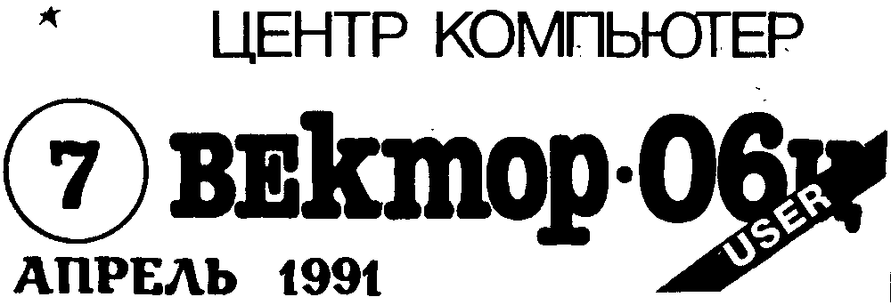
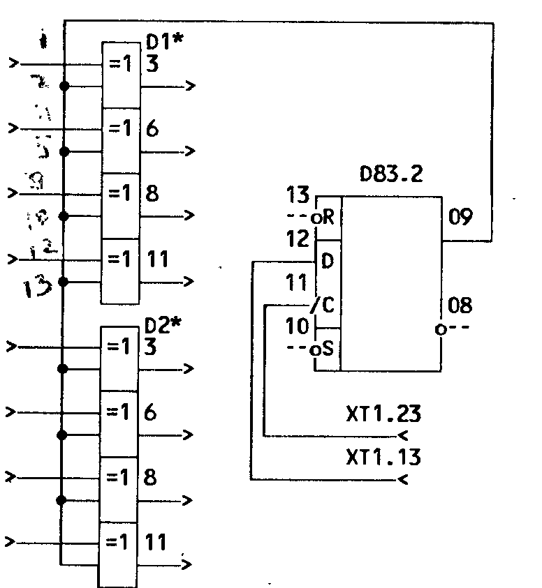
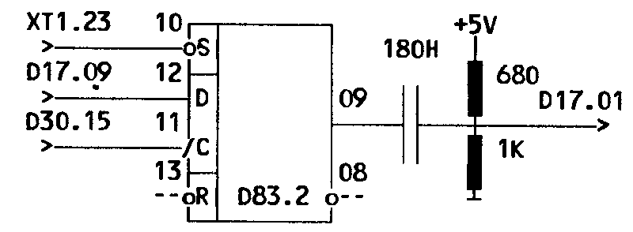
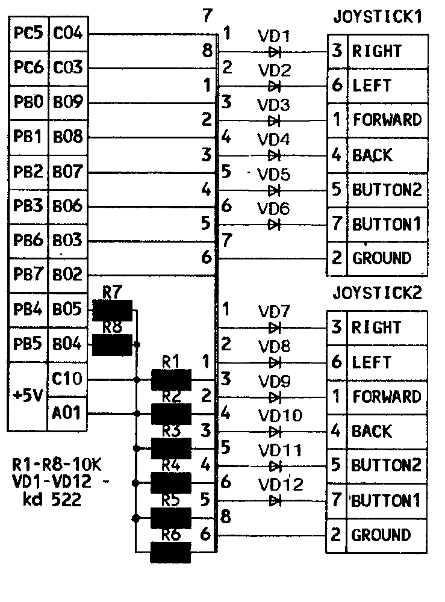
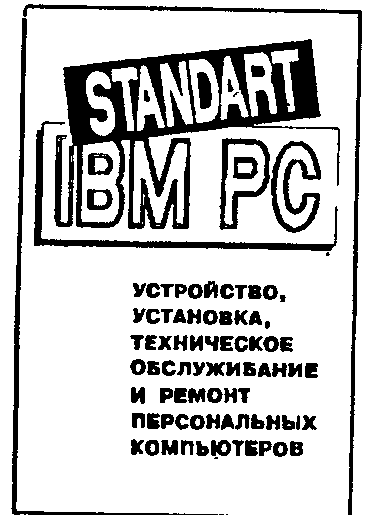

## От редакции

Переход на выборочную запись программ не оправдал возлагавшихся на него надежд.
Увеличились задержки в выполнении заказов, снизилось качество записи и сопроводительной документации.

Центр "КОМПЬЮТЕР" приносит Вам, дорогие читатели и пользователи, свои извинения, переходит на обычную форму распространения программ по выпускам и убедительно просит воздержаться от заказов до сентября 1991г.

## Русские буквы на EPSON (RAVI)

В принятой на ВЕКТОРе-06ц кодировке КОИ-7 заглавные русские буквы начинаются с кода 60H "Ю", а на принтерах - с B0H "А".
В Мониторе (NP1) эти коды расположены в адресах FFBCH-FFDBH, в BASICe 2.5 (SCREEN6,1) - в 1DBFH-1DDEH.
Чтобы на принтере печатались заглавные латинские и русские буквы, необходимо сделать перекодировку, для чего в указанных адресах записать:

```
FFBC(1DBF): CE B0 B1 C6 B4 B5 C4 B3
FFC4(1DC7): C5 B8 B9 BA BB BC BD BE
FFCC(1DCF): BF CF C0 C1 C2 C3 B6 B2
FFD4(1DD7): CC CB B7 C8 CD C9 C7 CA
```

Ю.Чернявский, г.Никополь

## Подключение монитора MC6105

Могу поделиться собственным опытом подключения к ВЕКТОРу-06ц видеомонитора Электроника MC6105 черно-белого изображения.

Для согласования этих устройств необходимо в компьютере емкость выходного конденсатора C33 увеличить до 50.0 мкФ (можно поставить электролитический, соблюдая полярность).
В мониторе емкость входного конденсатора C4 уменьшить до 1000 пФ.
Сопротивление R29 перед транзистором VT6 увеличить до 820 Ом, что повысит чувствительность.

Обратный ход строчной развертки можно убрать, как описано в ИВ№2 (частично неразборчиво в скане).
При недостаточной стабилизации питающего напряжения качество изображения ухудшается.

В.Шаповалов, г.Волынский

## Инверсные цвета на ВЕКТОРе-06ц

Данная схема позволяет при нажатии клавиш СС+БЛК+ВВОД инвертировать цвета изображения.
Обратное переключение осуществляется нажатием клавиш БЛК+ВВОД.
При доработке используется незадействованный триггер D83.2 (на плате находится в районе клавиши ПРОБЕЛ).
Микросхемы D1\*, D2\* К155ЛП5 (возможно применение серий 531 или 555) включаются перед D32, D39, как описано в ИВ№3 (вместо К155ЛН1).

Для доработки необходимо освободить резервные посадочные места, где находятся R53, C19.
Резистор необходимо оставить, припаяв его к выводам микросхемы, конденсатор можно исключить.
Если после переделки компьютер не работает, надо проверить аккуратность паек и отсутствие перемычек между проводниками.



Г.Василенко, г.Кишинев

## Автозапуск

Предлагаемая схема автозапуска для ВЕКТОРа-06ц передает управление программе пользователя после начальной загрузки (в том числе и новым загрузчиком), не дожидаясь мигания индикатора РУС.
Используется свободная часть триггера D83.2



В.Кальян, г.Кишинев

## Русские буквы в EDASM

В текстовом редакторе пакета EDASM в результате ошибочного определения конца файла становится невозможным правильный вывод на ленту текстов, содержащих символы с кодами больше 127, т.к. авторы проверяют только наличие в байте знакового (старшего) бита.
Предлагаемые исправления в коде редактора позволяют обойти этот недостаток:

```
975:  3C    INR A
976:  C8    RZ
977:  3D    DCR A
978:  81    ADD C
979:  4F    MOV C,A
97A:  88    ADC B
97B:  91    SUB C
```

П.Желнов, г.Отрадный

## Об эмуляторе РК-Микроша

Практически все программы, написанные для компьютеров РК и МИКРОША, можно запустить на ВЕКТОРе-06ц, используя программу-эмулятор.
Сразу после ее загрузки директивой & необходимо выбрать режим работы: "РК" или "МИКРОША".
ВЕКТОР-06ц эмулирует видеопамять, порты и стандартные подпрограммы монитора этих компьютеров.

Основная сложность состоит в том, что многие программы для этих компьютеров начинаются с адреса 0, а эмулятор хранит в ячейках 0000H-0002H переход по сбросу и в 0038H-003AH - переход на обработку прерывания.
Отказаться от использования этих ячеек эмулятором нельзя, поэтому программу приходится исправлять так, чтобы в них были переходы на соответствующие подпрограммы эмулятора.
Переделка не стоит больших усилий, но требует знание Ассемблера.
Если ничего не помогает, проще дизассемблировать такую программу и оттранслировать ее с адреса 100H.

С.Бергич, г.Кишинев

## Исправления

В статье "Исключение экранных плоскостей в Мониторе" (ИВ№6 стр.1) автором были допущены неточности.
В пункте 4 вместо "FBDA" следует читать "FBDB" и добавить пункт 6: "В ячейке FB9F изменить A0 на A0 (C0)"

Ю.Самарин, г.Ленинград

## Вопросы

Почему в Редакторе-Ассемблере EDASM не действует функция печати текста?

Какие программы для компьютера ВЕКТОР-06ц подходят к ВЕКТОРу-Старт 1200, на какие критерии ориентироваться в выборе программ?

И вообще, объявляется конкурс на лучший вопрос года в ИВ "ВЕКТОР User".
Бесплатные игровые выпуски ждут победителей, приславших самый компетентный, самый дилетантский вопрос, а также лучшие ответы на них.

## Выпуск Д-1

Инструментальный пакет создателя программного обеспечения для операционной системы МикроДОС (CP/M)

| Файл | Назначение |
| --- | --- |
| FORMAT.COM | программа форматирования гибкого диска |
| SYSGEN.COM | программа для переноса операционной системы на диск |
| PIP.COM | программа работы с файлами |
| WM.COM | текстовый редактор WordMaster |
| M80.COM | двуязычный макроассемблер |
| L80.COM | компоновщик перемещаемых модулей |
| LIB80.COM | программа работы с библиотеками перемещаемых модулей |
| DISASM.COM | дизассемблер |
| SID.COM | символьный отладчик программ в машинных кодах |
| LOADROM, LOADMON, LOADASM, LOADDOS, LOADBAS, SAVEROM, SAVEMON, SAVEASM, SAVEDOS, SAVEBAS | комплект программ для обмена с магнитофоном |

Стоимость выпуска с описанием 29 руб

## FORTRAN-80

Компилятор языка высокого уровня, позволяющий в операционной системе МикроДОС (CP/M) создавать эффективные программы на ВЕКТОРе-06ц в машинных кодах.

Стоимость 15 руб

## Новые программы

### Операционная система CP/M-39

Предлагаемая версия системы CP/M позволяет работать на ВЕКТОРе-06ц с одним или более дисководом без квазидиска.
Для программ пользователя остается 39K.
Под управлением системы нормально работают MARGO, SID, MAC, LINK, WORDMASTER, FORTRAN, BASIC и другие известные программы для CP/M.
Приобретя эту программу, вы затратите минимум средств и времени для дооснащения вашего компьютера дисковой операционной системой.

Стоимость программы 19 руб 20 коп

### MUSIC BOX

(С.Бергич, г.Кишинев)

Эта программа превратит ВЕКТОР-06ц в многоголосый клавишный инструмент с широкими возможностями.
Для работы программы необходима выносная музыкальная клавиатура, состоящая из 48 клавиш (4 октавы).
Для подключения этой клавиатуры к компьютеру потребуется 48 диодов, 8 резисторов и кабель.
Схема подключения прилагается при поставке.
Программа оформлена на BASICe, а основной блок написан в кодах.

Стоимость программы 9 руб

Возможна поставка программ на кассете или дискете заказчика или Центра (цена дискет 15 руб)

## ВЕКТОР-06ц для коротковолновиков

По многочисленным просьбам этой группы пользователей ВЕКТОРа-06ц Центр "КОМПЬЮТЕР" открывает новую рубрику.
Разработан модуль расширения ПИОНЕР-2 для работы RTTY, RS-232C (поддержка пакетной связи) с соответствующим программным обеспечением.
Готовится к выпуску программа для работы SSTV (медленное телевидение) с аппаратной поддержкой.

### AUTOCW

(С.Бергич, г.Кишинев)

Программа позволяет работать телеграфом в автоматическом режиме на прием и на передачу и может также использоваться для обучения азбуке Морзе.
Она превращает (неразборчиво в скане, возможно "прекращает") работу в эфире в приятное времяпровождение, т.к. обладает отличными сервисными функциями:

- передача текста непосредственно с клавиатуры;
- работа электронным ключом;
- постоянная запись передаваемой и принимаемой информации в аппаратный журнал и возможность его просмотра и печати;
- установка скорости передачи в широких пределах (от 30 до 4000 знаков в минуту);
- автоматическая настройка интерфейса на скорость приема информации (от 30 до 1000 знаков в минуту);
- передача в автоматическом режиме 16 буферов подготовки текста, специальных буферов RST, CALL, NAME, TIME и возможность перекрестных ссылок между ними;
- запись и считывание готовых текстов с магнитофона;
- выдача в эфир текущего времени системных часов;
- установка пользователем цвета изображения и фона;
- просмотр содержимого меню во время приема-передачи.

Передача сигнала осуществляется одновременно через магнитофонный выход ВЕКТОРа-06ц и порт ПУ.
Для согласования используется интерфейс CW (журнал "РАДИО" №8, 1983г).
Возможна коммутация трансивера.

Стоимость программы 18 руб.

## Джойстик П

Схема подключения джойстиков, опубликованная в ИВ№4, с незначительными изменениями стала стандартной для нового ВЕКТОРа-06ц.02 (см.стр.4).
Однако еще несколько предприятий в Союзе по-прежнему "гонят" ВЕКТОР-06ц.

Учитывая интересы многотысячной армии пользователей предыдущей модели популярного ПК, а также достаточную сложность схемы для повторения, в Центре "КОМПЬЮТЕР" была разработана альтернативная схема подключения к ВЕКТОРу-06ц двух джойстиков через разъем ПУ, не конфликтующая с принтером и модулем ППЗУ, которая получила название "ДЖОЙСТИК П".
В ней используется всего 8 резисторов и 12 диодов.

В схеме "П" сохранены распайка разъема и соответствие битам порта ВЕКТОРа-06ц.02 (на схеме в ИВ№4 следует исправить распайку и поменять местами биты кнопок в соответствии с приведенной схемой).

Для программной поддержки схемы необходимо сначала установить порт B на чтение в режиме 0

```
MVI  A,83H
OUT  4
```

Выбор джойстиков осуществляется установкой в 0 соответствующих им битов 5 или 6 порта C, а состояние джойстиков читается из порта B.

В настоящее время в Центре "КОМПЬЮТЕР" ведется адаптация существующего программного обеспечения под оба типа джойстиков.
Предлагаем всем разработчикам также поддерживать эти два стандарта.

В следующем выпуске "ВЕКТОР User" ждите большую конкретную статью по работе с PPI К580ВВ55А на ВЕКТОР-06ц.



Designed by О.Васенев, (неразборчиво в скане), Кишинев, 1991

## Оператор USR

Этот оператор позволяет, находясь в BASICe, выполнить подпрограмму в машинных кодах, если программа на BASICe выполняется медленнее, чем нужно.
Общий вид оператора:

```
X=USR(ADDR)
```

где X - идентификатор, ADDR - адрес программы в кодах.

Подпрограмма в кодах должна располагаться в области хранения программ и данных (4200H-7FFFH при четырех экранных плоскостях).
Подпрограмма на Ассемблере переводится в коды и записывается в память.
Чтобы защитить ее от случайного уничтожения, надо воспользоваться оператором HIMEM (например, если подпрограмма располагается по адресам 7500H-7FFFH, надо задать HIMEM &74FF), при этом область хранения программы становится недоступной для работы BASICa.

Подпрограмма в кодах должна соответствовать следующим требованиям, при несоблюдении которых BASIC может быть выведен из строя:

1. Программа должна начинаться с запоминания в стеке регистров микропроцессора и заканчиваться восстановлением регистров:

    | Начало | Код | Конец | Код |
    | --- | --- | --- | --- |
    | PUSH PSW | F5 | POP B | C1 |
    | PUSH H | E5 | POP D | D1 |
    | PUSH D | D5 | POP H | E1 |
    | PUSH B | C5 | POP PSW | F1 |

2. В конце подпрограммы должна быть команда RET (C9).

При выходе подпрограмма возвращает содержимое аккумулятора микропроцессора.
Если необходимо передать или получить от подпрограммы какие-либо данные, пользуйтесь операторами POKE и PEEK (см. ниже).

Загрузить подпрограмму можно, в зависимости от объема, при помощи директивы BLOAD или следующим образом.
Рассмотрим программу, которая при помощи подпрограммы в кодах чертит на экране линию толщиной 7 точек и длиной 8 \* заданное число точек.

```
10 HIMEM &7EFA
20 DATA &F5,&E5,&D5,&C5,&2A,&40,&7F,&3A,&45,&7F,&47,&C5,1,0,1,&E5,&3E,7,&36,&FF,&23,&3D,&C2,&E,&7F,&E1,9,&C1,5,&C2,7
30 DATA&7F,&C1,&D1,&E1,&F1,&C9
40 AD=&7EFC
50 FOR I=1 TO 37
60 READ B:POKE AD,B:AD=AD+1
70 NEXT I:CLS
80 INPUT"ADDRH";A
90 INPUT"ADDRL";A1
100 POKE &7F40,A1,A
110 INPUT"LINE";B
120 POKE &7F45,B
130 PRINT CHR$(12)
140 A=USR(&7EFC)
150 GOTO 80
```

Строка 10 резервирует память.
В блок данных DATA помещаются коды подпрограммы.
Затем в цикле оператором POKE в память записываются считанные из данных коды.

Ячейки памяти 7F40H и 7F45H служат для передачи данных в подпрограмму.
Сначала запрашивается старший байт адреса, затем младший.
Можно, например ввести &A0, 0,10, после этого на экране появится линия красного цвета длиной 80 точек.
Используемая в примере подпрограмма на языке Ассемблера выглядит так:

```
              ORG  7EFCH
F5            PUSH PSW
E5            PUSH H
D5            PUSH D
C5            PUSH B
2A407F        LHLD 7F40H
3A457F        LDA  7F45H
47            MOV  B,A
C5      M2:   PUSH B
010001        LXI  B,100H
E5            PUSH H
3E07          MVI  A,7
36FF    M1:   MVI  M,FFH
23            INX  H
3D            DCR  A
C20E7F        JNZ  M1
E1            POP  H
09            DAD  B
C1            POP  B
05            DCR  B
C2077F        JNZ  M2
C1            POP  B
D1            POP  D
E1            POP  H
F1            POP  PSW
C9            RET
```

Конечно, данный простой пример приведен лишь для иллюстрации работы USR.
Реальные возможности, которые открывает использование этого оператора, неограниченны (например, см. MUSIC BOX).
С его помощью можно создать динамическую игру, выполнить сложные расчеты, непосредственно обратиться к любым устройствам компьютера и т.д.

В.Князев, г.Ленинград

## Ошибки в BASICe 2.5

1\. Неверно работает оператор INPUT в случае ввода символьной строки.
Если введенная строка или ее часть совпадает с одним из зарезервированных слов BASICa, она возвращается в виде кода внутреннего представления этого слова.

Например, попробуйте ввести следующую небольшую программу:

```
10 INPUT A$
20 PRINT A$
```

Запустив программу, введите какое-нибудь зарезервированное слово, например, RENUM.
Вместо него оператором PRINT будет напечатана совершенная чепуха.
Хотя эту ошибку обойти совершенно невозможно, ввод таких строк бывает нужен разве что в обучающих программах.

Кроме того, оператор INPUT также неверно возвращает коды большинства специальных символов (порядок пар восстановлен по расположению в скане, часть значков сомнительна):

| Ввод | Возврат | Ввод | Возврат |
| --- | --- | --- | --- |
| - | % | " | ПУСТО |
| / | ' | & | I |
| : | ПУСТО | = | , |
| ; | ( | \* | & |
| @ | S | > | + |
| , | ПУСТО | < | - |
| + | $ | | |

2\. Как написано в документации, для печати крупным шрифтом достаточны оператор PLOT в режиме 2, LINE в режиме BS и PRINT.
Однако такая последовательность может нормально работать только 24 раза, после чего происходит скроллинг экрана на строку вверх.
Чтобы избежать этого, надо вставлять в программу CUR 1,1

3\. Некорректно работает функция ADDR для переменных, числовых и символьных массивов.
В случае символьных переменных выдается неверный адрес, использовать который дальше нельзя.
Это серьезный недостаток BASICa v2.5, так как теряется возможность записи символьных данных на магнитную ленту.

Правда, с помощью некоторых программных ухищрений это все же можно сделать.
Для этого необходимо в программе оператором HIMEM зарезервировать область памяти необходимой величины, а перед записью символьных данных перенести их побайтно в зарезервированную область в известном Вам порядке.

К примеру, надо записать на ленту символьный массив A$, состоящий из 10 элементов.
Вот фрагмент программы для его записи на ленту.

```
10 HIMEM &74FF
...
100 A=&7500
110 FOR I=0 TO 9
120 W$=A$(I)
130 POKE A,ASC(W$): A=A+1
140 IF LEN(W$)=1 THEN 160
150 W$=RIGHT$(W$,LEN(W$)-1): GOTO 130
160 POKE A,0: A=A+1: NEXT
170 BSAVE "DATA",&7500,A
```

Строка 100 задает начальный адрес зарезервированной области, в строке 120 очередная символьная строка копируется во вспомогательную символьную переменную W$.

4\. Оператор RENUM часто работает некорректно, особенно в длинных программах: после перенумерации в операторах передачи управления (GOTO, GOSUB, ON..., IF...THEN) появляются несуществующие строки.
За этим надо тщательно следить, просматривая программу после перенумерации.
Обычно эти несуществующие номера очень велики (больше 65000), поэтому заметить их не трудно.
Более того, если при перенумеровании задан, к примеру, шаг 10, то эти несуществующие номера еще более заметны, так как не будут кратны 10.

*ПРИМЕЧАНИЕ.* В наборе вместо символа (неразборчиво в скане) использован символ $

В статье использованы материалы И.Шиповского, В.Князева, В.Краева

## Объявления

> П.5 Продаю ВЕКТОР-06ц с дисководом TEAC и RAMдиском 256К.
>
> Центр "КОМПЬЮТЕР", Стас.

> Р.5 Ремонтирую магнитофоны типа "Электроника".
>
> Центр "КОМПЬЮТЕР", Дима.

> К.5 Куплю печатные платы квазидиска и контроллера дисковода ВЕКТОР-06ц.
>
> 183074 Мурманск-74, а/я 4128, Сергей

> К.6 Куплю новый кинескоп 51ЛК2Ц по договорной цене.
>
> 681017 Комсомольск на Амуре, ул.Вереговая, 29, В.Ерофеев

## Лучшая 8-разрядная советская ПЭВМ

- 1988г - серебряная медаль ВДНХ СССР
- 1989г - I место среди 8-разрядных ПЭВМ (II общее) на конкурсе ГКВТИ СССР

Новая модель:

### ВЕКТОР-06ц.02

- Подключение и загрузка с внешних устройств: блока НГМД (5.25" гибкий диск 800К), электронного RAMдиска (256К), модуля внешнего ПЗУ (32К), адаптера локальной сети, магнитофона.
- Периферийные устройства: принтер, джойстики, музыкальная клавиатура, модуль расширения для радиолюбителей, цифровой мультиметр и т.д.
- Улучшена схема подключения любых телевизоров и мониторов и настройка цветов (прямые/инверсные).
- Снижена на 40% потребляемая мощность, за счет применения новых БИС серии 1533 повышена надежность.
- Разработано и адаптировано самое обширное среди советских БПЭВМ прикладное, обучающее, системное программное обеспечение, дисковая CP/M-совместимая операционная система.

ВЕКТОР-06ц.02 с дополнительными периферийными устройствами поможет вам в решении широкого круга задач в быту, делопроизводстве, коммерции, в сфере обучения и организации досуга.

> Республика Молдова, 277032 г.Кишинев,
> ул.Тимошенко, 99, ПО "СЧЕТМАШ"
> телефоны (0422) 564-851
> 565-897
> телетайп 163421 ЛУЧ Корсунов
> (рукописная приписка: 56-49-88)

## Наконец-то выходит в свет справочник STANDART IBM PC

Устройство, установка, техническое обслуживание и ремонт персональных компьютеров

Книга содержит описание аппаратуры IBM-совместимых персональных компьютеров:



- принципиальные схемы всех основных устройств;
- практические рекомендации по диагностике и ремонту;
- обширный справочный материал.

Объем 12 п.л. Тираж 30 тыс.экз.
Стоимость - 17.8 руб.

Книга выходит в 3 квартале в издательстве ВИРТ и ориентирована на многоуровневое чтение для широкого класса пользователей, программистов и электроников.

Приглашаем к сотрудничеству книготорговые организации, оптовым покупателям предоставляется скидка от 10 до 30%.

*Заключение контрактов по гарантийным письмам.
Единичные заявки (до 10 экз.) выполняются наложенным платежом.*

> 277060 г.Кишинев, тел.57-84-87, 23-70-17

## КУВТ ВЕКТОР+

Лучшие в СССР 8-разрядные ПК ВЕКТОР-06ц под управлением профессиональной ПЭВМ ЕС 1840, совместимой с IBM PC

МНПП "ВИТАС" и Центр "КОМПЬЮТЕР" представляют

Комплекс учебной вычислительной техники **КУВТ ВЕКТОР+**

В единой сети работают ЕС 1840 - рабочее место преподавателя (РМП) и ВЕКТОР-06ц - рабочее место ученика (РМУ)

- КУВТ ВЕКТОР+ ... это оптимальное сочетание неограниченных возможностей, высокой надежности и низкой стоимости;
- КУВТ ВЕКТОР+ ... это богатое и разнообразное программное обеспечение:
  - комплекты учебных программ по предметам средней школы
  - системные и прикладные программы
  - широкий набор игровых программ
  - оболочка связи ЕС ↔ ВЕКТОР-06ц
  - работа в MS-DOS и МикроДОС (CP/M)

Каталог программ постоянно расширяется.
При желании Вы можете заказать дополнительное программное обеспечение.

**ВЕКТОР+ ... это Ваш КЛАСС!**

Установка в кратчайшие сроки, гарантийное и постгарантийное обслуживание в любом регионе страны.
Возможна поставка по государственным ценам монохромных мониторов ЕС 1840, ВЕКТОР-06ц, дооснащение квазидиском 64...256К (для разработки ПО, сбора данных и т.п. в сети ЕС-ВЕКТОР).

Информация и заказы по адресам:

> МНПП "ВИТАС"
> 270068 г.Одесса
> ул.Перекопской дивизии, 57
> телекс 232229
> телефакс 681722
> тел.(0482) 684-005

> Центр "КОМПЬЮТЕР"
> 277060 г.Кишинев
> а/я 3556
> тел.(0422) 242-218.

## Самая совместимая с IBM PC: ППЭВМ ЕС 1841

| Устройство | Характеристика |
| --- | --- |
| ОЗУ | 640Кбайт |
| НГМД | 2\*720Кбайт |
| Винчестер | 20 или 40Мбайт |
| Принтер | широкий СМ6337 или цветной СМ6341 |
| Манипулятор | типа "Мышь" |

Центр "КОМПЬЮТЕР" предлагает по государственным ценам ППЭВМ ЕС 1841 различной комплектации и дополнительное программное обеспечение.

> 277060 г.Кишинев-60
> а/я 3556
> тел.(0422) 242-218.

## Центр "КОМПЬЮТЕР" сообщает

> Центр "КОМПЬЮТЕР" приносит извинения уважаемым абонентам за большую задержку в подготовке Информационных Выпусков и надеется в ближайшем будущем наверстать упущенное на новом оборудовании.

> Центр "КОМПЬЮТЕР" ищет дилеров среди организаций или частных лиц для распространения Информационных Выпусков "ВЕКТОР User" по всей территории страны на взаимовыгодных условиях.

> Центр "КОМПЬЮТЕР" почти готов организовать выпуск похожих Информационных Выпусков по другим типам популярных бытовых компьютеров (MSX, ZX Spectrum, Atari, IBM PC и др).
> Предлагаем нашим читателям высказать свое мнение, спросить мнение знакомых и написать нам.
> Не дожидаясь результатов, можно присылать информацию, вопросы, объявления, рекламу и т.п. по адресу:
>
> 277060 г.Кишинев, а/я 3556, Центр КОМПЬЮТЕР

Макет выпуска подготовлен издательством ВИРТ-пресс.
