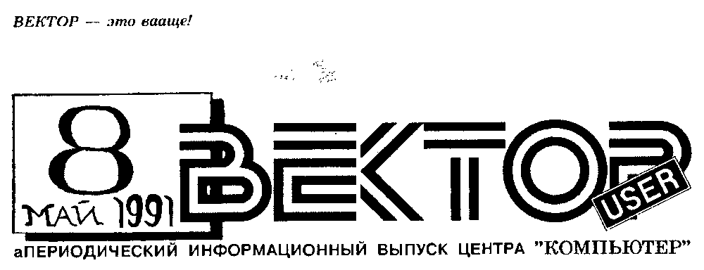
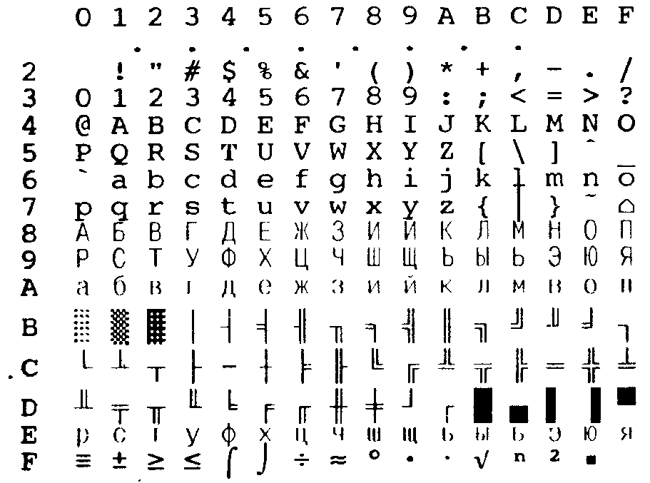
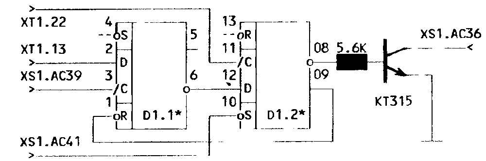

## От редакции

Мы еще раз приносим извинения всем абонентам Ц"К за задержку очередного Информационного Выпуска.
Наверстать упущенное в этом году вряд ли удастся.

Ц"К сообщает, что в целях борьбы с выборочной записью с ноября 1991 г. устанавливается стоимость выборочной записи любой программы 9 рублей.

Ранее принятые заказы мы выполним по старым расценкам.

## По следам наших программ...

### USERам RETEXа

По многочисленным просьбам трудящихся отвечаем на многочисленные вопросы, возникшие за полгода распространения Ц"К редактора RETEX.

**1\. Печать.**
RETEX поддерживает принятую на IBM PC в качестве стандарта кириллицы модифицированную альтернативную кодовую таблицу (866 СР), которая приведена ниже:



Подпрограмма вывода байта на принтер полностью совместима с системным ПО ВЕКТОРа, вроде бы имитирующим урезанный интерфейс CENTRONICS.
Единственное реальное объяснение нежелания редактора вообще работать с некоторыми типами принтеров - скорее всего, не выдержанные из-за отсутствия сигнала -acknlg временные диаграммы.
Чтобы редактор корректно печатал все 256 символов, ищите на своих принтерах альтернативную кодовую таблицу (обычно проходит как "вторая графическая") или ждите новую версию редактора с поддержкой любых принтеров.

**2\. Клавиатура** в раскладках QWERTY и JCUKEN, переключение - УС+ПС.
Кнопка УС "выбивает" из медленных операций обмена с лентой и принтером.
Для ввода любого символа в основном режиме наберите после АР2 три цифры его десятичного кода.
Не пытайтесь вводить 013 и 255 и не удивляйтесь изображениям символов с кодами 0...31: для вас важно только действие, производимое соответствующим управляющим кодом.

**3\. Копирование строк**, принцип которого не совсем понятен из встроенного HELPа.
Кнопка F5 запоминает подряд любые строки, на которых вы ее нажмете, и сдвигает курсор на позицию вниз, (если есть куда,) пока вы не забьете отведенный для этого буфер.
СС+F5 закрывает буфер на запоминание и выводит всю группу строк сколько угодно раз, пока вы не нажмете F5 и новые строки не попадут в чистый буфер, и т.д.

**4\. Поиск.**
При задании контекста, в котором "?" означает "любой символ в этой позиции", перед нажатием ВК устанавливайте курсор на последний символ шаблона поиска, а не после него.
Курсор остановится в строке, содержащей запрашиваемый контекст.
СТР продолжит поиск.

**5\. Магнитофон.**
В имени файла также работают символы маскировки "?" (любой символ в этой позиции) и "\*" (любая группа символов, начиная с этой позиции).
Если же редактор категорически отказывается читать с МЛ, (хотя формат полностью совместим с .ASM), - готовьтесь к худшему: ваш агрегат воспроизводит сигнал с развернутой на 180° фазой.
Существует несколько путей борьбы с этой недоделкой:

- а) попытаться начать чтение во время заголовка, благо RETEX повторяет пилот-сигнал дважды;
- б) если это не поможет, попробуйте считать текст только по двум проводам, поменяв местами "землю" и сигнал на разъеме;
- в) убедившись в перевернутии сигнала, соберите по любой известной вам схеме аналоговый инвертор на каком-нибудь транзисторе, запитайте его от порта ПУ и повесьте на вход чтения с МЛ ВЕКТОРа;
- г) если аппаратное решение этой проблемы вас не устраивает, попробуйте найти в вашей копии редактора подпрограмму чтения байта с ленты и удалите в ней команду СМС (в районе 0F256h заменить 3Fh на 0);
- д) при отсутствии достаточных познаний в электронике и программировании вам остается только ждать, когда авторы найдут в себе силы все доделать и выпустят новую версию RETEXа...

О.Васенев, Кишинев

### Исправления

Продолжается эпопея исправления ошибок в статье "Исключение экранных плоскостей в Мониторе" (ИВ№6).
Вот что, например, советует В.Князев из С.-Петербурга:

- а) в 3) вместо "FBD1" читать "FBD2";
- б) в 4) вместо "FBDA" читать "FBDB";
- в) в тексте после программы поменять местами номера плоскостей 3 и 2;
- г) сюда же можно добавить подпрограмму восстановления обоих плоскостей:

```
        LXI   H,0EF00h
        MVI   C,20h
        MVI   A,0C0h
W1:     MVI   D,10h
W2:     MOV   M,A
        INX   H
        XRI   60H
        DCR   D
        JNZ   W2
        INR   A
        DCR   C
        JNZ   W1
        JMP   0
```

- д) для восстановления также записать в ячейки:

```
FBA1 - E0     FBD2 - E0
FD84 - 06     FBDB - 3F
```

## Еще один автозапуск

Не всегда автозапуск на ВЕКТОРе-06ц желателен, а иногда он может вызвать сбой загружаемой программы.
Предлагаемая схема, в отличие от приведенной в ИВ№7, позволяет отключать автозапуск по желанию оператора, если СБР+БЛК отпущены при нажатой кнопке СС.
Но сброс также произойдет при ошибке чтения "старого" загрузчика.

В схеме используется не "лишний" триггер D83.2, а дополнительная микросхема D1\* К155ТМ2, которая с отогнутыми на 90° ногами и напаянными на них элементами схемы приклеивается прямо к плате в районе разъема XS1.
Остальные соединения распаивают монтажным проводом.
Правильно собранная из исправных деталей схема работает без наладки.



А.Крисенко, Минск

## Вопросы

Каков формат записи на МЛ в формате монитора?

Можно ли использовать отдельно подпрограммы "драйверов устройств"?

Как, используя интерфейс "CENTRONICS", перекачать информацию (например, на BASICe) с ВЕКТОРа-06ц на IBM PC?

Почему не выпускается ВЕКТОР-06ц синего цвета?

> Напоминаем: победителей конкурса "Вопрос года в ИВ ВЕКТОР User" ждут игровые выпуски Ц"К.

## LS PASCAL

Новая рубрика про особенности LS-версии транслятора популярного языка.

### Соответствие загрузочного модуля тексту программы

В генерируемом компилятором машинном коде вызов и возврат из подпрограмм (процедур и функций) пользовательской программы осуществляется не совсем обычным образом:

- все возвраты из подпрограмм осуществляются не с помощью RET, а с помощью JMP 24F4 (в системную библиотеку ЛС-Паскаля);
- со следующего адреса после возврата начинается следующая подпрограмма или главная программа;
- вызов подпрограмм осуществляет не CALL, а JMP на адрес ее начала.

Таким образом можно легко определить расположение подпрограмм и места их вызова.
Более уточненное соответствие для каждого оператора можно установить, зная как "выглядит" каждый оператор на ассемблере.
Например:

```
WRITE('ДА')
    CALL   2278
    Д
    А

COLOR(1)
    LXI    B,0001
    CALL   2426
    CALL   229E

WRITE(31)
    LXI    B,001F
    CALL   2426
    CALL   2228
```

### Ошибки в компиляторе Р-кодов и библиотеке PASLIB

**1\.** Оператором COLOR не устанавливается цвет подложек символов.
В библиотеке PASLIB, (включая и входящую в состав компилятора Р-кодов,) следует заменить по адресу 22A2h байт 0Fh на байт 0FFh.

**2\.** При выводе на принтер текста программы на ЛС-Паскале печатаются только номера строк.

**3\.** Р-коды, соответствующие оператору CALL (адрес), компилируются с ошибкой, в результате чего программа, дойдя до этого оператора, "рестартует".
Однако эту ошибку легко исправить в Мониторе-Отладчике.
Для этого надо:

- загрузить компилированный модуль;
- дать директиву

  ```
  Q283A,адрес конца модуля
  ```

  и на приглашение ответить:

  ```
  'LXI B,адрес
  ```

  после чего монитор сообщит некоторый адрес, например, 3DC0h;

- дать директиву L3DC0, на что появится следующий текст:

  ```
  3DC0   LXI  B,адрес
         CALL 2426
         MVI  A,FF
         CALL 2498
         JMP  283A      ;рестарт
  3DCE   ...
  ```

- дать директиву A3DC0 и ввести следующий текст:

  ```
  CALL адрес
  JMP  3DCE
  ```

**5\.** Модуль перестает запускаться, начиная с определенного размера.
Для устранения проявления (но не причины) этой ошибки следует вставить в виде двух "заплат" проверку и коррекцию четности адресов выборки ссылок вперед из рабочей таблицы компилятора:

```
344C   CALL 1B00

1B00   MOV  A,L
1B01   RAR
1B02   JNC  1B06
1B05   INX  H
1B06   MOV  E,M
1B07   INX  H
1B08   MOV  D,M
1B09   RET
```

**4\.** Предположительно, при числе ссылок вперед больше 129 начинает проявляться следующий эффект: в некоторых ссылках вперед переставляются местами младший и старший байты адреса.
Делается это в ссылках вперед на адреса в конце программы:

- в JMPe перехода с адреса 283Ah на начало главной программы;
- в последних процедурах и функциях;
- внутри главной программы.

Кроме того, в некоторых случаях перед перестановкой байтов дополнительно производится декремент старшего байта адреса и ссылка вперед может превратиться в ссылку назад, что может ввести в заблуждение.
Примеры ошибочных ссылок вперед:

```
283A   JMP D14B   вместо   JMP 4BD1  - на начало главной программы;
4E35   JNC A250   вместо   JNC 50A2;
4EE9   JNC 054E   вместо   JNC 4F05, но не JNC 4E05 (ссылка назад);
```

Перестановка байтов производится на этапе выборки ссылки вперед из таблицы ссылок, начинающейся с адреса 0F52Dh.
Ссылки вперед, начиная с определенной позиции, выбираются по смещенному на 1 байт в сторону младших адресов указателю позиции ссылки в таблице.

### Прогон загрузочного модуля в Мониторе-Отладчике

Не следует расстраиваться, если не удалось оттранслировать программу в желаемом режиме.
На каждый символ текста, выводимого оператором WRITE, требуется 1 Р-код (4 байта), а в загрузочном модуле - 1 байт.

Для изменения режима работы требуется изменить всего несколько байт в загрузочном модуле.
Можно установить такой режим, при котором в экранных плоскостях может находиться монитор-отладчик по 1-му варианту.
Для устранения видимости кода монитора в виде 88"мусора" (так в скане) можно соответствующим образом изменить палитры цветов (начальную и устанавливаемую пользовательской программой).

По материалам И.Самарина, В.Склара.

| Адрес | Режим 1 | Режим 2 | Режим 3 | Режим T | Назначение ячеек |
| --- | --- | --- | --- | --- | --- |
| 2807 | 0F | 07 | 03 | 06 | маска разрешения доступа к экранным плоскостям; |
| 2814 ... 2823 | | | | | 16 байт начальной палитры физических цветов (устанавливаются компилятором в соответствии с режимом трансляции); |
| 2832, 2833 | 01 | 01 | 01 | 01 | размер экранной области + 1; |
| 2835, 2836 | | | | | адрес последнего байта модуля (размер модуля - 1); |
| 283B, 283C | | | | | адрес перехода на начало главной программы; |
| 283D | | | | | начало первой подпрограммы. |

*Системная область компилятора LS-PASCAL*

## Вам нужен "ВЕКТОР"?

> Ц"К продает
>
> **ВЕКТОР-06ц.02 - 1490 р.**
>
> Если Вы сообщите нам о своем желании приобрести ВЕКТОР, мы вышлем Вам бланк-заказ.
>
> Перечислите на р/с Центра "КОМПЬЮТЕР" № 1700563 в ОПЕРУ ЖСВ г.Кишинева, стоимость компьютера + 80 р. за пересылку и отправьте нам заказ с Вашим подробным адресом и копией квитанции об оплате по адресу:
>
> 277060 Кишинев, а/я 3556

## PIONEER-2

Модуль расширения функциональных возможностей "ПИОНЕР-2" позволяет работать на ВЕКТОРе-06ц радиотелетайпом (RTTY) и организовать стык RS-232C, необходимый для подключения блока обработки пакетного сигнала, например, TNC.

В режиме телетайпа модуль включается на мкф/тлф вход/выход трансивера, работающего на ОБП.

Модуль имеет собственную программную поддержку, подключается и питается от разъема ПУ ВЕКТОРа.

Технические характеристики модуля "ПИОНЕР-2":

| Параметр | Значение |
| --- | --- |
| Потребляемая мощность | не более 3 Вт |
| Габаритные размеры | 220х120х68 мм |
| **Режим телетайпа:** | |
| Скорость передачи | 45.45, 50, 70, 110, 300 Бод |
| Скорость приема | 45.45, 50, 70 Бод |
| Разнос частот | 170 Гц (F1-1030 Гц, F2-1200 Гц) |
| **Режим RS-232C:** | |
| Скорость обмена | 300, 600, 1200 Бод |
| Уровни | лог."0" не более 0.4В, лог."1" не менее 2.4В |

> НПФ "Moldova-Telecom"
> 277012 Кишинев, а/я 45,
> (0422) 473-116

## Программирование. Секреты ABLESoft: PPI КР580ВВ55А

**Компьютер "ВЕКТОР-06ц" уникален в своем роде и знаменит отсутствием ППЗУ с базовой системой ввода-вывода (BIOS).
Предлагаемые создателями взамен т.н. "Драйверы Устройств" (некое окно для дураков в мир ВЕКТОРа) вряд ли могут удовлетворить по скорости и достоверности работы программистов, к примеру, с MSX.
Поэтому рано или поздно всем хочется "потрогать" конкретные порты и микросхемы ВЕКТОРа, выжать все, на что он способен.**

**Одной из таких БИС является периферийный программируемый интерфейс, легендарный PPI I8255 (ВВ55А).
Трудно найти компьютер, в котором его нет, а в ВЕКТОРе таких целых два (D27, D30 по старой схеме).**

Немного теории из справочника "Микропроцессорные средства и системы" (Н.Щелкунов, А.Дианов, М., Радио и связь, 1989) [1].

Для обеспечения параллельного обмена данными PPI содержит три двунаправленных 8-битовых порта, называемых обычно A, B и C, (в последнем независимы старшая Ch и младшая Cl половины), и регистр управления режимами обмена (Control Word) CW, доступный только для записи.

Все порты A, B, Ch и Cl могут работать в режиме 0 (однонаправленный обмен без подтверждения), когда информация при вводе в регистре не фиксируется, а при выводе остается в выходном регистре до следующего вывода или смены режима.

8-битовые порты A и B могут работать в режиме 1 (однонаправленный обмен с подтверждением), т.е. входная или выходная информация фиксируется в регистрах под управлением сигналов - определенных битов порта C.

Только регистр A может работать в режиме 2 (двунаправленный обмен с подтверждением), в котором он становится двунаправленной трехстабильной шиной, управляемой битами порта C.

Для управления режимами обмена в регистр CW записывается слово выбора режима (Mode Selection) MS, признаком которого является установленный в 1 старший бит.
Необходимо помнить, что при этом содержимое всех портов сбрасывается в 0.
Например:

```
MVI A,83h
OUT 4
```

- установить порты B и Cl на ввод в режиме 0, остальные - на вывод в режиме 0 (настройка D30 на работу с принтером и джойстиками П/мышью/муз.клавиатурой).

Регистр CW можно использовать для установки или сброса отдельных битов выходного порта C, когда они управляют процессом обмена данными.
Для этого в CW записывают слово установки битов (Bit Set/Reset) BSR с нулевым старшим разрядом.

Например:

```
MVI A,9
OUT 4
```

- записать 1 в четвертый разряд выходного порта C (сбросить флаг принтеру -strobe).

Порт Ch всегда работает на ввод.
Биты 7, 6 и 5 соединены с кнопками РУС, УС и СС соответственно.
На плате клавиатуры резисторами с +5В они подняты до уровня "1", а "0" при замыкании на "землю", (как, впрочем, и для всех остальных клавиш), означает нажатие кнопки.
Благодаря такому обособленному расположению этих кнопок они доступны для опроса всегда.

На бит 4, являющийся входом чтения ВЕКТОРа с МЛ, повешен компаратор.

Порт Cl всегда работает на вывод.
Бит 3 отвечает за индикатор "РУС", при этом "1" соответствует включению.

Бит 2 задумывался, вероятно, для какого-то строба клавиатуры "СО КЛВ", но даже на первых серийных ВЕКТОРах с емкостной клавиатурой он никуда не припаян, все существующее ПО его игнорирует, и, скорее всего, его можно считать свободным.

О.Васенев

Форматы слов MS и BSR указаны в таблице T1.

Ноги RESET, предназначенные для аппаратной инициализации PPI, (все регистры сбрасываются в 0, все порты в режиме прямого ввода), на ВЕКТОРе запаяны на "землю".
Следовательно, сброс никогда не происходит, и необходимо инициализировать БИС программно перед началом работы с ними.

Так как режимы обмена 1 и 2 в ВЕКТОРе не используются, мы не будем описывать их в этой статье.
Подробную информацию об этом ищите в [1].

Начнем с D27, на которую в ВЕКТОРе возложены многие жизненно важные системные функции.
Управляющее слово CW имеет адрес ввода/вывода 0, регистры C, B и A занимают порты ввода/вывода 1, 2 и 3 соответственно.

Какой резерв при такой загруженности схемы!..
А не повесить ли на него индикатор режима заглавных букв "CAPS"?
Или, может, стоит подумать о переключении им банков памяти, если приделать, наконец, ВЕКТОРу ПЗУху с BIOS?
Оба варианта заслуживают тщательной оценки, не правда ли?

Бит 1 вроде бы отвечает за реле управления мотором магнитофона, при этом "0" соответствует включению.
Но с какого-то времени оно тоже исчезло из ВЕКТОРа, говорят, не отвечало ТУ, хотя место под него на плате осталось, и вы можете впаять его сами.
Более того, этот бит используется в заводской схеме автозапуска нового ВЕКТОРа и в большинстве самодельных.
Из существующего ПО правильно поддерживается, пожалуй, только начальным загрузчиком.

На бит 0 повешена схема вывода ВЕКТОРа на МЛ.
Он же является выходом программной (soft) генерации звука.
На ВЕКТОРе нет отдельного бита вывода звука, и, наверное, это хорошо: сэкономлен бит и не надо переключать шнуры.

С портом B сложнее.
Обычно он работает на вывод в режиме 0, при этом младшие 4 бита 0-3 определяют код ("математический") текущего цвета бордюра, а бит 4 - текущий режим экрана ("1" - 512 точек).
Этот же код цвета в 4-х младших битах указывает номер регистра палитры при ее программировании (нет в СТАРТ-1200), но физически возможно это только в "невидимой" части экрана во время кадрового синхроимпульса, в самом начале процедуры обработки аппаратного прерывания (50 Гц), наверное, чтобы не возникало соблазна поморгать бордюром при обновлении растра.

Через этот же порт B при вводе в режиме 0 читаются данные состояния рядов матрицы клавиатуры.
Но делать это также рекомендуется в прерывании, в невидимой части экрана, чтобы он не изменялся в результате работы с портом.

Порт A работает на вывод в режиме 0, определяя позицию вертикального скроллинга (перемотки) экрана, проще говоря, младший байт адреса начала растра, (если помнить, что на ВЕКТОРе "столбики" экранной области ОЗУ начинаются снизу).

При сканировании клавиатуры сброшенные в "0" биты порта A разрешают опрос соответствующих им рядов матрицы.
Это соответствие в виде раскладки клавиатуры (по горизонтали - ряды, по вертикали - биты в них) приведено в схеме C1.

| Бит | Значение MS | Значение BSR |
| --- | --- | --- |
| 0 | Cl: 1-ввод, 0-вывод | Содержимое бита |
| 1 | B: 1-ввод, 0-вывод | Три бита - номер изменяемого разряда |
| 2 | Режим B | (то же) |
| 3 | Ch: 1-ввод, 0-вывод | (то же) |
| 4 | A: 1-ввод, 0-вывод | Три бита не используются |
| 5 | Два бита - режим A | (то же) |
| 6 | (то же) | (то же) |
| 7 | 1 - слово MS | 0 - слово BSR |

*T1. Форматы слов выбора режима MS и установки битов BSR*

| Ряд \ Бит | 7 | 6 | 5 | 4 | 3 | 2 | 1 | 0 |
| --- | --- | --- | --- | --- | --- | --- | --- | --- |
| 7 | SPC | ^ | ] | \ | [ | Z | Y | X |
| 6 | W | V | U | T | S | R | Q | P |
| 5 | O | N | M | L | K | J | I | H |
| 4 | G | F | E | D | C | B | A | @ |
| 3 | / | . | = | , | ; | : | 9 | 8 |
| 2 | 7 | 6 | 5 | 4 | 3 | 2 | 1 | 0 |
| 1 | F5 | F4 | F3 | F2 | F1 | АР2 | СТР | ↖ |
| 0 | ↓ | → | ↑ | ← | BS | CR | LF | TAB |

*C1. Матрица клавиатуры*

Заметим, матрица клавиатуры "упорядочена по ASCII", и это здорово облегчает программирование.

*продолжение следует*

## Про книжку

> Малое внедренческое предприятие ВИРТ с глубоким прискорбием извещает, что в свете последних событий с рублем справочник Г.Карпова "Standart IBM PC: Устройство, установка, техническое обслуживание и ремонт персональных компьютеров" будет продаваться в рознице по 30 р.
> Уже принятые Ц"К заказы будут выполнены наложенным платежом по старым ценам.
>
> (0422) 578-487

## Выпуск №13

### Планета птиц

Ваш космический корабль освобождает от врагов Планету Птиц.
Стреляя по противнику, не сталкивайтесь с ним, не сбивайте птичек, не забывайте заправляться, и вы увидите, как безжизненный ландшафт Планеты покрывается цветами.

### Адскок

Лезущему вверх человеку все сложнее от уровня к уровню уворачиваться от мерзких летающих тварей.
Оригинальная графика делает эту игру незабываемой.

### Columns

Популярная в последнее время версия ТЕТРИСа (настраиваемая на телевизор).

Падающие в стакан фигуры разной формы и цвета можно передвигать влево, вправо, вращать и менять местами составляющие ее разноцветные квадраты.
Соприкасающиеся одинаковые квадраты упавших фигур удаляются до тех пор, пока стакан не заполнится в результате ваших неудачных действий.

### Blaster

### Battle Tank

См.ИВ№6.

## Объявления

> **К.7** Выгодно куплю или обменяю: нужна головка GM-100 к принтеру D100E/PC или иглы к ней.
>
> 690014 Владивосток, а/я 1150, П.Бойчук

> **К.8** Куплю 3 вилки СНП34С-30В (для разъема ПУ), музыкальную клавиатуру на 4 октавы.
>
> 610006 Киров, Возрождения, 4-46, С.Шихов, т.23-51-44

> **П.6** Продаю дисковод МС-5309.
>
> 247760 Мозырь-12, Нефтестроителей, 23-25

> **П.7** Продаю квазидиск.
>
> Кишинев, т.(0422) 44-13-74, Максим

> **П.8** Продаю принтер D100.
>
> Кишинев, т.(0422) 24-02-98, Денис

> **П.9** Продаю ВЕКТОР-06ц, ПО.

> **П.10** Продаю комплекты микросхем для адаптера дисковода и квазидиска.

> **М.1** Меняю КР1818ВГ93 на плату адаптера дисковода.
>
> 454114 Челябинск, Набережная, 18-43, М.Хаматдинов

> **Р.6** Устанавливаю новый загрузчик.
>
> Центр "КОМПЬЮТЕР", Стас

> **Р.7** Предлагаю простой способ повышения надежности контактной клавиатуры ВЕКТОР-06ц.
>
> 400074 Волгоград, Иркутская, 8-18, А.Савенков

## Фотожурналист


"ФОТОЖУРНАЛИСТ" - это фотографии от формата 13х18 см до фотопанно в 9 кв.метров.

"ФОТОЖУРНАЛИСТ" производит все виды фоторабот - съемку, проявку, печать - от бытовой фотографии до художественных работ и подготовки к полиграфическому изданию.

"ФОТОЖУРНАЛИСТ" предлагает Вам воспользоваться нашим обширным фотоархивом для решения Ваших задач.

"ФОТОЖУРНАЛИСТ" предоставляет экспозиционные окна Дома Печати в Кишиневе для Вашей рекламы и фотовыставки, и все это - по госпрасценкам.

Квалифицированные специалисты готовы выполнить любой Ваш заказ!

> Наш адрес
> 277012 Кишинев, ул.Пушкина, 22
> (0422) 23-35-63, 23-39-77

## Новые программы

### Выпуск №12

- MOON BUGS
- ALIBABA
- PUTUP
- DONKEY KONG
- ШАШКИ

См.ИВ№5.

### Выпуск №14

Комплект обучающих программ по русскому языку и литературе (BASIC 2.5).

### Выпуск №15

Комплект обучающих программ по физике, математике и информатике (BASIC 2.5).

### Выпуск №16

Сборник игровых программ (BASIC 2.5).

### Выпуск №17

Сборник игровых программ (BASIC 2.5).

Стоимость каждого выпуска 28 р.
Все игры в кодах адаптированы под оба типа джойстиков.

## Всем! Всем! Всем! Всем! Всем!

Центр "КОМПЬЮТЕР" приобретает программы для БПЭВМ "ВЕКТОР-06ц" у авторов, авторских коллективов и организаций, обладающих авторскими правами.
Обычный порядок приобретения следующий:

1. АВТОР высылает свои программы, записанные на кассете или дискете по 2-3 раза (для надежности), в адрес ЦЕНТРА.
   При этом желательно наличие подробного описания.
   ЦЕНТР гарантирует сохранность "авторских прав" (ни одной копии до заключения договора) и возврат АВТОРУ магнитного носителя.
2. После анализа программ ЦЕНТР сообщает АВТОРУ замечания и предложения по ним, по устранении которых, если таковые имеются, следует договоренность об оплате и дополнительных условиях.
3. АВТОРУ высылаются три экземпляра договора, которые он заполняет и возвращает ЦЕНТРУ для утверждения.
   После отправки АВТОРУ одного утвержденного экземпляра договора, последний вступает в силу.

Процесс заключения договора значительно упрощается, если автор лично приносит свою программу в Ц"К", *Кишинев, ул.Букурешть (Искры), 68 (ГДМ), к.527.*

Программа, предлагаемая Ц"К для тиражирования, должна быть:

- дружественной к пользователю, иметь исчерпывающую подсказку, максимально использовать меню, чтобы всегда было ясно, что делать дальше;
- законченной, имеющей конкретное назначение и не требующей доработки пользователем;
- качественно оформленной.
  Успех программы во многом зависит от ее внешнего вида, поэтому не жалейте времени на поиск синтаксических ошибок в программе и выводимом тексте, на выравнивание строк, подбор цветов, рисование рамок и графических изображений, и т.д.
  Но знайте меру - если заставка рисуется несколько минут, многим надоест ждать, что же будет дальше...

Программы должны при запуске устанавливать маску закраски и доступа к плоскостям, палитру и другие параметры, которые могут быть изменены предыдущими программами, и иметь такой же корректный выход.

Больше всего ждем обучающие игры, учебные программы по курсу средней школы, системное и прикладное ПО: трансляторы с различных языков, базы данных и электронные таблицы, музыкальный редактор в кодах, программы для радиолюбителей и т.д.

Ц"К желает Вам творческих успехов и ждет новых программ.

## Лучшая программа года на ВЕКТОРе

Всем, кто когда-либо видел ВЕКТОР, Ц"К предлагает назвать три лучшие программы для этого компьютера в кодах и в BASICe (и фамилии их авторов) по следующим категориям:

- обучающие программы;
- системное и прикладное программное обеспечение;
- и, конечно, игры!

Ждем ваших открыток с пометкой "Программа года"!

> Принимаем для публикации любые материалы по компьютеру ВЕКТОР-06ц, рекламу, объявления и т.д.
>
> Наш адрес: 277060 г.Кишинев, а/я 3556, Ц"К, ИВ "ВЕКТОР User", (0422) 242-218

Макет выпуска подготовлен издательством ВИРТ-пресс.
© Ц"К © (логотип, неразборчиво в скане) © ABLESoft 1991, т.999
