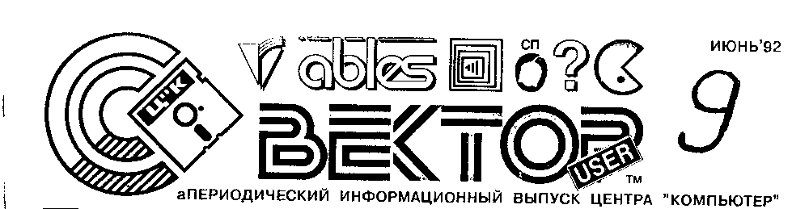
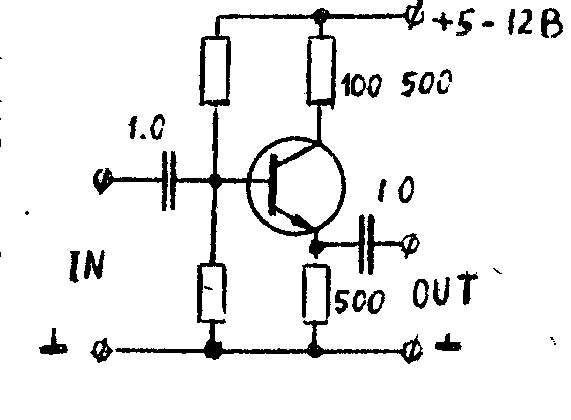

## Еще раз о мониторе МС 6105

В новых электрических принципиальных схемах этого монитора обозначения элементов отличаются от приведенных в статье.
В этом случае следует читать:

| В статье | в схеме |
| --- | --- |
| C4 | C1 |
| R29 | R1 |
| VT6 | VT1 |

Если после осуществления описанной в ИВ7 доработки монитора не удается получить изображение достаточной яркости, регулировкой подстроечного резистора R20 (по новой схеме) можно подобрать желаемый диапазон регулировки яркости.

В.Шаповалов, Волынский

## Оказывается...

**1.** После нажатия клавиши F5 в МОНИТОРе в старший разряд вводимых с клавиатуры кодов заносится "1".
Например, код 4E (N) превращается в CE (n).
При этом неопытным пользователям кажется, что программа сломалась, или выполняются команды МОНИТОРа и т.п.
Но достаточно повторно нажать F5, и все будет в порядке.

**2.** В МОНИТОРе при задании имени файла директивой I перед загрузкой, если известны некоторые символы, можно использовать "?", означающий *любой символ на этом месте*.
Например, имена: NATASHA и NA??S?A будут эквивалентны.

**3.** Возможно, не все знают о полной совместимости формата ввода/вывода команд BLOAD и BSAVE BASICa 2.5 и директив W и R МОНИТОРа.
Это открывает широкие возможности компоновки программ на Бейсике с подпрограммами на Ассемблере, но при этом надо внимательно следить за возможным перекрытием адресов ОЗУ.

**4.** Директива O МОНИТОРа дает возможность выгрузить программу в формате загрузчика одиночными блоками (без дублирования), если вместо знака ">" указать "%".

А.Бедняков, Саранск
В.Князев, С.-Петербург

## Калькулятор в BASICe 2.5

Быстро получить удобный калькулятор можно с помощью простой программы:

```
10 CLS: PRINT "CALCULATOR"
20 INPUT R
30 PRINT " R="R: PRINT
40 GOTO 20
```

После запуска программы надо ввести вычисляемое выражение и нажать ВК.
Программа даст ответ и перейдет в режим ожидания следующего вычисления.
В выражениях можно применять все допустимые в BASICe 2.5 числа и знаки операций, скобки, тригонометрические функции, число PI.
Можно также использовать результат предыдущего вычисления в виде переменной.

Таким калькулятором можно пользоваться как автономно, так и в составе другой программы, требующей периодических вычислений.

Пример работы:

```
CALCULATOR
?2*2
 R= 4

?SQR(R)
 R= 2

?SIN(PI/12)-ATN(5.33)
 R=-1.12652

?3.3*(R^2+(R/2^2)-(4E-3)
 R=3.24528

?_
```

Если калькулятор вам не нравится, попробуйте встроенный в программу "Научно-технические расчеты" или напишите свой и пришлите нам.

Б.Лапушнер, Ц"К

## От редакции

Уважаемые абоненты Центра "КОМПЬЮТЕР"!

В Ц"К растут горы писем, телефон звонит без перерыва, заказы накапливаются сотнями, и все это остается без ответа.
Объяснить создающуюся ситуацию трудно.
Она меняется ежедневно, в чем Вы можете убедиться сами, если читаете другие газеты, кроме нашей.

Повышение цен на продукты питания вызвало повышение цен на программные продукты.
Мы и не говорим о новых налогах, молча учитывая их в цене наших товаров.

Отдельно остановимся на "услугах" почты.
Ниже приводим справку, полученную в почтовом отделении:

**ТАРИФЫ на оплату услуг связи с 01.01.92г.**

**I.** Исчисление оплаты за пересылку наземным транспортом:

1. Оплата за ценность - 24% от назначенной суммы.
2. Оплата за наложный платеж данного отправления - 24% от назначенной суммы.
3. Оплата за 1 кг (до 1 кг) веса от 2р.40 к. до 5р.40 к.

**II.** Исчисления оплаты ценных бандеролей:

1. Оплата за ценность - 24% от назначенной суммы.
2. Оплата за наложный платеж 20% от назначенной суммы.
3. Весовой сбор также, как за посылку.

**III.** Страховой сбор за денежные переводы - 20% от суммы.

**IV.** Плата за страховку при авиаперевозках взымается в двойном размере.

**V.** За хранение почтовых отправлений более суток взымается 3 р. за каждые сутки.

*ПРИМЕЧАНИЕ:*
С организаций, учреждений, предприятий, кооперативов и т.д. весовой сбор взымается в двойном размере;

В итоге кассета с программами для ВЕКТОРа-06ц, отправленная наложенным платежом, например, в Москву, обойдется заказчику примерно в 240 р, квазидиск в 3 000 р, а собственно ВЕКТОР-06ц.02 - около 12 000 р.

Даже если Вы готовы заплатить такие деньги, нас с Вами ждет ряд проблем, связанных с самим фактом отправки посылок и денег между независимыми государствами.
Из-за всего этого деятельность Ц"К, связанная с почтой, парализована.

Несмотря ни на что, Ц"К будет искать возможности выполнения Ваших заказов.
Компьютеры, квазидиски и другие товары могут доставляться нарочными (при достаточном количестве заказов в одном городе).
Планируется создание филиалов в других городах.
Ц"К ищет дилеров, которым будет предоставляться скидка 10-50% (по количеству реализуемых товаров).
Подписка на ИВ приостанавливается, но их выпуск будет продолжен.

Из-за постоянных изменений тарифов, налогов, цен на комплектующие цены на товары и услуги меняются, как погода.

До 30 июня 1992 г.: выпуск программного обеспечения - 58 р. без стоимости кассеты.
Все выпуски перекомпонованы.
Игровые программы в кодах адаптированы к джойстикам.
Состав выпусков приведен далее.
Цена номера ИВ 3 р.
Остальные товары, информационно-технические материалы и услуги подорожали в среднем в два раза.

> **Наш новый расчетный счет:**
> Р/с 467203 в АКБ "ИНТРЕПРИНЗБАНКЭ" г.Кишинева,
> МФО 280101790, кор.счет 700161390,
> Фирма "ИНТЕРМОСТ", Центр "КОМПЬЮТЕР"

> **Адрес филиала Ц"К в г.Москве:**
> 113162 Москва, ул. Шухова, дом 16, корп. 6
> тел. 236-8183, НТК "СИРИУС", для Центра "КОМПЬЮТЕР"

## О копировщике

При ошибке чтения копировщика COPY 2.1 (базовая кассета) происходит сброс частично введенной программы и рестарт.
Предлагаемая модификация копировщика позволяет многократно попытаться продолжить загрузку, перемотав ленту немного назад.
При этом будет мигать надпись "ОШИБКА".

```
009F    PUSH  B
00A0    PUSH  D
00A1    PUSH  H
00A2    CALL  059B
00A5    POP   H
00A6    POP   D
00A7    POP   B
00A8    CALL  023D
00AB    JMP   0094
```

И.Самарин, С.-Петербург

## О массивах

В большинстве систем программирования массивы хранятся в памяти, как правило, по строкам, для наискорейшего изменения младшего индекса (C1).

```
A(0,0)  A(0,1)  A(0,2)
A(1,0)  A(1,1)  A(1,2)
```

*C1. Обычное размещение массива A(1,2) в ОЗУ.*

Но авторы BASICa 2.5 этому правилу изменили.
Двух- и более мерные массивы они располагают в памяти по столбцам (C2).

```
A(0,0)  A(1,0)  A(2,0)
A(0,1)  A(1,1)  A(2,1)
```

*C2. Размещение массива A(1,2) в ОЗУ BASICом 2.5.*

Выявить это позволяет приведенная ниже программа.

```
100 REM (C) SHP CORP.
110 CLS: DIM A(2,2)
120 FOR I=0 TO 2
125 FOR J=0 TO 2
130 PRINT "STRING";I, "COLUMN"; J, "ADDRESS"; ADDR(A(I,J))
140 NEXT J: NEXT I
```

Не забудьте, что на каждый элемент массива отводится по 4 байта.
Данный факт необходимо учитывать при работе с памятью с помощью операторов PEEK и POKE, а также при использовании для GET и PUT двух- и более мерных массивов.
Например:

```
100 REM (C) SHP CORP.
110 DIM A(2,2)
120 FOR I=1 TO 2: PLOT I*5,0,2
130 GET 3,3,ADDR (A(0,I)): REM NOT A(I,0)!!!
140 NEXT I
```

И.Шиповский

## О RAMдиске

**1.** Если у вас неустойчиво работает RAMдиск на длинном кабеле, попробуйте:

- а) задержать сигнал -RAS путем включения конденсатора емкостью 100 пФ между ногой 1 микросхемы D9.1 и массой;
- б) задержать сигнал -БЛК аналогичным образом на ноге 6 микросхемы D2.1;
- в) задержать строб записи в регистр инструкции - нога 8 микросхемы D1.

Если все это не поможет и вы уверены в исправности всех деталей, возможно, стоит подумать о сборке основной платы, RAMдиска и адаптера дисковода в новом компактном корпусе с мощным блоком питания, оставив в родном только клавиатуру.

**2.** Сигнал -CS на ногу 1 формирователя D12 подается с линии 11 (-БЛК) шины, а не с 14, как указано в принципиальной схеме RAMдиска, опубликованной в ИВ5.

Там же перепутаны линии адреса, выходящие в шину с повторителей D3.1-D4.4.

П.Шаповал, М.Федулов

Не завидуйте обладателям дисководов, если вы только начинаете собирать свой домашний комплекс.
Достаточно к ноге 5 триггера D10.1 через резистор порядка 2К припаять светодиод на массу, и ваш накопитель будет моргать, как настоящий!

О.Васенев, Ц"К

## Об инверсии

У многих пользователей ВЕКТОРа возникают проблемы с подключением цветных мониторов и телевизоров.
Изображение на экране получается инверсным, а схема, помещенная в ИВ3, достаточно сложна и требует разборки и доработки компьютера.

Предлагаю схему, которую можно установить в телевизоре или мониторе, а если есть необходимость, собрать в отдельном блоке.

На каждый из цветов (R, G, B) необходимо собрать такой видеоусилитель, на вход которого нужно подавать сигнал с ВЕКТОРа, а выход подключить к телевизору.

Данную схему можно использовать в телевизорах типа Ц380, Ц312, мониторах ВТЦ 101, 201 и других, требующих инверсии видеосигналов.

С.Бергич, Ц"К



## Вопросы

Почему у "ВЕКТОР User" такой маленький объем?

Как осуществить практически программное управление двигателем магнитофона?

Как подключить ВЕКТОР-06ц в цвете и со звуком к телевизору РЕКОРД ВЦ 311 (ЗУСЦТ-П-51-1) через X35?

Как программировать вывод в бордюр нескольких цветов одновременно?

Как вывести на экран дисплея текст программы, записанной на магнитную ленту в формате ROM?

Как использовать в программе рисунки КАРАНДАШа?

Какая по умолчанию скорость в БОД обмена с МЛ при загрузке BASIC 2.5?

Как изменить BASIC 2.5, чтобы использовать графический вывод на принтер МС-6313?

Как на ВЕКТОР адаптировать программы с компьютеров Yamaha, ZX Spectrum?

## Ответы

Если вы желаете иметь компьютер с синим оттенком, приобретите в коммерческом магазине "Средство для чистки магнитофонных головок".
Нанеся его ватой на корпус черного компьютера 2 раза, вы получите то, что хотели.

Н.Воронин, Петропавловск-К

Синий цвет не очень благоприятно действует на сетчатку глаз.
В случае окраски корпуса компьютера в синий, а также в зеленый или темно-серый цвет глаза пользователя очень скоро заболят.

Ю.Цацуро, Сосенский

Программы с иностранных компьютеров вроде Yamaha или ZX Spectrum, увы, НЕ адаптируются на ВЕКТОРе!
Причина - недальновидность авторов схемы, выбравших старый процессор I8080 (ВМ80) ради призрачного выигрыша в скорости доступа к RAMдиску через стековые операции.

О.Васенев, Ц"К

## Объявления

> **П.11** Продаю ВЕКТОР-06ц.
>
> 320081 Днепропетровск, Бердянская, 1-50, т. 23-7211

> **П.12** Продаю дисковод "Электроника МС 5305".
>
> Кременчуг Полтавской обл., Первомайская, 55-38, И.Небокар.

> **П.13** Продаю ВЕКТОР, квазидиск, SINTEZ, контроллер и дисковод для АГАТа.
>
> т. (0422) 43-4129, Володя

> **П.14** Высылаю наложенным платежом МС серий 155, 555, 1533, 580, 573, 556, 565, 1818 и другие.
>
> 400087 Волгоград-87, до востребования, Тюкилин Д.Ю.

> **П.15** Высылаю по предварительным заказам и наложенным платежом печатную плату и комплект документации на компаратор-регенератор, позволяющий перезаписывать с магнитофона на магнитофон любые типы программ без потери качества (при отсутствии физических дефектов ленты), а также не подстраивать голову после записи на чужом магнитофоне.
>
> 339000 Макеевка Донецкой обл., Солнечный, 8-128, Б.Линник.

> **П.16** Продаю адаптер дисковода для ВЕКТОРа, подключаю компьютеры к телевизорам и мониторам.
>
> т. (0422) 44-5293, 44-6226 (коммутатор) + 5-34, Стас

> **К.9** Куплю печатные платы адаптера дисковода и квазидиска, дисковод ТЕАС или подобный.
>
> 279700 Рыбница, Юбилейная, 59-110, А.Данильченко, т. (04255) 364-78

> **К.10, 11** Куплю дисковод с адаптером для ВЕКТОРа.
>
> 342000 Константиновка Донецкой обл, а/я 34, Д.Литовка, т. 265-92
>
> 270069 Одесса, Марсельская, 10-37, В.Ветрогон

> **К.12** Куплю адаптер дисковода для ВЕКТОРа.
>
> 275033 Ереван, Аветисяна, 80-3, А.Тигранян

> **К.13** Куплю дисковод с адаптером для ВЕКТОРа или обменяю на принтер МС-6312 или D100M с доплатой.
>
> 113545 Москва, Подольских курсантов, 14-1-138, А.Локтев, т. (095) 381-7914

> **К.14** Куплю дисковод с адаптером и квазидиск для ВЕКТОРа, принтер.
>
> 654086 Новокузнецк Кемеровской обл., Пржевальского, 8-65, С.Брецанов

> **Р.8, 9** Подключаем компьютеры к любым типам ТВ.
>
> т. (0422) 55-3282
> т. (0422) 52-2674

## Программирование. Секреты ABLESoft: PPI КР580ВВ55А

*(Продолжение. Начало см. в ИВ8)*

На прошлом занятии мы обзорно рассмотрели режимы обмена и подробно расписали аппаратное распределение всех портов "системного" (D30 по старой схеме, который мы нечаянно обозвали D27) программируемого периферийного интерфейса PPI I8255A (ВВ55А), ни словом не упомянув тему, вынесенную в заголовок.

ИТАК, для лучшего понимания следующего ниже материала вам потребуется:

- а) работающий компьютер, максимально совместимый с ВЕКТОРом-06ц;
- b) любой отладчик (SID, DEBUG, кассетный Монитор или что-то в этом роде);
- c) базовые представления о процессоре, его командах и мнемонике Ассемблера.

Учиться правильным приемам программирования PPI лучше всего, наверное, на примере предложенной создателями стандартной процедуры обработки прерывания, практически идентичной во всем базовом программном обеспечении.

**Hint 0.** Если вы решили набраться опыта и хорошо научиться много, быстро и красиво программировать, скорее всего, сначала вам придется хорошо и много разбираться в хороших, но чужих программах.
Поэтому также желательно наличие элементарных навыков исследования и трассировки программ в доступном вам отладчике.
Позже это облегчит поиск ошибок в собственных программах.
Как известно, сам термин debug означает буквально *"ловля блох"*.

Так устроен компьютер, что 50 раз в секунду (принятая у нас частота кадров) центральный процессор должен бросить все и выполнить полученный с пустой шины код 0FFh, соответствующий команде RST 7 (однобайтовый вариант CALL 38h).
С этого адреса всегда начинается подпрограмма обработки прерывания (что, впрочем, справедливо для большинства 8-разрядных компьютеров на Z80 и I8080, не усложненных контроллером прерываний).

В этом вы можете убедиться сами, введя директиву

```
L38
```

По адресу 38h, как правило, расположена команда

```
JMP address
```

- переход куда-нибудь внутри той основной программы, которая "поддерживает жизнедеятельность" вашего компьютера в данный момент, будь то DOS, Монитор или игрушка.
Запишите как address конкретный адрес в вашем случае.

**Hint 1.** Эта длинная процедурка 50 раз в секунду отнимает у процессора довольно значительное время.
Если вы хотите, чтобы кусок вашей программы, не использующий стандартный обмен с консолью, работал быстрее, можно не запрещать на это время прерывания командой DI (это может повлечь осложнения, трудно бывает найти, кто же их опять разрешает).
Проще и надежнее положить по адресу 38h код команды RET 0C9H, восстановив потом там в случае необходимости прежнее содержимое - код команды JMP 0C3h.

О.Васенев

Введите директиву

```
Laddress.
```

Вы увидите, что процедура обработки прерывания прежде всего начинается с сохранения в стеке всех регистров данных процессора.
Набравшись терпения, вы сможете найти где-то дальше восстановление в обратном порядке регистров, разрешение прерывания и выход.

Во-первых, делается это для того, чтобы основная исполняемая программа при возврате ей управления совершенно не почувствовала, что ее прервали на самом интересном месте.

Во-вторых, при уходе в процедуру обработки прерывания процессор автоматически *запрещает прерывания*, и не рекомендуется разрешать их - в случае длинной процедуры обработки прерывания может произойти рекурсивный вызов ее самой, программа потеряется в собственном стеке.

В-третьих, при возврате из процедуры обработки прерывания, и только в этом случае, команда EI разрешает прерывания *после выполнения следующей команды*, то есть последней RET, во избежание описанного во-вторых.

КАК уже упоминалось выше, программирование палитры на ВЕКТОРе физически возможно (по времени) только в начале процедуры обработки прерывания, что мы и можем наблюдать с помощью отладчика сразу после сохранения в стеке регистров.

**Hint 2.** Но из этого же вовсе не следует, что это необходимо делать каждое прерывание!..
Вполне достаточно один раз положить цвета в регистры палитры.
Вместо того, чтобы тратить время на это 50 раз в секунду, можно вынести этот код в основную программу и применить hint 1.

Встречаются различные реализации этой процедуры.
От себя же можем рекомендовать следующую подпрограмму установки палитры, успешно работающую в RETEXe:

```
        lxi   D,2D18h   ;set yellow
        call  COL       ;on green
COL:    lxi   h,0038h
        mvi   m,0C9h    ;poke 'RET'
        ei              ;waiting for
        hlt             ;interrupt
        mvi   b,15      ;from 15
?c1:    mov   a,b       ;to 0
        out   2
        ani   0010b     ;2nd layer
        mov   a,d
        jnz   ?c2
        mov   a,e
?c2:    mvi   c,4
?c3:    out   0Ch
        dcr   c
        jnz   ?c3
        dcr   b
        jp    ?c1
        mvi   m,0C3h    ;poke 'JMP'
        pchl
```

(В скане четыре строки от `ani 0010b` до `mov a,e` отмечены слева скобкой - это "отмеченный фрагмент", о котором говорится ниже.)

Если вы хотите программировать все 16 цветов, а не делать видимым только 1 слой, передавать надо адрес конца массива цветов и отмеченный фрагмент заменить на

```
        ldax  d
        dcx   d
```

Заметим, что в конце управление передается программе обработки прерывания, чтобы сохранить их темп.

В предыдущей статье упоминалось и о том, что клавиши также желательно опрашивать в прерывании, и вот почему.

Во-первых, сканируя и обрабатывая клавиатуру 50 раз в секунду, а не в цикле ожидания нажатия, мы можем проще организовать в фоновом режиме ее (своего рода борьба с дребезгом) работу и автоповтор.

Во-вторых, состояние матрицы клавиатуры читается через порт B.
Обычный режим работы D30 (адрес I/O 0) - 88h, порт B работает на *вывод* (цвет бордюра и режим).
То есть его надо переключить на *ввод*, режим 8Ah, а при этом содержимое *всех* регистров данных PPI, в том числе и вертикальный скроллинг, сбросится.
Следовательно, во избежание видеоэффектов, надо успеть сделать все и переключиться обратно на вывод до того, как компьютер сформирует картинку.

В-третьих, еще быстрее, сразу после переключения режима D30, желательно восстановить прежнее содержимое порта C (адрес I/O 1), в противном случае вы получите стабильный треск реле (если оно у вас есть), звук и мерцание индикатора "РУС".

Все это вы также можете наблюдать где-то после программирования цветов.
Кроме опроса клавиатуры, там же есть ее обработка (формирование конкретных кодов и укладка их в буфер клавиатуры, с которым и имеет дело основная программа), может быть отработка музыкальных очередей, опрос джойстиков, мыши и т.п.

**Hint 3.** Большинство программ, как правило, строится как *ожидание и отработка реакции* на введенные с клавиатуры данные.
При этом самим программам, в принципе, все равно, *когда* они эти данные получат.
Очевиден избыток времени при ожидании и недостаток при отработке, когда 50 раз в секунду "параллельно" делается что-то еще.
Но ведь можно ложить в буфер, например, номер нажатой клавиши и состояние УС и СС при этом, а преобразование в "настоящий" код, вынеся из прерывания, возложить на процедуру, выдающую его программе из буфера..

*продолжение следует*

## Каталог программного обеспечения

Программное обеспечение, предлагаемое Ц"К по соглашению с авторами на июнь 1992 г.

### Выпуск М-1

Сторона 1:

| Название | Тип |
| --- | --- |
| МикроДОС | ROM |
| DIR.COM | DOS |
| PIP.COM | DOS |
| LOADASM.COM | DOS |
| SAVEASM.COM | DOS |
| LOADMON.COM | DOS |
| SAVEMON.COM | DOS |
| LOADBAS.COM | DOS |
| SAVEBAS.COM | DOS |
| LOADROM.COM | DOS |
| SAVEROM.COM | DOS |
| MARGO.COM | DOS |
| MARGO.HLP | DOS |
| MAC.COM | DOS |
| SID.COM | DOS |

Сторона 2:

| Название | Тип |
| --- | --- |
| KDNAL | ROM |
| KDTEST | ROM |

Предназначен для наладки и использования квазидиска.
В состав выпуска входят:

- два теста для наладки;
- МикроДОС (квазидиск);
- программы для работы с файлами;
- средства обмена с магнитофоном во всех форматах;
- текстовый редактор;
- макроассемблер;
- отладчик.

Поставляется с описанием.

### Выпуск Д-1

| Название | Тип |
| --- | --- |
| МикроДОС | DOS |
| DIR.COM | DOS |
| PIP.COM | DOS |
| POWER.COM | DOS |
| LOADASM.COM | DOS |
| SAVEASM.COM | DOS |
| LOADMON.COM | DOS |
| SAVEMON.COM | DOS |
| LOADBAS.COM | DOS |
| SAVEBAS.COM | DOS |
| LOADROM.COM | DOS |
| SAVEROM.COM | DOS |
| MARGO.COM | DOS |
| MARGO.HLP | DOS |
| MAC.COM | DOS |
| M80.COM | DOS |
| L80.COM | DOS |
| DISASM.COM | DOS |
| SID.COM | DOS |

В состав выпуска входят:

- МикроДОС (дисковод);
- программы для работы с файлами;
- средства обмена с магнитофоном во всех форматах;
- текстовый редактор;
- макроассемблер;
- дизассемблер;
- отладчик.

### Выпуск Д-2

| Название | Тип |
| --- | --- |
| BASIC V2.5 DISK | DOS |
| КАРАНДАШ DISK | DOS |
| SHOW | DOS |
| DEBUGGER DISK | DOS |
| DOCTOR | DOS |

В состав выпуска входят:

- дисковый BASIC 2.5;
- дисковый КАРАНДАШ;
- программа для просмотра картинок КАРАНДАШа;
- дисковый отладчик;
- программа для "лечения" и работы с дисками.

### Выпуск КП-1

| Название | Тип |
| --- | --- |
| ФИЗИКА 1 | BAS |
| ФИЗИКА 2 | BAS |
| ФИЗИКА 7 | BAS |
| ФИЗИКА 8 | BAS |
| ФИЗИКА 9 | BAS |
| ФИЗИКА 10 | BAS |
| ФИЗИКА 11 | BAS |
| ФИЗИКА К1 | BAS |
| ФИЗИКА К2 | BAS |
| ФИЗИКА К3 | BAS |
| КОНТУР | BAS |
| ЛАБ.РАБОТА | BAS |
| ФИЗИКА ЗАД.7 | BAS |
| ФИЗИКА ЗАД.8 | BAS |
| ФАЗЫ ЛУНЫ | BAS |
| ГЕОМЕТРИЯ 1 | BAS |
| ГЕОМЕТРИЯ 2 | BAS |
| ГРАФ.ФУНКЦИЙ | BAS |
| КМАТ 1 | BAS |
| КМАТ 2 | BAS |
| МОЗАЙКА | BAS |
| ПОВЕРХНОСТИ | BAS |
| СИСТ.ИСЧИСЛ. | BAS |
| КЛ.ТРЕНАЖЕР1 | BAS |
| КЛ.ТРЕНАЖЕР2 | BAS |
| КЛ.МАРС | BAS |
| МИКРОСИСТЕМА | BAS |
| ОИВТ | BAS |

Обучающие программы по математике, физике и информатике.

### Выпуск КП-2

| Название | Тип |
| --- | --- |
| АВТОГРАФ 1 | BAS |
| АВТОГРАФ 2 | BAS |
| ДИКТАНТ 1 | BAS |
| ДИКТАНТ 2 | BAS |
| ПОСЛОВИЦЫ | BAS |
| РУСС 1 | BAS |
| РУСС 2 | BAS |
| СЛОВОСОЧЕТ. | BAS |
| СТИХИ 1 | BAS |
| СТИХИ 2 | BAS |
| ЗАГАДКА | BAS |
| МОРФОЛОГ.1-5 | BAS |
| ОРФОГРАФ.1-13 | BAS |

Обучающие программы по русскому языку и литературе.

### Выпуск КП-3

| Название | Тип |
| --- | --- |
| ЧБ ФОТО | BAS |
| ЦВ ФОТО | BAS |
| МУЗ.РЕДАКТОР | BAS |
| ЕЛИЕС | BAS |
| ЭЛ.РАСЧ. | BAS |
| ФОРТУНА | BAS |
| РЕДАКТ.ТЕКСТА | BAS |
| РЕДАКТ.ФОНТОВ | BAS |
| MBOX | BAS |
| МОРЗЕ | BAS |
| МУЛЬТИМЕТР | BAS |
| PARAWT | BAS |
| РАСЧ.РАДИАТ. | BAS |
| СПУТНИКИ | BAS |
| GRED | BAS |
| STADIC | BAS |
| ТРИГГЕР | BAS |
| МАРК.ДИОДОВ | BAS |
| МАРК.СТАБИЛИТ. | BAS |
| ZVDYH | BAS |

Выпуск прикладных программ на BASICe.

### Выпуск КП-4

| Название | Тип |
| --- | --- |
| КАРАНДАШ | ROM |
| RETEX | ROM |
| AUTOCW | ROM |
| DEBUGGER | ROM |
| ТРУБО ACCEM. | MON |

### Выпуск КП-5

| Название | Тип |
| --- | --- |
| PAS1 | ROM |
| PAS2 | ROM |
| PASLIB | ROM |
| Язык LS-PASCAL | |

### Выпуск КП-6

| Название | Тип |
| --- | --- |
| BASIC v2.5 | ROM |
| 10 УРОКОВ BASIC | BAS |
| НТР 7 ПРОГРАММ | BAS |

### Выпуск КП-7

| Название | Тип |
| --- | --- |
| ТЕСТ УСТРОЙСТВ | ROM |
| ТЕСТ ТЕХПРОГ. | ROM |
| ЭЛЕКТР.КУБИКИ | ROM |
| ЭМУЛ.РК-МИКР. | ROM |
| BASIC-КОРВЕТ | ROM |
| МОНИТОР | ROM |
| РЕД.-АССЕМЛЕР | MON |
| ДРАЙВ.УСТР. | MON |

Инструментальный выпуск.

### Игровые программы в кодах

#### Выпуск КИ-1

| Название | Тип |
| --- | --- |
| ЙЕТИ | ROM |
| ТЕТРИС | ROM |
| ПОЛЕТ | ROM |
| XONIX | ROM |
| WARP | ROM |

#### Выпуск КИ-2

| Название | Тип |
| --- | --- |
| PAIRS | ROM |
| TRAIN | ROM |
| ШТУРМ | ROM |
| PACMAN | ROM |
| ШАХМАТЫ | ROM |

#### Выпуск КИ-3

| Название | Тип |
| --- | --- |
| RISE OUT | ROM |
| JUNGLE | ROM |
| БЛИЗНЕЦЫ | ROM |
| ПОЖАРНИК | ROM |
| XYZOLOG | ROM |

#### Выпуск КИ-4

| Название | Тип |
| --- | --- |
| НИНЬЗЯ | ROM |
| ЭРИК | ROM |
| ХИМИЯ | ROM |
| ОХ МУМИЯ | ROM |
| COLOR BALL | ROM |
| УГОЛКИ | ROM |

#### Выпуск КИ-5

| Название | Тип |
| --- | --- |
| СТОП | ROM |
| ROTORS | ROM |
| КИРАШИ | ROM |
| ВЕРТОЛЕТ | ROM |
| СРАЖЕНИЕ | ROM |
| ПОДДАВКИ | ROM |

#### Выпуск КИ-6

| Название | Тип |
| --- | --- |
| MOON BUGS | ROM |
| ALIBABA | ROM |
| PUTUP | ROM |
| DONKEY KONG | ROM |
| ШАШКИ | ROM |

#### Выпуск КИ-7

| Название | Тип |
| --- | --- |
| АДСКОК | ROM |
| БЛАСТЕР | ROM |
| ТАНК | ROM |
| COLUMNS | ROM |
| ПЛАНЕТА ПТИЦ | ROM |

#### Выпуск КИ-8

| Название | Тип |
| --- | --- |
| ТРАКТОР | ROM |
| 3-М ТЕТРИС | ROM |
| ПРИВИДЕНИЯ | ROM |
| COOKER | ROM |
| SNAKE | ROM |

#### Выпуск КИ-9

| Название | Тип |
| --- | --- |
| АЛМАЗ | BAS |
| БИОРИТМЫ | BAS |
| БЫКИ И КОРОВЫ | BAS |
| БЛОК 5 | BAS |
| ЦЫГАНКА | BAS |
| ДУНБО | BAS |
| ФОРТУНА | BAS |
| ГОНКА | BAS |
| ГОРОДКИ | BAS |
| ГОСУДАРСТВО | BAS |
| КАЗИНО | BAS |
| КАПИТАН | BAS |
| КЛАД | BAS |
| КЛИНГИ | BAS |
| КОСИЛКА | BAS |
| КУВИКИ | BAS |
| КВАДРАТ | BAS |
| БАЗА АЛЬФА | BAS |
| КОСТИ | BAS |
| ШАРИКИ | BAS |
| ЗОДИАК | BAS |
| БИЗНЕС | BAS |

Сборник игровых программ на BASICe.

#### Выпуск КИ-10

| Название | Тип |
| --- | --- |
| ЧЕЛОВЕК | BAS |
| МУСОРЩИК | BAS |
| МАКСИТ | BAS |
| ПОКОС | BAS |
| СЛАЛОМ | BAS |
| ЛОГИКА | BAS |
| МИНОТАВР | BAS |
| МИННОЕ ПОЛЕ | BAS |
| ПОЛЕ ЧУДЕС | BAS |
| МОРСКОЙ БОЙ | BAS |
| НЛО | BAS |
| ОБОРОНА | BAS |
| ТАРАК.БЕГА | BAS |
| ИППОДРОМ | BAS |
| ПАУК | BAS |
| ПИТОН | BAS |
| ПЯТНАШКИ | BAS |
| ПРЫГ-СКОК | BAS |
| ПВО | BAS |
| СЕКРЕТ.КОД | BAS |
| ЧЕРВЬ | BAS |
| СОЛИТЕР | BAS |
| СЛОН | BAS |

Сборник игровых программ на BASICe.

### Продукция ПО СЧЕТМАШ

| Товар | Цена |
| --- | --- |
| ВЕКТОР-06ц.02 | 5200 р. |
| Электронный диск 256 КБ для ВЕКТОРа-06ц | 1480 р. |

> Принимаем к публикации любые информационные материалы по компьютеру ВЕКТОР-06ц, объявления, рекламу и т.п.
> Приобретаем у авторов программы для распространения в составе выпусков ПО.
>
> 277060 Кишинев, а/я 3556, Центр "КОМПЬЮТЕР", (0422) 24-2218

И.о.гл.редактора Б.Лапушнер.
Designed by О.Зияев, О.Васенев.
Макет подготовлен О.Васеневым в пакете "РусскоеСлово" на оборудовании СП "ДИАЛОГ" и МП "ВИРТ".

© Ц"К © (логотип) © ABLESoft 1992
