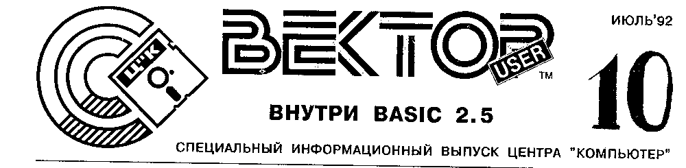
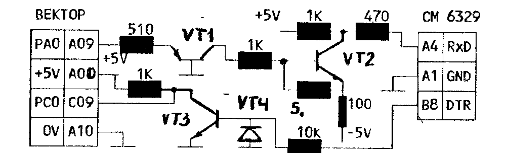

## Внутри BASIC 2.5

Тема публикации - маленькие "секреты" BASIC 2.5, знание которых позволит вам эффективно использовать подпрограммы, написанные на ассемблере.
Эти сведения получены при дизассемблировании интерпретатора.
Мы рассмотрим организацию обмена данными между BASIC программой и USR подпрограммами.
Если у вас возникнут вопросы, пришлите письмо в Ц"К, Е. Филиппову, и вложите в него конверт с вашим адресом.

Немного истории.
В далеком 1985 году в журнале РАДИО в рубрике "Микропроцессорная техника" был опубликован первый интерпретатор BASIC для 8-битной микро-ЭВМ в СССР, ставший основой для большинства последующих.
Позже в РАДИО была опубликована новая версия - BASIC МИКРОН, который был адаптирован Д. Темиразовым для ВЕКТОРа-06ц как BASIC 2.5.

### Программа и данные. Что, где и почему

Адрес начала BASIC программы хранится в ячейках 26h, 27h (38, 39 - здесь и далее числа, оканчивающиеся h, записаны в 16-ричной системе).
В этом 2-байтовом слове содержится адрес 4301h.
Кроме этого, адрес начала программы на BASIC хранится в слове 4043h.

Структура самой BASIC программы приведена в Радио, 1986, 3, с.30-32.

Сразу за концом BASIC программы начинается область данных, состоящая из двух зон.
Первая - простые переменные, ее адрес содержится в слове 4045h, а вторая - массивы, ее адрес - в 4047h.
В слове 4049h указан конец области данных.
В отличие от адреса начала BASIC программы, эти адреса меняются как при модификации BASIC программы, так и в процессе ее исполнения.

### Простые переменные - просто, но со вкусом

Все три типа данных - число, строка и описание определенных пользователем функций - имеют длину 6 байт и при исполнении BASIC программы по мере появления добавляются в конец первой зоны области данных, сдвигая вторую зону в сторону больших адресов.

#### Число с плавающей точкой

Ст. бит 1-й и 2-й литер имени равен 0.

| имя переменной | | число | | | |
| --- | --- | --- | --- | --- | --- |
| 2 let. | 1 let. | M0 | M1 | M2 | P |

Здесь M0, M1, M2 - нормализованная мантисса числа.
Она не содержит старшего разряда, который всегда равен 1.
Вместо него в старшем бите M2 знак мантиссы.
P - порядок + 80h.
Значение P = 0 - признак того, что число равно нулю.

Например, переменная AK=1 имеет следующее внутреннее представление:

```
4Bh, 41h, 0h, 0h, 0h, 81h
```

#### Строковая переменная

Ст. бит 2-й литеры имени равен 1.

| имя переменной | | длина | адрес |
| --- | --- | --- | --- |
| 2 let. | 1 let. | Len | Addr |

Например, переменные из строки программы 10 A$="ПРОГРАММА":B$="" могут иметь следующее представление:

```
A$: 80h,41h,09h,00h,09h,43h
```

- 0009h - длина строки ПРОГРАММА
- 4309h - адрес начала текста ПРОГРАММА в BASIC программе

```
B$: 80h,42h,00h,00h,18h,43h
```

- 0000h - признак пустой строки
- 4318h - адрес за первой кавычкой.

#### Функция пользователя

Ст. бит 1-й литеры имени равен 1.

| имя функции | | | |
| --- | --- | --- | --- |
| 2 let. | 1 let. | fAddr | aAddr |

Здесь fAddr - адрес текста функции, а aAddr - адрес аргумента функции.
Например, для DEFFNA(x)=2*x+1 имеем:

```
00h,0C1h,0Eh,43h,35h,43h
```

- 430Eh - адрес после знака '='
- 4335h - адрес байта M0 переменной X

### Массивы - "могучая кучка"

BASIC 2.5 поддерживает два вида массивов: чисел с плавающей точкой и строковые.
Они различаются старшим битом 2-й литеры имени.

Длина занимаемой массивом области зависит от его размерности и диапазона индексов.

Например, для DIM A(1,2): A(0,1)=1: A(1,0)=PI имеем:

```
00h,41h              имя: A
1Dh,00h              длина: 001Dh = 29
02h                  число индексов: 2
03h,00h              разм. по 2 инд. = 2+1
02h,00h              -"-"-  по 1 инд. = 1+1
00h,00h,00h,00h      элемент (0,0) = 0
DBh,0Fh,49h,82h      элемент (1,0) = Pi
00h,00h,00h,81h      элемент (0,1) = 1
00h,00h,00h,00h      элемент (1,1) = 0
00h,00h,00h,00h      элемент (0,2) = 0
00h,00h,00h,00h      элемент (1,2) = 0
```

Для одномерного массива размерность по 2-му индексу опускается.

### Как найти BASIC переменную в USR подпрограмме

Простейший способ указать ассемблерной подпрограмме адрес переменной - использовать функцию ADDR и передать полученный адрес с помощью оператора POKE.
Например:

```
BASIC:
10 A=10
20 AD=ADDR(A):A1=INT(AD/256)
30 A0=AD-256*A1
40 SA=&7003:POKE SA,A0,A1
50 B=USR(&7000)
```

Подпрограмма на ассемблере (далее - USR подпрограмма):

```
7000            JMP     SUBPRG
;резервируется под адрес переменной
7003            DS      2
;подпрограмма
7005    SUBPRG: ...
```

Функция ADDR для простых переменных возвращает адрес за именем переменной и применима также к элементам массива, т.е. можно ввести

```
AD=ADDR(A(0,2))
```

и AD будет указывать на байт M0 элемента (0,2) массива A.

Однако есть и более эффективный способ.
Для поиска переменной BASIC интерпретатор использует подпрограмму VARSEARCH (адрес 0A9Dh).
В регистровой паре (HL) должен находиться адрес текста с именем переменной.
При выходе из VARSEARCH в (DE) находится адрес переменной, а в (HL) - адрес за именем переменной.
Например:

```
BASIC:
10 A=10
20 B=USR(&7000)
USR:
VARSEARCH       EQU     0A9DH
7000            LXI     H,NAME
7003            CALL    VARSEARCH
7006            JMP     NEXT
;имя переменной заканчивается 0 !!!
7009    NAME:   DB      'A',0
;здесь будет адрес переменной A
700B    ADRESA: DS      2
700D    NEXT:   XCHG
;запомнить адрес переменной A
700E            SHLD    ADRESA
```

Помните, что VARSEARCH не только ищет, но и размещает новые, ранее не использовавшиеся простые переменные и массивы.
Если Вы будете искать переменную, которая до этого не использовалась, VARSEARCH разместит ее в соответствующей зоне области данных, и ранее определенные адреса переменных будут неверными.

### Передача данных между BASIC программой и подпрограммами на ассемблере

USR подпрограмма может вернуть 8-битное значение (0...255), например:

```
BASIC:
10 A=USR(&7000): REM A=10
USR:
7000            MVI     A,0AH
7002            RET
```

При вызове подпрограммы USR(адрес) в стек опускаются 12 байт:

```
(SP-6)  DW      адрес за ')'
(SP-4)  DW      09A1h
(SP-2)  DW      24ABh
(SP)            ;дно стека
```

Таким образом, Вы можете, получив доступ непосредственно к BASIC программе, найти либо адрес, либо значение параметров, расположенных за вызовом USR, и использовать их.
Затем, установив (HL) на адрес за последним параметром, записать это значение в стек и беспрепятственно вернуться из USR подпрограммы.

В BASIC 2.5 используется ряд подпрограмм, позволяющих организовать передачу параметров USR подпрограмме как по значению (только в USR), так и по ссылке (в обе стороны).

Подпрограмма COMPUTE (адрес 08CEh) вычисляет значение произвольного выражения BASIC.
В (HL) передается адрес начала выражения в BASIC программе.
При выходе в (HL) возвращается адрес за обработанным выражением, а в 4-х специальных ячейках с адресами 404Dh...4050h - результат, число с плавающей точкой (FLOAT POINT).

Для преобразования целого числа в FLOAT POINT можно использовать подпрограмму SHORTINT (адрес 24ABh).
В этом случае в ячейки 404Dh...4050h записывается число типа FLOAT POINT из регистра (A) в диапазоне 0...255, которое затем можно переписать по адресу любой численной переменной BASIC программы.

Для преобразования чисел, больших 255, надо использовать подпрограмму LONGINT (адрес 11DDh).
На входе необходимо задать следующие регистры: (ADE) - целое 24-битовое число со знаком (отрицательные числа даются в дополнительном коде), (B)=98h.
Результат также записывается в ячейки 404Dh...4050h.
Если Вы хотите передать 16-битовое целое число без знака в диапазоне 0...65535, то (A)=0.

Изменить знак числа в ячейках 404Dh...4050h можно подпрограммой CHANGESIGN (адрес 11EDh) без параметров.

Преобразование FLOAT POINT в целое 16-битовое число осуществляется подпрограммой INTFROMFLOAT (адрес 0566h), которая берет на входе число из ячеек 404Dh...4050h и возвращает его в (DE) в виде целого 16-битного числа без знака.

### Примеры

Способ загрузки кодов USR подпрограмм смотрите в приложении A.

#### Передача текста из USR подпрограммы

Загрузите BASIC 2.5, затем выполните последовательно BASIC программы USRP1S и USRP1.

Текст BASIC программы USRP1.BAS

```
10 CLS:PRINT"первый параметр-переменная":A$=""
20 FOR I=0 TO 5: A=USR(&7000),I,A$
30 IF A<>0 THEN PRINT"ошибка в индексе: I=";I
40 PRINT "A$=";A$
50 NEXT I
60 PRINT:PRINT"первый параметр-выражение":PRINT
70 FOR I=0 TO7:A=USR(&7000),I AND3,A$
80 IF A<>0 THEN PRINT"ошибка в индексе: I=";I
90 PRINT "A$=";A$
100 NEXT I
110 STOP
```

Текст USR подпрограммы USRP1.ASM:

```
        ORG     7000H
COMPUTE         EQU     08CEH
INTFROMFLOAT    EQU     0566H
VARSEARCH       EQU     0A9DH
USRP1S: POP     H
        POP     H
;адрес в BASIC программе
        POP     H
;есть запятая за USR(&7000)?
        RST     1
        DB      ','
;вычислить значение первого параметра
        CALL    COMPUTE
;проверить наличие запятой
        RST     1
        DB      ','
;запомнить адрес в программе
        PUSH    H
;преобразовать в целое
        CALL    INTFROMFLOAT
        XCHG
;запомнить значение первого параметра
        SHLD    I
        POP     H
;найти адрес второго параметра
        CALL    VARSEARCH
;запомнить адрес в BASIC программе
;за вторым параметром
        PUSH    H
        XCHG
;запомнить адрес описания строки A$
        SHLD    ADRASTRING
;проверка первого параметра
        LDA     I+1
        ORA     A
        JNZ     ERRUSR
        LDA     I
        MOV     E,A
        ANI     0FCH
        JNZ     ERRUSR
;найти описание сообщения с номером I
        MVI     D,0
        LXI     H,ADRTXT
        DAD     D
        DAD     D
        DAD     D
;длина сообщения
        MOV     A,M
        INX     H
;адрес начала сообщения
        MOV     E,M
        INX     H
        MOV     D,M
        CALL    TOSTRING
;признак нормальной работы
        XRA     A
        JMP     EXUSR
;подготовить второй параметр
TOSTRING:
        LHLD    ADRASTRING
;указать длину текста
        MOV     M,A
        INX     H
        MVI     M,0
        INX     H
;указать адрес начала текста
        MOV     M,E
        INX     H
        MOV     M,D
        RET
ERRUSR:
;обраб. ошибки - вернуть пустую строку
        XRA     A
        LXI     D,0
        CALL    TOSTRING
;признак ошибки
        MVI     A,-1
EXUSR:
;выход из USR
        LXI     H,09A1H
        PUSH    H
        JMP     24ABH
;место для значения первого параметра
I:      DS      2
;место для адреса второго параметра
ADRASTRING:
        DS      2
;описание текстовых сообщений
;с номерами 0...3
ADRTXT: DB      14
        DW      T1
        DB      4
        DW      T2
        DB      14
        DW      T3
        DB      2
        DW      T4
T1:     DB      'ИСПОЛЬЗОВАНИЕ '
T2:     DB      'USR '
T3:     DB      'С ПАРАМЕТРАМИ.'
T4:     DB      0DH,0AH
```

#### Передача BASIC программе численных параметров

Загрузите BASIC 2.5, затем выполните последовательно BASIC программы USRP2S и USRP2.

Текст BASIC программы USRP2.BAS

```
10 CLS
20 FOR I=0 TO 5: A=USR(&7000),I,AB
40 PRINT "A=";A,"-8*A=";AB
50 NEXT I
60 STOP
```

Текст USR подпрограммы USRP2.ASM

```
        ORG     7000H
CHANGESIGN      EQU     11EDH
LONGINT         EQU     11DDH
COMPUTE         EQU     08CEH
INTFROMFLOAT    EQU     0566H
VARSEARCH       EQU     0A9DH
USRP2S: POP     H
        POP     H
;адрес в BASIC программе
        POP     H
;есть запятая за USR(&7000)?
        RST     1
        DB      ','
;вычислить значение первого параметра
        CALL    COMPUTE
;проверить наличие запятой
        RST     1
        DB      ','
;запомнить адрес в BASIC программе
        PUSH    H
;преобразовать в целое число
        CALL    INTFROMFLOAT
        XCHG
;запомнить значение первого параметра
        SHLD    I
        POP     H
;найти адрес второго параметра
        CALL    VARSEARCH
;запомнить адрес в BASIC программе
;за вторым параметром
        PUSH    H
        XCHG
;запомнить адрес второго параметра
        SHLD    ADRTWO
;умножить первый параметр на 8
        LHLD    I
        DAD     H
        DAD     H
        DAD     H
;преобразовать результат в FLOATPOINT
        XCHG
        MVI     A,0
        MVI     B,98H
        CALL    LONGINT
;поменять знак результата
        CALL    CHANGESIGN
;и передать его во второй параметр
        LHLD    ADRTWO
        XCHG
        LXI     H,404DH
        MVI     C,4
        CALL    COPY
;выход из USR
        LXI     H,09A1H
        PUSH    H
        JMP     24ABH
COPY:
;копирование (C) байт с (HL) на (DE)
        MOV     A,M
        STAX    D
        INX     H
        INX     D
        DCR     C
        JNZ     COPY
        RET
;место для значения первого параметра
I:      DS      2
;место для адреса второго параметра
ADRTWO: DS      2
```

Если известно, что параметры - целые числа в диапазоне 0...65535, можно обращаться к USR подпрограммам для использования быстрых программ 16-битной арифметики.

### A. Программа загрузки кодов подпрограмм на ассемблере

Наиболее часто используемым способом загрузки кодовых последовательностей является использование специальной программы, в которой последовательность кодов оформляется в виде операторов DATA, содержащих HEX литеры для 16 байт, следующих друг за другом в памяти.

Сами коды получают из листинга трансляции подпрограмм на ассемблере.

Ниже приведена программа на BASIC 2.5, реализующая данный метод, и операторы DATA для USR подпрограмм USRP1 и USRP2.

```
10 CLS:PRINT"подготовка программы в кодах ":PRINT SPC(5);"для ";
100 RESTORE 9000:GOSUB 1000
110 STOP:RUN
1000 REM чтение hex данных
1010 READ NM$,LN,AD$:PRINT NM$:PRINT:GOSUB 2000
1020 SH=0
1030 FOR I=1 TO LN: SM=SH
1040 READ BT$:FOR CH=1 TO15*2+1 STEP2
1050 GOSUB 3000:POKE AD+SH,BT:SH=SH+1
1060 NEXT CH
1070 PRINT "строка";I,AD+SM,AD+SH
1080 NEXT I
1090 PRINT:PRINT"начальный адрес:";AD:PRINT"конечный адрес: ";AD+SH
1100 RETURN
2000 REM получить адрес из hex строки
2010 B0$=MID$(AD$,1,1):GOSUB 4000:AD=B0*4096
2020 B0$=MID$(AD$,2,1):GOSUB 4000:AD=AD+B0*256
2030 B0$=MID$(AD$,3,1):GOSUB 4000:AD=AD+B0*16
2040 B0$=MID$(AD$,4,1):GOSUB 4000:AD=AD+B0
2050 RETURN
3000 REM получить байт из hex строки
3010 B0$=MID$(BT$,CH,1): GOSUB 4000:BT=B0*16
3020 B0$=MID$(BT$,CH+1,1):GOSUB 4000:BT=BT+B0: RETURN
4000 REM получить цифру из hex литеры
4010 IF B0$>="0" AND B0$<="9" THEN B0=ASC(B0$)-ASC("0"): RETURN
4020 IF B0$>="A" AND B0$<="F" THEN B0=ASC(B0$)-ASC("A")+10: RETURN
4030 PRINT:PRINT"не hex литера: ";B0$: PRINT"в строке данных ";I:PRINT"номер байта ";(CH-1)/2: STOP
```

Далее, начиная со строки 9000, должны находиться операторы DATA с кодами.

Данные для программы USRP1S.BAS

```
9000 DATA "USRP1.BAS",9,"7000"
9010 DATA "E1E1E1CF2CCDCE08CF2CE5CD6605EB22"
9020 DATA "5B70E1CD9D0AE5EB225D703A5C70B7C2"
9030 DATA "4B703A5B705FE6FCC24B701600215F70"
9040 DATA "1919197E235E2356CD3F70AFC354702A"
9050 DATA "5D707723360023732372C9AF110000CD"
9060 DATA "3F703EFF21A109E5C3AB24000000000E"
9070 DATA "6B700479700E7D70028B706973706F6C"
9080 DATA "787A6F77616E69652055535220732070"
9090 DATA "6172616D657472616D692E0D0A000000"
```

Данные для программы USRP2S.BAS

```
9000 DATA "USRP2.BAS",5,"7000"
9010 DATA "E1E1E1CF2CCDCE08CF2CE5CD6605EB22"
9020 DATA "4770E1CD9D0AE5EB2249702A47702929"
9030 DATA "29EBAF0698CDDD11CDED112A4970EB21"
9040 DATA "4D400E04CD3E7021A109E5C3AB247E12"
9050 DATA "23130DC23E70C9000000000000000000"
```

Дисковый BASIC и все авторские тексты программ можно заказать в Ц"К.

Е.Филиппов, Кишинев

## Подключение принтера СМ 6329.01

На основе статей, опубликованных в журнале "РАДИО" №4,5 (1989), был разработан драйвер для подключения принтера СМ 6329.01 через последовательный порт.

Принтер подключается к разъему ПУ (XS5) через устройство сопряжения (УС), осуществляющее формирование двухполярных посылок.

Напряжение питания УС +5В берется от компьютера, -5В от отдельного источника.
Можно использовать БП от калькулятора или собрать свой на генераторе и питать его от тех же +5В.

Данные компьютер выводит через бит 0 порта А (контакт А09), сигнал готовности принтера DTR поступает через бит 0 порта С (контакт С09).
Программно реализован протокол последовательного обмена DTR со скоростью 300 БОД.
Можно попробовать поднять скорость путем уменьшения задержки в подпрограмме формирования бита.



```
PRN:    push    h               ;data in E
        mvi     d,0
?wt:    dcr     d
        jz      ext             ;exit with
        in      5               ;carry =
        rrc                     ;fault
        jc      ?wt
        xra     a
        call    bit             ;start "0"
        mvi     d,8
        mov     a,e
?b1:    ani     1               ;data 0...7
        call    bit
        mov     a,e
        rrc
        mov     e,a
        dcr     d
        jnz     ?b1
        mvi     a,1             ;2 stop "1"s
        call    bit
        call    tim
ext:    pop     h
        ret
bit:    out     7
tim:    lxi     h,11Eh          ;delay for
?tm:    dcx     h               ;TX=300Bd
        mov     a,h
        ora     l
        jnz     ?tm
        ret
```

В.Ромашов, Омск

## Вопросы

Как сделать простое устройство ввода графической информации для ВЕКТОРа типа "чувствительного планшета"?

Как сделать, чтобы программы, не предназначенные для работы в МикроДОСе, возвращались в МикроДОС после окончания их работы?

## Ответы

Формат записываемого КАРАНДАШом блока (части экрана) соответствует операторам PUT/GET BASICa и соответствующим подпрограммам Драйверов.
Первые два байта - размер блока по горизонтали и вертикали.
Следующие тетрады - коды цветов точек по строкам слева направо снизу вверх.

Если принтер МС 6313 (вариант МС6307) печатает графику только 6-ю верхними иглами, проще заменить содержимое его ПЗУ на EPSON-совместимый вариант.

В.Сидоренко, Житомир

## Объявления

> **Ц.1** Уважаемые абоненты!
> Все, кто ждет ответа и ИВ, высылайте конверты с обратным адресом!
> Ц"К

> **Ц.2** И не ищите больше Стаса.
> Он женился.
> Ц"К.

> **П.17** Есть редактор цветных спрайтов для ВЕКТОРа.
>
> т. (0422) 57-1901, Сергей

> **П.18** Продаю адаптеры с коррекцией 43-го трека, прекрасно работающие с любыми дисководами без наладки пользователем.
>
> 220007 Минск-7, а/я 375
> т. (0172) 249-838, Дима

> **К.15** Ищу документацию на принтер МС 6307 (от ДВК-2М) или специалиста для подключения к ВЕКТОРу.
>
> т. (0422) 63-2913, Марат

> **К.16, Р.10** Куплю контроллер дисковода, квазидиск для ВЕКТОРа, платы к ним.
> Программирую К573 РФ2, РФ4, РФ5, РФ6 и зарубежные аналоги по предоставленной эталонной м/схеме.
> Имеются версии прошивки для принтера МС6313:
> a) 040790/МС6307
> b) 080791/LX/FX800 EPSON
>
> 262025 Житомир-25, а/я 27, В.Сидоренко

> **М.2** Меняю осциллограф С1-67 на дисковод (Sinclair).
>
> т. (0422) 24-9219, Валера

## Вектор-Программер-Клуб

Уважаемые программисты!

Поддерживать Вас морально и материально - это одна из важных задач Центра "Компьютер".
Но в последнее время мы справляемся с этой задачей все хуже и хуже.
Поэтому, вспомнив, что "спасение утопающих - дело рук самих утопающих", мы решили предложить всем, кто программирует на ВЕКТОРе-06ц, объединиться в Клуб.

Взяв курс на непонятные названия и подозрительные аббревиатуры, Центр "Компьютер" (Ц"К) предлагает назвать этот союз

**ВЕКТОР-ПРОГРАММЕР-КЛУБ (ВПК).**

Цель Клуба - защита профессиональных интересов ВЕКТОРных программистов, координация их деятельности, информационная и другая поддержка.

Мы считаем, что ВПК может и должен:

- помочь программистам выработать общую ценовую политику оплаты результатов своего труда;
- обеспечивать членов Клуба необходимой информацией, документацией, осуществлять обмен исходными текстами, библиотеками функций и т.п.;
- следить за качеством и привлекательностью разрабатываемого ПО, поддерживая их на достойном уровне;
- публиковать тематические планы, координировать разработки во избежание повторений и напрасной траты времени;
- отражать ход борьбы за совершенство ПО в каком-нибудь издании на бумаге (готовы предоставить для этого страницы ИВ) или на магнитных носителях;
- собирать взносы и выплачивать премии, поддерживая организованность и членство в Клубе;
- искать и ставить на ноги талантливых начинающих программистов ВЕКТОРа.

Организация ВПК, на наш взгляд, может пройти в несколько этапов:

1. Программисты и считающие себя таковыми начинают переписку, например, через Ц"К.
2. Избирается Правление, на которое можно взвалить все организационные вопросы.
3. Правление вырабатывает Устав, в котором оговариваются условия приема в Клуб, права и обязанности Членов и т.п.
4. На основании Устава определяется первоначальный состав Клуба, вводится некое подобие Членских билетов.
5. Налаживаются связи между Членами ВПК, сбор взносов, выпуск своего издания.

Всех программистов, решивших откликнуться на предложение о создании такого Клуба и имеющих на этот счет конструктивные соображения, замечания и предложения, просим на письмах в наш адрес ставить пометку "ВПК".

Б.Лапушнер, Ц"К

## Всем, кто занимается видео и ТВ

Центр "КОМПЬЮТЕР" представляет первые модели новой серии устройств компьютерной обработки видеоизображений.

**ТИТР-1М** - недорогое полупрофессиональное устройство наложения ч/б графической и текстовой информации от ВЕКТОРа-06ц на цветной видеосигнал в системах PAL, SECAM, NTSC.
Вводит в кадр движущиеся labels, указатели, таймер, надписи и др. изображения (до 1/4 экрана) белым, черным и "полупрозрачным" цветом с подложкой.
Подсчет кадров, текстовый редактор, титры.

**ТИТР-2М** - быстродействующая цветная система, для IBM-совместимого компьютера.
Профессиональные возможности обработки изображения.

Информация и подробности в Ц"К

## Манифест Ц"К

*Soft-продавцы всех стран, скидывайтесь!*

### Вниманию организаций, занимающихся тиражированием программного обеспечения персонального компьютера ВЕКТОР-06ц

Друзья!

Сегодня ситуация на рынке ПО для ВЕКТОРа-06ц такова: хороших программистов все больше, а средств на их оплату все меньше.
Поэтому Центр "КОМПЬЮТЕР" предлагает следующий вариант приобретения программ.

Заинтересованные фирмы договариваются между собой, делают равные взносы, (чем больше фирм-пайщиков, тем, понятно, меньше сумма взноса), формируют техническое задание на программу, и затем конкретный программист за конкретную сумму пишет конкретную программу в установленный срок.
Возможна и обратная ситуация: программист приносит готовую программу, после чего организуется сбор взносов на ее покупку.

Например, 15 фирм, имеющих свой рынок сбыта и своих клиентов, (число 15 выбрано весьма условно, так как только в Кишиневе программами для ВЕКТОРа-06ц торгуют не менее 10 организаций), решили заказать игру KUNGFU, за которую программист требует 5 000 руб.
Это значит, что за 340 руб. все фирмы одновременно получают высококачественную новую игру с полными официальными и моральными правами на нее и со своими реквизитами в заставке.
Эти 340 руб. легко окупить и, продолжая получать доход, скинуться еще по 340 руб. на следующую игрушку.

Подобная система "скидывания" дает возможность:

а) значительно увеличить поток нового ПО, что уже само по себе выгодно всем, кто занимается ВЕКТОРом-06ц и чей доход зависит от популярности этого компьютера;

б) существенно повысить качество и привлекательность создаваемого ПО;

в) заказывать разработку крупных пакетов, (например, самоучитель английского языка, языки программирования ФОРТ, ЛОГО, Си и т.п.), которые финансово не под силу отдельно взятой фирме;

г) укрепив связи между зазря конкурирующими "конторами", попытаться создать некую монополию в этой области, а монополия, как показывает опыт капитализма, - это сверхприбыли.
Для начала можно договориться об общих ценах на ПО, о борьбе с "пиратством", о совместной покупке магнитных носителей (очевидно, чем больше партия, тем легче и дешевле она обойдется);

д) сделать рынок ПО для ВЕКТОРа-06ц более цивилизованным, и т.д.

Ц"К предлагает всем заинтересованным организациям обдумать это предложение и написать (277060 Молдова, Кишинев, а/я 3556) или позвонить (0422 24-2218) нам для согласования деталей.

> **Ц"К в Николаеве:**
> Украина 327020, Николаев, ул. Декабристов, 69, а/я 23
> тел. 37-7037, 36-7358, ПК "СИСТЕМА", для Ц"К

> **Ц"К в Ростове-на-Дону:**
> 344090 Ростов-на-Дону, ул. Зорге, 28/1, к. 175, для Ц"К

## Эрзац-программатор

Просто, дешево, работает!
Схема из... разъема-тридцатки, панели под м/схему и блока питания.
Поставка: кассета с программой, ее исходным текстом, описанием, схемой и RETEX для просмотра и печати.
Можно с разъемом и панелью.
Ц"К

> Принимаем к публикации любые информационные материалы по компьютеру ВЕКТОР-06ц, объявления, рекламу и т.п.
> Приобретаем у авторов программы для распространения в составе выпусков ПО.
>
> 277060 Кишинев, а/я 3556, Центр "КОМПЬЮТЕР", (0422) 24-2218

И.о.гл.редактора Б.Лапушнер.
Designed by О.Зияев, О.Васенев.
Макет подготовлен О.Васеневым в пакете "РусскоеСлово" на оборудовании СП "ДИАЛОГ" и МП "ВИРТ".

© Ц"К © (логотип) © ABLESoft 1992
