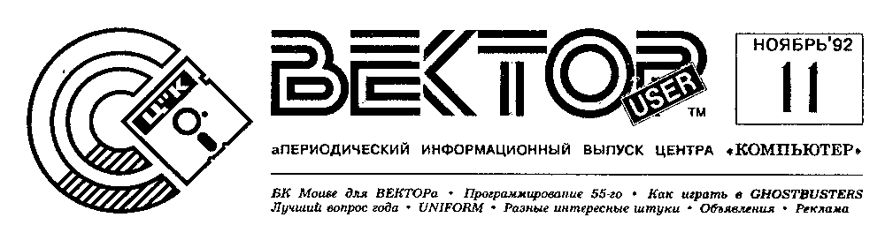
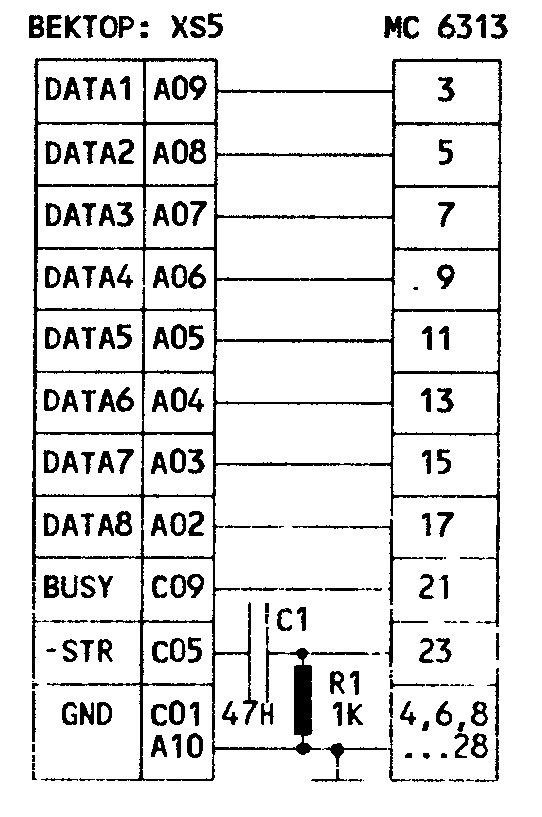
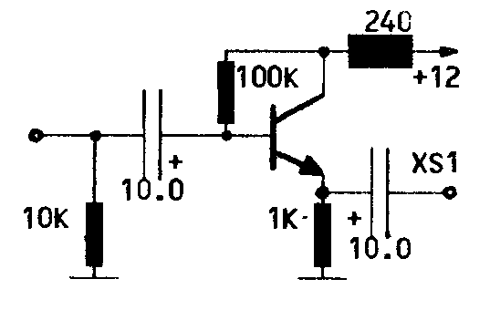
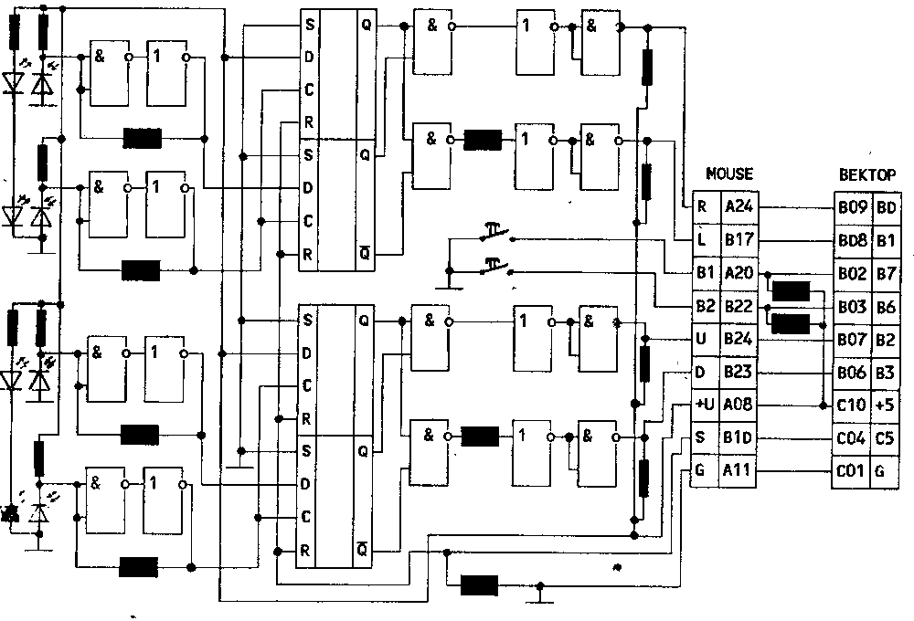

> БК Mouse для ВЕКТОРа - Программирование 55-го - Как играть в GHOSTBUSTERS - Лучший вопрос года - UNIFORM - Разные интересные штучки - Объявления - Реклама

## Подключение принтера МС 6313

Предлагаемая схема позволяет выводить на печать данные по протоколу ИРПР-М.

При использовании плоского кабеля (не длиннее 3м) желательно сигнальные жилы чередовать с общими.
На принтере включить SA1.5.

Так как временные диаграммы принтера и компьютера не совпадают, можно ввести цепь задержки C1R1.
Конденсатор и резистор монтируются в корпусе разъема.

Однако проще и надежнее задержать сигнал -STROBE, изменив подпрограмму вывода на принтер.



А.Зубков, Тирасполь
С.Маяцкий, Минск

## И еще раз о мониторе МС 6105

Введение каскада на транзисторе КТ315 значительно улучшает качество изображения.
Питание схемы +12В осуществляется от монитора.

Сопротивление R1 увеличивается до 4.7 К.



В.Князев, Ст.-Петербург

## О строковых переменных и ADDR()

По горячим следам специального ИВ10, в котором подробно описывались форматы и способы хранения данных BASIC 2.5, хотелось бы вернуться к статье "ОШИБКИ В BASIC 2.5", ИВ7.

К сожалению, один из авторов, не разобравшись нормально, написал о некорректной работе функции ADDR, якобы выдающей неверный адрес переменных, чем ввел в заблуждение Ц"К и наших абонентов.

К счастью, эта функция нормально возвращает адрес области описания строки, расположенной за именем переменной.

Мы обращаемся с огромной просьбой ко всем нашим абонентам, решившим стать соавторами ИВ, набраться терпения и тщательно проверять на практике все материалы, которые вы присылаете в нашу газету.

Наберите и выполните программу ADRCHAR.BAS.
На экран будет выведена текстовая строка, указан адрес ее области описания длиной 4 байта и показаны одна за другой отдельные буквы этой строки.

Обратите внимание на переменные B (адрес области описания строки), L1 (длина строки), AD (адрес собственно текста).

ADRCHAR.BAS:

```
10 CLS: PRINT: PRINT
20 A$="ABCDEF": B=ADDR(A$)
30 PRINT SPC(8);"СТРОКА=";A$:PRINT:PRINT "АДРЕС ОПИСАНИЯ СТРОКИ";B
40 L1=PEEK(B)+256*PEEK(B+1)
50 AD=PEEK(B+2) +256*PEEK(B+3)
60 PRINT "ДЛИНА="; L1, "АДРЕС ТЕКСТА=";AD:PRINT
70 FOR I=1 TO L1
80 PRINT SPC (3); "I="; I, SPC(6);"CHAR=";CHR$(PEEK(AD+I-1))
90 NEXT I
```

Е.Филиппов, Кишинев

## Цвета бордюра

Бордюр действительно станет полосатым, если очень быстро менять его цвет.

```
border: mvi a,15
?bor1:  out 2
        mvi c,1fh       ;delay
?bor2:  dcr c
        jnz ?bor2
        dcr a
        jp  ?bor1
        ret
```

Для устойчивости картинки предлагаемую процедуру нужно привязать к развертке, вставив ее вызов в подпрограмму обработки прерывания.
Ширина полос меняется величиной задержки, но помните, что это сильно замедляет работу компьютера.

В.Сидоренко, Житомир

## Формат MON

Формат записи на магнитную ленту директивой Монитора W следующий.

1. Вначале записывается заголовок MON и имя файла:
   - header 256 * 0h байт;
   - синхробайт 0E6h;
   - 4 * 0D2h байт;
   - имя (до 11 байт);
   - 3 * 0h байт.
2. Далее пишется сам файл:
   - header 256 * 0h байт;
   - синхробайт 0E6h;
   - ст., мл.байт адреса начала;
   - ст., мл.байт адреса конца;
   - байты файла;
   - 1 байт контр. суммы всех байтов без переноса.

При записи директивой W без имени пишется только вторая часть файла.

В.Токарев, Волгоград

## Ура! Ура! Ура!

Несмотря на низкую ответственность наших абонентов, подведены итоги конкурса на лучший вопрос.

Победителем единогласно признан местный парень

**Шура Хрящев**

с вопросом о синем ВЕКТОРе, который повлек за собой наибольшее количество откликов и в шутку, и всерьез.

Ц"К

## Ghostbusters

*По следам наших программ*

Цель игры: патрулируя город, уничтожить как можно больше привидений.

В начале игры Вы видите план города.
Привидения стремятся к зданию с надписью "ZOOL".
Управляя клавишами со стрелками, вам надо ловить их.
Касание привидения временно преграждает ему путь.
Если все же ему удалось проникнуть в "ZOOL", происходит резкое увеличение энергии привидений.
Помните, что энергия - Ваш основной враг!

Если целый квартал на плане города начинает моргать, там бушуют привидения.
Добравшись до такого квартала, Вы попадаете на дорогу.
По пути, перемещая машину влево и вправо, Вы можете всасывать привидения (ПРОБЕЛ) с помощью вакуумного аппарата, закрепленного на капоте (если, конечно, Вы заблаговременно его купили).
Выбор машины, который предоставляется перед началом игры, определяет скорость и время езды.
А время работает против Вас.
Прибыв к месту, Вы должны поймать привидение.
Это делается с помощью трапа или автотрапа (ПРОБЕЛ) в тот момент, когда привидение находится строго над ним.
Лазер позволяет подгонять привидения к трапу.
В случае неудачи теряется жизнь.
Если же приобрести защиту, она сделает Вас неуязвимым.
За пойманное привидение начисляют $1000 и уменьшается их энергия.

Затем Вы снова возвращаетесь к плану города.
Здесь не забудьте поехать к дому с надписью "GHOS" и зарядить трап энергией (ПРОБЕЛ, вниз + кнопка джойстика).
Если этого делать не хотите, то можно выйти в меню ("М", вверх + кнопка джойстика) и купить новый трап, но за деньги.
Заработав немного денег, в меню можно купить и различное новое снаряжение.

## NEW! NEW! NEW! Mouse для ВЕКТОРа!

Наконец-то!
К популярному компьютеру ВЕКТОР приделали это удобное устройство координатного ввода от не менее популярного компьютера БК (когда-то "манипулятор мышь" можно было приобрести в фирменном Магазине-салоне "Электроника" в Москве на Ленинском проспекте, тошно вспоминать, всего за 200 р).

Приведенные в паспорте тактико-технические данные и результаты ходовых испытаний с ВЕКТОРом позволяют утверждать: всяк, попробовавший ею рисовать, вряд ли когда-либо еще притронется к джойстику...

Схема для общего ознакомления с логикой работы мыши отнюдь не предназначена для повторения кооператорами.
Она, возможно, является собственностью завода и приведена здесь без цели причинения ущерба авторам.
Способ же подключения ее к ВЕКТОРу разработан автором статьи.

Мышка подключается на разъем ПУ совершенно аналогично джойстику П.
Разводка и значение битов порта совпадает с джойстиками.

Принцип работы мышки классический: по столу катается резиновый шарик.
К нему прижаты два валика, вращающихся на перпендикулярных осях.
С ними вращаются диски с щелями, у каждого из которых есть два комплекта свето- и фотодиодов с разных сторон.
По порядку открытия и закрытия щелей при вращении, а следовательно, и фотодиодов, схема определяет, в каком направлении съехала мышка.



Зарегистрировав любое перемещение, схема запирается до сигнала сброса.
Если бы в ВЕКТОРе был внешний вход запроса прерывания, было бы логично при этом дергать его каждый раз для отработки мыши.
Но у нас, увы, нет механизма быстрой реакции на перемещение.
В MSX эта проблема решилась созданием мыши, которая сама считает количество перемещений с момента последнего опроса.
Нам же придется в программу обработки прерывания в нескольких местах вставить call mouse:

```
mouse:  in  6
        mov e,a
        mvi a,11
        out 4
        mvi a,10
        out 4
        mov a,e
        ...
        ret
```

© Designed by ables
О.Васенев, Кишинев

## Новое издание про ВЕКТОР-06ц

У Ц"К появились конкуренты на фронте информационного обеспечения пользователей ВЕКТОРа.
В июле 1992 года вышел в свет первый номер

> Специально для "ВЕКТОР 06Ц"
>
> **UNIFORM**
>
> Информационный выпуск творческой группы VecSoft & K

Он представляет собой один лист формата А4, отпечатанный с обеих сторон на матричном принтере.
Основной темой публикаций, как обещают авторы, будет информация по Ассемблеру для ВЕКТОРа.

Выпуск производит несколько сырое впечатление, усугубляемое регулярными ошибками, техническим несовершенством верстки и мелкими неразборчивыми иллюстрациями.

Не в обиду издателям несколько советов:

- a) пробелы ставятся не до, а после знаков препинания;
- b) текст, качественно отформатированный в пакете "Русское Слово" обычными NLQ шрифтами EPSON-совместимого принтера, читается лучше, чем в графическом режиме.

Стоимость листка 8 руб.
Заказать его можно по адресу:

> 220086 Минск, а/я 199
> (0172) 34-6958

## Примочка к эмулятору

Центр "КОМПЬЮТЕР" и С.Морарь представляют новый пакет программ, значительно расширяющий возможности и функциональное назначение Эмулятора РК и Микроши.

Средства пакета позволяют считывать программы в форматах РК и Микроши на диск, запускать их на выполнение с диска в стандартном Эмуляторе 2.4, копировать с диска на МЛ.
Все функции реализуются в удобной диалоговой форме.

В состав пакета входят следующие файлы:

| Файл | Назначение |
| --- | --- |
| LRK.COM и LMC.COM | считывание на диск файлов в формате РК и Микроши |
| SRK.COM и SMC.COM | запись файлов с диска на МЛ |
| ORK.COM и OMC.COM | перевод форматов ДОС-РК и ДОС-Микроши |
| RMX.COM | перевод форматов РК-Микроша и Микроша-РК |
| RRM.COM | запуск программ с диска |
| SRM.COM | изменение адресов и контр. сумм программ |
| RKM.TXT | текстовый файл инструкции |

Наша система абсолютно необходима организациям, тиражирующим программное обеспечение для РК и Микроши!
Пакет работает под управлением ОС МикроДОС (CP/M) на ПК ВЕКТОР-06ц.

Ц"К заключает контракты с организациями, готовыми тиражировать этот пакет.

> 277060 Кишинев, а/я 3556, Ц"К

## Программирование. Секреты ABLESoft: PPI КР580ВВ55А

*(Продолжение. Начало см. в ИВ8,9)*

Когда-то, начав изучать правильные методы программирования PPI BB55A, мы попутно решили максимально разгрузить подпрограмму обработки прерывания, исполняемую 50 раз в секунду.
Мы уже вынесли из нее установку цветов.
Поговорим же и о клавиатуре.

Кому не надоел стандартный обработчик клавиатуры, который заставляет нас "клевать" ее, исключая одновременное нажатие даже двух близлежащих клавиш...

Сегодня мы предложим вам интересную процедурку, отрабатывающую столько клавиш, сколько физически позволяет схема клавиатуры (увеличивается включением каждой клавиши через свой диод, как в джойстике П) и размер системного буфера.
Идея заимствована из ПЗУхи MSX BIOS, дополнена и оптимизирована введением модифицируемых кодов.

```
STKEY   Db 01000010b
;keyboard status
NEWKEY  Ds 9
OLDKEY  Ds 9
KEYBUF  Ds 16
RPTKEY: Db 13
INTRPT: Push H
        Push D
        Push B
        Push PSW
        Lxi H,STKEY
        Mov A,M
        Xri 10000b
        Mov M,A
        Ani 10000b
;scan or code?
        Jz KEYWRK
        In 3
        Sta @@SCRL+1
        Mvi A,8Ah
        Out 0
        Mov A,M
        Out 1
        Mov C,A
        Inx H
        In 1
        Ori 11111b
        Mov M,A
        Mvi B,11111110b
?int1:  Mov A,B
        Out 3
        Rlc
        Mov B,A
        In 2
        Inx H
        Mov M,A
        Jc ?int1
        Mvi A,88h
        Out 0
        Mov A,C
        Out 1
        Mvi A,10000b
        Out 2
@@SCRL: Mvi A,0 ;dummy
        Out 3
?intf:  Pop PSW
        Pop B
        Pop D
        Pop H
        Ei
        Ret
```

Мы разнесли собственно сканирование клавиатуры и обработку полученных данных через одно прерывание, получив в результате уменьшение затрат времени и просто частоту повторения 25 нажатий в секунду.

Hint 4.
Если несколько условных ветвей вашей программы должны сойтись в одной точке, проще (но не быстрее!) сначала положить ее адрес в стек, возвращаясь туда по RET.

```
KEYWRK: Lxi H,?intf
        Push h
        Lxi H,0A6AEh
;'xra m, ana m
        Shld @PRESS
;search for new pressed keys
        Call PRESS?
        Rnz
        Lxi H,RPTKEY
        Dcr M
        Rnz
        Inr M
        Lxi H,0B72Fh
;'cma, ora a
        Shld @PRESS
        Jmp ??pres
```

Сначала мы ищем только вновь нажатые клавиши, заносим их в буфер.
И только при отсутствии таковых и вообще изменений, истекшей первой задержке 0.5 сек и пустом буфере берем неотпущенные клавиши.

```
PRESS?: Lxi H,OLDKEY+8
        Lxi D,NEWKEY+8
        Mvi B,9
?pres1: Ldax D
        Cmp M
        Dcx H
        Dcx D
        Jnz ?pres2
        Dcr B
        Jnz ?pres1
MSXOB:  Lxi H,0 ;dummy
        Mov A,L
        Sub H
        Ret
?pres2: Mvi A,13
        Sta RPTKEY
        Pop H           ;- 1 ret
??pres: Lxi H,OLDKEY+8
        Lxi D,NEWKEY+8
        Mvi C,64
?pres3: Ldax D
        Mov B,A
@PRESS: Nop             ;ana m  cma
        Nop             ;xra m  ora a
        Mov M,B
        Jz ?nokey
;search for bits
        Push H
        Push D
        Push B
        Mvi B,8
?kcod1: Dcr C
        Rlc
        Cc putbuf
        Dcr B
        Jnz ?kcod1
        Pop B
        Pop D
        Pop H
?nokey: Dcx H
        Dcx D
        Mov A,C
        Sui 8
        Mov C,A
        Jnz ?pres3
;else mode keys
        Ldax D
        Cmp M
        Rz
        Mov M,A
        Dcx D
        Cpi 10011111b
;US+SS?
        Mvi B,00100000b
;CAPS switch
        Jz ?ccod1
        Cpi 01011111b
;RUS+SS?
        Mvi B,01000000b
;QWER/JCUK switch
        Jz ?ccod1
        Ani 10000000b
;RUS?
        Rnz
        Mvi B,10001000b
;Rus & lamp switch
?ccod1: Ldax D
        Xra B
        Stax D
        Ret
```

Подпрограмма PutBuf должна подготовить код, который ложится в буфер, исходя из номера клавиши и статуса клавиатуры.
Как это делается, можно подсмотреть, к примеру, в RETEXе...

```
putbuf: Push PSW
;push or don't modify BC!
        Lxi H,KBUF
        Push H
        Mov A,C
        Cpi 63          ;space?
        Mvi A,32
        Rz
        ...             ;etc.
KBUF:   Mov E,A
        Lhld MSXOB+1
        Mov A,L
        Inr A
        Ani 15
        Cmp H
        Jz ?kbuf
        Sta MSXOB+1
        Mvi A,1
        Out 0
        Mov A,L
        Lxi H,KEYBUF
        Add L
        Mov L,A
        Jnc ?adhla
        Inr H
?adhla: Xra A
        Out 0
        Mov M,E
?kbuf:  Pop PSW
        Ret
```

Однако можно применить и Hint3.
В буфер можно ложить сразу номер нажатой клавиши (6 бит) и состояние УС и СС при этом, а также команды смены режимов клавиатуры.
Формировать код символа можно при выборке из буфера.

*продолжение следует*

О.Васенев

## Simulator

**Ваш PC становится ВЕКТОР-совместимым**

Впервые и только у нас Real-Time Vector Simulator, позволяющий создавать, отлаживать и исполнять любые программы для ВЕКТОРа-06ц на PC АТшках:

- программно эмулированы почти все функциональные возможности ВЕКТОРа, печать, RAMдиск, звук;
- SaveGame ("Magic");
- полноэкранный отладчик True Debugger for Vector, снимаются любые защиты;
- работа в МикроДОС и обмен с MS-DOS.

> (0422) 26-9719
> 24-2218

## Moldova Telecom

**(короче, Стас) предлагает:**

- поставку и установку RAMдисков, адаптеров и дисководов с блоками питания к ПК ВЕКТОР-06ц и СИНТЕЗ (ZX Spectrum);
- подключение любых компьютеров к любым телевизорам и мониторам;
- ремонт и техническое обслуживание IBM-совместимых компьютеров;
- разработку системного и прикладного программного обеспечения любого уровня сложности.

> (0422) 55-5745
> 56-1792

## Объявления

> **К.17** Ищу описание программы DOCTOR.
> Адрес в Ц"К

> **П.19** Высылаю принтеры МС 6312, дисководы МС 5305 или 5311, наборы для сборки ZX Spectrum и др.
>
> 453302 Башкирия, Мелеузовский р., Нордовское п/о, д.Завидовка, И. Утяев

> **П.20** Предлагаю литературу по программированию и компьютерам.
> Для получения каталогов высылайте конверт с марками + 5 руб.
>
> 461474 Оренбургская обл., Шарлыкский р-н, Ратчино, В. Выков

## Пользователям PCшек

Центр "Компьютер" и научно-технический центр "ЗАПТЕХНОЭКОС" (ZTE, Ltd) предлагают всем пользователям

**PC-КОМПЛЕКТ**

информационных материалов по ПЭВМ, совместимым с IBM PC XT/AT.

PC-комплект является фундаментальным пособием, полезным как начинающему пользователю, так и опытному специалисту, перед которым стоит задача максимально использовать возможности персонального компьютера.

PC-комплект содержит информацию, необходимую для профессионального использования персональных компьютеров, эксплуатации готовых программных систем и разработки программного обеспечения широкого спектра прикладных задач - от средств автоматизации инженерных и экономических расчетов до систем реального времени с непосредственным управлением оборудованием.

PC-комплект прошел экспертизу во Всесоюзном обществе информатики и вычислительной техники и рекомендован для использования заводами-изготовителями ПЭВМ, коллективами разработчиков программного обеспечения и отдельными пользователями.

PC-комплект уже приобрели сотни предприятий и организаций СНГ, среди которых, в частности, Московский Государственный Университет, Институт космических исследований, НПО "Энергия" и другие.

В состав PC-комплекта входит описание архитектуры персональных компьютеров, совместимых с IBM PC XT/AT, и операционной среды DOS 4.0.
Общий объем PC-комплекта составляет около 200 авторских листов (8 млн. знаков).

| Состав комплекта | Папка | Цена |
| --- | --- | --- |
| **ТОМ 1 Описание архитектуры ПЭВМ** | | |
| Книга 1 Введение в DOS | 1 | 90 |
| Книга 2 Система команд | 2 | 90 |
| Книга 3 Описание интерфейсов | 3 | 90 |
| **ТОМ 2 Описание операционной среды DOS 4.0** | | |
| Книга 1 Введение в DOS | | |
| Часть 1 Первое знакомство с персональным компьютером и операционной системой | 4 | 25 |
| Часть 2 Комплексное руководство для начинающих программистов (быстрое начало) | 5 | 25 |
| Книга 2 Руководство оператора | | |
| Часть 1 Встроенные команды системы | 6 | 190 |
| Часть 2 Внешние команды системы | 7 | 180 |
| Часть 3 Дополн. сервисные программы | 8 | 25 |
| Часть 4 Редакторы текста | 9 | 25 |
| Часть 5 Сообщения системы | 10 | 200 |
| Книга 3 Руководство программиста | | |
| Часть 1 Описание макроассемблера | 11 | 25 |
| Часть 2 Построитель программ LINK | 12 | 25 |
| Часть 3 Отладчик программ DEBUG | 13 | 40 |
| Часть 4 Прерывания DOS | 14а | 290 |
| Часть 5 Прерывания BIOS | 14б | 290 |
| Комплект из 190 программ-примеров использования функций DOS и BIOS на Паскале (4 дискеты) | - | 400 |
| Книга 4 Руководство системного программиста | | |
| Часть 1 Описание системы | 15 | 130 |
| Часть 2 Руководство по настройке опер. среды | 16 | 190 |
| Часть 3 Руководство по разработке драйверов | 17 | 90 |
| Часть 4 Справочник по аппаратным и операционным средствам | 18 | 170 |

По желанию пользователей перечисленные папки могут поставляться на дискетах.
При этом стоимость каждой папки возрастает на 100 рублей.

*В дополнение к этому предлагается*

**комплект информационных материалов**

с описанием аппаратной части ПЭВМ, совместимых с IBM PC XT/AT, являющийся развитием PC-комплекта в направлении более углубленного описания аппаратной части.
Комплект состоит из шести книг:

- Книга 1 Справочное руководство по элементной базе.
- Книга 2 Описание системных плат.
- Книга 3 Описание адаптеров внешних устройств.
- Книга 4 Описание внешних запоминающих устройств.
- Книга 5 Логика построения BIOS.
- Книга 6 Руководство по разработке аппаратных средств сопряжения.

*Также предлагается*

**электронный справочник по операционной среде DOS и BIOS TURBO-ES**

Он разработан НТЦ "ЗАПТЕХНОЭКОС" совместно с советско-австрийским СП "Семиплан".

Электронный справочник представляет собой детальное руководство, которое может быть полезно различным категориям пользователей персональных ЭВМ: специалистам по техническому обслуживанию, разработчикам средств сопряжения, прикладным и системным программистам, конечным пользователям.

В состав справочника входит описание прерываний DOS и BIOS, а также команд DOS 4.х.

От аналогичных зарубежных систем TURBO-ES отличают следующие особенности:

- детальность изложения (общий объем текстовой информации составляет около 90 авторских листов (3 млн. знаков);
- наличие большого количества примеров программирования с использованием прерываний DOS и BIOS (около 200 программ на Паскале и около 250 фрагментов программ на Ассемблере);
- наличие элементов турбо-среды (возможность запуска программ-примеров непосредственно из справочника);
- возможность вывода на принтер отдельных разделов справочника.

Стоимость TURBO-ES 6 000 руб., демо-версии 300 руб.

Надеемся, что эти программные продукты и документация будут интересны и полезны вам.
Мы готовы ответить на все ваши вопросы и выслать все необходимые вам материалы.

> Принимаем к публикации любые информационные материалы по компьютеру ВЕКТОР-06ц, объявления, рекламу и т.п.
> Приобретаем у авторов программы для распространения в составе выпусков ПО.
>
> 277060 Кишинев, а/я 3556, Центр "КОМПЬЮТЕР", (0422) 24-2218

Редактор В.Лапушнер.
Designed by О.Зияев, О.Васенев.
Макет выпуска подготовлен О.Васеневым в пакете "РусскоеСлово" на оборудовании В.Настасенко.

© Ц"К © (логотип) © ABLESoft 1992
