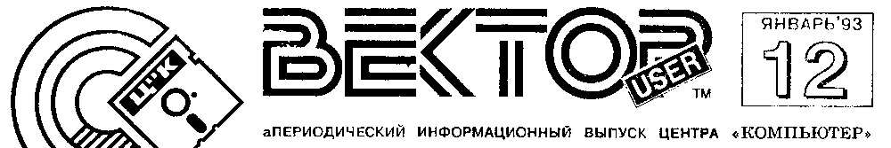
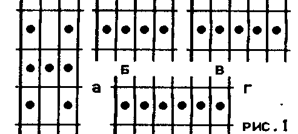
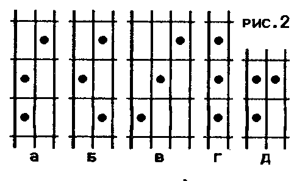
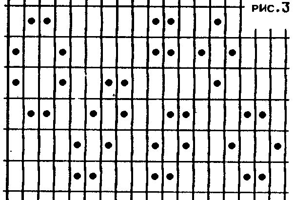
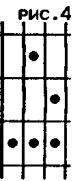
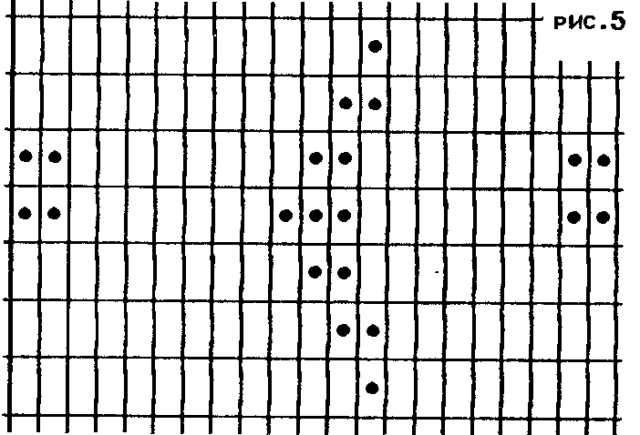

> С Новым Годом! - Спрайты в BASICe - Редактор "КАРАНДАШ" - Как играть в "LIFE" - Клуб "БИТ" - МППЗУ - Разные интересные штучки - Объявления - Реклама про ЕСки

## Информация по принтерам

Начиная с этого номера, Ц"К планирует публиковать некоторые сведения о наиболее распространенных среди пользователей ВЕКТОРа принтерах: основные технические характеристики, особенности, подключение к компьютеру.

### 1. Принтер СМ6337

| Обозначение | Интерфейс |
| --- | --- |
| Дб3.043.005 | ИРПР-М, стык С2 |
| Дб3.043.005-01 | ИРПР-М, стык С2 |
| Дб3.043.005-02 | ИРПР-М |
| Дб3.043.005-03 | ИРПР-М |

### 2. Цветной принтер СМ6341

| Обозначение | Интерфейс |
| --- | --- |
| Дб3.043.006 | ИРПР-М, стык С2 |
| Дб3.043.006-01 | ИРПР-М, стык С2 |
| Дб3.043.006-02 | ИРПР-М |
| Дб3.043.006-03 | ИРПР-М |

У СМ6337 черная печатающая лента шириной 13 мм.
У СМ6341 4-цветная печатающая лента шириной 25мм, цвета - черный, синий, красный, желтый.
Остальные параметры и распайка кабеля идентичны.

Скорость печати обычная 180 зн/сек, NLQ 40 зн/сек.
Набор символов 162.
Кодовые таблицы: КОИ-8, ОСН, АЛТ.
Управляющие коды типа EPSON.
Ширина бумаги до 450 мм (156 символов в строке).
Буфер 4 Кб (из них 3 Кб можно использовать для загрузки знакогенератора до 192 зн).
Потребляемая мощность не более 70 VA.
Размеры 593x333x138 мм.
Масса 9.8 кг.

| Стык С2 | Наименование | Направление |
| --- | --- | --- |
| 102 | сигнальное заземление | |
| 103 | передаваемые данные | (из принтера) |
| 104 | принимаемые данные | (в принтер) |
| 108 | устройство готово | (из принтера) |

| ИРПР-М | |
| --- | --- |
| 1 | STROBE |
| 3 | DATA 1 |
| 5 | DATA 2 |
| ... | ... |
| 17 | DATA 8 |
| 19 | ACKNLG |
| 21 | BUSY |
| 23 | PE |
| 26 | INIT |
| 28 | ERROR |
| 2, 4, ... 22, 24 | GND |

| Кабель 6337 | ВЕКТОР | Сигнал ВЕКТОРа |
| --- | --- | --- |
| 1 | C05 | Строб |
| 3 | A09 | D1 |
| 5 | A08 | D2 |
| 7 | A07 | D3 |
| 9 | A06 | D4 |
| 11 | A05 | D5 |
| 13 | A04 | D6 |
| 15 | A03 | D7 |
| 17 | A02 | D8 |
| 21 | C09 | Готов |
| 2, 4, ... 22, 24 | C01, A10 | Общий |

### 3. УВИП Электроника СМ6312

бК0.305.283, ОКП 4033282211.

Термоструйная печатающая головка МС6902.
Символов в строке 80.
Скорость печати обычная 150 зн/сек.
Набор символов 162.
Кодовые таблицы: КОИ-7 Н0, КОИ-7 Н1, КОИ-7 Н0/1, ОСН (без псевдогр.), АЛТ (без псевдогр.).
Управляющие коды типа EPSON.
Потребляемая мощность не более 30 ВА.
Размеры 55x164x277 мм.
Масса 2.3 кг.

| ИРПР-М (CENTRONICS) | 25-к | 15-к |
| --- | --- | --- |
| СТР | 1 | 1 |
| Д0 | 2 | 2 |
| Д1 | 3 | 3 |
| ... | ... | ... |
| Д5 | 7 | 7 |
| Д6 | 8 | 8 |
| Д7 | 9 | 9 |
| ПТВ | 10 | 10 |
| ЗАН | 11 | 11 |
| ТИП | 18 | 13 |
| ОБЩ | 24, 25 | 14, 15 |

| Кабель 6312 (УВИП) | ВЕКТОР | Сигнал ВЕКТОРа |
| --- | --- | --- |
| 1 | C05 | Строб |
| 2 | A09 | D1 |
| 3 | A08 | D2 |
| 4 | A07 | D3 |
| 5 | A06 | D4 |
| 6 | A05 | D5 |
| 7 | A04 | D6 |
| 8 | A03 | D7 |
| 9 | A02 | D8 |
| 11 | C09 | Готов |
| 21, 24, 25 | C01, A10 | Общий |

## SPRITEs в BASICe

Для любителей BASIC 2.5 и/или BASIC-ДИСК предлагается система спрайтовой мультипликации

**BASS**

Basic Animation Sprite System.

Система BASS позволит Вам в несколько минут создать простой мультфильм, а после некоторых усилий - написать вполне профессиональную игру с несколькими персонажами, графические возможности которой будут ограничены только Вашей фантазией.

Все ЗАРЕГИСТРИРОВАННЫЕ пользователи смогут получить ответы на ВСЕ вопросы по использованию системы BASS в течение месяца после покупки.

Комплект поставки:

- модуль BASS.DBA (подпрограммы спрайтовой мультипликации на Ассемблере, адаптированные для BASIC 2.5 / BASIC-ДИСК);
- графический редактор для подготовки знакогенераторов спрайтовой мультипликации GEASS.COM;
- программа JETI.BAS (версия игры ЙЕТИ, написанная только на BASIC!!!);
- знакогенератор для игры ЙЕТИ, подготовленный с помощью GEASS.COM;
- программа CAT.BAS (демонстрация многофазной мультипликации);
- знакогенератор для программы CAT.BAS;
- текстовый файл с документацией по использованию системы BASS и графического редактора GEASS.

Стоимость комплекта:

**1.500 руб.**
(без стоимости дискеты)

Заказы принимаются с 10.00 до 20.00 по тел. 52-80-27.
Возможна покупка вскладчину.
Для программистов на Ассемблере возможна поставка набора перемещаемых модулей для компоновки программы.

Е.Филиппов, 1993

## Клуб «БИТ»

Уважаемые пользователи ПК «ВЕКТОР» и «СИНТЕЗ»!
При Центре «КОМПЬЮТЕР» начал работу клуб пользователей ПК «БИТ»

- Клуб «БИТ» - это интересные встречи, новые друзья и соратники в познании вашего компьютера.
- Клуб «БИТ» - это организация лекций, консультаций и курсов по работе и программированию на вашем любимом ПК.
- Клуб «БИТ» - это самые новые программы, игры.
- Клуб «БИТ» - это низкие цены на дисководы, адаптеры, RAMдиски, дискеты.
- Клуб «БИТ» и ваши взносы - это маленькое предприятие по производству нового ПО, игр и аппаратного обеспечения, а также привлечению новых идей и разработок. У нас работают лучшие программисты в Кишиневе на ВЕКТОРе.
- Клуб «БИТ» сможет удовлетворить любые запросы.

Первые результаты работы клуба «БИТ» уже налицо.
Дело за вами.
Мы ждем вас!

Сумма взноса (пока)

**250 руб. на квартал.**

Наш адрес:

> Кишинев, ул.Букурешть, 68, к.705, тел. (0422) 24-2218

## Поздравления

Ц"К поздравляет всех

**С НОВЫМ ГОДОМ!**

Ну и что, что в феврале?
Несмотря на все эти реформы и суверенитеты, мы, кажется, все же выжили!
Чего и вам всем желаем.

Еще один год...
Все надежды на приток свежей крови - клуб «БИТ».
Пока!

Ц"К

## Как играть в LIFE

*По следам наших программ*

Большинство работ Джона Хортона Конвея, математика из колледжа Кембриджского университета, посвящено теоретической математике.
Но наряду с серьезными исследованиями он увлекается и занимательной математикой.
Мы познакомим вас с одним из известнейших и популярнейших творений Конвея - увлекательной игрой, которую он назвал «Life» (жизнь).

«Жизнь» происходит на клеточном поле.
Сущность игры состоит в том, чтобы, начав с простой конфигурации точек (каждая точка представляет собой одну «живую клетку»), посмотреть, как эта конфигурация будет изменяться под действием «генетических законов» - правил игры, придуманных Конвеем.

Вот эти законы, иначе говоря, правила игры.

1. Существование.
   У каждой клетки поля насчитывается восемь соседей.
   Каждая точка, рядом с которой расположены две или три точки, продолжает жить следующее поколение.
2. Отмирание.
   Каждая точка, у которой оказалось четыре или более соседних точек, отмирает (удаляется с поля) из-за перенаселенности.
   Каждая точка, у которой оказался всего один сосед или их вовсе нет, отмирает от одиночества.
3. Рождение.
   Каждая пустая клетка поля, с которой соседствуют три точки - ни больше, ни меньше, а только три, - является рождающейся клеткой.
   Следующим ходом на этой клетке появится точка.

Вот и все правила.

Важно иметь в виду, что все «отмирания» и «рождения» происходят одновременно.
Вместе эти события образуют «жизнь» одного поколения или, можно сказать, «ход» в общей истории жизни исходной конфигурации.

В качестве упражнения предлагается проследить историю жизни буквы Н (см. рис. 1а).
Если перекладину буквы Н поднять на одну клетку, получится П.
Если Н погибает быстро, то П живет очень долго.
После 173 ходов она распадается на пять прямых цепочек, в каждой по три шашки, шесть квадратных блоков по четыре шашки в каждом и два «пруда».
Выясните, как ведут себя цепочки различной длины: 4, 5, 6 и т.д. (см. рис. 1б, в, г) и как размер цепочки влияет на продолжительность и богатство ее жизни.



Занявшись игрой, вы увидите, что население доски претерпевает необычные, иногда очень красивые и всегда неожиданные изменения.
В некоторых случаях население в конце концов вымирает (все шашки снимаются с доски), хотя путь к этому печальному финалу может длиться много-много поколений.
Но большинство начальных позиций либо приводит к устойчивым системам, которые уже нельзя изменить, либо к конфигурациям, которые изменяются циклично, каждый раз возвращаясь к одному и тому же расположению шашек.

Позиции, в которых поначалу не было никакой симметрии, стремятся стать симметричными.
Когда симметрия достигнута, она уже не утрачивается, она может только становиться все более богатой.
Рассмотрим, что же происходит с различными начальными конфигурациями?
Одна шашка или пара шашек, произвольно расположенных, как это очевидно, погибают на первом же ходе.
Исходная система из трех шашек тоже погибает незамедлительно, если по меньшей мере одна шашка не имеет двух соседей.



На рис. 2 изображены пять триплеров, которые не погибают при первом ходе.
Однако первые три прекращают существование на втором ходе.
Конфигурация (г) - простейший пример колебательной системы, которая через ход возвращается в исходное состояние.
Конфигурация (д) образует после первого хода устойчивый блок (квадрат из четырех шашек).



На рис. 3 показано несколько наиболее распространенных стабильных конфигураций, которые уже не претерпевают дальнейших изменений.

Одно из самых замечательных открытий Конвея - «глиссер», составленный из пяти шашек (см. рис. 4).
Через два хода он смещается и превращается в свое зеркальное отображение, относительно диагонали.
Еще через два хода фигура смещается и восстанавливает свой первоначальный облик.
Глиссер, раз поставленный на поле, двигается в одном направлении, пока не достигнет границы или другой фигуры.



Проследите сами, что происходит с фигурами на рис. 5.



Сам Джон Конвей играл в «жизнь» на бумажном клетчатом поле с помощью большого количества черных и белых шашек.
Это требовало внимания и завидного терпения.

Компьютер ВЕКТОР и программа «LIFE» (автор Е. Филиппов) помогут избежать рутинной работы и оставят вам только элементы творчества и наслаждения.

*По материалам журнала "Наука и жизнь"*

## Загрузка из внешнего ПЗУ

Модуль внешнего ППЗУ позволяет быстро (1-2 сек) загрузить программу в ОЗУ компьютера и запустить ее на выполнение.

В МППЗУ может быть записана любая программа в кодах (до 32КБ), но необходимо помнить, что программа пересылается в ОЗУ на адрес 0.

Опыт эксплуатации таких модулей показывает, что наиболее эффективна прошивка в них тестов, BASIC, MicroDOS, а также игр, если ВЕКТОР используется в качестве игрового автомата.

Загрузка программ в ОЗУ из МППЗУ может происходить двумя способами:

1. Загрузить с магнитной ленты программу «Загрузчик из ПЗУ», которая перешлет данные из МППЗУ в ОЗУ.
   Длина загрузчика на МЛ не превышает 1 блока 256Б.
   Примерный текст программы (M80):

```
Load:   Di
        Mvi     A,82h   ;B in
        Out     4       ;A, C out
        Mvi     B,ZagE-ZagB
        Lxi     H,ZagB
        Lxi     D,ZagW
?rel:   Mov     A,M
        Stax    D
        Inx     H
        Inx     D
        Dcr     B
        Jnz     ?rel
        Jmp     ZagW
ZagB:   .phase  8000h
ZagW:   Lxi     D,0     ;ст.бит
        Lxi     H,8000h ;CS
?load:  Mov     A,L
        Out     7
        Mov     A,H
        Out     5
        In      6
        Stax    D
        Inx     H
        Inx     D
        Mov     A,H
        Ora     A
        Jnz     ?load
        Sphl
        Rst     0
        .dephase
ZagE:   End Load
```

2. Заменить в ВЕКТОРе ПЗУ начальной загрузки новым, с поддержкой RAM-диска, МППЗУ, дисковода.
   ВЕКТОР-06ц-02 выпускается с новым загрузчиком.

Конструктив: плата МППЗУ питается и подключается к 30-контактному разъему.
На ней до 4 м/с типа 2764, одна К555ИД4 для их выборки.

Готовые МППЗУ, их схемы, чертежи печатной платы и расположения элементов, а также новые микросхемы начального загрузчика заказывайте по адресу:

> 277060 Кишинев, а/я 3556
> (04222) 24-2218

## Графический редактор КАРАНДАШ

*По следам наших программ*

Программа предназначена для создания графических изображений, которые могут применяться в различных игровых и обучающих программах.
Имеется дисковый вариант с незначительными отличиями в управлении.

Редактор позволяет рисование линий, прямоугольников и окружностей, закраску и штриховку в 16 цветах, увеличение изображения, печать и сохранение изображения на магнитной ленте.
Объем программы - 24К.

При запуске программа предлагает выбрать тип джойстика.
После этого появляется заставка с названием редактора.
При нажатии на любую кнопку выходим в основное меню.
Кнопками `←` `→` выбираем в меню пиктограмму режима, а `ПРОБЕЛ` - переходим в него.

### 1. Вывод экрана на магнитную ленту

Данные в экранной области ОЗУ (8000h - FFFFh) упаковываются, после чего изображение инвертируется.
Включаем магнитофон на запись.
Вывод данных - `ПРОБЕЛ`.
Повторным нажатием `ПРОБЕЛ` выводим нужное число копий.
Запись производится в формате монитора-отладчика.
Выход в меню - `АР2`, при этом данные распаковываются, изображение восстанавливается.

### 2. Ввод экрана с магнитной ленты

Изображение, записанное на магнитную ленту, загружается в экранную область ОЗУ и распаковывается.

### 3. Вывод фрагмента изображения на магнитную ленту

Появляется прямоугольник.
Подводим его к выводимому фрагменту.
Нажав `АР2`, можно изменить размеры блока кнопками `↑` `↓` `←` `→`.
Изменение шага перемещения - `СТР`.
Повторное нажатие `АР2` - перемещение прямоугольника.
После установки позиции и размера блока нажать `ПРОБЕЛ`, выводимый блок инвертируется.
Включаем магнитофон на запись.
Вывод блока - `ПРОБЕЛ`.
Повторным нажатием `ПРОБЕЛ` выводим нужное число копий.
Выход в меню - `АР2`.
Формат вывода блока соответствует операторам GET/PUT.

### 4. Ввод фрагмента изображения с магнитной ленты

После загрузки блока с магнитной ленты на экране появится прямоугольник, размер которого соответствует размеру введенного блока.
Перемещение к месту установки кнопками `↑` `↓` `←` `→`.
Установка блока - `ПРОБЕЛ`.
Выход в меню - `АР2`.

### 5. Заливка

Вместо основного меню появляются 16 видов штриховки.
После выбора штриховки появляются 16 цветов закраски.
После выбора вида и цвета закраски на экране появляется карандаш.
Перемещаем его кончик на закрашиваемый участок, изменение шага перемещения - `СТР`, и нажимаем `ПРОБЕЛ`.
Границы закраски определяются элементами изображения, имеющими другой цвет.
Выход в меню - `АР2`.

### 6. Линия

Появляется карандаш.
Перемещение его по экрану - `↑` `↓` `←` `→`, а при нажатом `УС` - с одновременным рисованием.
Изменение шага перемещения - `СТР`.
Первое нажатие `ПРОБЕЛ` фиксирует начало "резиновой линии", второе - конец.
Выход в меню - `АР2`.

### 7. Выбор цвета

Вместо основного меню появляются 16 цветов.
Кнопками `←` `→` выбираем цвет, а `ПРОБЕЛ` - назначаем его для режимов «линия», «прямоугольник», «окружность», «текст».

### 8. Рисование прямоугольника

Появляется прямоугольник.
Нажав `АР2`, изменяем его размеры кнопками `↑` `↓` `←` `→`.
Изменение шага перемещения - `СТР`.
Повторное нажатие `АР2` - перемещение прямоугольника.
После установки позиции и размера прямоугольника нажать `ПРОБЕЛ`.

### 9. Рисование окружности

Появляется маленькая окружность.
Перемещаем ее кнопками `↑` `↓` `←` `→`.
`СТР` - изменение шага перемещения.
Нажав `АР2`, изменяем ее размер кнопками `↑` `↓`.
Нажатие `ПРОБЕЛ` - возврат в режим перемещения.
`ПРОБЕЛ` - установка окружности.
Выход в меню без рисования - `АР2` `АР2`.

### 10. Лупа

Появляется прямоугольник 32x32.
Перемещаем его кнопками `↑` `↓` `←` `→` на фрагмент, который надо увеличить.
`СТР` - изменение шага перемещения.
При нажатии `ПРОБЕЛ` в верхней части экрана появится изображение увеличиваемого фрагмента в масштабе 1:1, а внизу - увеличенное изображение с сеткой, в верхней части которого имеется меню цвета.

Перемещение курсора по лупе - `↑` `↓` `←` `→`, а при нажатом `УС` - с одновременным рисованием.
Нажатие `ПРОБЕЛ` фиксирует точку.
Выбор нового цвета - `АР2`, `←` `→` и `ПРОБЕЛ`.
Для выхода из лупы выбираем "цвет" за пределами меню, после чего на экране останется откорректированный фрагмент.
Выход в меню - `АР2`.

### 11. Копирование блока

Появляется прямоугольник.
Подводим его к копируемому блоку.
Нажав `АР2`, изменяем размеры блока кнопками `↑` `↓` `←` `→`.
Изменение шага перемещения - `СТР`.
Повторное нажатие `АР2` - перемещение прямоугольника.
После установки позиции и размера блока нажать `ПРОБЕЛ`, копируемый блок инвертируется.
Подводим выделенный прямоугольник на новое место и нажимаем `ПРОБЕЛ`.
Выход в меню - `АР2`.

### 12. Стирательная резинка

Вместо основного меню появляется меню выбора цвета.
После выбора цвета на экране появляется резинка.
Изображение под резинкой нажатием `ПРОБЕЛ` будет затираться выбранным цветом.
Перемещение резинки по экрану - `↑` `↓` `←` `→`, а при нажатом `УС` - с одновременным стиранием изображения.
Изменение шага перемещения - `СТР`.
Выход в меню - `АР2`.

### 13. Показ координат

Вместо основного меню отображаются в шестнадцатиричном формате текущие координаты X, Y положения графического курсора и номер цвета.
Выход в меню - `АР2`.

### 14. Ввод текста

На экране появляется курсор 16x16, определяющий размер букв.
Нажав `АР2`, изменяем его размер кнопками `↑` `↓` `←` `→`.
Изменение шага перемещения - `СТР`.
Повторным нажатием `АР2` или `ПРОБЕЛ` перемещаем курсор в нужное место и набираем с клавиатуры текст.
Выход в меню - `АР2`.

### 15. Вывод на принтер

Изображение с экрана печатается на EPSON-совместимом принтере в графическом режиме.
При этом цветам с 1 по 7 будет соответствовать одинарная, а с 8 по 15 - двойная плотность печати.

### 16. Очистка экрана

Надпись «ВСЕ СТЕРЕТЬ? ДА - (ПРОБЕЛ), НЕТ - (АР2)».
При нажатии `ПРОБЕЛ` производится очистка экрана.

Ц"К

## От редакции

Уважаемые господа!
Границы, таможни, подорожание почтовых услуг и т.п. нарушают наши с вами связи.
Мы постараемся хотя бы давать информацию, где взять программы.

> **ВНИМАНИЮ ОРГАНИЗАЦИЙ, ТИРАЖИРУЮЩИХ ПРОГРАММНОЕ ОБЕСПЕЧЕНИЕ ДЛЯ ПК ВЕКТОР-06ц**
>
> Редакция ИВ готова публиковать на страницах «ВЕКТОР user» ваши каталоги новых программ с вашими адресами и телефонами.
> Присылайте перечни с краткими аннотациями и фамилиями авторов в адрес Ц"К с пометкой «КАТАЛОГ» на конверте.

Просим не делать предоплату на наш счет без согласования с Ц"К!
Свяжитесь с нашим сотрудником, и только когда Вам отложили Ваш заказ, назвали его цену и номер, можно отправлять деньги, не забыв указать в бланке номер заказа.

Если Вы хотите получить письменный ответ или ИВ, обязательно пришлите конверт с необходимым количеством марок.
С 1.01.93 цена номера ИВ - 10 руб (ИВ 4 - 15 руб).
Подписаться можно вперед на 1...10 номеров, а также в Московском филиале Ц"К.

## Объявления

> **Ц.3** Васенев тоже женился.
> Поздравляем!
> Ц"К

> **Р.10** Разводка печатных плат любой сложности, в т.ч. и многослойных.
> Ц"К

## Реклама пользователям ЕСок

Центр "Компьютер" и инженерная фирма ELTRON, Ltd предлагают

**Усовершенствование ППЭВМ ЕС1840, ЕС1841**

### Оригинальная Базовая Система Ввода-Вывода (BIOS)

Характеристики:

- выборочное и ускоренное тестирование ОЗУ при включении ППЭВМ;
- загрузка с дискет формата 320 Кбайт (CPM-86, M86), 360 и 720 Кбайт (Альфа-ДОС, MS-DOS, PC-DOS);
- независимое от установленных перемычек определение размера установленной памяти;
- повышение быстродействия за счет установки оптимального периода регенерации памяти;
- оптимизация режимов работы НГМД;
- возможность продолжения работы при возникновении ошибки PARITY CHECK 2;
- устранение ошибок, допущенных фирмой IBM и повторенных и добавленных НИИЭВМ при разработке BIOSа ЕС1840, 41.

### Расширение ОЗУ

Характеристики:

- 736 Кбайт базовой памяти, 1 Мбайт общей.

Программная поддержка:

- оригинальный BIOS, драйвер виртуального диска размером 264 Кбайт, размещаемого в дополнительной памяти (свыше 736 Кбайт) с возможностью увеличения размера диска за счет базовой памяти.

Перспективные направления работ:

- разработка модуля памяти емкостью 2 Мбайт на ИМС КР565РУ7;
- разработка драйвера дополнительной памяти в стандарте EMS 4.0 LIM-спецификации (Lotus/Intel/Microsoft), поддерживающего до 32 Мбайт ОЗУ и необходимого для полноценной работы многих популярных пакетов программ.

### Конвертор системной шины

Характеристики:

- аппаратная совместимость с IBM PC/XT;
- возможность подключения одного, а при изменении компоновки ППЭВМ - до 5-ти устройств в конструктиве IBM PC, в том числе: сетевых адаптеров, встроенных модемов, стандартных контроллеров последовательного интерфейса, видеоконтроллеров EGA и т.д.;
- занимает одно посадочное место в ППЭВМ.

### Модуль программатора СППЗУ

Характеристики:

- осуществляет программирование и контроль микросхем программируемых постоянных запоминающих устройств с ультрафиолетовым стиранием (СППЗУ): К573РФ2, К573РФ4...К573РФ8, i2716, i2732, i2764, i27128, i27256, i27512, однокристальных микроЭВМ КМ1816ВЕ48, i8748;
- позволяет считывать информацию: с микросхем ППЗУ КР556РТ7 (7А, 18), КР556РТ16, из памяти ППЭВМ;
- занимает одно посадочное место в ППЭВМ.

### 4-канальный адаптер RS-232

Характеристики:

- полная программно-аппаратная совместимость с PC XT;
- обеспечение работы популярных зарубежных телекоммуникационных пакетов программ с модемами, графических и САПР пакетов с мышью, дигитайзерами и плоттерами;
- занимает одно посадочное место в ППЭВМ.

### Модуль связи с устройствами работы с перфолентой ПЛ150М, FS1501

### Установка высокоскоростных НМД с интерфейсом AT BUS

Характеристики:

- уменьшение времени доступа к НМД с 80 до 28 мс;
- возможность установки НМД емкостью от 40 до 120 Мб;
- резкое повышение надежности за счет исключения модуля ...737 и некачественных и устаревших НМД типа ST225.

### Повышение тактовой частоты ЕС1841 до 8 МГц

Характеристики:

- стандартная частота (1.193 МГц) работы таймера, необходимая для системных часов и музыкальных программ;
- реальное увеличение быстродействия в 2.1 раза по сравнению с PC и PC XT.
  Измерение производилось тестами SPEED, CHECKIT, QAPLUS.

### Телекоммуникационная программа

Характеристики:

- работа с любым внешним HAYES-модемом в среде MS-DOS на IBM-совместимых компьютерах, в том числе и на не совсем совместимых ЕС1840, ЕС1841;
- автоматическое определение числа последовательных портов RS232C и возможность работы с любым из них (от COM1 до COM8);
- терминальный режим;
- телефонный справочник;
- запоминание последнего номера телефона;
- автонабор номера телефона из телефонного справочника, по последнему номеру;
- автоповтор набора номера телефона;
- пересылка файлов по встроенным протоколам: ASCII, XMODEM, YMODEM-BATCH, ZMODEM;
- просмотр, упаковка и распаковка файлов;
- вызов оболочки ДОС;
- возможность выхода в ДОС без разрыва связи;
- оперативная настройка параметров связи;
- встроенный справочник по работе с программой.

Все это даст Вам возможность телефонной связи с любым IBM-совместимым компьютером в любой точке земного шара, оснащенным любым HAYES-совместимым модемом, а также с BBS любительской компьютерной сети FIDONET.

### Изменение компоновки ППЭВМ ЕС1841

Характеристики:

- повышение надежности за счет улучшения тепловых режимов модулей (вертикальное расположение плат) и укорочения длины связей с дисковыми накопителями;
- возможность перехода на один блок питания;
- возможность установки нескольких модулей в конструктиве IBM PC.

Предлагается:

- настольный вариант КУБ;
- напольный вариант TOWER;
- КУБ с одним блоком питания без конвертора шины.

Мы надеемся, что все предлагаемые нами усовершенствования помогут вам чувствовать себя увереннее в работе на ваших "самых совместимых" ППЭВМ.

Мы готовы ответить на все ваши вопросы и выслать необходимые вам информационные материалы.

С заказами и предложениями, а также за информацией о текущих ценах просим обращаться:

> 277060 Кишинев, а/я 3556
> (04222) 24-2218

> Принимаем к публикации любые информационные материалы по компьютеру ВЕКТОР-06ц, объявления, рекламу и т.п.
> Приобретаем у авторов программы для распространения в составе выпусков ПО.
>
> 277060 Кишинев, а/я 3556, Центр "КОМПЬЮТЕР", (0422) 24-2218

Редактор В.Лапушнер.
Designed by О.Зияев, О.Васенев.
Макет выпуска подготовлен О.Васеневым в пакете "РусскоеСлово" на оборудовании В.Настасенко.

© Ц"К © (логотип) © ABLESoft 1992
