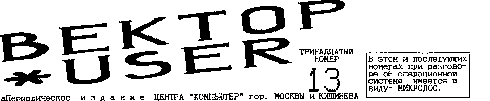
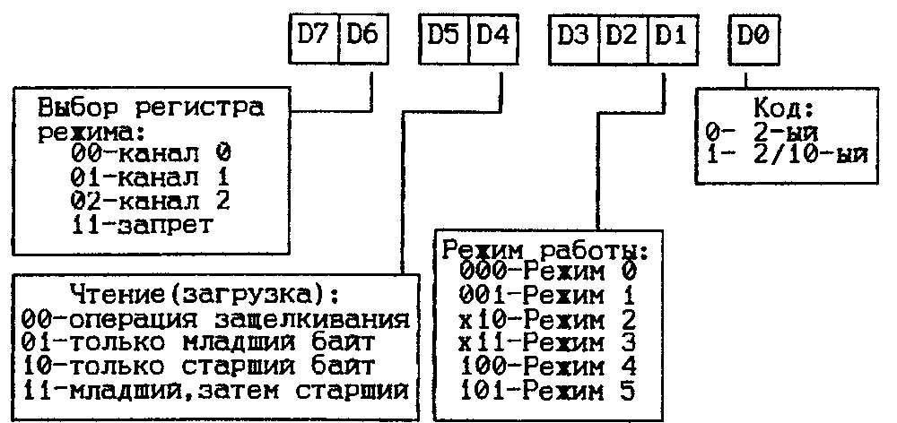
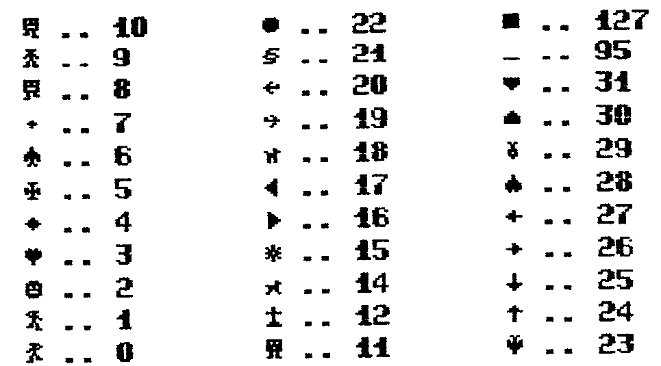

> Графический режим принтера - Какая МикроДОС лучше? - Модем-АОН "TELECOM V1200" - Программирование таймера - BASIC-ПЗУ и псевдографика - Приключения Колобка - Объявления

## Графический режим принтера

Мы будем рассматривать только 8-точечную графику, так как она возможна практически на всех современных матричных и струйных принтерах.
В 8-точечной графике существует восемь режимов, отличающихся горизонтальной плотностью печати.

| Режим | Плотность (точка/дюйм) | Колонок в строке 8 дюймов | Колонок в строке 11 дюймов |
| --- | --- | --- | --- |
| 0 | Одинарная (60) | 480 | 810 |
| 1 | Двойная (120) | 960 | 1620 |
| 2 | Двойная с высокой скоростью (120)* | 960 | 1620 |
| 3 | Четырехкратная (240)* | 1920 | 3240 |
| 4 | Плотность ЭЛТ I | 640 | 1080 |
| 5 | Одинарная плотность графопостроителя (144) | 576 | 972 |
| 6 | Плотность ЭЛТ II | 720 | 990 |
| 7 | Двойная плотность графопостроителя (144) | 1152 | 1944 |

\* В этих режимах печать соседних точек невозможна.
Если эти точки встречаются в описании графического изображения, то они исключаются автоматически.

Команды 8-точечной графики имеют следующий формат: `ESC <тип графики> n1 n2 <данные>`, где `<тип графики>` определяет горизонтальную плотность графического изображения и скорость печати; n1 и n2 - число колонок графики, вычисляем по формулам (d - число колонок): n1=d MOD 256, n2=INT(d/256); `<данные>` - байты, описывающие колонки в графической строке.
С помощью команды этого формата можно выбрать четыре типа графики, `<тип графики>` - { K; L; Y; Z; }:

- ESC K - графика одинарной плотности
- ESC L - графика двойной плотности
- ESC Y - графика двойной плотности на высокой скорости
- ESC Z - графика четырехкратной плотности

Рассмотрим ESC K - графический режим одинарной плотности с 480-ю точками на 8-ми дюймовой строке.

```
Формат команды:      ESC  K  n1  n2  d1  d2
                     027 075 XXX XXX XXX XXX
на принтер выводится (байты данных - колонки):
8 X X X X X X X X X
7 X X X X X X X X X
6 X X X X X X X X X
5 X X X X X X X X X
4 X X X X X X X X X
3 X X X X X X X X X
2 X X X X X X X X X
1 X X X X X X X X X
  1 2 3 4 5 6 7 8 9
```

Обратите внимание на пример, написанный на Basic:

```basic
10 IG$=CHR$(27)+CHR$(75)+CHR$(8)+CHR$(0)
20 PS$=CHR$(27)+CHR$(106)+CHR$(&18)
30 D1$=CHR$(&FF)+CHR$(&FF)+CHR$(&FF)+CHR$(&FF)+CHR$(&FF)+CHR$(&FF)+CHR$(&FF)+CHR$(&FF)
40 D2$=CHR$(&F0)+CHR$(&F0)+CHR$(&F0)+CHR$(&F0)+CHR$(&F0)+CHR$(&F0)+CHR$(&F0)+CHR$(&F0)
50 D3$=CHR$(&0F)+CHR$(&0F)+CHR$(&0F)+CHR$(&0F)+CHR$(&0F)+CHR$(&0F)+CHR$(&0F)+CHR$(&0F)
60 LPRINT IG$;D1$;IG$;D2$;IG$;D3$;PS$
70 GOTO 60
```

Программа должна напечатать:


Это изображение задается последовательностью команд:

```
ESC K 08 00
FF FF FF FF FF FF FF FF
ESC K 08 00
F0 F0 F0 F0 F0 F0 F0 F0
ESC K 08 00
0F 0F 0F 0F 0F 0F 0F 0F
ESC j 18 0A 0D
далее все повторяется.
```

Обычно графическая картинка состоит из нескольких графических строк, расположенных друг за другом.
Поэтому при работе с графикой необходимо изменить межстрочный интервал, передвигая бумагу с помощью команды прямой подачи бумаги (ESC"j").
Число посылаемых графических данных должно точно соответствовать числу данных, зарезервированному в используемой графической команде.
Если графических данных послано больше, то избыточная часть их будет восприниматься как коды символов.
Если же графических данных послано меньше, то принтер остановится и будет ждать недостающих данных.

Камшилин Д.В.  г.Владимир
С согласия автора перепечат. из "Владимир-Вектор"

## Объявления

> По адресу 117335 Москва а/я 101 Фиронову Виктору Павл. можно приобрести:
>
> 1. Контроллер дисковода и электронный диск на 256 К.байт.
>    Обе платы заново разведены, убраны все ошибки.
>    Предлагаются как готовые изделия, так и чистые платы.
> 2. Модем-АОН с дискетой программной поддержки.
>    Предлагаются как готовые изделия, так и конструктор для самостоятельной сборки.
> 3. Обширное программное обеспечение (различные текстовые редакторы; языки программирования: Ада, Фортран, Паскаль, Си, Бейсик-компиляторы, Бейсик-интерпретаторы; базы данных; всевозможные игровые программы; пакеты вспомогательных программ; и вообще много всего).
> 4. При получении марок на 100 рублей высылаю каталог.
> 5. Принимаю любые материалы связанные с Вектором для публикации в этой газете.
> 6. Также принимаю рекламу об обмене, купле, продаже аудио, видео, орг-техники и программного обеспечения.
> 7. Реклама платная. Справки по т. (095)128-73-18, 19-23 ч.

## Какая МикроДОС лучше?

В последнее время пользователи дискового варианта ВЕКТОР-06Ц столкнулись с массовым потоком различных операционных систем, объединенных общим названием МИКРОДОС, но различающихся названием BIOSа: v3.0; v3.1; vF02; v11; v14.2; vF5.1; и т.д.
Следует заметить, что мы рассматриваем только те ОС, которые поддерживают два дисковода и RAM-диск.
Рассмотрим таблицу, где собраны достоинства и недостатки самых распространенных ОС.

| - недостаток / + достоинство | BIOS v3.0 | BIOS v3.1 | BIOS vF51 |
| --- | --- | --- | --- |
| Полная совместимость с CP/M v2.2 | - | + | + |
| Правильная работа с файлами прямого доступа | - | + | + |
| Встроенный драйвер магнитофона формата DOS | + | + | - |
| Переключение клавиатуры | - | - | + |
| Назначение пути поиска системных файлов | - | - | + |
| Запуск INITIAL.SUB с электронного диска | - | - | + |
| Запуск файла с нулевого адреса | - | - | + |
| Встроенная команда переназначения статуса диска | - | - | + |
| Правильная таблица псевдографики | - | - | + |
| Возможность вызова псевдографики в текстовых редакторах | - | - | + |
| Массовое переименование файлов | - | - | + |
| Режим символов удвоенной ширины | + | - | - |

Весь поток версий МИКРОДОС отражает два направления развития ОС для ВЕКТОРа.
Одно направление "классическое" (самые старые МИКРОДОС).
Другое направление развивает Филиппов Е.В. (в версиях BIOSa стоит буква F).
Первая из самых распространенных была ОС с BIOSv3.0, но она имела не полную совместимость с CP/M и неправильно работающий режим прямого доступа к файлу в USERах отличных от нулевого.
Например в программе POWER не работала команда TEST.
Затем появилась ОС с BIOSv3.1, у которой отсутствовал первый недостаток, но появились новые.
МИКРОДОС BIOSvF5.1 - одна из последних для Вектора.
Она имеет ряд принципиальных достоинств, что видно из приведенной таблицы.

Камшилин Д.В.  г.Владимир

## Программы для Микродос

**DC.COM** (из пакета системных утилит) Программа копирования "диск в диск".
Копирует посекторно не разрушая ОС.
Автоматическая настройка на тип оборудования и формат диска.
Перекодирует файлы "COMAN" в нормальные.

## Немного о модеме-АОНе "TELECOM V1200"

Назначение: установление связи и передачи цифровой информации между вычислительными машинами по выделенным и коммутируемым телефонн. линиям; автоматическое определение номера и использование ПК в качестве телефона с богатыми сервисными возможностями.
Для работы с МОДЕМОМ нужны:

1. Компьютер Вектор-06ц (дисковый вариант).
2. Модем "TELECOM".
3. Телефонная линия.

### Технические характеристики модема

- модем удовлетворяет требованиям V.23 МККТТ
- тип модема ассинхронный
- скорость передачи - 1200/600/300 бод.
- вид модуляции - частотный
- ручная и автоматическая установка связи
- метод передачи - полудуплексный
- совместимость - модем АЛЬТАИР (IBM PC/XT/AT)

### Технические характеристики АОНа

- вывод информации на дисплей и индикатор
- автоматическое определение номера: при поднятии трубки / без поднятия трубки
- автодозвон по заранее заданному номеру
- установка количества знаков АТС
- тональное звуковое сопровождение
- записная книжка на 256 номеров и часы
- возможность громкоговорящей связи
- набор в линию номера из памяти
- набор в линию номера из записной книжки
- отображение на индикаторе режима работы
- просмотр количества звонивших абонентов

### Конструктивное исполнение

Плата с размерами 70 на 100 мм, подключаемая к параллельному порту (ПУ).

### Программный пакет V1200

На сегодня пакет содержит несколько утилит работающих в системе МИКРОДОС.

**VSND.COM** - Программа для передачи файлов по телефонной линии.

```
VSND имя1 имя2...имяN [/опция] [/таймаут]
```

Допустимы следующие опции:

- /H - передача со скоростью 1200 бод.
- /L - передача со скоростью 300 бод.
- /? - подсказка

Пример: `A>VSND DIR.COM PIP.COM /H`

**VRCV.COM** - Программа для приема файлов по телефонной линии.

```
VRCV [/опция] [/таймаут]
```

Опции аналогичны VSND.COM.
Пример: `A>VCRV /H`

**DIAL.COM** - Осуществляет набор номера и связывает двух абонентов.

```
DIAL N   где N - номер абонента.
```

Пример: `A>DIAL 55-37-55` (телефон автора).

**OFFLINE** - Отключает модем от телефонной линии.
Аналогично положенной трубке.

**ONLINE** - Подключает модем к телефонной линии.
Аналогично поднятию трубки.

**BAT** - Командный файл для работы информац. системы.
Пример: `A><BAT`

**IS.COM** - Основной блок информационной системы.

**SMODEM.COM** - Сервисная оболочка для работы модема.
Включает в себя все перечисленные утилиты.
Интерфейс аналогичен оболочке ASC.COM.
Программа оснащена телефонным справочником и возможностью автодозвона по межгороду.

Бергич С.Ф.  г.Кишинев

## Маленькое сообщение

Для имеющих программу ASC.COM, где оба окна после запуска показывают DRIVE A, после доработки будет: слева DRIVE A, справа DRIVE C.
Новые значения: 2323=43, 3E97=03.

Доронченко А.М.  г.Моздок

## Программирование таймера

Таймер (580ВИ53) содержит три независимых идентичных канала 0, 1, 2 с общей схемой управления.
Каждый канал может работать в шести режимах.
Программирование режимов осуществляется индивидуально и в произвольном порядке путем вывода управляющих слов в регистры режима каналов, а в счетчики - запрограммированного числа байтов:

1. Порт с адресом 0B - счетчик 0
2. Порт с адресом 0A - счетчик 1
3. Порт с адресом 09 - счетчик 2
4. Порт с адресом 08 - регистры режима

Счетчик канала - 16-ти разрядный с предустановкой, работающий на вычитание в двоичном или двоично-десятичном коде.
Максимальные числа счета равны 2^16 и 10^4.
Все три счетчика таймера модифицируются с частотой синхросерии С3=1,5 Мгц.
Каждый счетчик имеет управляющий вход, разрешающий или запрещающий счет.
Все эти управляющие входы подключены к линии СБРОС, это обеспечивает разрешение работы всех трех счетчиков при отсутствии нажатия клавиши СБРОС или ВВОД.
Выходы всех счетчиков через резисторы R55, R56 и транзистор VT1 подключены к динамической головке Н1.

Режимы работы (0-5) отличаются порядком формирования выходного напряжения на выводе OUT:

1. Режим 0 - прерывание терминального счета
2. Режим 1 - работа ждущего мультивибратора
3. Режим 2 - генерация частоты
4. Режим 3 - генерация меандра
5. Режим 4 - программное формирование одиночного строба
6. Режим 5 - аппаратное формирование одиночного строба

Формат управляющего слова:



Для формирования звуковых сигналов используется в основном режим 3, счет в двоичном коде, загрузка младшего, затем старшего байта.
После выполнения следующих команд на выходе канала 0 появится меандр с частотой 440 герц:

```
MVI  A,36H
OUT  08H
MVI  A,81
OUT  0BH
MVI  A,13
OUT  0BH
```

Этот сигнал будет идти до вывода в эти порты новых данных.
Для выключения канала достаточно выполнить две первые строчки примера.
Ниже приводится с комментариями фрагмент "ТЕТРИС-ОБ", работающий с массивом данных следующей структуры:

```
;
    DB<длител.звука>,<мл.байт>,<ст.байт>
;   для паузы
    DB<длительность>,-1
;   признак конца массива
    DB 0
```

Эти строки находятся в подпрограмме обработки прерывания:

```
        LHLD MU0        ;в MU0-указатель на следование
                         ;элемента массива данных
        LXI  B,0B36H    ;36-управляющее слово,0BH-адрес
                         ;порта счетчика
        LXI  D,TI0       ;в TI0-счетчик времени звучания
        CALL MU
        SHLD MU0        ;сохранение указателя
;
MU:     MOV  A,H        ;0 в указателе показывает,
        ORA  A          ;что данный канал "молчит"
        RZ              ;тогда возврат
        LDAX D          ;декремент счетчика
        DCR  A          ;длительности звука
        JZ   MM2        ;переход, если счет закончен
        STAX D          ;иначе сохранение нов. значения
        CPI  2          ;здесь формируется пауза между
        RNZ             ;звуками, чтобы звуки одинаковой
        MOV  A,C        ;частоты не сливались на слух
        OUT  8
        RET
MM2:    MOV  A,M        ;читать <длительность звука>
        INX  H          ;инкремент указателя
        CPI  0          ;признак конца массива
        JNZ  MM3
        MOV  H,A        ;сброс указателя
        MOV  A,C        ;"выключение" канала
        OUT  8
        RET
MM3:    STAX D          ;запись в TI0 нового числа
        MOV  A,M        ;младший байт
        INX  H          ;инкремент указателя
        CPI  0FFH       ;если пауза то возврат
        RZ
        MOV  D,A        ;модификация
        MOV  A,B        ;кодов:
        STA  MM4+1      ;для канала 1 будет OUT 0AH
        STA  MM1+1      ;для канала 2 будет OUT 09H
        MOV  A,D
MM4:    OUT  0BH        ;вывод младшего байта
        MOV  A,M        ;чтение старшего байта
        INX  H          ;инкремент указателя
MM1:    OUT  0BH        ;вывод старшего байта
        RET             ;возврат
```

Гусев А.Г.  г.Москва

> Для пользователей ПК Вектор предлагаю широкий выбор программного обеспечения.
> Писать: 446430 г.Отрадный Самарской области, улица Отрадная 17-16, Желнову П.А.

> Качественный ремонт бытовых ПК: Вектор-06ц и Апогей-01.
> (095)175-10-49, Михаил.

## Программы для Микродос

### МОЯ БИБЛИОТЕКА (пакет программ)

Созданный на основе РЕБУСА, пакет позволяет создать систематизированный каталог своей машинной библиотеки.
Пакет работает из главного меню в режимах: 1. Новая книга 2. Поиск 3. Редактирование 4. Удаление 5. Выход.
Каждый режим имеет семь подрежимов, которые систематизируют каталог по разделам: справочная, техническая, и т.д.
Ведется подсчет книг по каждой тематике, издательство, год выпуска, автор, название, обложка (мяг./твердая).

**PF.COM** Универсальный перекодировщик файлов.
Перевод текстовых файлов из КОИ-7 в КОИ-8, перевод из КОИ-7 с переключаемыми таблицами в КОИ-8, из альтернативной таблицы IBM в КОИ-8 и назад с учетом псевдографики.
В программе шесть режимов.
Есть Help.

## Приключения Колобка

> Для пользователей БПВЭМ "Вектор"-06Ц имеющих контроллер дисковода и электронный диск и работающих в МИКРОДОСЕ, имеем честь предложить новую игровую программу "ПРИКЛЮЧЕНИЯ КОЛОБКА".
> Мощная трехмерная графика, многоцветность, большая емкость этой игровой программы выводит "Вектор" на более высокий уровень по сравнению с другими 8-ми разрядными машинами.
> "КОЛОБОК" порциями загружается с дисковода в электронный диск, где Вы и имеете с ним дело.
> В этой игре есть все для любителей карате, лабиринтов, погонь и даже для любителей подумать.
> Для увеличения количества цветов использованы дополнительные области квазидиска.
> После получения 100-150 заказов всем будут высланы условия приобретения "...КОЛОБКА".
> Если заказов будет меньше (а так оно и будет), всем заказавшим будет выслана программа "...КОЛОБКА", которая сама будет инсталлироваться под конкретный процессор.
> По мере удовлетворения материальных запросов программиста все получат "...КОЛОБКА" в стандартном формате.
> Желающим приобрести ЭТО направлять заказы (БЕЗ ДЕНЕГ) по адресу: 117335 Москва а/я 101 Фиронову В.П.

## Программы для Микродос

**ASC.COM** Программа ASC представляет собой универсальную сервисную программу для работы с файловой системой МикроДОС.
Она имеет удобный интерфейс пользователя и позволяет даже новичку полноценно работать с ДОС.
В основу ASCa легла программа NORTON COMMANDER.

Основные возможности программы:

- копирование отдельных файлов
- копирование с переименованием
- групповое копирование, копирование по маске
- переименование файлов, удаление файлов
- групповое удаление файлов, удаление по маске
- отображение директории двух дисков либо двух USERob одного диска в текущих окнах
- выбор диска либо USERa в окне
- установка активного диска
- вызов подсказки, отмена любых режимов
- просмотр и редактирование текстовых файлов посредством встроенного дискового RETEXa
- полная информация о состоянии диска (объем свободной и занятой памяти, текущий USER, объем текущего либо отмеченных файлов)

**PSZX.COM** Значительное дополнение к программе C640.COM (чтение дисков SPEKTRUM).
Программа позволяет выводить на экран картинки с ZX в цвете (16 цветов).
Палитра максимально приближена к оригиналу.
Копирование программой C640 следует осуществлять без перекодировки.
PSZX без проблем функционирует также и в CP/M-39.

> Из письма: "...почему у "COMAN"а отрицательное отношение к RAM-диску?"
> Ответ: к CP/M53 без переделки Вектора подключить RAM-диск трудно (можно представить сколько будет шуму если это удастся) и, поэтому, легче хаять чужое.
> Вообще где вы видели IBM без электронного диска?
> Может в "COMAN"е?

## Описание BASIC-ПЗУ

BASIC-PZU полностью совместим с BASIC 2.5 и предназначен для ПЗУ 16 кб (РФ4-2шт).
Он занимает такой же объем памяти, но в целях максимального сокращения времени работы с BASICом и улучшения его сервиса в него внесены следующие изменения и доработки:

- появилась возможность вывода ключевых слов: "PAINT" - (УС+СС+J) и "POINT" - (УС+СС+U)
- упрощен ввод новой программы ("CLOAD") сразу с парой кавычек (УС+СС+.)
- курсор вместо стрелки стал "OK"
- вместо цветной заставки, которая в принципе не нужна и замедляет запуск БЕЙСИКа, вставлена сервисная программа, позволяющая быстро выбрать необходимый объем памяти и настроить дисплей с помощью трех TV-тестов
- наличие более приятного знакогенератора - это цифры и псевдографика

Псевдографические символы, которые практически не используются в программах, заменены изображениями персонажей игровых программ.
Причем некоторые из них изображены в различных фазах движения, что позволяет чередуя коды этих символов создавать движущиеся изображения без создания дополнительных спрайтов.
Все это экономит и затраченное время, и объем памяти, и, наконец, - это просто удобно.

Псевдографика, используемая в программах, оставлена без изменений.
"BASIC-ПЗУ" полезен тем, кто часто пользуется ленточным БЕЙСИКОМ 2.5.
Может хранится не только в ПЗУ, но и на ленте или дискете и использоваться вместо V2.5, сохраняя при этом свое основное преимущество - экономию времени.

*Псевдографика BASIC-ПЗУ*

Символы выводятся так: `'PLOTX,Y,2:LINE1,1,BS:PRINTCHR$(код)'`



Панин А.Д.  г.Москва

Ну как?
Здорово?
Автор продолжает работу в этом направлении.
На очереди BASIC-ПЗУ с диском, нормальная оболочка для него, встроенный калькулятор, набор знакогенераторов и другие сервисные программы.

> ПОДПИСКА ПОДПИСКА ПОДПИСКА ПОДПИСКА ПОДПИСКА
>
> Адрес для писем и переводов (телеграфных) 117335 Москва а/я 101 Фиронов В.П.
> До конца 1994 года планируется выпустить кроме этого номера еще не менее пяти номеров (14-18).
> Приславшие 1,5 $ (курс на день отправки денег), по мере выхода получат номера 14-18 на любой российский адрес.
> Будет продолжена тема работы Вектора с принтером; обзор программного обеспечения; описания программ; новая перефирия для Вектора; может даже интервью с теми кто программирует для Вектора.
> Этот номер набран в RETEXe (дисковая оболочка ASC.COM), следующие номера могут быть набраны в других редакторах, но только на Векторе.
> Никаких IBM-ок.

Макет выпуска подготовлен В.П.Фироновым в дисковой оболочке ASC.COM
Редактор ФИРОНОВ В.П.
