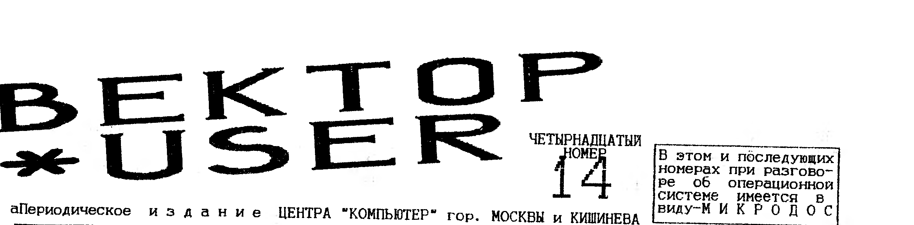
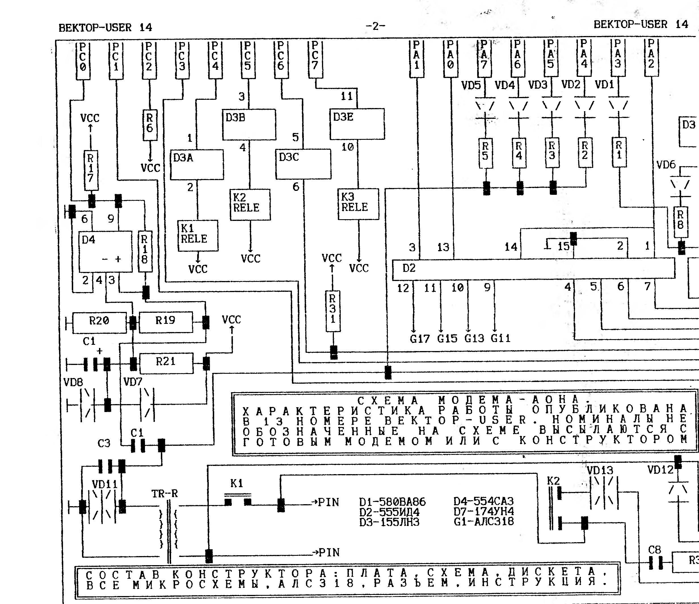
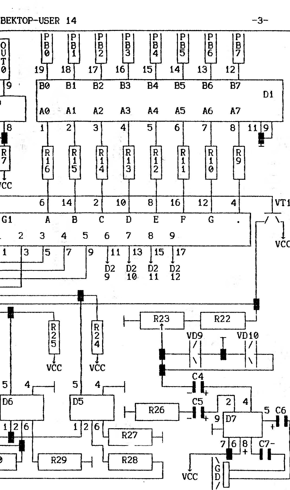

> В этом и последующих номерах при разговоре об операционной системе имеется в виду - МИКРОДОС.

> Цикл интервью (первое) - О "музыкалках" для Вектора-06Ц - Схема модема-АОН - SERVANT - Еще один модем ADD 1200/V - Адаптер процессора Z-80 - Текущие цены в Москве - Объявления

## Цикл (интервью первое)

Перлин Виталий Анатольевич.
Постоянно проживает в Петербурге, 25 лет, основное занятие - программист.

**1. Почему именно "Вектор", Виталий Анатольевич?**
Именно "Вектор", так как для своего времени это была неплохая ПЭВМ, в смысле соотношения стоимость/доступность.
Однако, хочу заметить, что загон морально устаревшего микропроцессора i8080 на тактовую частоту 3 Мгц. мало что дал в смысле повышения производительности (надо было использовать Z80 на 6-12 Мгц).
Кроме того, желательно было бы иметь ДЕЙСТВИТЕЛЬНО программируемый видеоадаптер (управление разверткой и частотой строк) и расширяемую видео-память.

**2. Как оцениваете перспективы выживания "Вектора" в существующем море персоналок?**
Любая ПЭВМ выживает, когда программное обеспечение для нее пишется профессиональными программистами в коммерческих фирмах, когда есть организованный рынок сбыта, маркетинга и рекламы.
Я думаю, что "Вектор" был изначально обречен вследствие его аппаратных особенностей и скудности П/О, как это не печально для небольшой группы пусть даже и весьма способных программистов одиночек.

**3. Как относитесь к пути который избрал "COMAN" ("Вектор" без электронного диска)?**
Отношение к этому пути индифферентное, так как у меня нет информации по этой разработке.

**4. Что можно ожидать в ближайшее время для "Вектора" конкретно от Вас?**
В настоящее момент дописал разделяемую библиотеку PPCLIB-Professional, которая, года 2 назад, пожалуй смогла бы успешно конкурировать с ДРАЙВЕРАМИ УСТРОЙСТВ.
В данный момент в Петербурге разработан следующий вариант Микродос с BOLD BIOS, которая поддерживает 4 цвета за счет аппаратной переделки "Вектора".
Была мысль разработать графически-ориентированную оболочку типа Microsoft Windows, но не знаю, хватит ли времени, а главное - желания.

**5. Есть ли у Вас любимая "игрушка" и чем она так хороша?**
Любимая игра - "АМБАЛ".
По моему действительно одна из профессионально написанных игр.
Пластика героя проработана неплохо.

**6. Каким программам отдаете предпочтение?**
В связи со скудностью программного обеспечения для "Вектора", предпочтение отдаю тем программам, которые пишу сам, так как хотя бы понимаю как с ними работать.

**7. Ваши предположения, почему "Вектор" собрали на РУ-6, а не на РУ-5 или РУ-7?**
"Вектор" собран на РУ-6 видимо из-за попытки сделать его более дешевым и дефицита на РУ-5 и, тем более на РУ-7 в конце 80-х годов.

**8. С чего Вы начинали, первая программа, чем запомнилась, легко ли далась?**
Первая программа, написанная мной - COBRA MISSION для РК-86.
Далась достаточно легко, и была написана за 2 месяца.
Интересно, что эта программа до сих пор бродит на РК-шках.

**9. Что пожелаете пользователям "Вектора"?**
Переходите на BOLD BIOS!
Это действительно СРМ-совместимый вариант МикроДос с ускоренным выводом символов.
Если вам еще не надоел "Вектор" своей, скажем мягко, неспешностью.

## О "музыкалках" для Вектора-06Ц

На сегодняшний день известны две разработки подключения АУ-3-8910 к ПК Вектор-6ц.
Это разработка Виктора Саттарова из г. Кирова (SOUND TRACKER) и разработка Руслана Костиневича из Белоруссии (R-SOUND).
Сравнительный анализ разработок дан в таблице.
Более подробное описание их дано в "БАЙТ"-ах, там же говорится о программировании этих "музыкалок".

| Параметры сравнения | Sound Track | R-Sound |
| --- | --- | --- |
| 0. Основная м/сх. | АУ-3-8910 | АУ-3-8910 |
| 1. Аналог | нет данных | YM2149F |
| 2. Внешний вид | отлаженная со всеми м/с плата, корпус отсутствует | на плате нет АУ-3-8910, корпус отсутствует |
| 3. Наличие разъемов | имеются | имеются |
| 4. Готовность работы | сразу | нет АУ-3-8910 |
| 5. Доработка Вектора | не нужна | нужна |
| 6. Подключение | разъем ВУ | разъем ПУ |
| 7. Аппаратные конфл. | отсутствуют | отсутствуют |
| 8. Поставка докумен. | отсутствует | осуществл. |
| 9. Совмещение звукового вых. с ВИ-53 | присутствует | присутствует |
| A. Тактовая частота | 1,7734 Мгц | 1,5 Мгц |
| B. Совместимость с музыкой написанной на "ПЕНТАГОНЕ" | полностью | не полностью |
| C. Наличие П/О - май94 (дальнейшая разработка П/О ведется по обеим "музыкалкам") | есть: 5 демонстрашек, редактор почти готов, тест, музыка с "ПЕНТАГОНА-128" | есть: тест |
| D. Автор разработки проживает | в России | в Белоруссии |

Пункты 3,4,5 и 7 определяют "сервисность" разработок.
Здесь SOUND TRACKER впереди: вставил после покупки в ВУ и сиди слушай.
Пунктом 8 Р. Костиневич разрешает всем тиражировать разработку.
Пункты А, В говорят, что на "SOUND..." музыка с "ПЕНТАГОНА" идет один к одному.
Пункт C показывает наличие П/О на сегодняшний день.
Окончательный выбор сделает пользователь.
Главное, "что именно приобретать", а не "зачем это нужно".
Уважаемые пользователи, выбирайте.

> ПО АДРЕСУ: 117335 МОСКВА А/Я 101 ФИРОНОВ В.П. (095) 128-73-18 МОЖНО ПРИОБРЕСТИ:
>
> 1. Контроллер дисковода и RAM-диск на 256 кб. Обе платы заново разведены (9х15 и 12х15). Предлагаем готовые изделия и чистые платы.
> 2. Модем/АОН с дискетой П/О. Готовое изделие или конструктор для самостоятельн. сборки.
> 3. Обширное программное обеспечение (текстовые редакторы; языки программирования: Фортран, Паскаль, Си, Бейсик; базы данных; игры и др.)
> 4. При получении марок на 300 рублей и оплаченного конверта высылаю каталог.
> 5. Принимаем любые материалы связанные с ПК Вектор-06Ц для публикации в этой газете.
> 6. Принимаем рекламу от авторов аппаратного и программного обеспечения для Вектор-06Ц.
> 7. Принимаем на реализацию пакеты игровых программ хорошего уровня исполнения.

## Схема модема-АОН

Схема продолжает публикацию модема-АОН, начатую характеристикой работы в №13 "Вектор-USER".
Номиналы, не обозначенные на схеме, высылаются с готовым модемом или с конструктором.



Состав конструктора: плата, схема, дискета.
Все микросхемы, АЛС318, разъем, инструкция.

Микросхемы: D1-580ВА86, D2-555ИД4, D3-155ЛН3, D4-554СА3, D7-174УН4, G1-АЛС318.

### Pioneer soft представляет новую сервисную оболочку для ПК "Вектор-06ц": SERVANT

DISK - выбор диска.
QUICK FORMAT - быстрый (обычный) формат.
SLOW FORMAT - медленный формат.
При встрече плохого сектора форматирование происходит дополнительное количество раз.
SYSGEN - после установки курсора на нужном файле и нажатия "ВК", SERVANT запишет этот файл на системные дорожки диска.
DISK TABEL - этот режим на Векторе впервые.
Он позволяет помечать диски своими именами, просматривать метки, устанавливать вектор защиты метки диска.
TEST - проверка диска.
В этом режиме производится тестирование диска, подсчет плохих секторов, дается перечень "затертых" программ, предлагается "лечение".
Сектора не поддающиеся "лечению" заносятся в образующийся BAD-файл и далее ДОС к ним не обращается.
Результаты работы всех подпрограмм SERVANT выдает не только в численном, но и в видовом режиме по ходу выполнения программы.
Дискета + SERVANT + пересылка по России стоят 2.5 $.
Эквивалент шлите Фиронову В.П.
Рассылка после получения 40 переводов.

Меню программы:

```
Disk
Quick format
Slow format
Sysgen
Disk tabel
Test
Help
Reset sustem
Exit to  ASC
Exit to  DOS

The SERVICE UTILITES for
VECTOR 06c
use only from tommynocker

SERVANT   VERSION 1.0
NEDOSEK D. & PAVLENKO A.
Pineer soft   Copyright 1994
```

Принимаем на реализацию пакеты игровых программ хорошего уровня исполнения.

## Схема модема-АОН (продолжение)

Продолжение схемы модема-АОН с предыдущей страницы: дешифратор D1 с адресными входами PB0-PB7, резисторная матрица R9-R16, знакогенератор G1 (АЛС318, сегменты A-G), формирователи D5-D7, цепи R22-R29, VD9-VD10, конденсаторы C4-C7.



### Как пользоваться "vector-simulator"-ом

1. Создать на жетком диске IBM новый каталог: C:\VECTOR
2. Скопировать программу iocpm.exe с дискеты (формата IBM) в этот каталог VECTOR
3. Все остальные команды и операции выполняются из состояния, когда вы находитесь на IBM в каталоге VECTOR включающий в себя iocpm.exe; т.е. C:\VECTOR\iocpm...

А) Вставить в дисковод IBM дискету "Вектор"-формата.
Команда `iocpm a:/d` выводит на экран каталог файлов.
Команда `iocpm a:filenn.ext c:\VECTOR` скопирует файл filenn.ext c "Вектор"-дискеты на IBM в каталог VECTOR.
Команда `iocpm a:*.* c:\VECTOR` скопирует все файлы с "Вектор"-дискеты на IBM в каталог VECTOR.

Б) Записать файлы, необходимые для копирования на "Вектор", в директорию VECTOR на IBM.
Команда `iocpm c:\VECTOR\filenn.ext a:` скопирует файл filenn.ext c диска c:каталога VECTOR на диск Вектор-формата.
Команда `iocpm c:\VECTOR\*.* a:` скопирует все файлы каталога VECTOR на диск Вектор-формата.

(С. Рыбкин г. Балашиха)

## Еще один модем

Асинхронный полудупл. модем ADD 1200/V предназначен для передачи двоичной информации со скоростью 1200 бод по коммутируемым телефонным линиям связи.
Модем обеспечивает прием и передачу данных по линиям как городских так и междугородней сети, подключение и отключение от линии абонента.

**Технические характеристики:**

| Параметр | Значение |
| --- | --- |
| метод передачи | асинхронный |
| метод модуляции | частотный |
| диапазон уровней передачи | -6±3дб |
| диапазон уровней приема | -35дб |
| скорость модуляции | 1200бод |
| частота передачи 1 | ±2100гц |
| частота передачи 0 | ±2100гц |
| частота ответного тона | 2100гц |
| ном. выходное сопротивл. | 600ом |

Плата 45 на 65 мм. подключается к разъему ПУ ПК Вектор.
Модем обеспечивает полную гальваническую развязку Вектора от телефонной линии и позволяет пользоваться телефонным аппаратом.
Отключение тел. аппарата от линии происходит только автоматически во время работы.

**Программная поддержка модема ADD120/V:**
Модем может работать при минимальной (магнитофон) и максимальной (НГМД и RAM диск) конфигурации системы.
При минимальной конфигурации рекомендуется прогр. ADD120V, которая может:
- принимать и передавать файлы по выделенному телефонному каналу;
- записыв. принятые файлы на магнитофон;
- читать файлы с магнитоф. для передачи.

При максимальной конфигурации системы рекомендуется использование программы-оболочки модема MDM1200V.
Обе программы совместимы по протоколам передачи данных.
MDM120V допускает обмен с IBM совместимыми компьютерами оснащенными модемами ADD MD1200.
Для доступа на узел ADD HOST реализованн. на базе IBM совместимого компьютера с модемом MD1200V рекомендуется терминал. прогр. TP1200V.

Выход на узел ADD HOST дает пользователю Вектора следующие возможности:
- просмотр списка файлов в директории FILES узла связи ADD HOST;
- прием любого из этих файлов на экран дисплея в режиме скроллинга;
- прием любого из этих файлов на текущий диск Вектора (режим download);
- передача любого файла с текущего диска Вектора в директор. FILES ADD HOST.

То есть реализуется режим BBS-станции.
Поскольку TP1200V реализует усеченный вариант ANSI терминала, при ее разработке потребовались специфические данные драйвера вывода на дисплей, реализованного в BIOS Микро-ДОС.
Для нормальной работы программы предпочтительней использовать Микро-ДОС с BIOS 5,1 (Copyright Е. Филиппов 1993г).
Разработчиком П/О для модема ADD120V является Филиппов Е.В.
Все права на программу TP1200V и документацию по модему принадлежат компании ADD S.R.L.: (0422)55-57-18.
Почтовый адрес: 277032 Республика Молдова г. Кишинев ул. Сармизеджетуса 13.

Модем ADD1200/V можно приобрести в Кишиневском ЦЕНТРЕ "КОМПЬЮТЕР" (0422)24-22-18.
Несколько дороже в Москве: 117335 Москва а/я 101 Фиронов В.П. (TP1200V работает при макс. конфигурац.)

## Адаптер процессора Z-80 для Вектора 06ц

Это устройство позволит значительно расширить возможности ПК Вектор-06ц.
По сути дела, после подключения адаптера Вектор сочетает возможности нескольких компьютеров.
Кроме непосредственно векторовских программ можно запускать синклеровские и микродосовские программы с "ЯМАХИ".
АДАПТЕР - ЭТО СТАРЫЕ ВОЗМОЖНОСТИ ПЛЮС:

1) Возможность исполнения команд процессора Z-80, который мощнее 580-го, и располагает более обширной системой команд, что позволяет эффективней использовать возможности Вектора.
Для исполнения ряда старых команд потребуется меньшее время, что только этим увеличит быстродействие на 15%.
2) Новые режимы работы с RAM-диском.
В специальном режиме возможен обмен с квазидиском не через стековые операции, а через операции MOV R,M; MOV M,R.
Есть возможность работы программы на квазидиске без использования памяти Вектора.
3) Возможность включения экрана с SINKLER-а.
Режим синклеровского экрана позволяет без переработки запускать практически все синклеровские программы.
4) Новая система прерываний включая немаскируемое позволит эффективней использовать перефирию Вектора.
5) Адаптер не использует питания +12 и -5 вольт.
Ваш Вектор будет работать только от +5 вольт.
6) Более благоприятный режим работы микросхем памяти Вектора, и электронного диска.

Новое устройство предназначено широкому классу пользователей.
Системных программистов заинтересует больший выбор системных программ, возможность использования новых команд Z-80, новые режимы работы квазидиска.
Электронщики получат возможность моделировать на Векторе работу программ устройств работающих на Z-80.
Любителей "игрушек" ждут тысячи новых игровых программ.

**Программное обеспечение:**
Работает подавляющее большинство векторовских программ.
Работа по созданию П/О использующего новые возможности, начата недавно.
В настоящий момент создана программа LOGAME, позволяющая запускать без переработки до 90% синклеровских программ.
Исключение - это программы со специальн. загрузчиками.
После изменения номеров портов "идут" все программы.
Пока LOGAME работает только с квазидиском и в черно-белом варианте.
После считывания с кассеты формируется ДОСовский файл, записав который можно уже без магнитофона запускать игру или иную программу.
В ближайшее время будет адаптирован TRDOS, что позволит непосредственно работать с синклеровскими дискетами.
В перспективе - LOGAME для работы без RAM-диска, доработка существующего ДОСа (дополнение функциями 26Н и 27Н) позволит запускать ямаховские микродосовские файлы, а это: упаковщики и распаковщики файлов, новый ассемблер, компилятор С и многое другое.
Автор приглашает к сотрудничеству программистов.
Специальные режимы работы устройства позволяют избежать значительн. сложностей адаптации программ.
В случае сотруднич. автор предоставит текст программы ZAGSIN, написанный на ассемблере, и подробное описание специальных режимов устройства.

**Подключение:**
адаптер представляет собой плату 11 на 9 сантиметров, 26 корпусов.
Вместо 580 ВМ80А впаивается панелька на 40 ног.
Никаких доработок в схеме Вектора не требуется.
Специальный разъем от адаптера надевается на панельку.
Устройство располагается вне корпуса Вектора.
В случае необходимости можно в панель вставить старый процессор.
Энергопитание устройства от "родного" блока питания.
Изделие можно приобрести в Кишиневе в ЦЕНТРЕ "КОМПЬЮТЕР" (0422)24-22-18.
Несколько дороже в Москве: 117335 МОСКВА А/Я 101 ФИРОНОВ В.П.

> "..... КОЛОБКА" (См. ВЕКТОР-USER 13) Эта многоуровневая объемная игра занимает на дискете 720кб.
> Выполнена в среде 512 х 256 точек, 64 (шестьдесят четыре) цвета одновременно.
> Минимальные аппаратные переделки RAM-диска.
> Но пришло пока только чуть менее пятидесяти заказов.

> По адресу: 610031 г. Киров-31 а/я 2629 Луппову Г.Б. пользователи ПК Вектор могут приобрести разнообразное аппаратное и программное обеспечение в том числе и музыкальный сопроцессор SOUND TRECKER подключаемый к 90-то контакт. разъему.
> Там же можно приобрести информационный выпуск "вектористов" г. Кирова - "БАЙТ".
> Вышло уже 23 номера, и хотя в них почти нет аппаратных штучек для Вектора, но по части программных в "БАЙТЕ" есть что почитать.
> Пишите, не пожалеете.

### Текущие цены в Москве (01.07.94.)

| № | Товар | Цена, $ |
| --- | --- | --- |
| 0 | Контроллер дисковода + RAM-диск | 32,0 |
| 1 | Шлейф для дисковода | 4,0 |
| 2 | Голые платы (комплект пункта 1) | 10,0 |
| 3 | Унив. загрузчик (прошитая 2716) | 2,0 |
| 4 | Модем/АОН с дискетой П/О, готовое изделие с поддержкой | 18,0 |
| 5 | Модем/АОН конструктор (см. схему) | 10,0 |
| 6 | Дискета (96tpi) для записи | 0,9 |
| 7 | Кассета (МК-60) для записи | 0,6 |
| 8 | Герконовая клавиатура | 21,0 |
| 9 | Адаптер Z-80 (принимаю заказы) | ?,? |
| A | Программатор (заводской) | 19,0 |

Все цены даны в долларах США без почтовых расходов.

### Программы для МикроДОС

**SSTV.COM** Предназначена для коротковолновиков, желающих освоить новый вид цифровой связи.
Передает и принимает изображение по каналам радиосвязи.

Возможности программы медленного TV:
- 8 градаций яркости;
- время полной развертки 6, 8, 32 сек;
- редактирование графики;
- запись принятых картинок на диск;
- однов. подготовка текста с передачей;
- возможность использования картинок подготовленных в "КАРАНДАШЕ".

Кому интересно, прошу звонить: (0422)55-37-55 Бергич Станислав Федорович.

> Уважаемые пользователи ПК Вектор, как видите мы делаем то, что обещали.
> Опубликовали схему модема/аона, за что благодарим С. Бергича из Кишинева, начали цикл интервью (в 15 номере на вопросы отвечает Евгений Филиппов).
> В ближайших номерах много всяких аппаратных примочек для Вектора.
> В связи с подорожанием почтовых услуг выпуски VECTOR-USER с 13 по 18 стоят 2.5 $.
> Успевших подписаться до 01.07.94. это не касается.

Макет номера подготовлен В.П. Фироновым.

Редактор В.П. Фиронов
