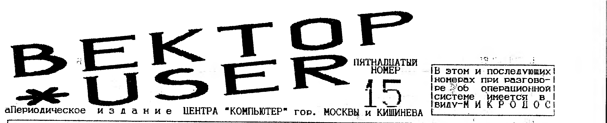
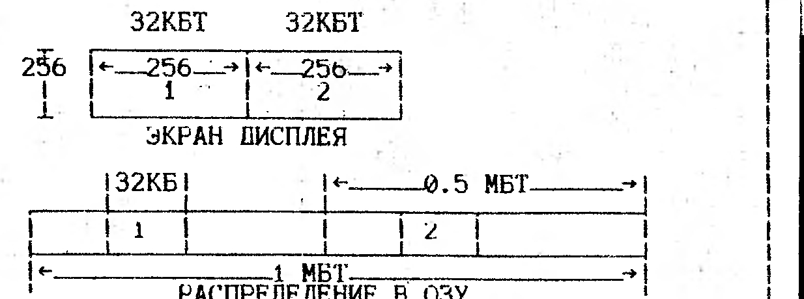
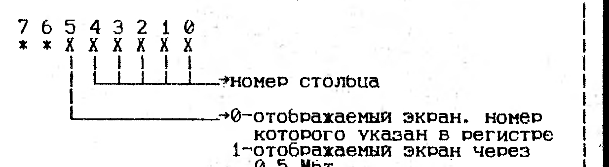

> В этом и последующих номерах при разговоре об операционной системе имеется в виду - МИКРОДОС.

## Цикл (интервью второе)

Луппов Григорий Борисович.
Постоянно проживает в Кирове, 25 лет, по профессии программист.

**1. Григорий Борисович, четыре вопроса я задаю всем программистам, так что не обессудьте.
Итак, почему именно Вектор стал Вашим домашним ПК?**
Вектор - это первый дешевый компьютер, появившийся в свободной продаже в Кирове.
Волею судьбы он и стал моим домашним ПК.

**2. Что можно ожидать для Вектора от Вас?**
Новую EGA-графику с IBM + музыкальное сопровождение для музыкального процессора со Спектрума.
Компилятор + декомпилятор музыкальных STM-файлов.
Утилиту для ускоренного поиска и снятия файлов STM с синклеровских дискет.

**3. Ваше отношение к пути избранному "COMAN"ом?**
Я не одобряю идеологию "COMAN"-а в отношении расширения для Вектора.
Быть может на меня оказывает определенное воздействие то, что я сам пользуюсь RAM-диском и МикроДос, но я бы не смог отказаться от квазидиска и перейти только на контроллер - это ущербная работа.
С электронным диском пользователь получает дополнительный диск с быстрым доступом, свободный от сбоев и ошибок записи, резко снижающий нагрузку на дисковод и продлевающий ему жизнь по крайней мере вдвое.
Кроме того возможно появление программ широко использующих дополнительные 256 Кбт ОЗУ.
Зачем "COMAN" городил огород с другими портами для своего контроллера и смесью логического строения диска в формате МикроДос и физического строения в формате Синклера?
"COMAN" проигнорировал наработки ЦЕНТРА "КОМПЬЮТЕР" и сделал дешевый контроллер с простой операционной системой, ориентированной на применение Вектора только для запуска "игрушек".
Для программистов "COMAN"-ская архитектура не подходит, а значит программное обеспечение будет разрабатываться для кишиневского контроллера.

**4. Ваши соображения о выживании Вектора?**
Сначала несколько слов о плюсах и минусах.
Минусы: медленный процессор; программное обеспечение хотя и не маленькое, но профессиональных качественных программ немного.
Плюсы: практически полноценная 16-ти цветная EGA-графика (возможность переноса IBM-овской графики на Вектор); наличие RAM-диска на 256 Кбт стандартно с возможностью нарастить до 1 Мгб; трехканальный таймер - это музыка на три голоса + шумовой канал; муз. платы "SOUND TRACKER" и "E-SOUND2" (использование на Векторе музыки уже наработанной на Спектруме); возможность замены медленного КР580ВМ80 на более быстрый и производительный Z80 (перенос на Вектор спектрумовских программ + досовские программы с Ямахи).
Но Вектор не выживет, если им не заниматься.
Главная проблема - автор не может или может, но с большим трудом, получить вознаграждение за свой труд.
Эту проблему надо решать.

**5. На какой вопрос Вы бы хотели ответить?**
Задавайте, отвечу.
Сам набиваться не люблю.

**6. Ваше отношение к созданию, скажем так, центра "вектористов" и возможно ли это?**
Если это означает бесплатный доступ к программному обеспечению то я против.

**7. Все пользователи Вектора утверждают, что получили вирус из Кирова.
Ваше отношение к этому утверждению и к вирусам?**
Не знаю насчет всех пользователей, мои клиенты никогда ни о чем подобном мне не сообщали.
Могу твердо заверить, что П/О центра "БАЙТ" чистое.
По Кирову был момент, когда прошла вирусная атака (это уже потом выяснилось), но вспышка быстро угасла и сейчас все тихо.
Отношение к вирусам крайне отрицательное.
Я бы не хотел оказаться жертвой какого-нибудь хитрого вируса.

**8. Самые популярные программы, как известно - это игры, почему Ваших игр так мало?**
Моих игр мало по 3-м причинам: мало времени; небольшая коммерческая выгода, работы много, а доходов.....; прошел период энтузиазма, чтобы делать бесплатные программы.

**9. Что скажете пользователям Вектора?**
Хочу сказать всем любителям Вектора, что они сделали правильный выбор при покупке ПК, и я постараюсь этот выбор оправдать.

## Взаимодействие "Вектора" с дисководом

Не существует единого способа подключения контроллера дисковода.
Автору известны четыре варианта интерфейса контроллера (дальше - КД).
Большинство изготовителей придерживается Кишиневского стандарта, рекомендованного разработчиками ПК.
Незначительно отличается от него вариант Sphere+, распространяемый одноименной фирмой (возможно создание универсальных программ).
КД, выпускаемый московской фирмой "COMAN", отличается от обоих вышеуказанных вариантов.
Существует еще вариант Омского центра программирования, способный работать также и на ПК "Криста-2" и совместимый снизу вверх с Кишиневским.
Все эти КД построены на основе БИС 1818ВГ93, которая представляет собой однокристальное программируемое устройство, предназначенное для управления обменом информацией между ЭВМ и накопителем на гибких магнитных дисках (далее НГМД).
БИС обеспечивает программирование номера дорожки, сектора и стороны диска, а также длины сектора, режимов поиска дорожки и установки магнитной головки в исходное состояние, режимов записи/чтения, скорости перемещения МГ.
Обмен информацией с ЭВМ происходит по 8-ми разрядной двунаправленной шине данных.
Запись осуществляется с одинарной (FM) или двойной (MFM) плотностью.
БИС не содержит схем выбора накопителя и управления двигателем.
Этим должно заниматься специальное устройство управления.

Шашков В.А. г.Омск

(Продолжение в следующем номере)

### Текущие цены остались на уровне 14-го номера

> ПО АДРЕСУ: 117335 МОСКВА А/Я 101 ФИРОНОВ В.П. (095)128-73-18 МОЖНО ПРИОБРЕСТИ:
>
> 1. Контроллер дисковода и RAM-диск на 256 Кб.
>    Обе платы заново разведены (9х15 и 12х15).
>    Предлагаем готовые изделия и чистые платы.
> 2. Модем/АОН с дискетой П/О.
>    Готовое изделие или конструктор для самостоятельн. сборки.
> 3. Обширное программное обеспечение.
>    Цены на которое высылаются вместе с каталогом после получения марок на 400 рублей и конверта-оплаченного, чистого (без адреса).
> 4. Принимаем любые материалы по ПК Вектор-06ц.
> 5. Предоставляем скидки: для распространителей номеров 13-18 (от 50-ти штук 0.15 $ номер), на перефирию (от 5 штук 10%, от 10 штук 15%).
> 7. Принимаем рекламу от авторов аппаратного и программного обеспечения к ПК Вектор-06ц.
> 8. Перефирию оптом только после телеф. звонка.

Нумерация пунктов объявления (5, затем сразу 7) приведена как в оригинале.

## Схема контроллера дисковода

Это не новый контроллер дисковода, это облегченная версия Кишиневской схемы (ИВ-4).
Перед опубликованием испытывалась два месяца на 5323.01 (двигатель TAIWAN) и ROBOTRON'е.
На "выборных" перемычках дисководов должен стоять резистор 330 ом, а не 150.

## 1. Работа системной шины

Толчком к написанию этой статьи послужили работы Омского центра программирования по установке в "Вектор" подобные машины процессора Zilog Z80.
Естественно, при этом хотелось повысить быстродействие компьютера засчет того, что Z80 может работать на тактовой частоте вплоть до 12 Мгц.
Для этого необходимо было понять, как в "Векторе" решена проблема взаимодействия процессора и видеоадаптера при обращении к ОЗУ.
Для обеспечения взаимодействия ОЗУ, ПЗУ, микропроцессора и видеоадаптера служит системная шина.
В первом приближении это - комплекс проводов, передающих различные сигналы, и устройство управления.
Именно оно определяет эффективность использования ресурсов машины.
Работа системной шины в "Векторе" организована по циклам.
Различают два вида цикла шины: цикл с обращением процессора и цикл без обращения процессора.
Каждый цикл разбивается на 4 такта, а такт, в свою очередь, на 4 четверти.
Длительность одного такта составляет 1 период тактовой частоты процессора (3 Мгц на "Векторе").
Рассмотрим работу системной шины по тактам.
1-ый такт любого цикла шины - такт обращения видеоадаптера.
Устройство управлен. вырабатывает сигнал переключения шины так, что на адресные входы ОЗУ приходит адрес, сформированный видеоадаптером.
В конце такта информация, считанная с ОЗУ, заносится в регистры сдвига и затем точка за точкой выводится на экран в течение всего цикла шины.
Второй такт цикла шины служит для приведения ее в исходное состояние для обращения процессора.
В конце такта процессор, в случае обращения к ОЗУ, выдает сигнал MREQ.
В ответ на это устройство управления формирует сигнал ПЕР, который выбирает тип остальных тактов цикла как тактов с обращением процессора.
Если же сигнал MREQ не был выставлен, то шина отрабатывает цикл без обращения процессора.
Во время 3-го и 4-го цикла без обращения процессора шина отрабатывает холостые такты, никакие операции не производятся.
Во время 3-го такта цикла с обращением процессора (это соответствует второму такту микропроцессора) на микросхемы ОЗУ выдается адрес, сформированный процессором.
На первой четверти 4-го такта происходит передача данных между процессором и ОЗУ.
Затем шина подготавливается к выдаче байта видеоадаптеру.
Все происходит нормально, если начало цикла памяти процессором совпадает по времени с тактом 2-го цикла шины.
В прочих случаях устройство управления выставляет процессору сигнал READY=0, в ответ на что процессор, начиная со следующего такта своего цикла, переходит в состояние ожидания, в котором и будет находиться до тех пор, пока шина не начнет выполнять третий такт.
Следовательно, если процессор выставил запрос на обращение к ОЗУ, например, в 3-м такте цикла шины, то он будет находиться в состоянии ожидания в течение 4-го, 1-го и 2-го тактов цикла шины.
При выполнении процессором последовательности 4-тактных команд, т.е. команд, цикл которых состоит из 4-х тактов, например, NOP, ADD R, CMA, XCHG, все циклы процессора оказываются согласованными с циклами шины и дополнительные такты ожидания не появляются.
В остальных случаях работа шины приводит к тому, что на выполнение любого машинного цикла требуется кратное 4-м число тактов.
Например команда MOV R1,R, чей цикл занимает 5 тактов, в действительности требует их 8.
Установка МП Zilog Z80, все циклы которого не длиннее 4-х тактов, приведет к тому, что одна из наиболее употребляемых команд - MOV, будет работать вдвое быстрее, что повысит общее быстродействие ПК на 20%.

## 2. Таблица команд МП INTEL 8080 (КР580ВМ80)

1-я колонка - время выполнения в тактах i8080
2-я колонка - время выполнения на "Вектор"-подобных ПК

| Команда | i8080 | Вектор | Команда | i8080 | Вектор | Команда | i8080 | Вектор |
| --- | --- | --- | --- | --- | --- | --- | --- | --- |
| MOV R1,R | 5 | 8 | MOV R,M | 7 | 8 | MVI R,D8 | 7 | 8 |
| MVI M,D8 | 10 | 12 | STAX RP | 7 | 8 | LDAX RP | 7 | 8 |
| STA ADR | 13 | 16 | LDA ADR | 13 | 16 | | | |
| LXI RP,D16 | 10 | 12 | SHLD ADR | 16 | 20 | LHLD ADR | 16 | 20 |
| PUSH RP | 11 | 16 | POP RP | 10 | 12 | SPHL | 5 | 8 |
| XCHG | 4 | 4 | XTHL | 18 | 24 | | | |
| CMC | 4 | 4 | STC | 4 | 4 | CMA | 4 | 4 |
| DAA | 4 | 4 | INR R | 5 | 8 | INR M | 10 | 12 |
| DCR R | 5 | 8 | DCR M | 10 | 12 | INX RP | 5 | 8 |
| DCX RP | 5 | 8 | | | | | | |
| ADD R | 4 | 4 | ADD M | 7 | 8 | SUB R | 4 | 4 |
| SUB M | 7 | 8 | ADC R | 4 | 4 | ADC M | 7 | 8 |
| SBB R | 4 | 4 | SBB M | 7 | 8 | ANA R | 4 | 4 |
| ANA M | 7 | 8 | ORA R | 4 | 4 | ORA M | 7 | 8 |
| XRA R | 4 | 4 | XRA M | 7 | 8 | ADI D8 | 7 | 8 |
| ACI D8 | 7 | 8 | SUI D8 | 7 | 8 | SBI D8 | 7 | 8 |
| ANI D8 | 7 | 8 | ORI D8 | 7 | 8 | XRI D8 | 7 | 8 |
| CMP R | 4 | 4 | CMP M | 7 | 8 | CPI D8 | 7 | 8 |
| DAD RP | 10 | 12 | | | | | | |
| RRC | 4 | 4 | RLC | 4 | 4 | RAL | 4 | 4 |
| RAR | 4 | 4 | | | | | | |
| EI | 4 | 4 | DI | 4 | 4 | NOP | 4 | 4 |
| HLT | 7 | 8 | | | | | | |
| IN | 10 | 12 | OUT | 10 | 12 | | | |
| PCHL | 5 | 8 | JMP ADR | 10 | 12 | J* ADR | 10 | 12 |
| CALL ADR | 5 | 8 | C* ADR /Y | 17 | 24 | C* ADR /N | 11 | 16 |
| RST N | 11 | 16 | RET | 10 | 12 | R* /Y | 11 | 16 |
| R* /N | 5 | 8 | | | | | | |

## 3. Команды Z80, имеющие другое время выполнения

| Команда Z80 | i8080 | Вектор | | Команда Z80 | i8080 | Вектор |
| --- | --- | --- | --- | --- | --- | --- |
| ADD HL,RP | DAD RP | 11 | 12 | CALL *,ADR | C* ADR /N | 10 | 12 |
| DEC RP | DCX RP | 6 | 8 | INC | INR R | 4 | 4 |
| EX (SP),HL | XTHL | 19 | 24 | INC (HL) | INR M | 11 | 16 |
| DEC (HL) | DCR M | 11 | 16 | INC RP | INX RP | 6 | 8 |
| DEC R | DCR R | 4 | 4 | JP (HL) | PCHL | 4 | 4 |
| LD R1,R | MOV R1,R | 4 | 4 | LD SP,HL | SPHL | 6 | 8 |
| OUT .A | OUT | 11 | 12 | IN A, | IN | 11 | 12 |

Примечание.
Знаки /Y и /N обозначают выполнение команды в случае соответственно истинности и ложности условия.

Шашков В.А. г.Омск

## Программы для Микродос

**CATALOG.COM** Может читать директории и создать каталог, а также загрузить файл-каталог с диска для обработки.
Позволяет: дополнить готовый каталог; сортировать его заново; записать на диск файл-каталог с указанным именем; просмотреть каталог на экране; удалить имена; распечатать каталог на принтере; искать в каталоге имя по шаблону и по теме; размещать имена по разделам; переводить каталог в текст. формат и мн. другое.

## Вектор-Турбо Плюс

НПП "Интек" в настоящее время производит модернизацию ПК "Вектор-06ц" с целью значительного увеличения его ресурсов и возможностей, причем все предыдущее программное обеспечение будет работать без изменений (на 20% быстрее).

**Основные характеристики:**

| Параметр | Значение |
| --- | --- |
| Базовый процессор | Z80 |
| Разрядность | 8 разрядов |
| Тактовая частота | 3/6/12 Мгц |
| Быстродействие | 800/1500 тыс.оп/сек |
| ОЗУ: динамическое | от 1 Мбт/2 Мбт |
| ОЗУ: статическое | от 32 Кбт/256 Кбт |
| ПЗУ (н.загр. и ОС) | 32 Кбт |
| Графический экран | 256/512/512/1024 на 256 |
| Количество одновременно отображаемых цветов соответственно | 16/16/4/4 из 256 |
| ОЗУ экрана соотв. | 32/64/32/64 Кбайта |
| Звук. синтезатор | AY8912(10) стерео |
| Программируемый таймер | КР580ВИ53, 3 канала |
| Параллельный порт | КР580ВВ55, 3/8 линий |
| Системные часы (энергонезавис.) | будильник/час/мин/сек, день/год/мес/день нед. |
| Внешнее запомин. устройство: НГМД | 800 Кбт/диск |
| Внешнее запомин. устройство: магнитофон | 512 Кбт/60 мин. |
| Клавиатура | IBM AT 101 кл. |
| Систем. прерываний: маскируемое | 8 уровней, приоритетное, с возможностью независимого маскирования |
| Систем. прерываний: немаскируемое | программное и аппаратное (кнопка) |

Базой для разработки структуры машины была схема "Вектор-06ц".
Модернизация не вносит принципиальных изменений в архитектуру, а является органичным развитием базовой структуры.

**Организация памяти.**
ПЗУ расширено до 32 Кбт и содержит в себе начальный загрузчик, программу начальной инициализации программируемых БИС, системных регистров, м/схем видеоадаптера и операционную систему.
Начальный загрузчик сохранил все функции старого универсального загрузчика.
Динамическое ОЗУ минимальной емкости 1 Мбт делится на ОЗУ процессора 64 Кбт (которое может быть выбано в любой области ОЗУ с дискретностью 64 Кбт), причем видеоОЗУ может быть выбрано тоже в любой области ОЗУ и не входить в адресное пространство процессора, а оставшаяся область ОЗУ отведена под RAM-диск.
Нововведением является энергонезависимый электронный диск "D" на статических ОЗУ емкостью от 32 Кбт до 256 Кбт для хранения конфигурации ПК и наиболее часто употребляемых программ и данных пользователя, которые каждый записывает по своему усотрению.
Операционная система после запуска считает текущим диск "D", поэтому в некоторых приложениях возможна работа без использования дисководов.
В машине применен горизонтальный скроллинг экрана с дискретностью 1 байт.

**Экран (ну очень круто!).**
Как уже было сказано выше, введена возможность отображения любой области памяти с дискретностью 32 Кбт.
Это производится записью в порт номера отображаемой области (32 экрана 256/256 точек/16 цветов для 1 Мбт памяти).
В "старых" режимах 256/256 точек и 512/256 точек 32 Кбт экрана располагается в одной из областей ОЗУ, задаваемой системным регистром.
Введено два новых режима экрана 512/256 точек/16 цветов и 1024/256 точек/4 цвета:

В новых режимах экран занимает 64 Кб и располагается в двух областях по 32 Кбт, причем адрес первой области задается системным регистром, а адрес второй равен "адрес 1 + 0.5 Мбт".
Режим 512/256 16 цветов получается отображением на левой и правой половинах экрана двух обычных экранов 256/256 16 цветов.
Режим 1024/256 4 цвета получается аналогично с включенным режимом 512, как на стандартном ВЕКТОРе.

**Горизонтальный скроллинг (тоже крутой).**
Осуществляется записью в порт номера первого отображаемого столбца.
Причем в режиме 512/256 16 цветов скроллинг будет как и вертикальный (ролик), а в режиме 256/256 (старый) при включении скроллинга со стороны сдвижки "вылезет" область ОЗУ, отстоящая на 0.5 Мбт.

Структура порта скроллинга:

Исправлена не совсем корректная работа КР155РУ2 на запись, из-за чего приходилось производить запись в них несколько раз подряд.
Теперь достаточно одного OUT 0C.

**Система прерываний.**
Имеем 8 прерываний с программируемым приоритетом, и одно немаскируемое.

НПП "Интек" г.Владимир

## Программы для Микродос

**REPRINT.COM** Редактор знакогенератора EPSON-совместимых 9-ти игольчатых принтеров.
Программа позволяет производить перекодировку принтеров, чем и обеспечивает вывод на принтер символов, которые невозможны в текстовых редакторах.
Работает с диском (чтение и запись), с выходом в ДОС.
Очень удобна.

**POSTER.COM** Предназначена для вывода на принтер небольших, 1-2 строки, текстов (реклама, объявление, и т.д.) символами большого размера в графическом режиме.
Предоставляет пользователю следующие возможности:

- выбор высоты и ширины букв;
- выбор номера графического режима печати;
- инверсия (белые буквы на черном фоне);
- многоразовый проход головки принтера позволяет получить качественное изображение при изношенной ленте.

Управление: клавиатура или мышь.
Возможно самостоятельное изготовление шрифтов.

Из письма: "...в 13-м номере вы давали рекламу на Желнова, а я от него получил вирус на дискете".
Ответ: Извините, сами получили тоже самое, но он это не нарочно, видно у него все файлы на "винте" IBM-ки (они номерные), а следить за ними некогда.

Макет выпуска: В.П. Фиронов.
Редактор В.П. Фиронов.
