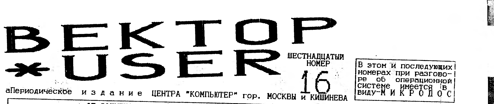

> В этом и последующих номерах при разговоре об операционной системе имеется в виду - МИКРОДОС.

## Об "ашипках"

В связи со спешкой при выпуске 15-го номера исправляем некоторые ошибки: НПП из г.Владимира называется "ИНТЕК"; автор новой версии контроллера - Михаил Евсеев из г.Калининграда Московской области; некоторые алогичности в рекламе Вектора-турбо+ на совести рекламодателя; после команд OUT, IN, IN A, должен стоять значёк # ; 7-ая нога АГЗ:R=51ком.

## Цикл (интервью третье)

Шашков Вячеслав Александрович, постоянно проживает в г.Омске, 20 лет, студент ОмГУ.

**1. Вектор был у Вас первой машиной?**
Начинал я не с него, а с БК-0010, затем "Специалист", "Криста-2", только потом "Вектор", пожалуй, самый мощный на i8080 и довольно привлекательный для своего времени ПК.

**2. И какие, на Ваш взгляд, перспективы у этого ПК на будущее?**
По-моему, 8-разрядная архитектура - это тупиковый путь.
Какое-то время машина продержится.
Но закат ее неизбежен.

**3. Что скажете насчет "Coman"-а?**
Ребята сделали стартер для игрушек и весьма неплохо.
Работать в их системе попросту неудобно.
Кстати, "Coman" все же выпустил блок расширения ОЗУ для своей ОС.
Естественно нестандартный, хотя и неплохой.

**4. Ну а от Вас что можно ожидать?**
Готовится выход своего варианта ОС - "на все случаи".
Почти все переписано в ней заново.
Есть кое-какие "магнитофонные" программы.
Разрабатываю Soft для новой "музыкалки".

**5. Нужен ли Вектору винчестер?**
Я считаю - да.
Но его установка имеет смысл только после перехода на Z80 и MSX-DOS, так как возможности CP/M-Микродос сильно ограничены (объем "винта" не больше 8-ми мб.).

**6. Есть ли желание создать что-то эдакое?**
Плох тот солдат, который не мечтает стать генералом.
Вот только что?
И хватит ли сил?

**7. На Векторе чувствуете себя хозяином?**
Да, конечно, так как вся перефирия, подключенная к нему (КД, ЭД, часы RTC, музпроцессор) собрана мной самим и по собст. схемам.

**8. Как Вы думаете, что препятствует появлению новых программ?**
Думаю, главное препятствие - программист не знает, что сделать, с чего начать.
Да и не всегда знаний хватает.
До всего сразу самому не дойти.
Всей литературы - три справочника.
Для "Спектрума", например - сотни книг.

**9. Ну а аппаратные "штучки" для Вектора в Омске разрабатываются?**
В Омске разработаны часы реального времени на ИМС КР512ВИ1, плата музыкального сопроцессора.
В работе адаптер Z80, расчитанный на широкое повторение, и музыкальная плата SOUND BLASTER для воспроизведения цифровой музыки (работающие на IBM могут получить о ней представление, посмотрев и послушав Scream Tracker хотя бы на Covox).

**10. Что пожелаете любителям Вектора?**
Пользователям - почаще платить за программы.
Тиражаторам - тиражировать программы только с описаниями.
Программистам - почаще и получше документировать свои изделия, снабжать их встроенной подсказкой, выводимой хотя бы по /?

Интервью с Е.В.Филипповым затерялось в электронной почте, разыщем-напечатаем.

## Графический редактор "DRAW"

(До сих пор авторы производят свои программы без описания.
Ниже описывается работа с новым графическим редактором сделанным в Молдове.
Автора просим поправить если что не так).

После запуска редактор переходит в режим основного меню.
При этом в верхней части экрана появляется ряд квадратов с обозначениями режимов.
Перемещение по этому ряду - КЛАВИШИ КУРСОРА.
Выбор режима - ПРОБЕЛ.
Отмена режима - АР2.
Вызвать и убрать меню - ТАБ.

Режимы основного меню (слева направо).

**1. (DISK) - работа с диском.**
При запуске появляется меню в котором:
LOAD - считывание картинки с диска:
SAVE - запись картинки на диск:
LOAD... - считыв. фрагмента, палитры, шрифта;
SAVE... - запись фрагмента, палитры, (шрифта?)
Перемещение по меню - КЛАВИШИ КУРСОРА.
Выбор режима - ПРОБЕЛ или ВК.
При этом:

а) в режиме LOAD появляется сообщение: "File=0/A:*.Spr", где 0 - номер пользователя; A: - имя диска; *.Spr - имя файла;
Все эти параметры можно изменять, подведя курсор в нужное место и введя необходимые данные (как в ASCe).
После чего нажать ВК.
Имя файла можно не указывать (оставить "*.Spr"), тогда будет выведен каталог файлов с расширением "Spr".
Перемещение по каталогу и перелистывание страниц - КЛАВИШИ КУРСОРА.
Выбор - ВК.

б) в режиме SAVE появляется надпись: "File=0/A:Noname.Spr".
Здесь также можно установить номер пользователя и имя диска, а вместо Noname необходимо ввести имя, под которым файл будет записан на диск.
После этого нажать ВК.
Если на диске уже существует файл с этим именем, то появится сообщение: "File exists! (overlay? Y/N)".
Если "Y", то новый файл запишется поверх имеющегося на диске.
Любая другая клавиша отменит запись.

в) в режиме LOAD... появляется меню, где: Part image - считывание с диска фрагмента картинки.
Появляется надпись: "File=0/A:*.Pat".
Здесь, как и в режиме LOAD, устанавливают номер пользователя, имя диска, имя файла.
Если имя файла не введено, будет выведен список всех файлов с расширением Pat.
Перемещение по списку - КЛАВИШИ КУРСОРА.
Выбор - ВК.

(Продолжение на четвертой странице).

### Текущие цены остались на уровне 14 номера

> ПО АДРЕСУ: 117335 МОСКВА А/Я 101 ФИРОНОВ В.П. (095)128-73-18 МОЖНО ПРИОБРЕСТИ:
>
> 1. Контроллер дисковода и RAM-диск на 256 КБ.
>    Обе платы заново разведены (9х15 и 12х15).
>    Предлагаем готовые изделия и чистые платы.
> 2. Модем/АОН с дискетой П/О.
>    Готовое изделие или конструктор для самостоятельн. сборки.
> 3. Обширное программное обеспечение, цены на которое высылаются вместе с каталогом после получения одной тысячи рублей и конверта-оплаченного, чистого (без адреса).
> 4. Принимаем любые материалы по ПК Вектор-06Ц.
> 5. Предоставляем скидки: для распространителей номеров 13-18 (от 50-ти штук 0.15 $ номер); на перефирию (от 5 штук 10%, от 10 штук 15%)
> 7. Принимаем рекламу от авторов аппаратного и программного обеспечения к ПК Вектор-06Ц.
> 8. Перефирию оптом только после телеф. звонка.

Нумерация пунктов объявления (5, затем сразу 7) приведена как в оригинале.

## ЦАП (цифро-аналоговый преобразователь)

Если Вам попалась программа SAMANTHA или подобная ей, и Вы не знаете что с ней делать, соберите любую из предложенных здесь схем и слушайте в свое удовольствие.

На РИС.1: схема собранная на 155ЛА3, резисторы R1=1,1 ком, R2=2,2 ком, что обязательным не считается, лишь бы были в два раза больше (в пределах от 0,5 до 10 ком).
Если не нашли микросхем, соберите схему по РИС.2.
Качество конечно похуже и шипения побольше.
Собрав стандартную схему ЦАП на 572ПА1 Вы чуть-чуть приблизитесь к качеству звука SOUND BLASTERа собранного в Омском ЦЕНТРЕ программирования.
Поэтому неудивительно что они предоставили нам для публикации схему своего музыкального сопроцессора, который является полным аналогом Кировскому (В.Саттаров).
Публиковаться будет в следующем номере.


На РИС.1 выводы 02, 05, 10, 13 можно сделать управляющими, соединив их вместе.
На РИС.2 можно емкостями снизить фон, но полученный результат этого не стоит, лучше соберите схему на 572ПА1.
Конечно, там нужно подавать напряжения которых нет на Векторе, но результат стоит того.

В.П. Фиронов, г.Москва.

## Программирование ПГЗ AY-3-8910 (YM2149F)

(Для пользователей Вектора проживающих в тех регионах где не читают "Байт", перепечатка из №23).

Технические характеристики:

- 3 независимых музыкальных канала (стерео музыка + генератор белого шума);
- 2 (или 1) параллельных порта ввода/вывода;
- 16 градаций амплитуды;
- 16 форм волнового пакета;
- основная частота: 1,7734 Мгц;
- диапазон воспроизводимых частот: 27 Гц - 11 Кгц;
- частоты волнового пакета: 0,1 Гц - 6 Кгц;
- частота генератора шума: 3 Кгц - 110 Кгц;

ПГЗ является регистро-ориентированным генератором звуков.
Его функции выполняются посредством 16 внутренних регистров.
Номер регистра задается 4 младшими разрядами при подаче команды "фиксация адреса" и остается действительным до получения команды о смене этого адреса.
В таблице приведены функции регистров и допустимые значения для них.

| №регист. | Назначение или содержание | Значение |
| --- | --- | --- |
| 0, 2, 4 | нижние 8 бит частоты голосов A, B, C | 0-255 |
| 1, 3, 5 | верхние 4 бита частоты голосов A, B, C | 0-15 |
| 6 | управление частотой генератора шума | 0-31 |
| 8, 9, 10 | управление амплитудой каналов A, B, C | 0-15 |
| 11 | нижние 8 бит управления периодом пакета | 0-255 |
| 12 | верхние 8 бит управления периодом пакета | 0-255 |
| 13 | выбор формы волнового пакета | 0-15 |
| 14, 15 | регистры портов ввода/вывода | 0-255 |

Основным при работе ПГЗ является регистр 7.
Его главное значение - определять, какие каналы должны участвовать в образовании звука и определять направление обмена портов ввода/вывода.
Его структура показана ниже.
Ноль соответствует включению определенной позиции, а еденица - выключению.

| 7 | 6 | 5 | 4 | 3 | 2 | 1 | 0 |
| --- | --- | --- | --- | --- | --- | --- | --- |
| порт B | порт A | шум C | шум B | шум A | тон C | тон B | тон A |
| упр. ввод/выв. | упр. ввод/выв. | выбор канала шума | выбор канала шума | выбор канала шума | выбор канала тона | выбор канала тона | выбор канала тона |

Для портов "1" соответствует режиму вывода инфор.
OUT 15H - задает номер регистра;
OUT 14H - задает значение этого регистра;
Частота генератора = 162500/(16*((256*R1)+R0));
Частота шума = 162500/(16*R6);
Амплитуда: R0,R9,R10: бит 0-3 - эффектив. значение; бит 4 - модуляция (1-активно)
Период волн. пакета P=162500/(256*((256*R12)+R11)
Состояние регистра R13 определяет форму звучания сигнала.
Его значение показаны в таблице.
Бит 3 этого регистра определяет включен эффект или нет (0 соответствует выключению эффекта).

| Уров. звучания | Значение |
| --- | --- |
| 0 | одно снижение, затем выключение |
| 1 | одно нарастание, затем выключение |
| 2 | одно снижение, затем поддержка |
| 3 | одно нарастание, затем поддержка |
| 4 | повторяющееся снижение |
| 5 | повторяющееся нарастание |
| 6 | повторяющееся нарастание-снижение |
| 7 | повторяющееся снижение-нарастание |

Виктор Саттаров, г.Киров.

## Взаимодействие Вектора с дисководом

(Продолжение, начало в номере 15)

БИС содержит, как говорилось, 5 внутренних регистров.
Их назначение следующее:
-Data (запись, чтение) - обмен данных: ЭВМ-БИС;
-Track (запись, чтение) - номер текущей дорож.;
-Sector (запись, чтение) - номер сектора;
-Status (чтение) - результат выполнен. команды;
-Command (запись) - задание команды БИС;
Чтение Status возможно не ранее чем через 30 мс. после записи команды.
Микросхема обеспечивает прием и выполнение 11 команд.
Все команды условно разделены на 4 типа: вспомогательные, записи и чтения информации, поиска и чтения индексного поля и принудительного прерывания.

**1. Вспомогательные команды.**
Команды этого типа выполняются вне зависимости от сигнала готовности накопителя.

Команда RESTORE обеспечивает МГ переход на нулевую дорожку.
Если нулевая дорожка не достигнута после 256 шагов, выполнение прекращается.

Команда SEEK предполагает, что регистр Data содержит номер требуемой дорожки, а Track - текущей.
Перемещение МГ выполняется до тех пор, пока не будет достигнута требуемая дорожка.
По окончании регистр Track содержит новый номер текущей дорожки.

Команда STEP обеспечивает перемещение головки на один шаг.
Направление перемещения совпадает с направлением предыдущего движения головки.

Команды STEPF и STEPB обеспечивают перемещение МГ на 1 шаг соответственно вперед или назад.

Состояние битов регистра Status в процессе и после выполнения этих команд:
R7: 1=накопитель не готов;
R6: 1=дискета защищена от записи;
R5: 1=головка прижата;
R4: 1=ошибка поиска;
R3: 1=ошибка в контр. коде заголовка сектора;
R2: 1=МГ на нулевой дорожке;
R1: 1=индексный импульс;
R0: 1=идет выполнение команды;

**2. Команды чтения и записи данных.**
Перед выполнением этих команд нужно в регистр Track и Sector записать номер требуемой дорожки и сектора соответственн.
Длина сектора задается кодом в индексной области (заголовке):
00 = 128 байт на сектор;
01 = 256 байт на сектор;
02 = 512 байт на сектор;
03 = 1024 байт на сектор;

Команда READSCT выполняется, когда прочитан заголовок сектора с параметрами, совпадающими с запрошенными в Track и Sector.
Если за 10 оборотов диска запрошенный сектор не найден, вырабатывается признак СЕКТОР НЕ НАЙДЕН и прекращается выполнение команды.
Если сектор найден, он байт за байтом считывается и передается в регистр Data.
Если это не произойдет, то в Data записывается следующий байт и вырабатывается признак ПОТЕРЯ ДАННЫХ.
В конце считывания проверяется контрольная сумма.
В случае несовпадения выставляется признак ОШИБКА КОНТРОЛЬНОГО КОДА и выполнение команды прекращается, даже в случае многосекторн. режима (m=1).

Команда WRITESCT выполняется аналогично.
Если регистр Data не будет записан в течение 20мс. после установки признака ЗАПРОС ДАННЫХ, то вырабатывается признак ПОТЕРЯ ДАННЫХ, а на диск записывается байт нулей.

Значение битов регистра Status:

| Бит | READSCT | WRITESCT |
| --- | --- | --- |
| R7 | 1=НГМД не готов | аналогично |
| R6 | всегда 0 | защита записи |
| R5 | 1=стертые данные | ошибка записи |
| R4 | 1=сектор не найден | аналогично |
| R3 | 1=ошибка в контрольн. коде | аналогично |
| R2 | 1=потеря данных | аналогично |
| R1 | 1=запрос данных | аналогично |
| R0 | 1=идет выполнение | аналогично |

**3. Команды поиска и чтения индексного поля.**
Эти команды предназначены для поиска информации на диске и для форматирования.

Команда READADR предназначена для определения положения головки.
По этой команде последовательно считываются с диска 6 байт индексной области первого обнаруженного на диске сектора и передаются в ЭВМ: номер дорожки, номер стороны, номер сектора, код длины сектора, двухбайтная контрольная сумма.
В процессе выполнения этой команды содержимое Sector разрушается (туда копируется содержимое Track).
Если за 10 оборотов диска ни один сектор не будет найден, устанавливается признак СЕКТОР НЕ НАЙДЕН.

Команда READTRK предназначена для отладочных целей.
По этой команде дорожка считывается целиком (начало дорожки определяется по индексному импульсу) и передается в ЭВМ.
Проверка контрольного кода не производится.

Команда WRITETRK предназначена для форматирования дорожки.
Информация в ЭВМ для этой процедуры должна содержать все пробелы, индексные метки и т.д.
Байты F5H-FEH - служебные и предназначены для записи контрольных кодов, меток и т.п.
Запись дорожки начинается в момент прихода индексного импульса.

Содержимое регистра Status:

| Бит | READADR | READTRK | WRITETRK |
| --- | --- | --- | --- |
| R7 | 1=НГМД не готов | аналогично | аналогично |
| R6 | всегда 0 | всегда 0 | 1=защ. зап |
| R5 | всегда 0 | всегда 0 | 1=ошиб. зап |
| R4 | 1=сект. не найден | всегда 0 | всегда 0 |
| R3 | 1=ошибка контроля | всегда 0 | всегда 0 |
| R2 | 1=потеря данных | аналогично | аналогично |
| R1 | 1=запрос данных | аналогично | аналогично |
| R0 | 1=идет выполнение | аналогично | аналогично |

**4. Команды прерывания.**
По этим командам выполнение текущей команды прекращается и генерируется сигнал INTRQ.
В зависимости от кода команды, возможны различные условия генерации этого сигнала.

Коды команд:

| КОМАНДА | 7 | 6 | 5 | 4 | 3 | 2 | 1 | 0 |
| --- | --- | --- | --- | --- | --- | --- | --- | --- |
| RESTORE | 0 | 0 | 0 | 0 | h | V | Ч1 | Ч0 |
| SEEK | 0 | 0 | 0 | 1 | h | V | Ч1 | Ч0 |
| STEP | 0 | 0 | 1 | И | h | V | Ч1 | Ч0 |
| STEPF | 0 | 1 | 0 | И | h | V | Ч1 | Ч0 |
| STEPB | 0 | 1 | 1 | И | h | V | Ч1 | Ч0 |
| READSCT | 1 | 0 | 0 | m | S | E | C | 0 |
| WRITESCT | 1 | 0 | 1 | m | S | E | C | a0 |
| READADR | 1 | 1 | 0 | 0 | 0 | E | 0 | 0 |
| READTRK | 1 | 1 | 1 | 0 | 0 | E | 0 | 0 |
| WRITETRK | 1 | 1 | 1 | 1 | 0 | E | 0 | 0 |
| INTERRUPT | 1 | 1 | 0 | 1 | j3 | j2 | j1 | j0 |

h=1-прижимать головку, h=0-нет.
V=0-не проверять положение МГ, V=1-проверять.
И=0-не изменять Track во время выполнения команды, И=1-изменять.
m=0-работать с одним сектором, m=1 работать до конца дорожки.
S=0-нижняя сторона, S=1-верхняя сторона.
C=0-не проверять совпад. стороны, C=1-провер.
E=1-задержка 15мс после приема команды (подвод головки), E=0-без задержки.
Ч1=0, Ч0=0 - время на шаг 6мс.
Ч1=0, Ч0=0 - время на шаг 12мс.
Ч1=0, Ч0=0 - время на шаг 20мс.
Ч1=0, Ч0=0 - время на шаг 30мс.
a0=0-обычная запись, a0=1-зап. стертых данных.

(Продолжение в следующем номере).

Шашков В.А., г.Омск.

## Часы реального времени

Часы реального времени собраны на специализированной микросхеме КР512ВИ1.
Эта микросхема имеет режим календаря, часов и будильника, а также ОЗУ общего назначения 50 байт.

Питание часов может осуществляться как от ПК, так и от внешнего источника напряжения 3-6 в.
Схема, по которой собраны часы, предполагает возможность одновременного подключения питания от ПЭВМ и от внешнего источника.
Если питание осуществляется только от ПЭВМ, то при включении машины нужно будет каждый раз устанавливать показания часов.
Если питание подается и от внешнего источника (батарейка, аккумулятор), то во время работы ПЭВМ батарейка практически не расходуется, а когда ПЭВМ отключена, расходуется очень экономично (ток потребления - 50мкА).
В качестве батареи подойдет все, что угодно - пальчиковые и квадратные батарейки, плоские аккумуляторы.

Лучше всего часы спрятать внутрь ПЭВМ - параллельно системному разъему.
Подключение очень простое - провода выведены так, что их припаять к контактам системного разъема можно четко параллельно.
Именно: первые десять к выводам 1-10, следующие восемь к выводам 25-32, остальные три к выводам 35,37,41 соответственно.
Питание: красный - плюс, белый - минус.

Как работают эти часы?
При подаче питания на них они, естественно, устанавливаются случайным образом.
Значит, первое, что нужно сделать - установить текущие показания часов.
После этого они уже сами будут все делать, пока им подается питание.
Задача компьютера только в том, чтобы считывать показания часов и выводить их на экран.
Разберемся, как устроены часы в программном отношении.

Для программиста часы - это 64 ячейки памяти, имеющие адреса от 00 до 3FH и два порта: 20H - сюда записывается адрес ячейки памяти часов, 21H - данные этой ячейки.
В общем виде картина такая - чтобы записать информацию в часы, нужно в порт адреса (20H) послать адрес ячейки, в которую хотите записать данные, затем в порт данных (21H) послать данные для этой ячейки.
Чтобы считать информацию какой-либо ячейки часов, посылаем в порт адреса ее адрес, а из порта данных считываем данные.
ПРИМЕР:

```
MVI   A,4      ;04-адрес ячейки часов
OUT   20H      ;сообщение о работе с ней
IN    21H      ;берем данные из нее
CALL  0F9815H  ;выводим на экран
MVI   A,2      ;02-адрес ячейки минут
OUT   20H      ;сообщение о работе с ней
IN    21H      ;берем данные из нее(минуты)
CALL  0F815H   ;выводим на экран
JMP   0        ;возврат в монитор

MVI   A,2      ;02-ячейка минут
OUT   20H      ;
MVI   A,33H    ;новые показания
OUT   21H      ;записываем в эту ячейку
```

Как видите, все довольно просто.
Правда, чтобы записать информацию в часы, надо чуть по-другому начать.
Кроме того, при первом включении часов нужно их инициализировать.
Как это делать, разберем после блока справочной информации.

Сергей Дудкин, г.Омск.
(Продолжение в следующем номере).

Уважаемые пользователи, большая просьба присылать свои магнитные носители только бандеролями, но не посылками.
На нашей почте отсутствует посылочное отделение.
Присматривайтесь на своей почте какой бланк Вы заполняете.
Переводы желательно телеграфом.
Разницы от почтовых почти никакой, а приходят быстрее.

> Омский сервисный центр "Гепард" предлагает для пользователей ПК "Вектор-06Ц" и "Криста-2" следующую перефирию: автономные часы, музыкальную плату, картриджи (внешнее ПЗУ) с игровыми и системными программами; а также обширную справочную литературу и многое другое.
> Писать: 644100 г.Омск а/я 3812 "G".
> Тел. (3812)65-57-30 (18-20 по моск.времени).

## Графический редактор "DRAW" (продолжение)

Выбранный фрагмент выводится на экран в виде прямоугольника, перемещение которого по экрану осуществляется КЛАВИШАМИ КУРСОРА, закрепление - СТР, изменение шага перемещения, АР2-выход в основное меню.

Palette - считывание с диска цветовой палитры.
Появляется надпись: "File=0/A:*.Pal".
Те же операции, что и в других режимах.
После считывания происходит изменение цветовой палитры рисунка и выход в основное меню.

Type shift - считывание с диска шрифтов.
Появляется надпись: "File=0/A:*.Sft".
Опять стандартный набор операции.
После считывания выбранного файла на экране появляется выбранный шрифт.
Продолжение, как в меню - КЛАВИШАМИ КУРСОРА, выход в основное меню - АР2 или ПРОБЕЛ.
Вывод 6 букв на экран - смотри ниже в разделе "ШРИФТ".

d) в режиме SAVE... появляется меню, где: Part image - запись фрагмента картинки на диск.
В этом режиме на экране появляется квадрат.
КЛАВИШАМИ КУРСОРА он устанавливается на фрагмент, который необходимо записать.
Переключение шага - СТР, включение увеличения - АР2, увеличение (уменьшение) ширины и высоты квадрата - КЛАВИШИ КУРСОРА.
Выход из этого режима - ПРОБЕЛ.
После установки квадрата на нужное место нажать ПРОБЕЛ.
На экране будет надпись "File=0/A:*.Name.Pat".
Ввести имя, нажать ВК.
После записи происходит переход в осн. меню.

Palette - запись цветовой палитры на диск.
На экран выводится: "File=0/A:*.Name.Pal".
Ввести имя, нажать ВК, на диск запишется текущая цветовая палитра и вновь в основн. меню.

**2. (ВАЛИК) - закраска замкнутых площадей.**
НЕОБХОДИМО, чтобы закрашиваемая поверхность была ЗАМКНУТОЙ, то есть имела замкнутую границу другого цвета.
После выбора режима появляется меню маски закраски.
Перемещение - КЛАВИШИ КУРСОРА, выбор - ПРОБЕЛ.
Затем меню цвета (управление то же).
На экране маркер (управление то же).
После установки его на закрашиваемое поле - ПРОБЕЛ.
Выход из этого режима - АР2.
ВНИМАНИЕ!!!
Если необходимо закрасить весь экран, то вначале надо нарисовать рамку по краям экрана при помощи "ЛОМАНОЙ ЛИНИИ", а уж затем производить закраску.

**3. (ЦВЕТНЫЕ КВАДРАТЫ) - выбор цвета.**
Появляется меню цвета.
Перемещение - КЛАВИШИ КУРСОРА, выбор - ПРОБЕЛ.

**4. (ЛОМАНАЯ ЛИНИЯ) - рисование ломаной линией.**
Появляется маркер.
Перемещение - КЛАВИШИ КУРСОРА, рисование/перенос - ПРОБЕЛ, переключение величины шага - СТР, выход - АР2.

**5. (РЕЗИНОВАЯ НИТЬ) - рисование прямой линии,** один конец которой неподвижен, а другой следит за маркером.
Таким образом линию можно вращать.
Управление то же, но перед выходом для закрепления нарисованной линии необходимо нажать ПРОБЕЛ (должен появиться маркер).

(Окончание в следующем номере)

Александр Гуссак, г.Москва.

> В следующих номерах: музыкальный сопроцессор из Омска (схема, плата); RAM-диск на РУ-7 (наш); разделение строчного и кадрового в 0-втором;

Макет номера: В.П. Фиронов.
Редактор: В.П. Фиронов.
