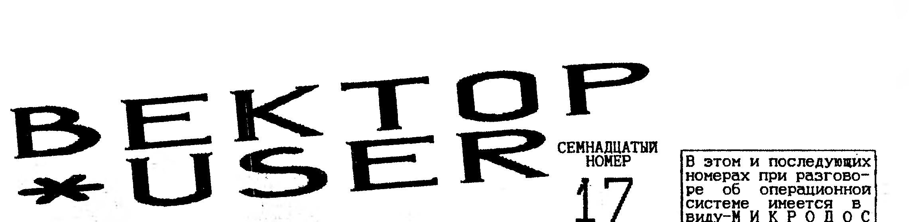

> В этом и последующих номерах при разговоре об операционной системе имеется в виду - МИКРОДОС.

## Цикл (интервью четвертое)

Платонов Дмитрий Игоревич, постоянно проживает в г.Омске, 21 год, инженер-программист, студент ОмГТУ.
Дмитрий Игоревич, стандартные четыре вопроса.

**1. Почему именно Вектор?**
В 1989 году я увидел у знакомого "Вектор".
Это был, наверное, один из первых Векторов в городе, причем тот человек ухитрился получить его из Посылторга (сколько я потом не писал, так ничего и не добился).
По тем временам это было что-то необыкновенное.
Машина рисовала красивые картинки и исполняла музыку в три голоса.
Я, естественно, захотел такой же компьютер.
Но в Омске они еще не продавались, Посылторг не отвечал и я имел несчастье купить "Кристу-2".
Она была полностью совместима с Вектором за исключением трех "мелочей" - работала на т.частоте 2,5Мгц, имела зашитую в ПЗУ палитру и в режиме высокого разрешения экранные плоскости сдвигала в другую сторону.
Правда имела герконовую клавиатуру.
Первый год я адаптировал к ней Векторовские программы, потом занялся ее переделкой.
В результате получился Вектор без программируемой палитры.
В 1992 году в Волгограде приобрел контроллер дисковода и RAM-диск, после чего, к моей радости, Криста неожиданно сломалась.
Предприняв символическую попытку к ее починке, я купил Вектор.

**2. Как относитесь к идее "Coman"a (Вектор без электронного диска)?**
Отношусь к этому плохо.
Мало того, что они придумали свой, ни с чем не совместимый контроллер дисковода, так они еще и уверяют всех подряд, что RAM-диск никому не нужен!
*(В ближайших номерах будет публикация, как переделать "COMAN"-контроллер в стандартный)*
Я сам не в восторге от этого RAM-диска (почему бы не сделать нормальную странично-переключаемую память, а не 256 КБ. стека?), но если уж это устройство есть и распространено довольно широко, то надо использовать все его достоинства.
Лишняя память никогда не была лишней (простите за каламбур).
Я знаю немало программ, которые ее используют, думаю в ближайшее время появится еще больше, так как наши программисты совершенствуются, программы растут и им требуется все больше и больше ресурсов.

**3. Что ждать от Вас в ближайшее время?**
Мои планы в отношении Вектора довольно обширны.
Планируется выпустить еще не менее тре игр из серии "puzzle" (головоломки), затем грандиозный проект, который займет не менее года, надеюсь, что и результат будет соответствующим.
Хорошо, если удасться осуществить хотя бы треть задуманного.

**4. Выживет ли Вектор в дальнейшем?**
Вообще-то уже закрадывается маленькое сомнение: профессионалы переходят на платформы IBM и Macintosh, обычные пользователи начинают покупать игровые приставки.
Но тем не менее, слышал, что уже несколько сильных фирм решили заняться реабилитацией Вектора, выпуская новые высококачественные "игрушки" большими тиражами.
Надеюсь, что это поможет (а заодно и сам приму в этом участие).

**5. Сколько времени у Вас забрал Minesweeper и почему именно игра такого рода, а не аркадная или стрелялка?**
Minesweeper я писал по вечерам, в свободное время, и управился примерно за месяц, итого 20-25 вечеров.
Относительно жанра могу сказать следующее: делал я ее в первую очередь для себя, она не предназначалась для широкой продажи, а я люблю игры двух типов - "puzzle" и "adventure".
Тем более, что игру-головоломку было сделать довольно легко, и я выбрал одну из самых популярных игр этого жанра.

**6. Как Вы думаете, установка Z80 на Вектор даст возможность увеличить количество игр непосредственно для Вектора, или пользователи удовлетворятся спектрумовскими игрушками?**
Одна только установка Z80 еще не делает Вектор совместимым со Спектрумом, и не особенно поможет в переносе игр на новый компьютер.
Вообще, со Спектрумом довольно сложно конкурировать по количеству игр, но если сделать эту переделку достаточно дешевой и доступной простым пользователям, а также написать достаточное количество программ, которые будут использовать преимущества Z80, то не исключено, что это как-то изменит положение.

**7. Как начинали свой путь в программировании?**
В 1987 году я впервые увидел ЭВМ СМ-2 у отца на работе.
На ней была одна из популярных игр того времени - "Королевство Эйфория".
Поиграв в нее некоторое время, я придумал несколько усовершенствований и спросил, как эту игрушку можно изменить - и в ответ был научен Бейсику.
Для Вектора, единственный язык, на котором я писал, был ассемблер.
Я считаю, что для машин такого класса это единственный язык, который позволяет полностью использовать все ресурсы машины и, в то же время, делать достаточно компактный код.

**8. Так как Вы являетесь автором одной из самых качественных, на мой взгляд, игр для Вектора, скажите, прибыльное-ли это дело - писать игры, а если нет, то что надо сделать, чтобы оно стало прибыльным?**
Единственной моей выручкой от Minesweeper была сумма в 20 000 рублей, полученная от Сергея Дудкина в качестве премии, хотя игру я ему подарил, как давнему хорошему знакомому.
От него она и разошлась по стране и, хотя теперь она есть у самого последнего пирата, а так ничего больше и не получил.
Правда, я получил некоторую известность - писем и звонков было довольно много.
Тем не менее, при выпуске новых программ я собираюсь уделить гораздо больше внимания финансовой стороне.

**9. Что можете сказать пользователям Вектора?**
Все-таки Вектор - это лучший из доступных у нас в стране дешевых бытовых компьютеров.
Жаль только, что программисты поздно спохватились о том, что надо выпускать в свет только качественные продукты, и, в течение нескольких лет, гнали массу халтуры, которую всякий пират считал своим долгом поместить к себе в каталог как нечто совершенно новое и необычное.
И лишь изредка среди этого потока можно было найти что-то действительно приличное.
К счастью, сейчас это положение исправляется, культура повышается не только у программистов, но даже и у пиратов.
Надеюсь, что Вектор будет здравствовать еще не один год.

Получаем много разных каталогов и видим как в некоторых местах отпугивают людей от покупки ПК ВЕКТОР-06Ц, доводя его цену даже за сто тысяч рублей.
Поэтому приводим цену этого ПК.
В Москве Вектор-06Ц производства Астрахань в магазине "Радиотехника" на 15.09.94 стоил 47т.
В Кишиневе Вектор-06Ц-02 с герконовой клавиатурой на российск. деньги стоил не дороже 90т.

## Схема музыкального сопроцессора


### Аннотация

Вектор-06ц имеет в своем составе трехголосный музыкальный синтезатор на м/с 8253.
Однако ввиду того, что эта микросхема не ориентирована на такое применение, возможности данного синтезатора невелики.
В частности, отсутствует управление амплитудой и огибающей сигнала.
Попытки программно управлять указанными параметрами приводят к большому расходу памяти, ресурсов процессора, и все же не дают удовлетворительных результатов.
Поэтому в 1994 году в Кировском центре "Байт" была разработана схема установки в Вектор-06ц музыкального сопроцессора AY-8910, применяемого в ПК типа Sinkler 128.
Подобной разработке и посвящены эти строки.

Микросхема AY-8910 - это специально разработанная для синтеза звука микросхема.
Она имеет три независимых канала, каждый из которых может синтезировать тональный сигнал с регулируемой амплитудой и огибающей и/или шум.
Пассивным микшером формируется стереофонический сигнал.
Подробно о программировании AY-8910 можно прочитать в обширной литературе о ПК Sinkler.
Но автор планирует выпустить брошюру, посвященную программированию AY-8910.
ДАННЫЙ ВАРИАНТ ПОЛНОСТЬЮ СОВМЕСТИМ С КИРОВСК. РАЗРАБОТКОЙ.
Чтобы записать/прочитать какой-либо регистр AY, его номер заносится в порт 15h, обмен данными происходит через порт 14h.

**Наладка схемы.**
Правильно собранный из исправных деталей сопроцессор начинает работать сразу.
Изредка приходится подбирать резистор R1 (220-470 ом) для обеспечения устойчивой генерации (на выводе 11 DD4 должны присутствовать колебания частотой 14 Мгц).
В точку BEEP подается сигнал с контакта "1" магнитофонного разъема ПК.
На схеме не показаны блокировочные конденсаторы.
Желательно установить один-два емкостью 0,47 - 0,1 мкф.

Шашков В.А. г.Омск.

> Пользователям ПК "Вектор-06Ц" предлагаем:
> - разнообразная перифирия (от контроллера FDD до модема) и обширное программное обеспечение: (МОСКВА, ОМСК, КИШИНЕВ)
> - голые платы музыкального сопроцессора, контроллера дисковода, RAM-диска, модема/АОНа: (МОСКВА, ОМСК, КИШИНЕВ)
> - адаптер Z80 для Вектора-06Ц: (МОСКВА, КИШИНЕВ)
> - "ПРИКЛЮЧЕНИЯ КОЛОБКА" - игра, 720 кб. объем: (МОСКВА)
>
> 117335 МОСКВА А/Я 101 ФИРОНОВ В.П.
> 644100 ОМСК А/Я 3812 "G" (3812) 65-57-30.
> КИШИНЕВ: (0422)55-37-55 БЕРГИЧ С.Ф. (модем/аон)
> ТАМ ЖЕ: (0422)24-22-18 ЦЕНТР "КОМПЬЮТЕР"

## Как подключить к Вектору клавиатуру от IBM

Ни для кого не секрет, что "родная" клавиатура Вектора, особенно емкостная, никогда не отличалась особым качеством.
Клавиши у нее перекашиваются, застревают, загрязняются так, что их каждые полтора-два месяца приходиться чистить (а, простите, какая радость простому пользователю по нескольку раз в год вскрывать свой ПК, который, к тому же опломбирован, и чистить у него кнопки).
Расположение клавиш тоже оставляет желать лучшего: привыкнув к клавиатуре профессионального компьютера и перейдя на Вектор, как-то теряешься: ESC (АР2) вместе с функциональными клавишами оказалась где-то справа вверху, клавиша ТАБ, совершенно незаменимая при программировании на ассемблере, почему-то съехала вниз к пробелу...
Каждый решает эту проблему как может.
Кто-то ищет Вектор с герконовой клавиатурой (в Кишиневе это, может, и просто, а, например в Омске такая клавиатура - большая редкость).
Кто-то сам делает новую клавиатуру на свой вкус.
Я предлагаю еще один выход: подключить к Вектору клавиатуру от IBM.

(Продолжение следует) Д.И.Платонов. г.Омск

> В ближайших номерах: Костиневич об "R-SOUND", Вьюнов о Резидентной Дисковой Системе и др.

## Взаимодействие Вектора с дисководом

(Продолжение, начало в номерах 15 и 16).

j0=1 - прерывание по готовности накопителя.
j1=1 - прерывание по неготовности накопителя.
j2=1 - прерывание по индексному импульсу.
j3-1 - немедленное прерывание.

**Структура информации для формат. дорожки (MFM):**

| Число байтов десят. | Байт | Назначение |
| --- | --- | --- |
| 80 | 4E | Пробел от начала индекс. импульса |
| 12 | 00 | |
| 3 | F6 | Запись байтов C2 |
| 1 | FC | Индексная метка начала дорожки |
| 50 | 4E | Пробел перед сектором |
| 12 | 00 | |
| 3 | F5 | Запись байтов A1 |
| 1 | FE | Метка заголовка сектора |
| 1 | XX | Номер дорожки |
| 1 | XX | Номер стороны |
| 1 | XX | Номер сектора |
| 1 | XX | Код длины сектора |
| 1 | F7 | Запись контрольной суммы |
| 22 | 4E | Пробел перед данными |
| 12 | 00 | |
| 3 | F5 | Запись байтов A1 |
| 1 | FB | Метка данных |
| XXX | E5 | Сектор |
| 1 | F7 | Запись контрольной суммы |
| | | Запись остальных секторов |
| &&& | 4E | Продолж. записи до конца дорожки |

Назначение служебных байтов (MFM):
F5: запуск байта A1, запуск вычисления контрольного кода (суммы);
F2: запись байта C2;
F7: запись контрольного кода (контрольн. суммы)

В режиме MFM на одну дорожку можно записать:
- пять секторов размером 1024 байта;
- девять (а где и 10) секторов размером 512 байт;
- шестнадцать секторов размером 256 байт;
- двадцать шесть секторов размером 128 байт;

Подробная информация о БИС КР1818ВГ93 опубликована в журнале "Микропроцессорные средства и системы" в третьем номере за 1986 г.
В ПК Вектор адреса регистров БИС (номера портов) следующие:

| Регистр | Порт Coman | Остальные |
| --- | --- | --- |
| Data | 9EH | 18H |
| Sector | BEH | 19H |
| Track | DEH | 1AH |
| Command | FEH | 1BH |
| Status | FEH | 1BH |

Кроме того, все контроллеры содержат еще регистр управления; Sphera и Coman имеют второй регистр статуса.

**Контроллеры Кишиневского, Омского вариантов и Кристы-2.** Номер порта управления - 1CH.
Доступен только по записи.

| | Кишиневский | Омский | Криста-2 |
| --- | --- | --- | --- |
| R0 | выбор накопителя (0=A/C, 1=B/D) | | |
| R1 | Выбор 0=AB, 1=CD | Не задействован; всегда AB | |
| R2 | 1=нижняя сторона, 0=верхняя сторона | | |
| R3 | Не задействован | | |
| R4 | 0=8", 1=5" | Не задействован; всегда 5" | |
| R5 | 0=FM, 1=MFM | Не задействован; всегда MFM | |
| R6 | Не задействован | | |
| R7 | Не задействован | Не задействован | 0=стандар., 1=совмещ. |

Для запуска двигателя необходимо записать байт в регистр управления.
После этого двигатель работает в течение 2,5 сек.
Перезапись регистра возобновляет отсчет времени с момента последней записи.

**Контроллер фирмы Coman.** Номер порта управления - 1EH.
Доступен только по записи.

- R0, R1: выбор накопителя (A-D)
- R2: сброс ВГ93 (сброс-0; нормально-1)
- R3: сигнал готовности головки (записать 1 перед выполнением команд)
- R4: 0=верхняя сторона, 1=нижняя
- R5: не задействован
- R6: 0=MFM, 1=FM
- R7: не задействован

Второй регистр статуса. Номер порта-1EH.
Доступен только по чтению.

- R0-R5: не задействованы
- R6: сигнал DRQ
- R7: сигнал INTRQ

Для запуска двигателя необходимо выполнить любую вспомогательную команду с модификатором прижима головки, а затем установить бит готовности головки в регистре управления.
Время выбега двигателя - 2 сек. (10 оборотов).

**Контроллер фирмы Sphere+.** Номер порта управления - 1CH.
Доступен только по записи.

- R0, R1: выбор накопителя (A-D)
- R2: 0=верхняя сторона, 1=нижняя сторона
- R3: 0=выбор запрещен, 1=выбор разрешен
- R4-R7: не задействованы

Второй регистр статуса. Номер порта-1CH.
Доступен только по чтению.

- R0, R1: не задействованы
- R2: инверсный DRQ
- R3: INTRQ
- R4-R7: не задействованы

Для запуска двигателя необходимо занести в регистр управления байт, выбирающий нужный накопитель и разрешающий выбор.
Двигатель накопителя будет работать до тех пор, пока не будет выбран другой накопитель или не будет сброшен бит разрешения выбора в регистре управления.

Для того, чтобы что-то сделать с дисководом (прочитать/записать сектор), нужно уметь включать мотор, выбирать накопитель, позиционировать головку и обмениваться данными.
Однако, как правило, пользователь, имеющий дисковод и контроллер, использует его не просто так, а под операционной системой.
И система обычно не любит, чтобы пользовательская программа сама работала с регистрами контроллера - такие действия часто заканчиваются "повисанием".
Поэтому рекомендуется в таких программах сохранять состояние всей используемой дисковой аппаратуры - регистров Sector и Track, положение головок всех используемых накопителей.
Вот пример программы, определяющей текущую дорожку, на которой находится головка накопителя, вне зависимости от того, какая дискета установлена (даже неформатированная).

Шашков В.А. г.Омск
(Продолжение в следующем номере)

## Графический редактор DRAW

(Продолжение, начало в номере 16)

6. (ПУЛЬВЕРИЗАТОР) - закраска площадей хаотически расположенными точками.
Квадрат перемещается КУРСОРОМ.
СТР-величина шага.
АР2-включает увеличение/уменьшение размера при помощи КЛАВИШ КУРСОРА.
Выключение режима-ПРОБЕЛ.
Закраска-ПРОБЕЛ.
Цвет точек выбирается в режиме ВЫБОР ЦВЕТА.
Выход-АР2 (дважды).

7. (КВАДРАТЫ) - рисование квадратов.
Управление то же, что и в ПУЛЬВЕРИЗАТОРЕ.

8. (СТИРАЮЩАЯ ГУБКА) - стирание рисунка выбранным цветом.
Появляется меню цвета.
Перемещение-КУРСОР, выбор-ВК.
Далее управление то же, что и в ПУЛЬВЕРИЗАТОРЕ.

9. (ОКРУЖНОСТИ) - рисование окружностей.
Управление то же, что и в ПУЛЬВЕРИЗАТОРЕ.
В режиме увеличения (после АР2) КЛАВИШАМИ КУРСОРА производится увеличение/уменьшение диаметра окружности.
(Продолжение на 4-й стр).

10. (ШРИФТ) - вывод на экран букв и цифр из верхнего и нижнего регистров, а также вывод шрифтов, считанных с диска.
Появляется квадрат, определяющий величину выводимых знаков.
Управление квадратом стандартное, но после нажатия ПРОБЕЛа квадрат закрашивается, и с этого момента можно вводить с клавиатуры текст.
При этом квадрат автоматически перемещается вправо (как курсор).
Кроме того квадратом можно также управлять и КЛАВИШАМИ КУРСОРА.
В режиме клавиатуры LAT выводится шрифт заложенный в программе.
Перевод клавиатуры в РУС выводит шрифт считанный с диска.
Выход-АР2.

11. (ЛУПА) - рисование мелких элементов рисунка.
Прямоугольник КЛАВИШАМИ КУРСОРА установить на нужное место.
СТР-изменение шага перемещения.
Затем-ПРОБЕЛ.
В центре экрана появляется увеличенное изображение выбранного фрагмента.
Над ним меню цвета.
КУРСОРОМ перемещается маркер по полю.
ПРОБЕЛ-закраска точки.
АР2-переход в меню цвета.
Перемещение по меню-КУРСОР.
Закрепление цвета и возврат к рисованию точек-ПРОБЕЛ.
Для выхода в рисунок вывести маркер за пределы окна и нажать ПРОБЕЛ.
Выход в основн. меню-АР2.

12. (КОПИЯ) - копирование фрагмента рисунка.
Управление квадратом то же.
Запомнить фрагмент-ПРОБЕЛ (после режима увеличения ПРОБЕЛ нажать дважды: первый для выхода из режима, второй для запоминания).
Переместить фрагмент в место копирования фрагмента и нажать ПРОБЕЛ.
Выход-АР2.

13. (X= Y= Color=) - вывод координат и номера цвета точки в позиции маркера.
Маркер перемещается КУРСОРОМ.
Вверху экрана выводятся координаты по горизонтали-X, по вертикали-Y и код цвета данной точки.
Выход-АР2.

14. (Palet) - установка цветовой палитры.
В верхней части окна меню цвета, в нижней, в виде полос-состав выбранного цвета (количество R-красной, G-зеленой и B-синей составляющей).
КЛАВИШАМИ КУРСОРА выбирают цвет, который собираются изменить и нажимают ПРОБЕЛ.
Внизу появляются в виде полосок количество составляющих основных цветов в выбранном цвете, под одной из которых находится маркер в виде треугольн.
КЛАВИШИ КУРСОРА увеличивают/уменьшают количество данной составляющей и передвигают маркер на следующую составляющую.
Получившийся цвет виден в прямоугольнике справа.
Закрепление цвета-ПРОБЕЛ.
При этом происходит переход в меню цвета для выбора следующего.
И т.д.
Следует иметь в виду, что первый цвет слева - цвет первоначального фона.
При изменении этого цвета изменится и фон.
Третий цвет слева-цвет фона различных меню программы.
Выход из режима как в режиме ЛУПА.

15. (ПРИНТЕР) - вывод на принтер рисунков.
Передвижение по меню размеров печати-КУРСОР, выбор-ВК.
Принтер должен быть включен и готов к работе.
По окончании печати выход в основное меню происходит автоматически.

16. (ПУСТОЙ КВАДРАТ) - общее стирание (очищается весь экран).
"Cls-<blank>, not-<ap2>".
ПРОБЕЛ-стирание, АР2-отмена режима.
Далее автоматически-режим основного меню.

А.Гуссак г.Москва.

## Часы реального времени

(Продолж. начало в №16)

**Распределение памяти микросхемы КР512ВИ1.**

| Адрес | Данные | Адрес | Данные |
| --- | --- | --- | --- |
| 00H | Секунды | 0AH | Регистр A |
| 01H | Секунды (будильник) | 0BH | Регистр B |
| 02H | Минуты | 0CH | Регистр C |
| 03H | Минуты (будильник) | 0DH | Регистр D |
| 04H | Часы | с 0EH | ОЗУ общего |
| 05H | Часы (будильник) | по 3FH | назначения |
| 06H | День недели | | |
| 07H | День месяца | | |
| 08H | Месяц | | |
| 09H | Год | | |

Можно зап/чит любую ячейку за исключением:
- по адресам 0CH, 0DH только чтение;
- старшие разряды по адресам 00 и 0AH можно только считывать.

Как обращаться с ячейками по адесам 00-09 (календарь, часы, будильник) рассмотрено выше.
Больше никаких секретов нет.
Точно так же записываются и считываются данные из ОЗУ общего назначения (0EH-3FH).
Разница лишь в том, что это ОЗУ - Ваше и то, что Вы туда записали часам "до фени", а с тем, что Вы пошлете в ячейки 00-09, часы работают.
Там информация все время меняется.
Останутся регистры A, B, C, D.
Что это за звери?
Эти регистры предназначены для управления работой м/схемы и анализа ее состояния.

**Регистр A**

```
Формат байта: D7  D6  D5  D4  D3  D2  D1  D0
              ---------------------------
              -----> UIP    DV        RS
```

UIP - единица в этом разряде означает, что происходит обновление информации о времени.
В этот момент считывание информации даст неопределенный результат, поэтому корректное обращение выглядит так:

```
NOYET:  MVI   A,0AH   ;обращаемся
        OUT   20H     ;к регистру A
        IN    21H     ;считываем из него байт
        RAL           ;выделяем ст.разряд-UIP
        JC    NOYET   ;если он нулевой - ждем
```

DV - часы могут работать с разными кварцами, но по нескольким параметрам (стоимость, доступность, экономичность) лучше всего кварц на 32768 Гц.
Он кодируется: 0 1 0

RS - устанавливает частоту сигнала на выходе SQW и период повторения периодических прерываний с выхода IRQ.
IRQ=1000/SQW.
Например, частота на выходе SQW равна 256 Гц, период прерывания равен 1000/256=3,9 милсек

| D3 | D2 | D1 | D0 | частота, Гц | период, милсек |
| --- | --- | --- | --- | --- | --- |
| 0 | 0 | 1 | 1 | 8192 | 0,122 |
| 0 | 1 | 0 | 0 | 4096 | 0,244 |
| 0 | 1 | 0 | 1 | 2048 | 0,488 |
| ... | | | | | |
| 1 | 1 | 1 | 0 | 4 | 250 |
| 1 | 1 | 1 | 1 | 2 | 500 |

(в оригинале между строками 0101 и 1110 напечатана только пунктирная разделительная линия, промежуточные строки таблицы не приведены)

Выход SQW-это 23 вывод м/сх ВИ1.
Чаще всего используется для подачи сигнала от будильника.
Выход IRQ-19 вывод м/сх.
Используется как сигнал выдачи прерывания либо по постоянной частоте (см. выше), либо по окончании цикла обновления, либо от будильника.
(Продолжение в сл. номере) С.Дудкин г.Омск

## Пользователям Вектора-06Ц

Прочитав обращение Волгоградской "СИСТЕМОТЕХНИКИ", соглашаюсь во всем, кроме......
Да, многие работавшие на Вектор, бросили это дело из-за слабой, можно сказать никакой, материальной отдачи.
Сам могу назвать десяток фамилий, это те, новые программы которых Вы не видите последние два года.
Но предложение "СИСТЕМОТЕХНИКИ" меня рассмешило.
Цель прекрасная - вдохнуть новую жизнь в "ВЕКТОР", но методы (прислать по пятнадцать тысяч) к этой цели не приведут.
Кота в мешке никто покупать не будет.
"СИСТЕМО..." говорит, что это единственный способ - утром деньги, вечером стулья.
Согласен, но где стулья?
А, их еще не сделали?
А если не сделают вообще?
Если не пришлют столько, сколько надо?
"СИСТЕМО..." отвечает, что тогда можно приобрести существующие табуретки.
А мне кажется, что если игры хороши, пусть с электронными ключами, то они всегда найдут покупателя, рано или поздно.
Главное, чтобы они были.
А демонстрашки будущих игр можно рассылать, тем и привлекая пользователей.
А то ММЩина какая-то.
Фиронов В.П.

МАКЕТ НОМЕРА: Фиронов В.П.
РЕДАКТОР: Фиронов В.П.
