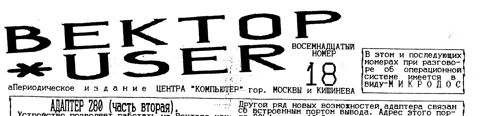

> В этом и последующих номерах при разговоре об операционной системе имеется в виду - МИКРОДОС.

## Адаптер Z80 (часть вторая)

Устройство позволяет работать на Векторе, как 01-М, так и 02-М непосредственно с синклеровскими дискетами и лентой.
А также дает возможность принципиально новых режимов работы.
Кратко о новых возможностях и преимуществах:

1. Дополнительные команды Z80, более быстрое выполнение старых команд.
2. Возможность гибкого режима с квазидиском через регистр (HL).
3. Активное использование всего ОЗУ эл.диска, не отличающееся от использования собственного ОЗУ Вектора.
   Удобство перехода между ОЗУ.
4. Синклер. экран и возможность практически полной эмуляции Sinkler-48 (впоследствии-128)
5. Благоприятный режим работы м/схем памяти.

С точки зрения программиста, новые режимы задаются записью в порт 80h числа, биты которого соответственно равны:

- 0 - включение синклеровского экрана.
- 1 - инверсия старшего бита адреса ОЗУ.
- 2 - взаимная замена ОЗУ ПК <-> ОЗУ Эл.диска.
- 3 - обращение к квазидиску в операциях с (HL).
- 4 - немаскируем. прерыван. по незнакомым портам.
- 5 - имитация ПЗУ для адресов 0-3FFFh, блокировка Эл.диска при обращении к адрес. 4000-5FFF.
- 6 - увеличение быстродейст. некоторых операций.
- 7 - блокировка обращения к квазидиску в стековых операциях.

После включения все биты устанавливаются в 0, что соответствует режиму обычного Вектора.
Специально отмечу, что есть небольшие различия в исполнении команд 580-го и Z80-м, в частности формирование флага паритета/четности в операциях сложения, вычитания и др.

**ПРОГРАММНОЕ ОБЕСПЕЧЕНИЕ.**
Работает абсолютное большинство векторовских программ.
Исключение составляют программы, для которых существенно выше упомянутое отличие в исполнении команд.
Активно ведется работа по созданию прогр. обеспечения с использованием новых возможностей.
К настоящему времени (01.11.94) создана уже третья версия программы ZX-эмуляции работы Spectrum.
В отличии от первой версии программа практически полностью эмулирует Spectrum-48: клавиатура, цвет (при наличии квазидиска), звук, загрузка-выгрузка с магнитофона, один или несколько дисководов, программируемый джойстик и клавиши, без каких-либо доработок в перефирии Вектора и без переработок синклеровских программ (загрузка непосредственно со синклеровской дискеты или кассеты).
В следующей версии планируется предусмотреть работу с принтером и музыкальным сопроцессором (Саттаров, Шашков), обращение к Эл.диску к одному из дисководов.
Широкие возможности открывает адаптация ямаховского MSX-DOS.

**ПОДКЛЮЧЕНИЕ.**
Подключение не является даже незначительной переработкой Вектора.
В простейшем случае (герконовая клавиатура) специальный разъем надевается прямо в панельку, где стоял 580-й процессор.
Еще три сигнала берутся с платы Вектора.
Есть возможность обратной замены.

**ПРОГРАММИРОВАНИЕ АДАПТЕРА.**
Процессор Z80 обладает несравненно более обширной системой команд по сравнению с 580-м процессором.
За малым исключением Z80 исполняет одинаково все команды 580-го.
Исключение составляет формирование флага паритета/четности при сложении и вычитании и некоторые другие.
Новые команды Z80 можно изучить в обширной литературе и здесь не рассматриваются.

Другой ряд новых возможностей адаптера связан со встроенным портом вывода.
Адрес этого порта 80h (точнее 10*0**** в двоичном коде).
После сброса все биты порта устанавливаются в 0, что соответств. обычному режиму Вектора.
Новый режим работы задается путем записи в порт какого-либо числа, которое запоминается до следующего обращ. к порту или сброса.
Каждый бит числа, записанного в порт, отвечает за какой-либо режим работы.
Краткое назначение битов порта 80h описано выше, разберемся подробнее.
Биты числа, записанного в порт, обозначены как 00, 01,...,07, и, разумеется, могут принимать значение 0 и 1.
При обращении к ОЗУ Вектора или квазидиска 16 бит адреса обозначены как A0, A1,...,A9, AA, AB, AC, AD, AE, AF.

**БЫСТРОДЕЙСТВИЕ.**
Для выполн. ряда общих команд Z80 и i8080 требуется различное время.
Так операции MOV R1,R2; INR R; DCR R (R, R1, R2 отличны от M) выполняются в два раза быстрее, что может сказаться на программной совместимости, например, при программировании палитры цветов.
С целью более полной совместимости в адаптере введена возможность задержки.
Так при 06=0 вышеперечисленные операции выполняются за тоже время, а при 06=1 вдвое быстрее.

**НЕМАСКИРУЕМОЕ ПРЕРЫВАНИЕ.**
Адаптер эмулирует работу не векторовских программ.
При 04=1 происходит немаскируемое прерывание после обращения (чтения или записи) к порту с двоичным адресом ***1****.
По адресу 66h, к которому происходит переход после прерывания, должна находиться подпрограмма, идентифицирующая устройство, к которому идет обращение и заменяющая его на обращение к соответствующим портам Вектора.
При 04=1 такого прерывания не происходит.

**ФОРМИРОВАНИЕ СИГНАЛА STEC.**
В Векторе этот сигнал играет важную роль при обращении к Эл.диску.
580-и формирует этот сигнал при записи в стек или чтении из него.
В Векторе обращение к квазидиску через сигнал STEC происходит, если в 4-й бит порта 10h записана единица.
Отметим, что в адаптере формирование сигнала STEC не эквивалентно обращению к стековому адресу, как с 580-м.
Адаптер формирует этот сигнал более сложным образом, благодаря чему возможны принципиально новые режимы работы с Эл.диском.
Промежуточный сигнал STECB=[[обращение к (HL) в MOV, INR, DCR] and 03]or[[обращение к стеку в операциях POP, PUSH] and /07], где / обозначает логическую инверсию: /X = not X.
Окончательный сигнал: STEC=[STECB Xor 02] and /[/AF and AE and /AD and 05]].
Кратко поясним, как можно использовать некоторые новые режимы, чтобы обращаться к Эл.диску, используя сигнал STEC.
Запишем в порт 10h число 0001NN00 (двоичный код), где NN - граница Эл.диска.
При 07=1 исключается чтение и запись на квазидиск при стековых операциях.
При 03=1 обращение к Эл.диску происходит при некоторых операциях с регистром M, что гораздо мобильнее обращения через стек.
Бит 02=1 инвертирует сигнал STEC, при этом ОЗУ Вектора и Эл.диска как бы меняются местами: выполняемая программа находится на Эл.диске, а к ОЗУ Вектора происходит обращение как к Эл.диску.
При включении этого бита нужно соблюдать определенную осторожность.
Об этом ниже.

Владимир Фролов, г.Кишинев (0422) 73-88-64
(продолжение следует)

> Адаптер можно приобрести в Кишиневе у автора, также в Москве у Фиронова В.П. (095)128-73-18

## Схема RAM-диска на 565РУ7


Идеи, использованные в этом Эл.диске, те же, что и в стандартном.
Отличием является применение 565 РУ-7 и нескольких дополнительных м/схем для регенерации некоторых сигналов.
Вот и все.

Этот RAM-диск не требует никаких перепрошивок или переделок Вектора.
Отзывается на версии DOS с BIOS 5,1 и другие подобные.

## Установка микропроцессора Z80 на Вектор-06Ц

Для установки, которая не делает Вектор-06ц Spektrum-совместимым (это делает адаптер Z80), требуются следующие доработки:

1. Выпаять микросхему D20.
2. Отсоединить от контактных площадок следующие выводы м/сх: D1(1, 2, 3, 4), D26(2, 3, 4), D16(2), D23(3), D15(3), D83(5), D22(1).
3. Перерезать дорожку, соединяющую выводы: D10(9, 10, 12, 13) и D2(2, 14).
4. Отрезать дорожки от выводов XS1 (AC03-AC10)
5. Напаять поверх D1 м/сх 580ВА87, соединив выводы 9, 10, 11, 20 с соответствующими выводами нижней ИМС.
   Выводы этой ИМС соединить с контактными площадками, соотв. D1(1, 2, 3, 4).
   Соединить выводы 1-8 ВА87 с XS1 AC03-AC10 соответственно.
6. Напаять поверх D10 м/сх ЛА1.
   Соединить выводы 7, 14 с нижней м/сх.
   Выводы 1, 2, 4, 5, соединить с выводами ВА87 5, 6, 7, 8 соответственно.
   Вывод 6 ЛА1 соединить с 2, 14 D2.
7. Напаять поверх D22 м/сх ЛП5.
   Соединить выводы 7, 14 с нижней м/сх.
   Соединить ЛП5(1) с Z80(3), ЛП5(2) с Z80(4), D22(2) с Z80(5).
8. Распаять ШД и ША Z80 в соответствующие места из под 580ВМ80А.


По всем вопросам установки микропроцессора Z80 на ПК Вектор-06ц обращаться к Кузнецову Владимиру во Владимир по т.(09222) 2-70-90.

Всех, кто нас читает, поздравляем с Новым Годом.
В новом году: окончание всех материалов 1994 г., "печатка" с контроллером, музыкалкой и RAM-диском, Максим Алюдин (AMSOFT) с рассказом - как создать игру на ассемблере, аппаратные примочки, описания программ, продолжение ЦИКЛА и мн. др.
Кто поможет с адресами Новикова, Лебедева, Пересадова и других?
Лишняя реклама никому не помешает, даже если кто и бросил Вектор.
Фиронов В.П.

## Переделка COMAN-контроллера для работы с МикроДОС

Все обозначения приведены по схеме из "Coman-Info 2".

1. Удалить м/сх D11(ЛП11); все связи, идущие к ней, кроме тех, что идут к выв. 8 и 16, отключить.
   Удалить резисторы, подключенные к выв. 12 и 14 указанной м/сх.
2. Удалить диод.
3. Отсоединить от монтажа вывод 2 D7(ТМ9).
   Соединить с общим проводом вывод 37 D9(ВГ93).
4. Отсоединить от монтажа вывод 19 D9(ВГ93) и соединить его с выводом 41 разъема (сигнал RESET).
5. Отсоединить от монтажа вывод 23 D9(ВГ93) и подать на него лог. 1 (например, с вывода 1 D7(ТМ9)).
6. Отсоединить от монтажа вывод 28 D9(ВГ93).
7. Отсоединить от монтажа выводы 8-13 м/сх D6(ЛН1).
8. Отсоединить от монтажа выводы 1-5 м/сх D1(ЛА2).
   На выводы 1,2,3 подать лог 1, выводы 4, 5, 6 соединить с контактами 8-10 разъема соответственно.
9. Отсоединить от монтажа выводы 2 и 3 D8(ИД14) и соединить их с контактами 5 и 6 разъема соответственно.
10. Отсоединить от монтажа выв. 4,5,6 D8(ИД14) и выв. 3 D9(ВГ93).
    Соединить выв.5 D8(ИД14) с выв.3 D9(ВГ93).
11. Соединить м/сх D5(ЛЛ1): выв.1 с выв.4 D8(ИД14), выв.2 с конт.37 разъема (ЗПВВ), выв.3 с выв.9 D7(ТМ9).
12. Отключить от монтажа вывод 1 м/сх D14 и соединить его с выводом 10 D7(ТМ9).
13. Подключить связи, шедшие раньше к D10(ЛП11): выв.2 (контакт 8 дисковода) к выводам 9 и 10 D4(ЛИ1); выв.3 (35 D9(ВГ93)) к выводу 8 D4(ЛИ1); вывод 4 (конт.26 дисковода) к выводу 12 и 13 D4(ЛИ1); вывод 5 (34 D9(ВГ93)) к выводу 11 D4(ЛИ1); вывод 6 (конт.26 дисковода) к выв.4 и 5 D5(ЛЛ1); выв.7 (36 D9(ВГ93)) к выв.6 D5(ЛЛ1).
14. Установить м/сх К155АГ3 (можно на место, где стояла раньше ЛП11).
    Подсоединить ее выводы: 1 к выводу 9 D7(ТМ9); 2 и 3 к лог.1; 8 к общему; 13 к выв. 11 D13 (ЛН2); 14 к "+" конденсатора на 100 мкф, 15 к "-" этого конденсатора.
    Между выводом 15 и +5в. включить резистор на 75 ком (47 ком, если применена м/сх 555АГ3).
15. Для реагирования на "ГОТОВ" НГМД, надо отсоединить от монтажа вывод 32 D9(ВГ93) и соединить его с выв.9 D6(ЛН1).
    Вывод 8 D6(ЛН1) соединить с конт.34 НГМД.

Из опыта переделок 20 штук: время на переделку - 4 часа, запуск сразу - 80%, остальные - после устранения ошибок.

Подготовлено: Spase corrporation. (Шашков В.А.)

*(так в оригинале - название "Spase corrporation" напечатано с ошибками)*

## Подписка

В 1995 году планируется выпустить не менее шести номеров (пока шести, а дальше - посмотрим), подписка на них и открывается этим объявлением.
Номера 19-24 будут выходить примерно один раз в месяц.
Для получения номеров 19-24 следует выслать по известному Вам адесу эквивалент 2,8$ (долларов США) и шести конвертов с литерой "А" (другие конверты просьба не высылать из-за возможного подорожания почтовых услуг) с четко написанным Вашим адресом.
Если таких конвертов не нашли, то перевод должен быть равен эквиваленту 3,7 доллара США.
Если Вы не уверены в своем почтовом ящике (ломают, воруют и т.д.), указывайте адрес знакомых, друзей.
Мы можем высылать номера заказными письмами.
В этом случае стоимость подписки увеличивается в 1,5 раза, т.е. 5,25$.
Можем высылать номера простыми и заказными письмами в страны СНГ.
Тогда стоимость подписки будет стоить 7,7$ и 9,8$ соответственно (извините, почта).
Пользователи Вектора из Молдовы могут приобретать номера в ЦЕНТРЕ "Компьютер" г.Кишинева значительно дешевле указанных выше цен для стран СНГ.
Туда номера доставляются со знакомыми.
При поступлении дополнительных материалов, надеемся они будут, подписка будет продолжена.
Принимаем только телеграфные переводы.
Цены могут быть изменены по истечении месяца после получения Вами этого номера.
Индивидуально извещаем Шашкова В.А. о бесплатной подписке на все последующие выпуски "Вектор-User", как автора трех статей и ждем от него новых.
Эти льготы действуют для всех авторов программного и аппаратного обеспечения для ПК Вектор-06ц.

## Вектор Турбо+ (часть вторая)

В дополнение к напечатанному (N15) добавляем, что все адресное пространство портов ввода/вывода разбито на следующие части:

| Адрес портов | Назначение |
| --- | --- |
| 00-03 | 580ВВ55 клавиатуры (D30) |
| 04-07 | 580ВВ55 внешняя (D27) |
| 08-0B | 580ВИ53 (D29) |
| 0C-0F | таблица цветности |
| 10-13 | электронный диск |
| 14-17 | музыкальный процессор |
| 18-1B | контроллер 1818ВГ93 |
| 1C-1F | триггеры контроллера |
| 20-3F | резерв (БИСов) |
| 40 | номер доступного банка памяти по "адр." |
| 41 | номер доступного банка памяти "стеком" |
| 42 | маска памяти при работе по "адресности" |
| 43 | номер отображаемого экрана и его режим |
| 44 | регистр горизонтального скроллинга |
| 45 | режим адресации портов |
| 46 | режим чтения клавиатуры |
| 47 | "встроенный" порт мышки |
| 48-4F | резерв |

Также нами разработан высоколинейный ч/б и цветной видеовыход для работы на нагрузку 75 ом.
Выдержан телевизионный стандарт, легко подключается к стандартному Вектору, имеет отдельно цветной и ч/б выходы.
Сейчас идет подготовка к выпуску первого варианта ПК (модель 010) без контроллера IBM и системн. часов.
Предполагается выпускать Вектор турбо+ в вертикальном исполнении с клавиатурой IBM, Эл.диском 1 Мбт, дисководом 2 х 80 на 800 кб.
Примерные размеры машины 400 х 260 х 120 mm.
Примерная стоимость машины (09.94) 360 т.руб.
За более подробной информацией обращайтесь: 600030 г.Радужный Владимирской обл. квартал 3 дом 5 квартира 6.
Кузнецов Артур Владимирович

Определение типа микропроцессора.
Программа, используемая для определения типа процессора, приведена ниже.

```
;Определение типа микопроцессора
;по установке флага
;четность, переполнения
        xra     A
        dcr     A
        jpe     P580  ; если Z80 то переход
;P280                 ; иначе Z80
```

*(так в оригинале - метка и комментарий у команды `jpe` не соответствуют друг другу, а название подпрограммы напечатано как "микопроцессора")*

Камшилин Д.В. г.Владимир.

> Предлагаем большой выбор услуг по обслуживанию бытовых ПК "Вектор", "Spectrum" и их модификации.
> Прошиваем ПЗУ, тестируем м/сх, контроллеры, принтеры и дисководы.
> Широкий выбор радиодеталей, программ и перефирии.
> Тел. во Владимире: 2-70-90. фирма "Эдельвейс"

## PIONEER SOFT снова представляет: "ЖУРНАЛИСТ"

Эта новинка - экранный, графический, текстовый редактор, который позволяет быстро, удобно и красиво редактировать тексты в графическ. режиме разными шрифтами.
Редактор снабжен всеми необходимыми дисковыми функциями.
Работа в режимах 64, 32, 15 символов в строке.
Произвольные размеры по вертикали.
В режиме 15 символов в строке возможно включение увеличения символа.
Программа позволяет быстро и удобно работать с псевдографикой.
Возможна сдвижка/раздвижка по горизонтали и вертикали.
Редактор позволяет работать со спрайтами, нарисованными в графическом режиме 512/256.
Печать подготовленных текстов в 6-ти графических режимах.
На данный момент завершается работа над этим по сути настольным издательством (если есть принтер), который будет представлять мощный двух дисковый пакет с богатой библиотекой сприатов и множеством разнообразных шрифтов.
В состав пакета будут входить редактор шрифтов, графический редактор спрайтов, сервисная дисковая оболочка, специализированная программа печати и многое другое.
Желающие приобрести этот пакет, шлите заказы Фиронову В.П.
Стоимость работы программиста будет делиться на количество заказов и если для конкретного пользователя цена будет велика, пакет распространяться не будет.
Так что заказывая его для себя и десятка своих друзей и знакомых имейте в виду, что Вы платите и за них тоже.

## Совместимость Z80 и i8080

Принято считать, что Z80 и i8080 полностью совместимы и с Z80 могут работать любые программы, написанные для i8080.
Однако это не совсем так.
В работе команд из набора i8080 на Z80 имеются два отличия.
Первое заключается в том, что в Z80 флаг паритета (бит D2 регистра признаков), кроме основной функции, используется для указания переполнения.
Обычно это надо при работе с числами со знаком.
Второе отличие - корректное выполнение команды DAA (десятичной коррекции) после операции вычитания.
При разработке программ необходимо учитывать эти особенности и не использовать команды, выполняемые i8080 и Z80 по-разному.
Учитывая, что некоторые команды Z80 выполняет за меньшее, чем i8080, число тактов, программы реального времени должны корректировать константы задержек в зависимости от типа микропроцессора.

## Вектор-06Ц-02: кадровый и строчный с/импульсы

В этой модели разделение кадрового и строчного с/импульса заложено в схеме.
На м/схеме D83 н.9 и 8 кадровый прямой и инверсный соответств.
D89 н.6 и 5 строчный инверсный и прямой соот.
R, G, B следует посадить на "землю" через 75ом.
Фиронов В.П. г.Москва.
