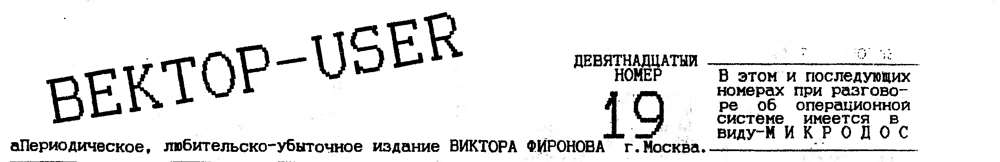
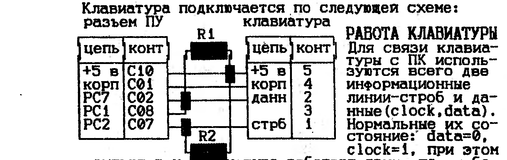
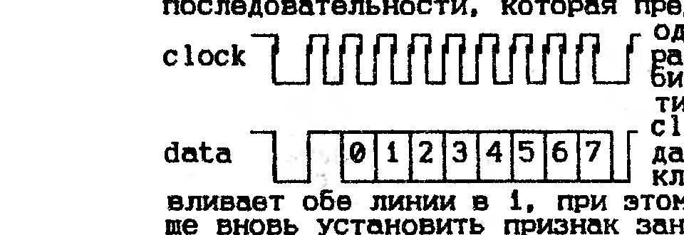

> В этом и последующих номерах при разговоре об операционной системе имеется в виду - МИКРОДОС.

## Адаптер Z80 (часть вторая)

(окончание, начало в номере 18)

Бит 05 используется для блокировки сигнала STEC при обращении по адресам 4000-5FFFH, и блокировки записи по адресам 0-3FFFH. Этот бит используется для эмуляции работы SINKLER, у которого по адесам 0-3FFFH находится ПЗУ, а внутри области 4000-5FFFH находится экран. Отметим, что адаптер не интерпретир. команду XTHL как стековую, кроме того, при работе с квазидиском через стек (четвертый бит порта 10h равен единице), не регламентируется работа с условными и безусловными командами CALL, RET, RST. Практически это не ведет к каким-либо ограничениям, так как для работы с Эл.диском используются исключительно команды PUSH и POP. Также не регламентируется работа новых команд Z80, начинающихся DD, ED, FD, CBH при 04=1 при работе с квазидиском.

**ИЗМЕНЕНИЕ АДРЕСНОГО ПРОСТРАНСТВА.**
Важную роль играет промежуточный сигнал SINC, формируемый как SINC=00 and AF2 and /STEC, где AF2=AF X или 01. При обращении МП к ОЗУ с двоичным адресом AF AE AD AC AB AA A9 A8 A7 A6 A5 A4 A3 A2 A1 A0, реально происходит обращение по адресу AF2 AE AD AC AB AA A9 A8 A7 A6 A5 A4 A3 A2 A1 A0 при SINC=0, и к AF2 AE AD AC A4 A3 A2 A1 A0 /AC /AB /A7 /A6 /A5 /AA /A9 /A8 при SINC=1. Изменение адресного пространства никак не сказывается на формирование сигнала STEC и применяется для формирования синклеровского экрана, отличного от векторовского. При 00, 01, 05=1 при работе синклеровских программ, графика заносится на первую экранную плоскость Вектора по координатам, соответствующим положению на синклеровском экране. Таким образом можно получить ч/б изображение без каких-либо переделок в программе.

**ПЕРЕКЛЮЧЕНИЕ БИТОВ 01 И 05.**
Предположим, мы захотели изменить один из этих битов. Адрес команды OUT 80H - МЕТ, следующ.адрес, запрашиваемый МП после выполнения OUT 80H, будет МЕТ2. После изменения режимов работы, связанных 01 и 05, реальное считывание происходит либо по преобразованному адресу (бит 01), либо происходит переход с ОЗУ Вектора на ОЗУ квазидиска, или наоборот (бит 05). В новом месте должен быть подготовлен текст продолжения программы. Если бы соответствующие режимы переключались сразу же после OUT 80H, пришлось бы подготавливать продолжение программы в строго определенном месте, что не удобно. Аппаратно найдено другое решение: переключение происходит не только после извлечения кода следующей за OUT команды. Рекомендуется задавать команду PCHL.
Пример перехода из ОЗУ Вектора на нулевую плоскость электронного диска:

```
        MVI     A, 10H
        OUT     10H
        LXI     H, MET1
        MVI     A, 84H
        OUT     80H
        PCHL

;переход по адресу MET1 на квазидиск.
...
;текст, заранее перенесенный на квазидиск.
        .PHASE  ...
...
;продолжение программы на квазидиске.
MET1:   ...
...
        .DEPHASE
        END
```

Пример изменения старшего бита адреса:

```
        LXI     H, MET3
        MVI     A, 2
        OUT     80H
        PCHL

;переход по адр. MET3 и измен. адр.простр.
MET2:   .PHASE  8000H+MET2
...
;продолжение программы
MET3:   ...

        .DEPHASE
        END
```

Владимир Фролов, г.Кишинев. Тел: (0422) 73-88-64.

## Часы реального времени (продолжен)

**Регистр B.**

Форм.байта: D7 D6 D5 D4 D3 D2 D1 D0
SET PIE AIE UIE SQWE DM 24/12 0

SET-единица в этом разряде запрещает обновление, давая возможность записать в регистры времени начальные значения. После этого необходимо записать 0 в этот разряд - включить цикл обновления.
PIE-разрешение прерываний с периодом, задаваемым разрядами RS регистра A. Может быть сброшен сигналом RESET. Подать сигнал RESET - это значит подать 0 на 18 вывод м/сх ВИ1.
AIE-разрешение прерывания от будильника. Может быть сброшен сигналом RESET.
UIE-разрешение прерывания по окончании цикла обновления. Может быть сброшен RESETом.
SQWE-разрешение выдачи сигнала на выход SQW. Может быть сброшен сигналом RESET.
DM-единица в этом разряде означает, что данные о времени и дате представлены в двоичном коде, 0 - в двоично-десятичном. Значение этого разряда нельзя изменять без повторной записи начальных значений в ячейки времени и календаря.
24/12-устанавливает 24-х часовой(1) или 12-ти часовой(0) режим счета времени. В 12-ти часовом режиме время после полудня отмечается еденицей в старшем разряде регистра часов (адрес 04).

Этой информации уже достаточно, чтобы инициализировать м/сх. Для этого в регистр A нужно записать байт 0010XXXX, например 26H. Здесь важно дать понять часам, что к ним подключен кварц 32768 Г, а не другой. Затем в регистр B пишем 1XXXX010, например, 82H. Здесь важно установить SET в 1 (поскольку следом мы будем записывать данные в регистры времени), дать понять м/сх, что данные представлены в дв.-дес.виде и работать нужно в 24-х часовом режиме. Остальное пока безразлично. Вот вариант пуска часов:

```
        MVI     A, 0AH
        OUT     20H
        MVI     A, 26H
        MVI     A, 0BH
        OUT     20H
        MVI     A, 82H
        OUT     21H
        .....
;программируем регистры времени
        .....
        MVI     A, 0BH
        OUT     20H
        MVI     A, 02H  ;сброс разряда SET в 0,
        OUT     21H     ;чтобы часы затикали
```

Часы заработали, можно ими пользоваться.

**Регистр C.**

Формат байта: D7 D6 D5 D4 D3 D2 D1 D0
IRQF PF AF UF 0 0 0 0

IRQF-флаг запроса прерывания. Устанавливается в еденицу при выполнении условия: PFxPIE+AFxAIE+UFxUIE=1. Одновременно с установкой IRQF=1 на контакте IRQ устанавливается низкий уровень. Флаг сбрасывается после чтения регистра C или сигналом RESET.
PF-устанавливается в еденицу фронтом сигнала на выходе внутреннего делителя частоты, выбранном в соответствии с разрядами RS регистра A. Флаг сбрасывается после чтения регистра C или сигналом RESET.
AF-устанавливается в еденицу при совпадении текущего времени с временем, указанным в регистрах будильника; сбрасывается после чтения регистра C или сигналом RESET.
UF-устанавливается в еденицу после окончания каждого цикла обновления; сбрасывается после чтения регистра C или сигналом RESET.

**Регистр D.**
Здесь работает лишь один старший разряд, в остальных всегда нули. В старшем разряде устанавливается 0, если было любое, даже кратковременное отключение питания микросхемы. Еденица устанавливается только считыванием регистра D. Так что если Вы усекли 0 в старшем разряде регистра D-знайте, что информация в часах неверная, так как их отключали.

(окончание следует) Сергей Дудкин г.Омск

## С чего начать?

В этой статье я хочу поделиться своим опытом с теми, кто хотел бы перейти на программирование на ассемблере, но не знают с чего начать. Первая моя программа была картинка и я всем советую начать именно с нее. Правда, ассемблер Вам пока и не понадобится. Для рисования картинки Вам будет нужен монитор-отладчик и BASIC 2,5. Рассмотрим пример рисования картинки на весь экран, используя 1 и 2 плоскости видеоОЗУ. Картинка будет нарисована 4-мя цветами, считая фон. Все три цвета будут оттенками красного, фон черный. Итак начнем.

1. Сама картинка рисуется на бейсике. Она должна рисоваться только 1-3 цветом. Все эти цвета перекодируются в цвета, которые нужны мне по команде SCREEN 0,0,0,5,6,7. В конце программы рисования картинки должны стоять команды: SCREEN2,0:BSAVE"ИМЯ",&C000,&FFFF. Первая команда для того, чтобы не испортить картинку работой второй команды, которая выводит содержимое 2 и 1 плоскости на кассету.
2. Загружаете монитор-отладчик. Нажимаете\<1\>.
3. Загружаете файл-картинку в монитор с адреса 200 командой RW4200 (загрузить файл с любым именем со смещением 4200). Смещение нужно, чтобы картинка записалась с адреса 200, а не опять в видеоОЗУ.
4. Набираете следующую программу с адр. 100, дав команду A100, при этом на экране появляется текущий адрес и курсор.

```
DI              ;Запрет прерывания.
MVI A,C9        ;Занести в A C9 (код команды RET).
STA 38          ;Записать в адр.38 то, что в A(RET),
                ;чтобы во время прерывания МП опять
                ;возвращался на выполнен. программы.
XRA A           ;обнулить A (команда только для A).
OUT 10          ;Содержимое A(0) в порт 10(эл.диск)
                ;чтобы не влиял на работу программы
DCR A           ;Уменьшить то, что в A на единицу.
                ;то есть от 0 отнять 1 будет FF.
OUT 3           ;В порт 3(скроллинг)занести FF, что-
                ;бы верхний угол изобр. был равен FF
MVI A,C3        ;Занести в A C3 (код команды JMP).
STA 0           ;В адрес 0 занести C3.
LXI H,100       ;В HL занести 100(адрес начала прогр)
SHLD 1          ;Содержимое HL занести в адреса 0001 и
                ;0002. Последние 4 команды для старта
                ;программы (<СБР><БЛК>).
LXI H,8000      ;В HL 8000 (очистка экрана)
MVI M,0         ;В ячейку памяти, адрес которой указан
                ;в HL занести 0 для обнуления видеоОЗУ.
INX H           ;Увеличить содержимое HL на единицу.
MOV A,H         ;Содержимое H занести в A.
ORA L           ;Логическое "или" A и L. Не 0 ли в HL?
JNZ 11A         ;Если не 0, то переход на 114 (MVI M,0)
LXI D,200       ;"Рисование картинки. Перенесение из
                ;памяти в видеоОЗУ". Занести в DE 200.
LXI B,C000      ;Занести в BC C000(начало 2-й плоск)
LDAX D          ;Загрузить в A содержимое ячейки,адрес
                ;которой находится в DE.
STAX B          ;Содержимое A записать в ячейку памяти
                ;адрес кст которой находится в BC.
INX D           ;Увеличить содержимое DE на единицу.
INX B           ;Увеличить содержимое BC на единицу.
MOV A,B         ;Содержимое B занести в A.
ORA C           ;Логическое "или" A и C.
JNZ 128         ;Если не 0, то переход на 122 (LDAX D).
LXI H,1F0       ;"Перекодировка цвета". В HL 1F0 (ад-
                ;рес кодов цветов).
LXI D,1000      ;В D 10 (16 цветов), в E 0 (фон).
EI              ;Разрешение прерывания.
HLT             ;Ждать прерывания, чтобы при перекоди-
                ;ровке не было никаких эффектов.
MOV A,E         ;Содержимое E занести в A (номер цв.).
OUT 2           ;Занести в порт 2.
MOV A,M         ;Занести в A содержимое ячейки, адрес
                ;которой в HL (код цвета).
INX H           ;HL + 1.
INR E           ;E + 1.
DCR D           ;D - 1.
OUT C           ;Содержимое A занести в порт C.
.....           ;повторено несколько раз для большей
OUT C           ;надежности.
JNZ 139         ;Если не 0 после последней арифметиче-
                ;ской операции (DCR D), то переход на
                ;адрес 133 (MOV A,E).
XRA A           ;Обнулить A.
OUT 2           ;В порт 2.
DI              ;"стоп". Запрет прерываний.
HLT             ;Ждать прерывания, которого не будет.
```

Выход из режима набора программы \<ВК\>.
5. Ввести коды цветов с адреса 1F0. Даете команду S1F0, появляется 1F0 00 и курсор. После этого занести коды цветов с 0 по F(15). В данном примере: 0\<ВК\> 5\<ВК\> 6\<ВК\> 7\<ВК\> и еще 12 нулей.
6. Записать всю получившуюся программу на кассету в формате ROM по команде 0>1,41,0 (с 1-го блока, длиной 41 (65) блоков со смещением 0).
7. Теперь программу можно проверить, перед этим записав ее еще и в формате монитора на случай ошибки. Просмотреть ее можно командой L и адр. Отвечу, если смогу, на любые вопросы по программированию. Просьба писать по адресу:

127549 Москва Бибиревская 17-313 Максим Алюдин

## Программы для МикроДОС

FRM.COM - EDP.COM - SDP.COM - BPR.COM
Пакет программ под общим названием "Типография" позволяет форматировать тексты по правой границе на заданное количество символов в строке, поможет красиво и удобно распечатать любые тексты, подготовить эти тексты для печати их в виде брошюры, расставляет и убирает коды 0CH в тексте и вообще неплохой пакет программ.

STP.COM - STP.OVL - STF.COM - STF.OVL
Дополнение к текстовому процессору SUPER TEXT. Это то, что было заложено в ST с самого начала (работа с принтером и форматирование текста), но не у всех присутствовало в их программотеках. Также неплохая добавка к Вектору.

## Взаимодействие Вектора с дисководом (продолжение)

```
SAFE:   IN      TRACK   ;Сохраняем регистр Track
        STA     TRKBUF  ;в ячейке TRKBUF,
        IN      SECTOR  ;а регистр Sector-
        STA     SCTBUF  ;в SCTBUF.
WAIT:   CALL    MOTOR   ;Запустим мотор, выберем НГМД.
                        ;Реализация этой процедуры
                        ;зависит от типа контроллера.
        IN      STATUS  ;НГМД готов (дверь закрыта)?
        RLC             ;бит готовности>флаг переноса
        JC      WAIT    ;Нет, еще не готов.
        MVI     A,STEPF ;Делаем шаг вперед
        CALL    DO
        MVI     B,255   ;B - счетчик шагов.
LOOP:   MVI     A,STEPB ;Делаем шаг назад.
        CALL    DO
        INR     B       ;Инкрементируем счетчик шагов
        IN      STATUS  ;Читаем результат.
        ANI     4       ;Нулевая дорожка?
        JZ      LOOP    ;Нет еще
        MOV     A,B     ;Иначе B содержит номер дор.
        STA     TRK0    ;на которой стояла головка
        CALL    STOP    ;Остановим мотор (Sphera+)
        RET             ;Закончим.

;
DO      PROC            ;Процедура вып.вспом.команды
        OUT     COMMAND ;Пошлем команду в ВГ93
DO_1:   IN      STATUS  ;Команда уже выполняется?
        RRC             ;Бит выполнения>флаг переноса
        JC      DO_1    ;Еще не выполняется
DO_2:   IN      STATUS
        RRC             ;Команда еще выполняется?
        JC      DO_2    ;Да.
        RET             ;Команда выполнена.
DO      ENDP
```

Для восстановления положения головки можно пользоваться, например, такой программой:

```
REST:   CALL    MOTOR       ;Запустим мотор
        MVI     A,RESTORE   ;Головку на 0-ю дорожку
        CALL    DO
        LDA     TRK0        ;Номер требуемой дорожки
        OUT     DATA        ;в регистр данных
        MVI     A,SEEK
        CALL    DO          ;Позиционирование.
        LDA     TRKBUF      ;Восстанавливаем регистры
        OUT     TRACK
        LDA     SCTBUF
        OUT     SECTOR
        RET                 ;Вот и все.
```

Как было сказано выше, перед началом чтения нужно установить головку на нужную дорожку. Для этой цели можно использовать программу аналогичную вышеприведенной. Но необходимо понять, что в дисковод может быть установлена дискета не того типа, на который расчитан накопитель, например, в 80-ти дорожечный дисковод вставлена 40-ка дорожечная дискета. В этом случае для перемещения головки на соседнюю доожку необходимо перемещать ее на 2 шага, а значение в регистре Track изменить на 1. Чтобы определить какая дискета установлена, можно воспользоваться информацией, содержащейся в системной области диска. Однако этот способ не универсален. Гораздо надежней позиционировать головку на 2-ую дорожку и прочитать адрес (команда READADR). Если на самом деле головка стоит на 1 дорожке-значит в 80-дор. накопителе стоит 40-дор. диск. Предположим, что Вы установили головку на нужную дорожку и регистр Sector содержит номер нужного сектора. Процесс чтения происходит так. Запускается мотор дисковода. Когда НГМД будет готов, посылается команда READSCT. В подтверждение выполнения контроллер устанавливает бит выполнения. Теперь нужно следить за состоянием бита ЗАПРОС ДАННЫХ. Когда этот бит равен 1, необходимо почитать содержание регистра Data и записать его в память. Так продолжать до тех пор, пока бит выполнения не очистится. Можно для проверки окончания процесса чтения проверять состояние сигнала INTRQ (в контроллерах Coman и Sphera+), который равен 1 в момент завершения выполнения команды.

Из-за довольно низкой тактовой частоты процессора, процесс чтения критичен ко времени. Во время чтения прерывания должны быть запрещены. Более того, без применения программных ухищрений невозможно одновременно следить за битами ЗАНЯТО и ЗАПРОС ДАННЫХ. Как эта ситуация обходится - читайте ниже.

(окончание следует) В.А.Шашков г.Омск

## Как подключить к Вектору клавиатуру от IBM

Мною был разработан способ подключения такой клавиатуры к Вектору и написано несколько драйверов для различных приложений. Сам я уже давно пользуюсь этим удобным устройством и могу только лишний раз подтвердить ее надежность.

**ДОСТОИНСТВА:** преобладание IBM-совместимых ПК исключает неудобство перестройки под непривычное расположение клавиш; возможность выбора клавиатуры на любой вкус-клавиши высокие или низкие, мягкие или жесткие, серые или белые-какую угодно; подключение производится очень просто, для этого даже не нужно вскрывать Вектор, все, что Вам понадобится-это одна пятиштырьковая розетка, два резистора (6-10 ком) и провода; существующее программное обеспечение позволяет эффективно использовать клавиатуру во многих программах, удобно переключать регистры, вводить любые символы, включая управляющие и псевдографические; клавиатура не конфликтует ни с одним из известных мне устройств, подключаемых к разъему ПУ Вектора.

**НЕДОСТАТКИ (а недостатки ли это?):** стоимость такой клавиатуры составляет треть, а то и половину стоимости Вектора; с этой клавиатурой будут работать только те программы, которые или работают в ДОСе или оснащены специальным встроенным драйвером. "...которые работают в ДОСе..."-а это не так уж и мало, ведь существует немало людей, которые занимаются подготовкой текстов. На Векторе есть и СУБД, и электронные таблицы, и справочные системы. А чем большую часть своего времени занимается программист?-сидит в редакторе и чинит свои исходники. В большинстве игрушек клавиатура вообще не нужна-джойстик гораздо удобнее; в Кировском центре "Виктория" занимаются разработкой контроллера этой же клавиатуры, который позволит использовать внешнюю клавиатуру во всех без исключения программах. Но, во-первых, этот проект находится пока только на стадии разработки, а во-вторых зачем покупать дорогостоящий контроллер, для подключения которого надо лезть в компьютер, если клавиатура Вам нужна в основном для работы в ДОС и в ее приложениях?

**ВЫБОР КЛАВИАТУРЫ:** для работы с данным драйвером Вам необходима клавиатура, работающая по стандарту PC/XT. Если Вы будете использовать старую 83-клавишную клавиатуру, то никаких проблем возникнуть не должно. Если Вы приобрели 101-клавишную клавиатуру, то убедитесь есть ли на ней переключателя "ХТ-АТ".

> ЦЕНТР "КОМПЬЮТЕР" предлагает программистам, пишущим на Вектор, пакет "TRANSLATOR", который позволяет переносить игры со SPECTRUMa на Вектор (игра в неделю). Обязательное условие-обмен играми и их одновременное распространение. Тел: (0422)24-22-18 Юрий Макринский.

Клавиатура подключается по следующей схеме:



**РАБОТА КЛАВИАТУРЫ.**
Для связи клавиатуры с ПК используются всего две информационные линии-строб и данные (clock, data). Нормальные их состояние: data=0, clock=1, при этом компьютер и клавиатура работают сами по себе, никак не общаясь друг с другом. Если клавиатуре есть, что передавать, то она периодически сбрасывает линию clock в 0 и тут же восстанавливает ее обратно, так что длительности состояний 1 и 0 находятся в соотношении примерно 10:1. Компьютер обнаружив это устанавливает линию data в 1, что служит сигналом клавиатуре к передаче следующей последовательности, которая представляет собой один стартовый бит равный 1, и восемь битов данных, тактируемые по линии clock.



После передачи порции данных клавиатура устанавливает обе линии в 1, при этом компьютеру лучше вновь установить признак занятости (data=0), чтобы клавиатура не начала передавать следующий байт, пока он обрабатывает только что полученный.

**ПРОГРАММА ПРИЕМА БАЙТА ДАННЫХ С КЛАВИАТУРЫ:**

```
IBMKey: MVI   A,15        ;Установка бита 7 порта 5 в е-
                          ;диницу(установка признака го-
        OUT   4           ;товности ПК к приему данных).
        LXI   B,0B00H     ;Загр.счетч. из регистра-накоп.
nx000:  IN    5           ;Ожидание 1 на линии строба.
        ANI   4
        JZ    nx000
        DCR   B           ;Проверка значения счетчика и
        JZ    KeyOvr       ;выход если там 0.
        IN    5           ;Чтение из порта 5 и сдвиг про-
        RRC               ;читанного значения таким об-
                          ;разом, чтобы бит данных клави-
        RRC               ;атуры попал во флаг переноса.
        MOV   A,C         ;Сохранение прочитанного бита
        RAR               ;в регистре C.
        MOV   C,A
nx111:  IN    5           ;Ожидание нуля на линии
        ANI   4           ;строба
        JNZ   nx111
        JMP   nx000       ;Конец цикла
KeyOvr: MVI   A,14        ;Установка бита 7 порта 5 в е-
                          ;диницу(то есть установка при-
        OUT   4           ;знака занятости компьютера).
        MOV   A,C
        RET               ;Выход из подпрограммы.
```

Возможно, все это выглядит запутанно и не наглядно, но это вариант готовый к работе и оптимизированный по длине. Процедура ждет, пока клавиатура не начнет передавать данные, читает байт ждет пока на линии строба вновь установится 1, и затем возвращает прочитанный бит в регистре A. Для динамического опроса клавиатуры в подпрограмме, вызываемой по прерыванию по адресу 038h, можно использовать следующую проверку:

```
        MVI   B,80        ;Загрузка счетч. При числе по-
                          ;второв меньше 70 система реа-
                          ;гирует на сигналы клав.с чуть
                          ;заметным, но неприятным запаз-
                          ;дыванием.Установавл. число бо-
                          ;льше 90-пустая трата времени.
noKeys: IN    5           ;Чтение значения из порта.
        ANI   4           ;Фильтрация бита 2-строба клв.
        CZ    IBMKey      ;Если там 0,вызывается подпро-
                          ;грамма IBMKey
        JZ    KeyEnd      ;и цикл завершается.
        DCR   B           ;Иначе ожидание продолж.,
        JNZ   noKeys      ;пока не кончится счетчик.
Keyend:
```

Перед началом работы микросхема параллельного интерфейса инициализируется так, чтобы старшая тетрада порта C работала на вывод, а младшая-на ввод. Для этого подходит, например, значение 083h (в данном примере заодно настраивается на ввод и порт B, к которому подключается джойстик "П"). Если Вы хотите изменить значение одного бита порта 5, то лучше не посылайте в него весь новый байт целиком, а изменяйте только один нужный Вам бит путем записи значения в управляющий порт 4. В начале работы Вашей программы рекомендуется произвести сброс клав. (мало-ли в каком состоянии она может находиться). Для этого перед настройкой микросхемы интерфейса для нормальной работы установите бит 2 порта 5 в ноль (проще всего отправить значение 080h в порт 4) и подождите не менее 50мс (три команды HLT при разрешенных прерываниях). Затем настройте микросхему так, как было описано выше (083h), и вызовите подпрограмму IBMKey для чтения одного байта с клав. Клавиатура при сбросе проводит самотестирование и, в случае успеха, должна послать число 0AAh. Если значение, которое вернула п/п IBMKbd, отличается от этого, то или клавиатура не в порядке, или просто нажата какая-то клавиша.

Дальнейшая обработка данных, полученных от клавиатуры, очень проста: она посылает коды нажатых клавиш, сама организует автоповтор со скоростью 10 симв. в сек, а при отпускании клавиши посылает тот же самый код, но с установленным в единицу старшим битом.
Для тех, кто пишет игры, привожу коды некоторых клавиш: вверх-048h, вниз-080h, вправо-04Dh, влево-048h, пробел-039h, ввод-01Ch. Остальные коды можно узнать в многочисленных справочниках по IBM PC.
Совершенно бесплатно предлагаю всем желающим все, что касается программной поддержки подключения IBM-клавиатуры к Вектору. Отвечу на любые вопросы и приму все замечания и предложения. Пишите мне по адресу: 644048 Омск Серова д.12 кв.6 Платонов Д.И.

Без ошибок, видно, не обойтись. На схеме RAM-диска (N18) при разводке совсем забыли, что у 155ЛР1 элементы не одинаковы (схема печаталась после разводки). Следует поменять местами следующие выводы 155ЛР1(D12): 2 и 9, 3 и 10, 4 и 1, 5 и 13, 8 и 6. Также D9-это не ЛП5, а ЛАЗ (просто описка).
Еще одну описку нашли наши читатели в N15. На вывод 6 м/сх 555ИР16 должен приходить сигнал WD (запись данных) с ВГ93, то есть вывод 31, а не 1. Все эти ошибки учтены, и уже к концу февраля у нас будут откорректированные платы на которых схемы из NN 15,17,18 вместе со стерео-усилителем. Выходные колонки втыкаются прямо в разъем на плате. Размер платы 115 X 180, она непосредственно вставляется в разъем ВУ, выполнена промышленным, а не ручным способом. Стоимость голой платы - 9 $, готового изделия - 35 $. "Колобок" набрал недостаточно заказов и неудивительно, что у "СИСТ..." акция провалилась, о чем они сами и пишут. Поэтому Центр "КОМПЬЮТЕР" и предлагает свой "TRANSLATOR". В течение 2-х мес. каждый сделает пусть пять игр, а после обмена станет владельцем (5 X ?) игр. Я думаю, что деньги за "TRANSLATOR" окупятся, так как игр на Sinkler придумано много.
Фиронов В.П.
