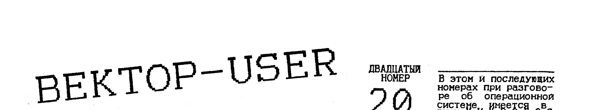

> В этом и последующих номерах при разговоре об операционной системе имеется в виду - МИКРОДОС.

## Цикл (интервью пятое)

Вьюнов Виталий Анатольевич, 19 лет, постоянно проживает в п.Ревда Мурманской области, основное увлечение в жизни - программирование,которое и пытается превратить в профессию.

До того, как я в первый раз увидел ВЕКТОР в работе, я уже знал, что этот ПК является лучшей отечественной серийной бытовой машиной,но увиденное, как я сейчас помню,сильно поразило меня (до этого я программировал на БК-0010.01 и РК-86), и я сразу загорелся желанием приобрести ВЕКТОР, что и сделал в начале 1991 года и о чем до сих пор не жалею.

Перспективы ВЕКТОРА кажутся мне довольно туманными. Несколько продлить жизнь ему сможет переход на процессор Z80, но думаю, что когда в России наступит экономическое возрождение, а это неизбежно, то через три-четыре года домашним ПК многих россиян станет Macintosh, стало быть все армии бесчисленных Sincler'ов, БКашек, ПОИСКов, IBM'ок (шутка) и, как ни печально, ВЕКТОРов прикажет долго жить.

Вообще лично у меня особое, резко негативное отношение к "Coman"у, но независимо от этого я полностью согласен с Лупповым(N15), вызывает мягко говоря недоумение, зачем "Coman" выпустил контроллер несовместимый с кишиневской версией, этим он оказал "медвежью" услугу пользователям ВЕКТОРа и разделил их как бы на два лагеря. По-моему преимущество кишиневского "квазидиск + контроллер" неоспоримо, можно использовать все программное обеспечение ОС СР/М и значительно продлить жизнь дисководу.

В крайнем случае в качестве "стартера для игрушек" можно использовать ОС СР/М39 или Микродос-28. Вообще электронный диск для ПК типа ВЕКТОРа ведь совершенно необходимая, а появление ОС РДС дает владельцам квазидисков еще один большой плюс.Мне кажется,что "Coman" сам загнал себя в угол и теперь при всем желании ему будет не отказаться от своего контроллера так как тогда это придется как-то компенсировать тем, кто приобрел этот КД.

В ближайшее время я буду заниматься программным обеспечением для РДС и видимо постараюсь выпустить к началу 1995 года улучшенную РДС версии 2,0. В аппаратных делах я не шибко силен, но у меня давно созрела идея о новом расширении ОЗУ,которое сделает из ВЕКТОРа просто профессиональный ПК,а после появления адаптера Z80 эта идея может и должна быть реализована. На страницах ВЕКТОР-USER я постараюсь поделиться этой идеей с любителями ВЕКТОРа и особенно с читателями из числа инженеров и всех тех, кто смог бы реализовать ее.Для профессионала это будет не трудно.

Я полностью согласен с Шашковым (N16) в той части,что установка винчестера на ВЕКТОР имеет смысл только после установки Z80,но не согласен в той части,что нельзя использовать винчестер под СР/М. Ведь в СР/М можно использовать винчестер не 8, а 128 Мгб! А ограничение в 8 Мгб касается только логических дисков но не физических (к примеру на РС-совместимых ПК, MS-DOS ограничивает емкость логических дисков в 32 Мгб).А винчестер в 40 Мгб можно, например, разбить на пять логических дисков по 8 Мгб.

Единственной серьезной причиной малого количества хороших и качественных программ для ВЕКТОРа является то, что пользователи упомянутого компьютера не желают платить за эти самые программы столько, сколько они стоят и тому, кто имеет на это право. А ведь процесс создания высококлассной программы это очень и очень нелегкий и непростой труд. Думаю, что если ситуация в этом деле в ближайшее время не изменится, то хорошие программы для ВЕКТОРа вообще прекратят появляться и никакой Z80 уже не поможет.

Хочу пожелать всем пользователям не покупать программы у пиратов, а всем кто еще не обзавелся квазидиском и контроллером (только не "COMAN"овским) с дисководом, обязательно это сделать. Я думаю, что в наше время быть пользователем минимальной конфигурации ВЕКТОРа просто несерьезно. А моя РДС должна добить эту конфигурацию (ПК+магнитофон).

## Резидентная дисковая система

РЕЗИДЕНТНАЯ ДИСКОВАЯ СИСТЕМА (РДС) представляет собой ОС,которая резидентно (постоянно) находится на квазидиске. Это ее основное преимущество и отличие перед всеми остальными ОС (МикроДОС,СР/М) существующими на ВЕКТОРе. РДС спроектирована таким образом, что оставляет пользователю наибольшее количество ОЗУ - в первом режиме, полностью совместимом с СР/М - это 62,5 Кб. Во втором своем режиме работы (специальном, "векторовском", частично не совместимом с СР/М) аж все 64 Кб! Первый режим работы РДС предназначен для работы СР/Мовских программ (POWER, MARGO, REBUS, компиляторы языков высокого уровня и т.д.). Второй режим для тех программ, которые будут и уже разрабатываются специально для ВЕКТОРа Поясню немного последнюю фразу - дело в том, что до появления РДС обыкновенный пользователь приобретя контроллер дисковода, дисковод и квазидиск мало что получал от такой мощной конфигурации своего ПК, в основном ему приходилось пользоваться хотя и богатым, но устаревшим программным обеспечением ОС СР/М времен 80-х годов. Под словом "устаревшим" я подразумеваю здесь в основном архаичный неудобный интерфейс общения программ с пользователем. Получилась ситуация,что один из лучших бытовых компьютеров, с хорошими графическими и музыкальными возможностями получив дисковод, трудится только над тем, что выводит на экран монохромные символы. А ведь наш ВЕКТОР умеет не только это. Но в рамках ОС СР/М или МикроДОС воспользоваться всеми богатыми возможностями ВЕКТОРа очень затруднительно. Вот почему и была написана ОС РДС, и вот почему существует в ней режим номер 2, который оставляет пользователю все ОЗУ ВЕКТОРа (64кб), и позволяет использовать в программах и многоцветную графику, и музыкальный синтезатор, и вообще все, что угодно. Теперь стали возможны такие вещи, как создание библиотек музыкальных и графических функций для существующих компиляторов языков высокого уровня (BASIC,PASCAL,C,FORTH и др.) которые раньше "пылились" без дела у многих пользователей (этим РДС как бы "оживляет" старые программы). В скором времени можно ожидать выход целого ряда новых качественных программ с современным интерфейсом и дизайном, например, мощный текстовый процессор, позволяющий одновременно обрабатывать и графику и текст, или мощный графический полноэкранный редактор с кучей возможностей и, наконец, те же самые игры, с классной графикой и музыкой, речью и многочисленными уровнями, хоть на всю дискету. Подавляющее число программ будет выходить на дискетах, что может способствовать защите их от пиратского тиражирования. Нельзя сказать что некоторые из вышеуказанных вещей вовсе не были возможными скажем из МикроДОС, но там это было сопряжено с немалыми трудностями, а в РДС все это можно делать легко, удобно,по четким правилам и никакой головной боли. В общем, я думаю что обрисовал те возможности, которые открываются перед пользователями ВЕКТОРа с появлением РДС и надеюсь что она действительно вдохнет новую жизнь в наш любимый "Вектор-06Ц". Ниже я приведу некоторые детали, которые могут быть интересными для пользователей и программистов.

Интерфейс взаимодействия пользователя с РДС в первом режиме такой же как и в СР/М, но может быть изменен на более удобный - РДС позволяет это сделать. В отличии от СР/М, РДС не требует обязательного присутствия системного диска в дисководе А:, так как процессор консольных команд находится в файле COMMAND.SYS на диске С:, куда он заносится вместе с файлом OS.COM после форматирования квазидиска при холодном старте РДС. Программирование в РДС ничем не отличается от программирования в СР/М интерес для программиста представляют лишь переключения из одного режима в другой. Все это подробно описано в "РДС. Руководство программиста" поставляемом вместе с РДС. Частичная несовместимость с СР/М во втором режиме означает то, что доступ к некоторым системным таблицам невозможен напрямую, а возможен при обращении к квазидиску. В РДС применен удобный драйвер клавиатуры, который позволяет пользоваться псевдографикой так же как в МикроДОС v3.F.XX, переключение режимов `РУС/LAT` тоже такое же.

Несколько слов о некоторых программах которые продаются вместе с РДС и работают в ней. Это BASIC/D - дисковый v2,5, RETEX/D, REMBRANT/D - дисковый графический редактор РЕМБРАНДТ, MAG - программа обмена информацией между магнитофоном и дисководом во всех форматах, Test & Format - форматирование и восстановление дисков, Vector Commander - дисковая оболочка, игровые дисковые программы - Boulder Dash, Break House и другие программы. Получить полную информацию и приобрести РДС можно по адресу: 184291 п.Ревда Мурманской области а/я 14 Вьюнов В.А.

## Универсальный дизассемблер команд Z80 и 8080

**1. Назначение дизассемблера.**

Программа ZX-INTEL.COM является частью довольно-таки удобного пакета для "передирания" синклеровских игрушек на "Вектор-06Ц". В основе ее лежит программа RESCZ80, модифицированная Е.Филипповым. В результате получился мощный транслятор 100%(!!!) документированных команд Z80, выполняемых 580ВМ80. Для начала это можно убедиться, запустив командный файл DEMOZX.CMD. Все очень просто: вместо команд, отсутствующих на 580-м, вставляются макросы, понимаемые и выполняемые им. Перед командами, которые "не выполняет" 580-й, ставится ремаркирующий знак [;]. Слишком большие макросы заменены соответствующими подпрограммами, находящимися в файле ZX-MACRO.REL. И еще. С помощью этого пакета, и в частности этого дизассемблера, были "содраны" такие программы, как CHESS MASTER, WEST BANK, JUMPING JACK и в работе находятся еще несколько.

**2. Запуск дизассемблера.**

Набрав в командной строке ZX-INTEL и нажав `ВК`, Вы войдете в программу-дизассемблер. На экране появится заставка, дающая информацию об авторах, верхней границе рабочей области памяти и знак [*], приглашающий к вводу одной из команд дизассемблера:

```
TRANSLATOR
Z80 kodes in WM80
TORNADO & YUMAK.COM
V 3.0   25/09/94
Memory open to nnnn
*
```

Далее:-установите стартовый OFFSET 4000h (адрес, с которого физически будет размещаться дизассемблируемая программа):

```
*O 4000
```

-загрузите COM-файл для дизассемблирования:

```
*R <filename.COM>
```

-загрузите (если Вы продолжаете работу) файлы таблиц .SYM, .CTL, .DOC:

```
*R <filename.SYM>
*R <filename.CTL>
*U 6000
*R <filename.DOC>
```

Загруженная в работу программа будет дизассемблироваться с адреса 0100h. Синклеровские программы размещаются и стартуют по другим адресам. Информацию о том, с какого адреса "сидит" программа, можно узнать с помощью SPECTRUM-boot либо из бейсик-загрузчика, в котором может быть указан адрес загрузки программы в память SPECTRUMa, например:

```
RANDOMIZE USR 15619: REM: LOAD "filename" CODE 47800
```

Наш дизассемблер работает с шестнадцатеричными данными, поэтому, проведя пересчет, Вы получите число BAB8h. Далее введите:

```
*J BAB8
*L
```

и Вы увидите начало Вашей программы. Но бывает так, что синклеровские программы стартуют не по адресу загрузки. Тогда опять нужно обратиться к бейсик-загрузчику и узнать адрес старта. Он обычно выглядит так:

```
RANDOMIZE USR <ADDR>.
```

Произведя пересчеты DEC в HEX, Вы получите стартовый адрес программы. Выполнив

```
*L <ADDR>
```

Вы наверняка увидите стартовую часть Вашей программы. Далее - все дело техники и навыков.

При дизассемблировании создаются и используются три таблицы:
- таблица CTL управления выбором способа интерпретации кодов исполняемой программы (это могут быть коды инструкции процессора, коды байтовых или адресных данных);
- таблица SYM символьных меток и соответствующих им адресов для текста программы на языке ассемблера;
- таблица DOC вставляемых программистом текстов комментариев (вместе с адресами команд, перед которыми они должны быть вставлены);

Память для размещения таблицы CTL резервируется в области, занимаемой самой программой ZX-INTEL. Таблица SYM начинается сразу после таблицы CTL, однако ее размер можно изменить с помощью команды O. Таблица DOC необязательна (т.е. может отсутствовать), но перед началом ее использования необходимо указать дизассемблеру начальный адрес для ее размещения в памяти с помощью команды U.

В процессе дизассемблирования объемы названных таблиц изменяются и программист должен позаботиться о таком расположении таблиц в памяти, при котором не происходило бы наложения таблиц друг на друга. Информацию о текущем объеме названных таблиц можно получить с помощью команды ?. Допускается весь процесс дизассемблирования выполнять в несколько этапов, запоминая промежуточные состояния таблиц с помощью команды S в дисковых файлах (их имена программист должен задавать произвольно, но расширения имен должны совпадать с именами, данными выше соответствующим таблицам), а при последующих прогонах программы ZX-INTEL считывать содержимое таблиц в отведенные места оперативной памяти с помощью команды R. (окончание следует)

Юрий Макринский. г.Кишинев (0422) 24-22-18

## Программы для музыкального сопроцессора

из Кирова: GIRL(muz:ROBOCOP,grf:OLGA); REDLINE(muz:AXEL,grf:REDLINE); GOLDAXE(muz:DTRACY,grf:GOLDAXE); KVA-KVA; MAN(семь мелодий); UNKNOWN.

## Взаимодействие Вектора с дисководом (окончание)

При чтении возможно возникновение ошибок. Наиболее часто возникают ошибки "Сектор не найден" и "Ошибка контрольного кода". Разберемся, почему они возникают. Ошибка "Сектор не найден" возникает, если по каким-либо причинам не происходит идентификация сектора. Это случится, например, если в дисковод вставлена неформатированная дискета, неверно позиционирована головка или заголовок сектора поврежден. При чтении контроллер пытается прочитать заголовок сектора с требуемыми параметрами - номером дорожки, стороны и сектора. Если он не будет найден за 10 оборотов диска, устанавливается признак СЕКТОР НЕ НАЙДЕН. Поскольку диск вращается со скоростью 5 об/сек, то для того, чтобы эта ошибка не приводила к зависанию, время выбега двигателя должно быть не менее 2,5 сек (это относится только к контроллеру МикроДОС). Ошибка КОНТРОЛЬНОГО КОДА происходит если, например, загрязнена головка дисковода, неверная юстировка, некачественная запись, наводки, помехи и т.п. Иногда для ее устранения полезно делать несколько попыток чтения сектора. Приведем здесь два варианта программ чтения сектора. Первая из них применяется почти во всех программах, работающих с диском (по-видимому, она ровесница ДОС). Вторая была разработана в Омском центре программирования и применяется в Универсальном загрузчике Spase. Будем считать, что мотор запущен и регистры Track и Sector содержат верные параметры.

```
RSEKT:  DI              ;Запр. прерывания-критично по времени
        LXI     H,BUF   ;HL-адрес буфера,кратн. 256
        MVI     A,READSCT;Команду READSCT пошлем в
        OUT     COMMAND ;регистр команд.
RRDY :  IN      STATUS  ;Ожидаем начало выполнения:
        RRC             ;Выделим бит выполнения
        CNC     RRDY    ;Он сброшен-ждем.
        MVI     B,2     ;Маска бита ЗАПРОС ДАННЫХ
        LDA     SCTSIZE ;Читаем код размера сектора
                        ;(записать сюда заранее)
        DCR     A       ;=1?
        JZ      R256    ;Да, сектор в 256 байт
        DC      A       ;=2?
        JZ      R512    ;Да, сектор в 512 байт
                        ;Иначе-1024 байта
R1024:  IN      STATUS  ;Читаем статус
        ANA     B       ;Выделяем бит запроса данн.
        JZ      R1024   ;Он сброшен-запроса нет.
        IN      DATA    ;Читаем порт данных
        MOV     M,A     ;Записываем в ОЗУ.
        INR     L       ;Инкрементируем смещение
        JNZ     R1024   ;256 байт еще не прочитаны
        IN      H       ;Читаем следующие 256 байт
R768 :  IN      STATUS  ;Читаем статус
        ANA     B       ;Выделяем бит запроса данн.
        JZ      R768    ;Он сброшен-запроса нет.
        IN      DATA    ;Читаем порт данных
        MOV     M,A     ;Записываем в ОЗУ
        INR     L       ;Инкрементируем смещение
        JNZ     R768    ;256 байт еще не прочитаны
        INR     H       ;Читаем следующие 256 байт
R512 :  IN      STATUS  ;Читаем статус
        ANA     B       ;Выделяем бит запроса данн.
        JZ      R512    ;Он сброшен-запроса нет.
        IN      DATA    ;Читаем порт данных
        MOV     M,A     ;Записываем в ОЗУ
        INR     L       ;Инкрементируем смещение
        JNZ     R512    ;256 байт еще не прочитаны
        INR     H       ;Читаем следующие 256 байт
R256 :  IN      STATUS  ;Читаем статус
        ANA     B       ;Выделяем бит запроса данн.
        JZ      R256    ;Он сброшен-запроса нет.
        IN      DATA    ;Читаем порт данных
        MOV     M,A     ;Записываем в ОЗУ
        INR     L       ;Инкрементируем смещение
        JNZ     R256    ;256 байт еще не прочитаны
REND :  IN      STATUS  ;Ждем завершения
        RRC             ;Завершено?
        JC      REND    ;Нет еще. Ждем.
        IN      STATUS  ;В аккумуляторе-код заверш.
```

Очевидно, что приведенная выше программа обладает недостатками. Основной из них - требование заранее знать размер сектора и размещать его по адресу, кратному 256 байт. Да и размер ее довольно велик. Ниже предлагается программа, работающая по так называемому паритетному алгоритму.

```
RSECT:  LXI     H,BUF   ;HL-адрес буфера
        DI
        MVI     A,READSCT
        OUT     COMMAND
RRDY :  IN      STATUS
        RRC
        JNC     RRDY    ;до этого места-аналогично
        MVI     B,3     ;ВЫПОЛНЕНИЕ и ЗАПРОС ДАННЫХ
        JMP     LOOP2   ;Обходим участок...
LOOP1:  MOV     M,A     ;Заносим байт в ОЗУ
        INX     H       ;Инкремент адреса
LOOP2:  IN      STATUS  ;Читаем статус
        ANA     B       ;Выделим нужные биты
;Флаг паритета процессора = 0, если только
;один из двух выделенных битов - еденичный.
;Так как ситуация,при которой ВЫПОЛНЕНИЕ=0,
;а ЗАПРОС ДАННЫХ=1 невозможна, то(PF=0)обо-
;значает, что команда еще выполняется и за-
;проса данных нет.
        JPO     LOOP2
        IN      DATA    ;Читаем порт данных
;Флаг паритета будет равен 1, если либо оба
;выделенных бита = 1, и тогда нужно обработать запрос данных,либо оба = 0, и тогда
;выполнение команды закончено. Но в послед-
;нем случае дополнительно флаг Z=1. Поэтому
        JNZ     LOOP1
        IN      STATUS  ;На вых.в аккум.-код заверш.
```

Поскольку выполнение команды когда нибудь заканчивается, эта программа не "зависает", если не найден сектор, как предыдущая. Кроме того, она значительно короче.

Операция записи выполняется на всех контроллерах, кроме "Криста-2", аналогично. Приведем здесь паритетный вариант программы записи сектора.

```
WSEKT:  LXI     H,BUF
        DI
        MVI     A,WRITEST
        OUT     COMMAND
        IN      STATUS
        RRC
        JNC     $-3
        MVI     B,3
LOOP :  IN      STATUS
        ANA     B
        JPO     LOOP
        MOV     A,M     ;Эти команды
        OUT     DATA    ;на флаги процессора
        INX     H       ;не влияют.
        JNZ     LOOP
        DCX     H       ;Был лишний инкремент
        IN      STATUS
```

Шашков В.А. г.Омск

## Часы реального времени

Итак, почти вся необходимая информация у Вас есть. Остались мелочи. Дни недели кодируются так: 1-понедельник, 2-вторник и т.д. Год задается двумя младшими цифрами, например 1994 год записывается как 94. Все значения должны заноситься в формате, установленном в соответствующих разрядах регистра B. Например десятичному числу 11 соответствует 00001011(0BH) в двоичном и 00010001(11H) в двоично-десятичном формате. Каждую секунду 512 ВИ1 обновляет информацию о времени (первый раз обновление произойдет спустя 0,5 сек. после записи нуля в старший разряд регистра B). Внутренняя логика м/сх автоматически учитывает количество дней в месяце, различая високосные и невисокосные годы. Однако программист обязан правильно задать начальные значения. Это относится не только к дате, но и к другим величинам. Нельзя, например, в ячейку минут записывать число большее 59. Одновременно с обновлением информации о времени заданное время сравнивается с текущим. Следует иметь в виду, что если в любую из ячеек будильника записан код, содержащий еденицы в двух старших разрядах (0C0H...0FFH) она переходит в безразличное состояние и не учитывается при сравнении с текущим адресом. Например, если записать код безразличного состояния по адресу 05H, то будильник будет срабатывать в заданную минуту и секунду каждого часа. После считывания регистра C все его разряды автоматически сбрасываются в ноль. Еденицы в этих разрядах появляются вновь после очередного наступления соответствующих событий и будет сохраняться только до следующего считывания. Так что если необходимо неоднократно анализировать состояние различных разрядов этого регистра, то после считывания нужно сохранить его копию и затем проверять отдельные разряды.

В заключение рассмотрим схему подачи звукового сигнала при срабатывании будильника. Для того, чтобы эта схема срабатывала, в регистр B должны быть записаны еденицы в разряды AIE и SQWE и нули в разряды UIE и PIE. Желаемая высота звука (частота сигнала на выводе SQW) задается разрядами RS регистра A. При совпадении заданного времени срабатывания будильника с текущим временем на выходе IRQ устанавливается низкий логический уровень, разрешающий прохождение сигнала со входа элемента ИЛИ-НЕ, соединенного с выводом SQW на его выход. Одновременно начинается разрядка конденсатора C1 через резистор R2. Как только напряжение на входе RESET достигнет низкого логического уровня, восстанавливается высокий уровень на выходе IRQ и звуковой сигнал прекращается. Длительность сигнала определяется постоянной времени цепочки R2C1. В любой момент его можно прекратить, нажав кнопку SB1.


Сергей Дудкин г.Омск

## Возможный поиск неисправностей в ПК

В вычислительных системах при выполнении программы отсутствуют периодические сигналы и осциллограф показывает случайные последовательности двоичных сигналов, которые меняются логическими состояниями в произвольные моменты времени. Для запуска осциллографа требуется какой-нибудь синхронизирующий сигнал, а сигналы нерегулярно изменяющие свое состояние препятствуют принятию осмысленных решений. При анализе линии шины данных или шины адреса даже двухканальный осциллограф, как регистрирующий прибор, бесполезен, так как показывает процесс происходящего только на отдельных линиях шины адреса или шины данных. С помощью простой программы, которая образует периодические сигналы, можно осциллографом проверить, например, все 8 линий выходного порта и сделать для себя соответствующие выводы.

```
        MVI     A,00H   ;Сброс регистра A в ноль.
LOOP:   OUT     01      ;пересылка этого значения в
                        ;выходной порт с адресом 01.
        INR     A       ;Инкрементируем регистр A.
        JMP     LOOP
```

В программе реализован бесконечный цикл и выводимые в порт данные проходят последовательности от 00 до FF, происходит сброс на 00 и все начинается сначала.

Фиронов В.П. г.Москва

> В связи со взятием долларом четырехтысячной отметки публикуем новые цены на 1995г
>
> контроллер НГМД+гам-диск (ру5) - 29 $
> собраны на 2-х платах: (9Х15) и (12Х15) по кишиневским схемам, заново разведены.
>
> печатные платы вышеуказанного пункта - 8 $
>
> контроллер НГМД+AY8910+гам-диск (ру7) - 35 $
> все схемы публиковались в ВЕКТОР-USER и разведены на одной плате (12Х18).
>
> печатная плата вышеуказанного пункта - 9 $
>
> \*модем - аон (готовое изделие) - 16 $
>
> \*модем - аон (конструктор) - 9 $
>
> \*модем add1200 (готовое изделие) - 16 $
>
> \*адаптер Z80 (запуск Sinkler-дисков) - 32 $
>
> \*программатор (счетмаш) - 19 $
>
> \*блок герконовой клавиатуры (счетмаш) - 20 $
>
> шлейф для дисковода - 4 $
>
> универсальный загрузчик (м/сх 2716) - 2 $
>
> "музыкалка" (схема В.А.Шашкова)
> - печатная плата - 2 $
> - все кроме AY8910 - 5 $
> - готовый к работе - 9 $
>
> каталог с ценами на П/О - от 1 т.р до 1,5 $
>
> за небольшие комиссионные оказываем услуги по приобретению различных электронных комплектующих на московских радиорынках.
> Всегда рады материалам по ПК "Вектор-06Ц" и всегда публикуем их с рекламой автора. Отмеченное "\*" высылается после т.звонка. Почтовые расходы по России составляют 11% от стоимости товара, не считая программ.
>
> 117335 москва а/я 101 В.П.Фиронов т:1287318

## Письма читателей

из письма: "... приобрел у вас адаптер Z80, не говоря уже, что замучился его подключать, но после подключения он работает минут пять а потом "зависает". Деньги назад требовать неохота, вещь вроде неплохая. Что делать? Подскажите."

Отвечаем: Большого мучения при подключении адаптера нет. Если бы емкостная клавиатура не перекрывала собой процессор, герконовая здесь идеальна, всей работы - выкусить 580-й и впаять панельку, ну еще три провода припаять к плате Вектора. На адаптере Z80 установлен на недоброкачественной панельке и от встряхивания (стук по клавиатуре) выводы Z80 "гуляют" по панельке, в результате чего и происходят "зависы". Понятно, что адаптер сразу дает возможность приобщиться к тысячам игр, но старайтесь не стучать по клавиатуре очень сильно.

из письма: "...после приобретения адаптера Z80 стал независим от капризов программистов пишущих, вернее, непишущих для Вектора, и чего-то ждущих от пользователей. С нетерпением жду от Фролова версию ZX-эмулятора для 128-го Sinkler'a. Хотя и в 48-ом программ хватает. Большое спасибо." Вот так.
