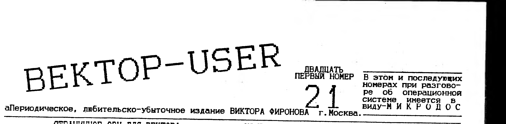

> В этом и последующих номерах при разговоре об операционной системе имеется в виду - МИКРОДОС.

## Страничное ОЗУ для Вектора

**1.Зачем это нужно?**

Предлагаю вниманию владельцев ПК "Вектор-06ц" описание устройства блока страничного ОЗУ для нашего компьютера. Владельцы ВЕКТОРОВ могут сразу же задать вопрос, - а зачем ВЕКТОРУ новый блок расширения ОЗУ, если уже есть квазидиск? Дело в том, что квазидиск (RAM-диск или электронный диск) задумывался разработчиками компьютера прежде всего как устройство внешней памяти, эмулирующее НГМД, а не как расширение ОЗУ, но в него заложили разработчики при разработке возможность работы с памятью квазидиска, как с обычной памятью компьютера, но эта возможность весьма ограничена и была введена только для поддержки работы операционной системы. Поэтому нельзя рассматривать квазидиск как полноценное расширение ОЗУ. Однако до сих пор владельцы ВЕКТОРА мало ощущали отсутствие такого расширения для своего компьютера, ведь морально устаревший процессор ВМ580 был довольно медленноват для ряда специфических задач например, он явно не справляется с теми 32-мя килобайтами видеопамяти, которые обеспечивают широкие графические возможности нашего ВЕКТОРА. Но с появлением адаптера процессора Z80 для ВЕКТОРА, ситуация кардинально изменилась, теперь быстрому и мощному процессору станут явно тесноваты те 64 килобайт основной памяти которые установлены на ВЕКТОРЕ, да и использовать все те замечательные возможности, которыми обладает Z80, без расширения ОЗУ, будет просто невозможно.

**2.Устройство блока расширения ОЗУ.**

При разработке этого блока расширения весьма важно не упустить следующий момент: появление этого нового блока расширения ОЗУ не должно отвергать старое программное обеспечение! Поэтому, весьма разумным будет объединение двух устройств - блока страничной памяти и квазидиска - в одно. Это будет важно как с точки зрения подключения этого блока к компьютеру, так и с точки зрения программного обеспечения. Таким образом это будет два независимых устройства, с раздельной памятью, объединенные на одной плате. Конечно, весьма разумным будет собрать все это дело на 16-ти микросхемах 565РУ7, тогда плата устройства получится достаточно компактной. Описание квазидиска я здесь приводить не буду, а вот описание устройства модуля страничной памяти с точки зрения программиста попробую сделать. Оно представляет собой 16 независимых и равноценных страниц памяти по 16 килобайт подключаемых к четырем окнам в основной памяти компьютера (смотри рисунок).

```
        ────────────────── 0FFFFh
        ... окно N 3 ...
        ────────────────── 0C000h
        ... окно N 2 ...
        ────────────────── 8000h
        ... окно N 1 ...
        ────────────────── 4000h
        ... окно N 0 ...
        ────────────────── 0000h
```

Активностью окон управляет системный регистр с адресом 40Н. Биты D4-D7 не используются, бит D0 управляет окном 0, D1 - окном 1 и т.д. Ноль в бите управления окном означает, что окно не активно (то есть по этим адресам идет работа с основной памятью ВЕКТОРА), а единица в бите означает, что по этим адресам подключена страница, номер которой находится в регистрах номеров страниц. Это порты с адресами 41Н и 42Н. Порт 41Н содержит номера страниц окон 0 и 1, а порт 42Н содержит номера страниц окон 2 и 3 (смотри рисунок).

**Порт 41Н.**

| Биты | Назначение |
|---|---|
| D7-D4 | номер страницы окна 1 |
| D3-D0 | номер страницы окна 0 |

К примеру, нужно подключить к окну N1 страницу N5, к окну N2 страницу N8, а к окну N3 страницу N12. Ниже приведен фрагмент программы на ассемблере, показывающий, как это сделать.

```
        MVI     A,00001110B     ;включаем окна 1, 2 и 3.
        OUT     40H
        IN      41H             ;номер страницы окна N0
        ANI     0FH             ;без изменения.
        ORI     50H
        OUT     41H
        MVI     A,0CBH
        OUT     42H
        ;теперь по адресам с 4000h по 0FFFFh подклю-
        ;чена память квазидиска.
```

С аппаратной точки зрения ясно, что биты порта 40Н, активизирующие окна, должны управлять соответствующими микросхемами, которые должны осуществлять "подмену" выбранного адресного пространства основной памяти компьютера, памятью модуля страничной памяти. Биты портов номеров страниц должны по временным интервалам (RAS и CAS) подаваться на адресные входы A7 и A8 микросхем 565РУ7 (напомню, что эти микросхемы имеют адресные входы с A0 по A8). Перечислю еще то, что должен делать модуль страничной памяти:

1) не конфликтовать с квазидиском;
2) должен очищать биты порта 40Н после нажатия клавиш `БЛК`+`ВВОД`.

**3.Заключение.**

Итак, уважаемые пользователи ВЕКТОРА, прочитав данную статью, возможно кто-то из Вас и возьмется за реализацию высказанной идеи в виде конкретного "железа". Польза от этого всем владельцам ПК "Вектор-06Ц" будет несомненна. Чем раньше модуль страничной памяти появится на рынке периферии для этого компьютера, тем лучше. Тогда можно будет написать по настоящему эффективную операционную систему, и воспользоваться, с помощью страниц по 16 килобайт, замечательной возможностью процессора Z80 - исполнять перемещаемый код, при создании нового высококачественного программного обеспечения.

Вьюнов В.А. Мурманская область.

## Некоторые советы начинающим программистам

Компьютер не сможет преобразовать программу написанную на ассемблере в машинный код без информации о том, в какой области памяти будет находиться программа. Эта информация должна задаваться до начала ассемблирования и называется директивой ассемблера. С помощью соответствующей директивы ассемблера любой переменной, к которой в исходной программе имеются обращения по символическому имени, должно быть присвоено численное значение.

## Универсальный дизассемблер команд Z80 и 8080

В приводимом ниже списке команд дизассемблера приняты следующие обозначения:

hh - шестнадцатеричные числа-абсолютные байтовые значения;

nnnn, mmmm - шестнадцатеричные числа-абсолютные адреса;

метка - символьная метка-начинающаяся с буквы строка букв и цифр, может содержать символ подчеркивания;

адрес - шестнадцатеричное число или выражение вида .метка;

файл - присваиваемое программистом имя файла.

Замечание: команды дизассемблера не должны содержать пробелов внутри себя - в описании команд пробелы используются только для удобства чтения.

**3.Команды дизассемблера.**

- **?** - на экран выводится информация о размещении в памяти всех таблиц дизассемблера и текущий адрес обработки кодов программы.
- **;[nnnn]** - на экран выводится содержимое таблицы комментариев DOC, начиная с того элемента, который относится к адресу nnnn (если операнд опущен, то на экран выводится все содержимое таблицы комментариев).
- **;nnnn, [комментарий]** - заданному адресу предпосылает указанный комментарий-удаляя тем самым прежний комментарий для этого адреса; если текст комментария вообще отсутствует, то просто удаляется прежний комментарий для заданного адреса; символ "\" в тексте комментариев интерпретируется как признак перехода на новую строку.
- **B[nnnn] [,mmmm]** - просматривается заданная область кодов программы, для каждого абсолютного адреса kkkk, встретившегося в инструкции процессора, в таблицу SYM добавляется символическая метка стандартного вида Lkkkk, одновременно выполняется команда L с теми же самыми операндами.
- **C[nnnn]** - на экран выводится содержимое таблицы CTL, начиная с адреса, не меньшего величины nnnn (если операнд опущен, то выводится содержимое всей таблицы CTL).
- **C адрес, переключатель** - в таблицу CTL добавляется запись, что с данного адреса коды программы интерпретируются в соответствии с указанным переключателем, который может принимать следующие значения:
  - B - начать байтовую интерпретацию (тип DB);
  - E - прекратить интерпретацию вообще (END);
  - I - начать интерпретацию инстр. процессора;
  - K - удалить из CTL запись для задан. адреса;
  - S - объявить начало резервируемой области;
  - T - начать символьную интерпретацию (ASCII);
  - W - начать адресную интерпретацию (тип DW);
- **D=hh** - устанавливает число строк, выводимых на экран последующими командами D (по умолчанию выводит на экран 10 строк).
- **D[nnnn] [,mmmm]** - на экран выводится HEX-представление заданной области кодов программы по 16 байт в каждой строке, если опущен 1й операнд, то за начало области принимается текущий обрабатываемый байт программы, если опущен 2й операнд команды, то на экран выводится назначенное, или умалчиваемое число строк.
- **DS[.метка]** - вывести на экран содержимое таблицы SYM (начиная с заданной метки, либо всей целиком, если метка опущена).
- **E nnnn, .метка** - добавить в таблицу SYM заданное символьное обозначение для указанного адреса; в результате метка имеет вид: имя метки nnnn; одному адресу может соответствовать несколько символьных обозначений хотя при формировании выходного файла командой L будет использоваться лишь одна метка, самая первая в алфавитном порядке; макс. длина вводимой метки-10 символов.
- **F[nnnn] [,mmmm]** - просматривать коды программ начиная с адреса mmmm (если он опущен, то начиная с адреса 0100Н), в поисках адресной константы nnnn (если она опущена, то ведется поиск константы, которая была указана в предыдущей команде F); поиск прекращается при нажатии любой клавиши.
- **J nnnn** - пересчитывает OFFSET и устанавливает адрес для L равным nnnn.
- **K .метка** - из таблицы SYM удаляется заданная метка; имя метки вводится полностью.
- **L=hh** - устанавливает новое умалчиваемое число строк выводимых на экран последующими командами B или L (по умолчанию ZX-INTEL выводит на экран 10 строк).
- **L[nnnn] [,mmmm]** - выполняются вывод на экран и дизассемблирование исходного текста на языке ассемблера для кодов программы, начиная с адреса nnnn (если он опущен, то с текущего адреса обработки) до адреса mmmm (если он опущен, то обеспечивается вывод на экран установленного числа строк исходного текста). Замечание: нажатие на консоли любой клавиши прекращает вывод информации и заканчивает выполнение команды дизассемблирования.
- **O[nnnn]** - устанавливает начальный адр. OFFSET изначально OFFSET=0000h.
- **P nnnn, mmmm** - формирует "пролог" программы, состоящей из оператора ORG 100H и из операторов EQU для всех адресов, не принадлежащих области с заданными шестнадцатеричными границами.
- **Q** - префикс, употребление которого перед именем любой другой команды отменяет вывод информации на экран (однако, сообщения об ошибках выдаются и в этом случае). Замечание: параллельного вывода информации в файл типа .ASM на языке ассемблера префикс Q не отменяет.
- **R файл.COM** - заданный файл считывается в область кодов программы; на экран выводится адрес первого свободного байта памяти.
- **R файл (.CTL или .DOC или .SYM)** - содержимое заданного файла считывается в область памяти, предназначенную для соответствующей таблицы дизассемблера (соответственно CTL, DOC или SYM), при этом для таблицы DOC необходимо командой U предварительно задать ее начальный адрес.
- **S файл.ASM** - открывает на диске указанный файл; в этот файл будут последовательно записываться результаты дизассемблирования для последующих команд B, L, P; закрывается названный файл при достижении элемента E в таблице, либо командой Z.
- **S файл (.CTL или .DOC или .SYM)** - в указанный файл записывается текущее содержимое таблицы, имя которой совпадает с заданным расширением имени дискового файла.
- **U[nnnn]** - устанавливает значение nnnn в качестве начального адреса таблицы DOC (если операнд опущен, то на экран выводится используемый начальный адрес таблицы DOC); перед началом ввода комментариев программист обязан задать начальный адрес таблицы DOC с помощью данной команды дизассем.
- **X** - удаляется содержимое всех таблиц дизассем.
- **Z** - выводит на экран оператор END и закрывает ранее открытый файл типа .ASM.

**4.Сообщения дизассемблера.**

Во время работы дизассемблер выдает следующие сообщения об ошибках:

- `cannot close file` - при неудачном завершении попытки закрыть файл (например, если нет места для записи файла).
- `Command ignored: Enter "Unnnn" to tell ZX-INTEL the start of comments table!` - при попытке формирования комментария без предварительного задания адреса начала таблицы DOC.
- `CTL table out of order` - при обнаружении ошибки в теле таблицы CTL.
- `don't access file until ASM file is closed` - при попытке чтения файла в то время, когда еще не закончен вывод файла с исходным текстом на языке ассемблера.
- `File not found` - при попытке читать файл отсутствующий на дисках системы.
- `source file in use: use Z command or E entry in CTL table to close it` - при попытке выйти из дизассемблера, когда еще не закончен вывод файла с исходным текстом на языке ассемблера.
- `Unexpected end of file` - при попытке прочитать в память файл, длина которого превышает допустимый для него объем.
- `write protected` - при попытке удалить (перезаписать) файл, у которого установлен атрибут R (только для чтения).

АВТОРЫ ПАКЕТА: Юрий Макринский и Влад Федоров.

По всем вопросам "передирания" программ и приобретения пакета обращаться в Кишиневский "ЦК" по телефону (0422) 24-22-18 с 10.00 до 18.00

## "R-SOUND"

В последнее время все больше разных моделей ПК стали оснащаться музыкальными сопроцессорами AY-3-8910 или их функциональными аналогами YAMAHA YM 2149 F, позволяющими значительно украсить звуковое сопровождение игровых и других программ всевозможными музыкальными и шумовыми эффектами, превосходящими те, что может выдать наш "Вектор-06Ц", в котором в качестве трехканального генератора звука используется таймер КР580ВИ53, не позволяющий в силу специфики своей работы регулировать громкость, создавать шумы и различные звуковые эффекты, легко получаемые AY-3-8910. Были попытки некоторых программистов при помощи программных ухищрений добиться регулировки громкости, но я не могу назвать их успешными, ибо "рожденный ползать, летать не может" (это о ВИ53).

Для расширения звуковых возможностей "Вектора" мной была разработана простая, дешевая и надежная система подключения сопроцессора к компьютеру через разъем "ПУ", не требующая собственного источника питания, названная "R-SOUND".

Плата "R-SOUND" путем сопряжения музыкального сопроцессора AY-3-8910 или его аналога с БПЭВМ "Вектор-06Ц" позволяет значительно украсить игры и другие программы новым, ранее ошеломляющим стереофоническим звучанием, несравнимым по красоте с ВИ53. Для нормальной работы требуется минимальная доработка "Вектора", которую может сделать любой, даже не подготовленный пользователь. На плате имеется разъем для подключения звуковых выходов к стереоусилителю или магнитофону. Разработка сохраняет работу музыкального "синтезатора" компьютера, благодаря чему на "Векторе" возможно создание семиканальной музыки, украшенной звучанием тарелок и прочими звуковыми эффектами, красота которых может быть ограничена лишь фантазией программиста. Если Вы слышали, как звучит Sinkler-128 или другие Spectrum-совместимые компьютеры, оснащенные сопроцессором, то Вы знаете какой неподражаемый звук можно создать с его помощью.

Плата размером 58х67 мм. имеет собственный генератор тактовой частоты, место для установки второго гнезда "ПУ", что удобно для пользователей, подключивших к разъему принтер или джойстики, т.е. совершенно "прозрачна" для этой периферии. Тактовая частота 1.7734 МГц, подаваемая на сопроцессор, позволяет программистам при написании собственных программ использовать блоки данных из программ, написанных для ZX-SPECTRUM или других ПК с сопроцессором. Частота музыкального тона останется такой же, как на компьютере оригинале, что особенно важно при создании музыкальных редакторов. Вопрос о "правильной" тактовой частоте вызывает много ненужных споров. Верная такт. частота, подаваемая на сопроцессор - 1.7734 МГц и в этом легко убедиться, расшифровав таблицу коэффициентов деления, взяв ее из любой программы для ZX-SPECTRUM-128, в которой есть обращение к сопроцессору. Система программно не "конфликтует" ни с одним из известных мне периферийных устройств массового применения и позволяет в полной мере производить обмен данными между компьютером и сопроцессором, осуществлять программный и аппаратный (нажатие `ВВОД`+`БЛК`) сброс программируемого генератора звука, а также пользоваться звуковыми возможностями "родной" ВИ53-й через совмещенный аудиовыход, получая тем самым семь каналов звука, четырьмя из которых можно управлять только по частоте, а оставшиеся три управляются по:

- частоте, каждый канал отдельно (ККО);
- громкости, ККО;
- наличию/отсутствию тона, ККО;
- наличию/отсутствию шумов, ККО;
- частоте шума, все каналы вместе (ВКМ);
- част. изменения амплитуды (огибающей), ВКМ;
- рисунку огибающей (атака, затухание), ВКМ.

**ТЕХНИЧЕСКИЕ ХАРАКТЕРИСТИКИ "R-SOUND" v.4.1:**

- Тактовая частота - 1.7734МГц ± 1%
- Частотный диапазон звучания - 27-110837 Гц
- Музыкальный диапазон звучания - от "ЛЯ" субконтр до "ДО" 6 октавы
- Количество каналов выхода звука - 7
  - из них принадлежит сопроцессору - 3
  - принадлежит компьютеру - 4
- Количество уровней громкости - 16
- Диапазон генерации шума - 3575 - 110837 Гц
- Количество форм звуковых эффектов - 8
- Частота звуковых эффектов - 0,1 - 6927 Гц
- Напряжение питания - +5в

Плата сопряжения с установленной на ней сопроцессором имеет два разъема, один для подключения к гнезду "ПУ", другой-обычное пятиконтактное гнездо для соединения смешанных аналоговых выходов сопроцессора и таймера со стереоусилителем посредством соединительного шнура. Для совмещения аудиовыходов компьютера и сопроцессора в компьютере необходима небольшая переделка: припаяйте к любой ножке конденсатора C58 (выход на магнитофон) экранированный провод, другой конец которого пустите на контакт B01 "ПУ", а дорожку, идущую к этому контакту, обрежьте. Тем самым Вы подключите к контакту B01 сразу четыре канала выхода звука вместо одного как было раньше. Сейчас многие программисты в разных местах СНГ пишут программы, ориентированные на систему "R-SOUND" и количество программ постоянно растет. В основном это демо-программы. Не исключено, что и пользователи, собравшие своими руками плату сопряжения сопроцессора с компьютером, захотят попробовать себя в программировании музыки при помощи сопроцессора, так как это большой сложности не представляет. Мной написана брошюра, подробно описывающая программирование сопроцессора, желающие попробовать себя в написании музыкальных программ могут написать мне. Для программистов, знакомых с программированием сопроцессора на примере платы "SOUND TRECKER" сообщу лишь правила программирования "R-SOUND", для того, чтобы в программах присутствовали обращения к обоим типам плат.

**ПРОГРАММИРОВАНИЕ "R-SOUND".**

На плате сопряжения ПГЗ с "Вектором" находится разъем, предназначенный для подключения к гнезду "ПУ" компьютера, и тем самым обеспечивающий связь между ПК и сопроцессором при содействии внешнего порта ввода/вывода D27. Программистам эта микросхема известна, как порты 5, 6 и 7. Управление режимами работы микросхемы (запись/чтение, выбор регистра, автономная работа) осуществляется при помощи комбинаций состояний двух шин микросхемы: BC1 и BDIR. В плате "R-SOUND" для этих сигналов предусмотрены следующие соединения:

- 1-й бит порта 5 - BC1
- 2-й бит порта 5 - BDIR
- 3-й бит порта 5 - RESET

Обмен данных между ПГЗ и компьютером происходит через посредство 6-го порта. Таким образом меняя числовые комбинации на выходе 5го порта и производя запись/считывание данных из 6-го порта можно программировать звук в сопроцессоре и осуществлять программный его сброс. Аппаратный сброс происходит при помощи клавиш `ВВОД`+`БЛК`.

Управляющие слова (или стробы) идущие на сопроцессор из 5-го порта должны идти одновременно с выдачей (считыванием) данных в 6-ом порту. Порядок следования сигналов (строб, затем данные или данные, затем строб) может быть любым, важно, чтобы между ними не было ощутимого разрыва во времени (пять и более циклов).

**ФОРМАТ УПРАВЛЯЮЩИХ СЛОВ.**

Разумеется, для успешного программирования сопроцессора необходимо предварительно задать управляющее слово для внутреннего порта ввода/вывода компьютера, обеспечив тем самым его работу в том или ином режиме. Так, последовательность команд

```
MVI     A,88H
OUT     4
```

подготовит порт для записи данных в сопроцессор, а последовательность

```
MVI     A,8AH
OUT     4
```

позволит в дальнейшем считывать информацию из текущего регистра ПГЗ. Ниже приведен формат управляющих слов, адресуемых сопроцессору через 5-й порт и воздействующих на шины BDIR и BC1 и обеспечивающих правильную работу.

| Управляющее слово | Функция сопроцессора |
|---|---|
| 02 | Чтение из текущего регистра. |
| 04 | Запись данных в текущий регистр. |
| 06 | Выбор регистра. |
| 08 | Программный RESET (сброс). |

На простейших примерах это будет выглядеть так

```
MVI     A,6     ;Загружаем в аккумулятор слово выбо-
OUT     5       ;ра регистра, выдаем его в 5-й порт.
MVI     A,NREG  ;в аккумуляторе - номер регистра со-
OUT     6       ;процессора, выдаем его в 6-й порт.
                ;Регистр выбран и стал текущим.
MVI     A,4     ;В А - слово для записи данных в ПГЗ,
OUT     5       ;выдаем его в 5-й порт, заносим в А
MVI     A,DATA  ;данн. для пересылки в текущий ре-
OUT     6       ;гистр и отсылаем их сопроцессору.
MVI     A,2     ;В А - управляющее слово для считыва-
OUT     5       ;ния данных из текущего регистра, вы-
IN      6       ;даем его в 5-й порт и считываем со-
                ;держимое регистра посредством 6-го.
MVI     A,8     ;В А - управляющее слово для сброса
OUT     5       ;ПГЗ, отсылаем его в 5-й порт, сопро-
                ;цессор прерывает работу и обнуляет
                ;все регистры.
```

Разумеется, вместо команды MVI A,DATA может быть любая другая команда, загружающая аккумулятор либо из памяти, либо из какого-нибудь регистра микропроцессора. Важно помнить, что между засылкой управляющего строба в 5-й порт и выдачей данных в 6-й не прошло много времени, потому что сопроцессор может принимать и передавать данные только в тот момент, когда на шинах управления (BDIR и BC1) присутствует строб управляющего слова. Ниже приведены коэффициенты деления такт. частоты 1.7734 МГц, позволяющие тональным генераторам сопроцессора охватить весь музыкальный диапазон звучания.

| Нота | Суб-контр октава | Контр-октава | Больш. октава | Малая октава | 1-я октава | 2-я октава | 3-я октава | 4-я октава | 5-я октава |
|---|---|---|---|---|---|---|---|---|---|
| ДО | | 0D3DH | 069FH | 034FH | 01A8H | 00D4H | 006AH | 0035H | 001AH |
| ДО# | | 0C80H | 0640H | 0320H | 0190H | 00C8H | 0064H | 0032H | 0019H |
| РЕ | | 0BCCH | 05E6H | 02F3H | 0179H | 00BDH | 005EH | 002FH | 0018H |
| РЕ# | | 0B22H | 0591H | 02C8H | 0164H | 00B2H | 0059H | 002CH | 0016H |
| МИ | | 0A82H | 0541H | 02A0H | 0150H | 00A8H | 0054H | 002AH | 0015H |
| ФА | | 09EBH | 04FFH | 027BH | 013DH | 009FH | 004FH | 002BH | 0014H |
| ФА# | | 095DH | 04AEH | 0257H | 012CH | 0096H | 004BH | 0025H | 0013H |
| СОЛЬ | | 08D6H | 046BH | 0235H | 011BH | 008DH | 0047H | 0023H | 0012H |
| СОЛЬ# | | 0857H | 042CH | 0216H | 010BH | 0085H | 0043H | 0021H | 0011H |
| ЛЯ | 0FBEH | 07DFH | 03F0H | 01F8H | 00FCH | 007EH | 003FH | 0020H | 0010H |
| СИЬ | 0EDCH | 076EH | 03B7H | 01DCH | 00EEH | 0077H | 003BH | 001EH | 000FH |
| СИ | 0E07H | 0703H | 0382H | 01C1H | 00E0H | 0070H | 0038H | 001CH | 000EH |

После появления возможности замены 580-го на Z80 адаптация программ для этого МП не составит такого труда как раньше, и в скором времени в этом можно будет убедиться. Так уж сложилось, что плата "R-SOUND" является не первой и не единственной из существующих на "Векторе". Существует еще "SOUND TRACKER", созданный в г.Кирове, который пользуется большим спросом чем "R-SOUND", но все равно надеюсь, что программисты, пишущие программы для "SOUND TRACKER", будут вставлять в свои программы обращения и для "R-SOUND".

Желающие иметь готовые платы "R-SOUND", комплектующие для их изготовления, программное обеспечение, сопутствующую информацию, могут получить их, выслав в мой адрес заявку, чистый конверт с марками и обратным адресом.

Хочу поблагодарить всех известных и неизвестных мне программистов и пользователей за программную поддержку, разумную критику и дельные советы по улучшению характеристик схемы. Мой адрес: 222120 Республика Беларусь, г.Борисов, ул.Гагарина д.67, кв.157.

Костиневич Руслан Л. (01777) 50-146.

> НАЧИНАЕМ ИЗУЧЕНИЕ СПРОСА, А С СЕРЕДИНЫ МАЯ МЕСЯЦА НАЧИНАЕМ РАСПРОСТРАНЕНИЕ НОВОГО АППАРАТНОГО РАСШИРЕНИЯ ДЛЯ ПК "ВЕКТОР-06Ц". ЭТО-КОНТРОЛЛЕР НАКОПИТЕЛЯ ЖЕСТКОГО МАГНИТНОГО ДИСКА (ВИНЧЕСТЕРА) НА 40 МЕГАБАЙТ. ВИНЧЕСТЕР БУДЕТ РАБОТАТЬ ПОД УПРАВЛЕНИЕМ МИКРОДОС, КАК С 580-М ПРОЦЕССОРОМ, ТАК И С АДАПТЕРОМ Z80. В ЦЕЛЯХ ЗАЩИТЫ УСТРОЙСТВА ОТ КОПИРОВАНИЯ, КОНТРОЛЛЕР ВИНЧЕСТЕРА БУДЕТ РАСПРОСТРАНЯТЬСЯ ЗАЛИТЫМ СМОЛОЙ, А ПРИ ВЫХОДЕ ИЗ СТРОЯ ПРОСТО ЗАМЕНЯТЬСЯ. ОКОНЧАТЕЛЬНАЯ СТОИМОСТЬ КОНТРОЛЛЕРА ВИНЧЕСТЕРА ПОКА НЕ ОПРЕДЕЛЕНА И БУДЕТ ОПУБЛИКОВАНА В 22-М ИЛИ В 23-М НОМЕРЕ НАШЕГО ИНФОРМАЦИОННОГО ВЫПУСКА. ХОТЕЛОСЬ БЫ УЗНАТЬ, НУЖНО ЛИ ЭТО АППАРАТНОЕ РАСШИРЕНИЕ ПОЛЬЗОВАТЕЛЯМ УЖЕ ИМЕЮЩИМ RAM-ДИСК И ДИСКОВОД?
>
> 117335 МОСКВА А/Я 101 ФИРОНОВ (095)128-73-18
