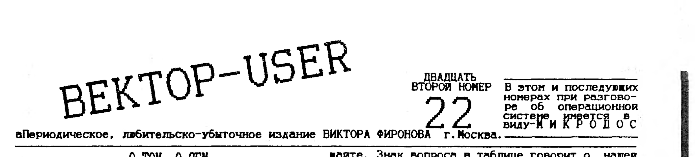
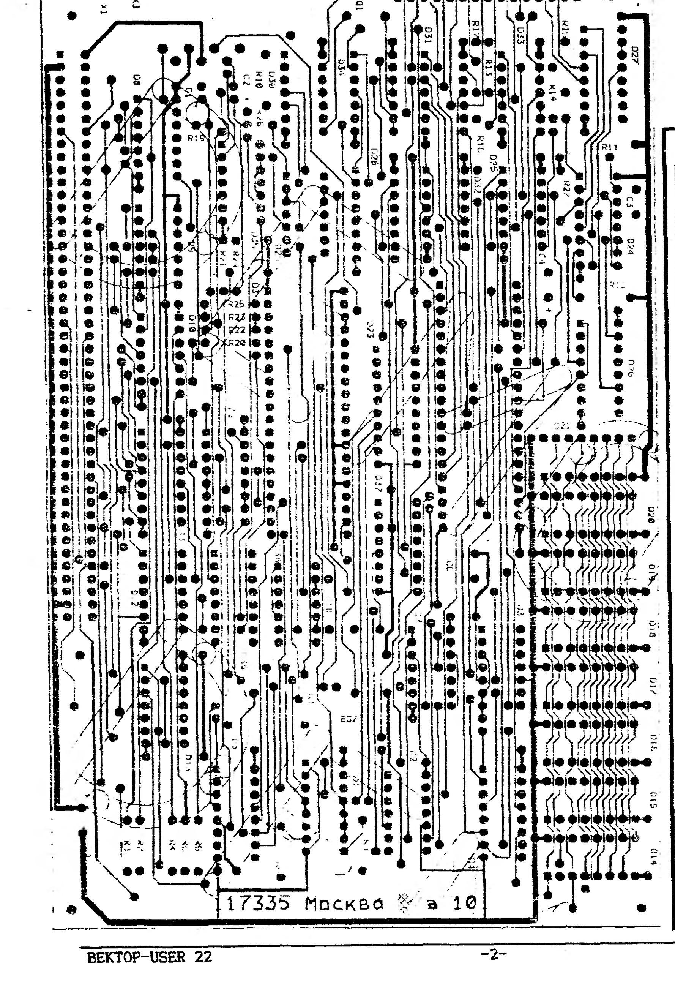
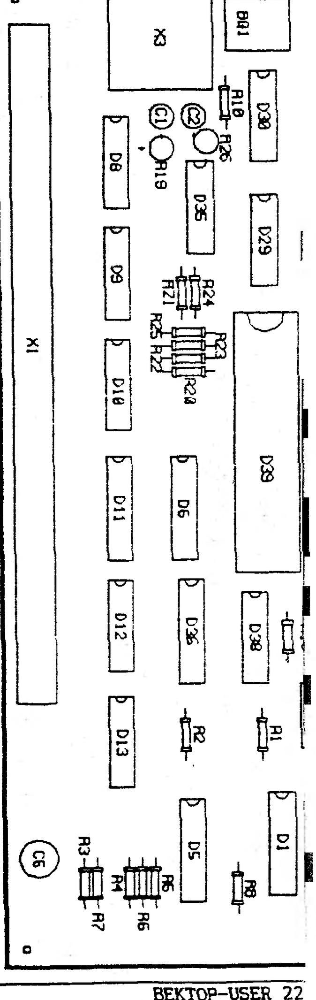
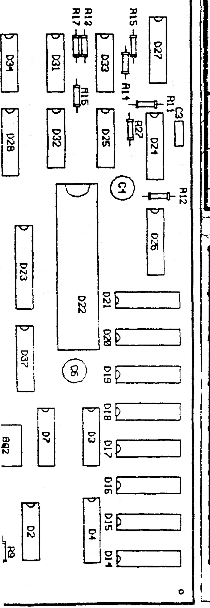
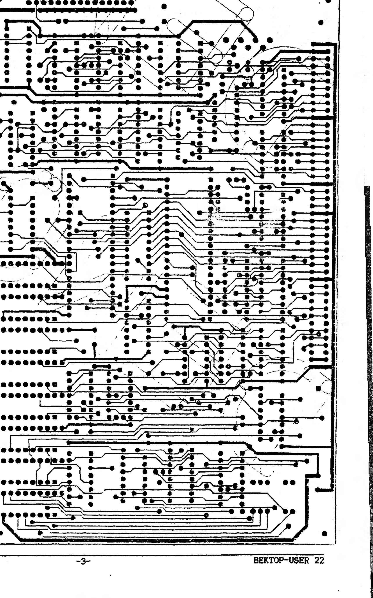

> В этом и последующих номерах при разговоре об операционной системе имеется в виду - МИКРОДОС.

## О том, о сем

С выходом в свет контроллера жесткого диска (винчестера) для ПК Вектор-06ц, практически завершился процесс формирования необходимой конфигурации этой машины. "Мышка" и световое перо, которые тоже входят в число необходимого аппаратного расширения, будут подключены к Вектору, наверное уже в этом году.

Из таблицы, приведенной ниже, можно увидеть как обрастал Вектор аппаратным расширением, и в каких регионах нашей необъятной СНГовии это аппаратное расширение было придумано.

Об обнаруженных ошибках или нашей неосведомленности большая просьба сообщить, так как эта таблица не является последней инстанцией. Таблица составлялась именно по регионам и не включает в себя конкретных людей. Также не указаны года появления - это то, что нам известно на начало 1995 года.

| наименование | 1 | 2 | 3 | 4 | 5 | 6 | 7 | 8 |
|---|---|---|---|---|---|---|---|---|
| 0.контроллер нгмд | Р | - | Р | Р | Т | Р | П | Р |
| 1.RAM-диск (ру5) | Р | - | - | - | - | - | - | - |
| 2.RAM-диск (ру7) | - | - | Р | Р | Т | - | П | - |
| 2А.расширение ОЗУ | - | - | ? | - | Т | - | - | ? |
| 3.модем-аон | Р | - | - | - | - | - | - | - |
| 4.модем | Р | - | - | ? | - | - | - | ? |
| 5.контроллер нжмд | Р | ? | - | - | Т | - | - | - |
| 6."музыкалка" | - | Р | А | Р | Т | - | П | - |
| 7.сканер | А | - | - | - | - | - | - | - |
| 8.системные часы | - | - | - | Р | Т | - | - | ? |
| 9.IBM-клавиатура | - | - | - | Р | Т | - | - | - |
| 9А.контроллер п.9 | - | ? | А | ? | Т | - | - | - |
| A.ROM-диск | Р | - | - | ? | Т | - | - | Р |
| B.Z-80 (замена) | - | - | - | ? | Р | - | - | - |
| C.адаптер Z80 | Р | - | - | - | - | - | - | - |
| D.программатор | Р | - | - | - | - | - | - | Р |
| E."мышка" | П | - | ? | Т | - | - | - | - |
| F.световое перо | - | - | ? | - | - | - | - | ? |

Условные обозначения в таблице:

1 - Кишинев, 2 - Киров, 3 - Москва, 4 - Омск, 5 - Владимир, 6 - Волгоград, 7 - Беларусь, 8 - "Coman".

Р - получил распространение; П - были упоминания в печати; А - сделан, остался у автора; ? - идет разработка; Т - Вектор-турбо+.

В графе 8 представлены собственные обещания Тимошенко еще на 1994 г. (смотри Coman N15).

Кого задело за живое неупоминание чего-то в этой таблице, либо какие-нибудь неправильные данные, не поленитесь еще раз повторить-сообщайте. Знак вопроса в таблице говорит о нашей осведомленности в том, что разработка в этом регионе проводится, но чем она закончится, неизвестно. Так, в таблице не нашел выражения омский "Sound Blaster", о начале работы над ним сведения из Омска есть. А может его постигнет участь сканера? Сделали, посмотрели и забыли. "Coman" обещал дигитайзер, стриммер - ну и что дальше? Дай бог чтоб хоть четвертая часть знаков вопроса в таблице обернулась реальным "железом". Огромную благодарность от имени всех дисковых пользователей Вектора приношу Ф.А.Пересадову, который выпустил в свет игрушку, достойную Вектора. Правда защищенную как ████████████. Видно, человеку надоели привычки пользователей - получать все даром. Но есть надежда, что вслед за "КВ" выйдут в свет и другие подобные, многоемкие игровые программы. Свое слово в этой области не сказали еще много классных программистов, обойдемся без фамилий.

Трудностью является то, что отличные игры можно делать только для дисковых пользователей, а их не так уж и много. Со своей стороны ничего обещать не будем, обойдясь на "Колобке", но это честнее чем сначала собирать деньги, а потом объявлять о своей несостоятельности. Может наша дополнительная реклама в журнале "Радиолюбитель" даст какие-то плоды. В течение года мы попытаемся выпустить пакет лучших игровых программ перекинутых с ПК Sinkler, но сомневаемся, что к этому времени исчезнет халявное настроение пользователей, ведь халява, как явление, сидит в народе уже на генном уровне.

Ну и под конец несколько слов о так называемом "пиратстве". Сколь нибудь классического объяснения этого слова нет нигде. Если популярно, то это - незаконное тиражирование чужого программного и аппаратного обеспечения. И если посмотреть каталоги тех сервисных центров (команд, фирм,...), представители которых и возмущены больше всех этим явлением, то в них можно найти более 95% чужого программного продукта. Кто может похвастать, что выплатил Тимиразову хоть что-нибудь за первый дисковый пакет (Format, Sysgen и т.д.)? Никто. Так чего на зеркало пенять если рожа крива? Мы не являемся исключением из этого правила, но в свою очередь будем отсылать всех обратившихся к нам за серьезными программными разработками (STM-pro, пакет РДС и подобные) к авторам. ЧЕГО ЖДЕМ И ОТ ДРУГИХ.

Это правило, конечно, не может относиться к тем программам, которые попали к нам через третьи-пятые руки, автор которых неизвестен и уровень которых невысок - причины могут быть разными. Неужели своего знакомого я должен отсылать за, например, демонстрашкой "Toxic" в Киров, которую мне прислали из Астрахани? Думаю, что после этого у меня на одного знакомого (или клиента) будет меньше. Для непонятливых краткое резюме:

> УВАЖАЕМЫЕ КОЛЛЕГИ ИЗ КИРОВА, ОМСКА, ВОЛГОГРАДА, ВЛАДИМИРА, АСТРАХАНИ И ДРУГИХ МЕСТ!!! ДАВАЙТЕ ПРЕКРАТИМ ТИРАЖИРОВАТЬ ХОТЯ БЫ СЕРЬЕЗНЫЕ ПРОГРАММНЫЕ И АППАРАТНЫЕ РАЗРАБОТКИ, ЕСЛИ ОНИ ВАМ НЕ ПРИНАДЛЕЖАТ.

Вы можете не рекламировать авторов (кстати, только мы это делаем), если боитесь конкуренции. Просьба не в этом. Не тиражируйте. Перетягивание на себя одеяла в виде сиюминутных выгод в конце концов даст остановку в разработке программных продуктов.

Кто будет квалифицировать уровень разработки? Неужели рекламная кампания будет проводиться из-за ерунды? Можно, конечно, и защиту поставить. Но нужно ли это рядовому пользователю? Пишите, если что.

Фиронов В.П. г.Москва.

## Печатная плата электронного диска, контроллера дисковода и музыкального сопроцессора

Публикуем печатную плату, на которой разведены: a) электронный диск на 256 кб (Ру7), b) контроллер дисковода, c) музыкальный сопроцессор. Фотошаблон печатной платы напечатан здесь с увеличением 1.2 из-за большой плотности соединительных линий (замыкание которых даже здесь видно). Монтажная схема для набивки платы выполнена в натуральную величину. Напоминаем, что этот электронный диск работает с операционными системами производства Филиппова Е.В. (5,1). Желающие получить дискету с picad'овским файлом, звоните.



**Электронный диск:**

| Поз. | Тип | Поз. | Тип |
|---|---|---|---|
| D1 | 155КП2 | D24 | 155АГЗ |
| D2 | 155ИЕ4 | D25 | 555ТМ2 |
| D3 | 155ИЕ2 | D26 | 155ИЕ7 |
| D4 | 589АП26 | D27 | 155ИД4 |
| D5 | 589АП26 | D28 | 155ИД4 |
| D6 | 155КП2 | D29 | 155ИЕ5 |
| D7 | 155ЛАЗ | D30 | 155ЛА4 |
| D8 | 155ЛА2 | D31 | 155ЛН1 |
| D9 | 155ЛАЗ | D32 | 555ИР16 |
| D10 | 155ЛП5 | D33 | 555ЛИ1 |
| D11 | 555ТМ9 | D34 | 155ЛЕ1 |
| D12 | 155ЛР1 | R10 | 330 Ом |
| D13 | 155ЛАЗ | R11 | 2 КОм |
| D14-D21 | 565РУ7 (x8) | R12 | 51 КОм |
| R1-R9 | 33 Ом | R13-R17* | 2 КОм |
| C5 | (12-47) x 16 | R27 | 2 КОм |
| | | BQ1 | 8 МГц |
| | | разъем | 7-ми шт |

*диапазон обозначений R13-R17 частично обрезан на сгибе страницы в оригинале, восстановлен по контексту.

**Контроллер:** D22 - 1818ВГ93, D23 - 580ВА86.



**Музыкалка:**

| Поз. | Тип |
|---|---|
| D35 | 555ЛИ6 |
| D36 | 555ИД7 |
| D37 | 555ИЕ7 |
| D38 | 555ЛАЗ |
| D39 | AY8910 |
| R18 | 330 Ом |
| R19 | 4,7 КОм |
| R20 | 5,1 КОм |
| R21 | 10 КОм |
| R22 | 10 КОм |
| R23 | 10 КОм |
| R24 | 10 КОм |
| R25 | 5,1 КОм |
| R26 | 4,7 КОм |
| C1, C2 | 10 x 16 |
| C6 | 47 x 16 |
| BQ2 | 14 МГц |

Разъем (контакты): 1) левый; 2) общий; 3) правый; 4) +5в; 5) +12в; 6) beep.



Указанные микросхемы не являются единственными для использования, можно применять и 555-ю и 1533-ю серии. Употреблена самая дешевая, 155-я серия. Блокировочные конденсаторы по питанию устанавливать можно любые. Один конденсатор на две-три микросхемы логики и на каждую из микросхем памяти (Ру7). При исправных деталях плата должна сразу заработать. R18 (музыкалка) подбирается после запуска. Приносим извинения за нарушение обещанных сроков высылки плат - не от нас это зависело. Если появятся вопросы - спрашивайте.



## Адаптация музыкальных программ

Адаптация музыкальных программ, написанных для "Sound Tracker" под систему "R-Sound" не представляет большого труда. Необходимо, во-первых, раскомпрессировать программу (если это нужно). О распаковке программ, сжатых компрессорами не однократно писалось во многих изданиях для векторцистов, поэтому подробно останавливаться на этой операции нет смысла. Далее вы должны просмотреть начало программы и записать первые 2, 3 оператора на бумаге, чтобы не потерять их. Затем вместо первого оператора пишите JMP XXXX где XXXX - адрес подпрограммы установки ВВ55го порта "ПУ" в режим, обеспечивающий нормальную работу с сопроцессором. Вот ее текст:

```
MVI     A,88H
OUT     4
```

```
...     ;Здесь должны быть операторы, кото-
...     ;рые вы записали на бумагу и были
...     ;"забиты" командой JMP XXXX.
JMP     XXXY  ;Пересылка управления в начало про-
              ;граммы, на первый "незабитый" адр.
```

Далее вам необходимо отыскать в теле программы оператор, реализующий связь с платой "Sound Tracker" (OUT 15H). Вместо этого оператора пишем JMP ADAPT, т.е. передаем управление программе адаптации, которая желательно должна находиться в конце основной программы, так как "втискивать" ваш кусок в тело программы - дело трудное и опасное. Разумеется, вместо ADAPT вами должен быть подставлен реальный адрес подпрограммы адаптации. Несколько слов о самой подпрограмме, текст которой приведен ниже. Этот способ обращения к плате "R-Sound" более корректен и позволяет добиться естественного звучания, в точности такого же, какое вырабатывает кировская и омская музыкальные платы, чего нельзя сказать о способе программирования платы, опубликованном в "Байт" N23 и "Вектор-User N21". Дабы исправить свою ошибку, в этой статье приводится верный способ программирования платы. Эта подпрограмма, не уничтожая обращения к "Sound Tracker", добавляет к ним свои, рассчитанные на систему "R-Sound", т.е. доработанная программа допускает наличие у пользователя музыкальной платы любой конструкции из разработанных для Вектора.

```
AE5F7:
0ADAPT: OUT     15H     ;Сообщаем "ST" номер регистра
        OUT     06H     ;Эти же данные выдаем на ПД "RS"
        MOV     B,A
        MVI     A,6     ;Строб записи регистра выдаем
        OUT     5       ;в пятый порт
        XRA     A       ;Обнуляем A и гасим строб.
        OUT     5       ;регистр выбран
        MOV     A,M     ;Читаем данные для тек. регистра.
        OUT     14H     ;Засылаем их в "Sound Tracker" и
        OUT     06H     ;выставляем на ПД "RS".
        MVI     A,4     ;Строб записи данных в "R-Sound"
        OUT     5       ;выдаем в пятый порт
        XRA     A       ;и тут же его
        OUT     5       ;гасим, данные приняты.
        DCX     H
        MOV     A,B     ;Все регистры сопроц. загружены?
        DCR     A
        JP      ADAPT   ;Нет - продолжаем (AE5F7).
        RET
```

Еще пара слов для программистов, использующих для написания музыкальных программ подпрограмму В.Саттарова, под названием "PLAYV1.ASM". Вам достаточно разместить в ее теле подпрограмму ADAPT, расположив ее по адресу метки AE5F7 и ваши игры и "музыкалки" для сопроцессора приобретут еще больший успех. Многие пользователи звонят, пишут, спрашивая меня, какая разработка лучше? Постараюсь ответить кратко и полно: никакая. По характеристикам обе платы одинаковы, только подключаются и программируются по разному, что не мешает программистам писать программы поддерживающие оба стандарта. В некоторых случаях пользователю лучше приобрести "Sound Tracker" (или плату Шашкова), в некоторых - "R-Sound". Что выбрать? Для Вектора существуют три стандарта подключения джойстиков, четыре - контроллеров дисковода, два - моденов (пока), четыре - установки Z80 вместо 580го. "R-Sound" стал вторым стандартом подключения музыкального сопроцессора к Вектору. Пусть каждый выбирает по своему вкусу и понятию об удобстве работы, исходя из того, какая периферия подключена к разъемам ПК. Желающие самостоятельно собрать плату v4.2 (самый последний и окончательный вариант) могут найти ее схему и рисунок печатной платы в 29 номере "Байт", а желающие купить (8 USD) могут обращаться по адресам: 222120 Беларусь, г.Борисов ул.Гагарина д.67 кв.157 т.(01777) 50-146 Костиневич Р.Л. или 117335 Москва а/я 101 Фиронов В.П.

> Доллар взял очередную отметку (5000 р.)
>
> контроллер НГМД + гам-диск (руб) - 27 $
>
> печатные платы вышеуказанного пункта - 8 $
>
> контроллер НГМД+AY8910+гам-диск (ру7) - 33 $
>
> печатная плата вышеуказанного пункта - 8 $
>
> модем - аон (готовое изделие) - 16 $
>
> модем - аон (конструктор) - 8 $
>
> модем add1200 (готовое изделие) - 16 $
>
> адаптер z80 (запуск Sinkler-дисков) - 29 $
>
> программатор (счетмаш) - 19 $
>
> блок герконовой клавиатуры (счетмаш) - 20 $
>
> дисковод 5323.01 включая пересылку - 24 $
>
> шлейф для дисковода - 4 $
>
> универсальный загрузчик (м/сх 2716) - 2 $
>
> "музыкалка" (схема Шашкова В.А.)
> - печатная плата - 2 $
> - все кроме AY8910 - 5 $
> - готовый к работе - 8 $
>
> 117335 МОСКВА А/Я 101 ФИРОНОВ В.П.

## Программы для МикроДОС

STM-pro: пакет программ для "Sound Tracker" и "R-Sound". В пакет входят:

- `EDIT/I.COM` - редактор инструментов
- `EDIT/O.COM` - редактор орнаментов
- `STT-STM.COM` - декомпилятор
- `STM-STT.COM` - компилятор
- `STMVIEW.COM` - вьювер музыкальных файлов
- `KIROV95.STL` - библиотека инструментов (>120)
- `KIROV95.STO` - библиотека орнаментов (>40)
- `STM-PRO.TXT` - описание пакета
- STM-файлы - более четырех десятков

Автором пакета является Луппов Г.Б. (Байт) и по поводу приобретения пакета следует обращаться в г.Киров. Нельзя сказать, что пакет "STM-pro" является музыкальным редактором, но - в принципе - пользователь, обладая определенным уровнем знания по программированию, сможет создать что-нибудь свое, либо "передрать" что-нибудь с Sinkler'а.
