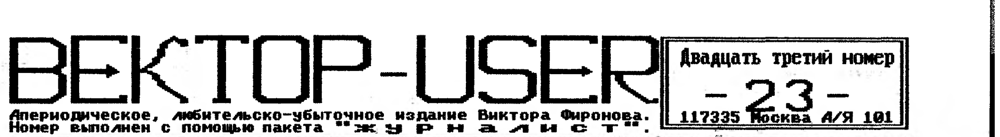
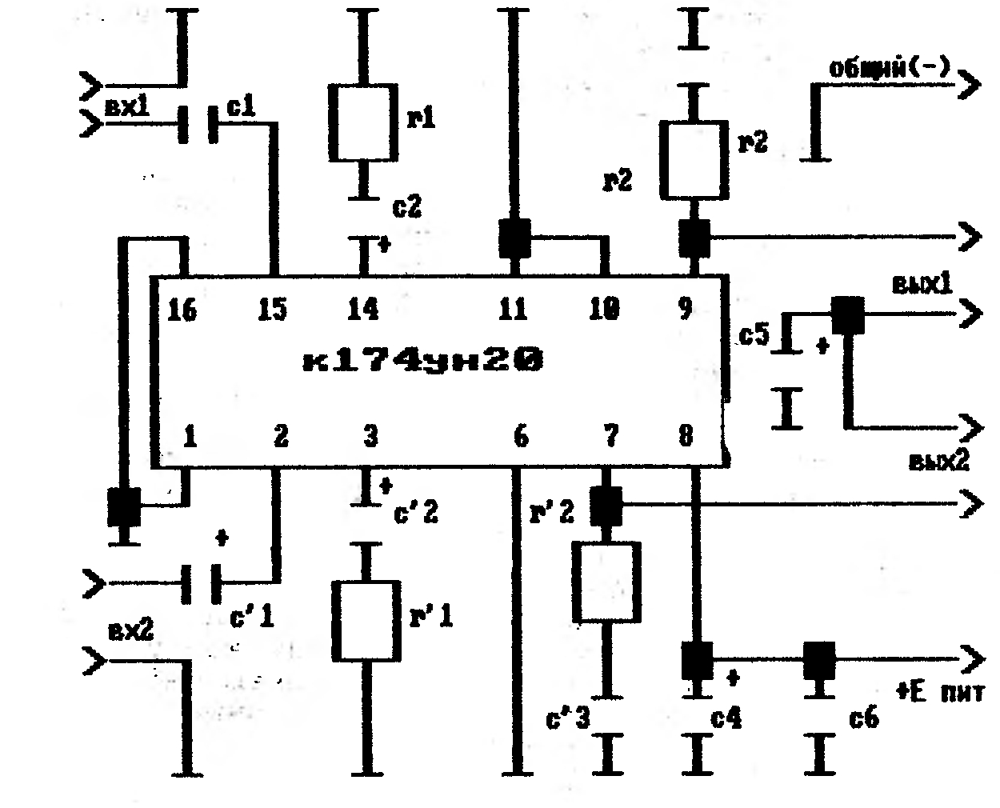
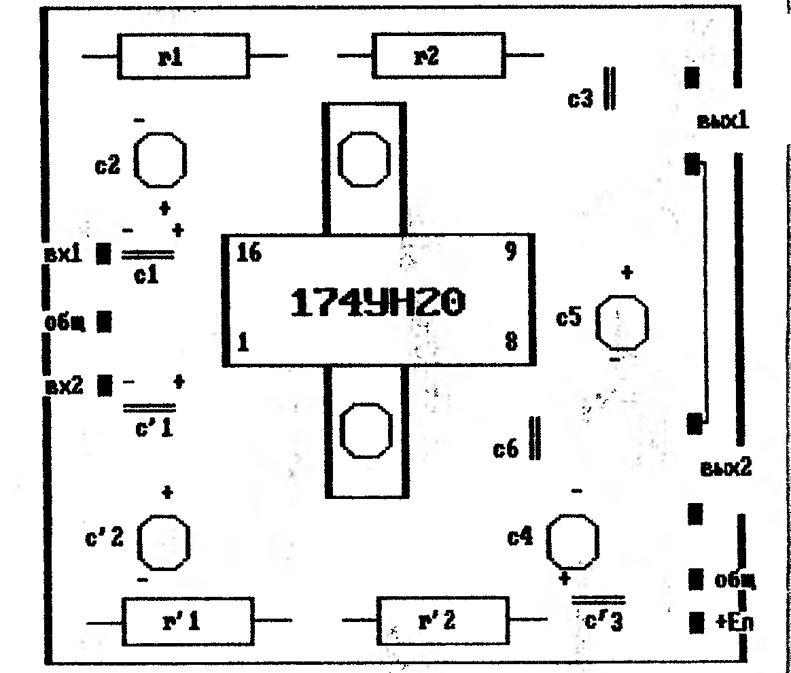

## Цифа (интервью шестое)

Костиневич Руслан Леонидович. Постоянно проживает в г.Борисове (Беларусь), основное занятие - электрик по ТВЧ (пока).

**1.Как пришли к Вектору?**

Вектор - моя первая любовь. В армии работал на больших машинах, потом перешел на ДВК-2, там и заразился "компьютероманией". Впоследствии долго и кропотливо собирал характеристики разных отечественных ПК, обращался за информацией на заводы, в редакции журналов. Сопоставив раздобытые данные о 14-ти типах ПК, я пришел к выводу, что Вектор - это вещь! Приобрел его 16 марта 1990 года сразу же после начала их выпуска Минским ПОВТ.

**2.А с чего начинали?**

С Бейсика. Освоив его полностью и написав десяток программ ("Веришь - не веришь", "Комбинация", "DOCTOR+" и др.) на этом успокоился, ибо больше из него выжать не удавалось. "COMAN" тиражировал эти программы, но ни копейки за них получить не удалось, поэтому решил заняться ассемблером, и до сих пор не могу уйти дальше написания простецких прикладных программ. "Железом" занимаюсь так же как и ассемблером - методом "мозгового штурма", т.е. сначала копию все данные, а потом уж оперирую, исходя из них.

**3.Ваши соображения о перспективах Вектора?**

Трудный вопрос. Вектор будет жить долго для тех, кто видит в нем друга и помощника в делах. Многое зависит от программного обеспечения, от его прикладных свойств. Игровые программы надоедают, а хорошие прикладные программы нет, возьмите тот же SID или ASC - эти программы нужны всегда. Нужны профессионалы, нужны фирмы, занимающиеся Вектором не на любительском уровне, а так как "у них" - за границей. Необходимо искоренить советскую традицию "халявы" на программное обеспечение. Станут ли пользователи цивилизованнее, будут ли платить программистам и разработчикам различных "прибамбасов" за их труд? Хочется верить, что большинство поймет наконец, что "нет денег - нет и стульев". Сколько талантов "сошло" с Вектора! Станьте на их место и подумайте, долго ли бы продержалось желание творить в этих условиях? Вектор может спасти только отказ пользователей от услуг "тиражаторов", как бы трудно это не было. Иного выбора нет.

**4.Как относитесь к контроллеру "COMAN"?**

Мои соболезнования всем владельцам этих контроллеров, которые оказались привязаны к своему "железу", весьма ограничивающему работу с ПК. У меня есть знакомый "страдалец", который передает благодарность Шашкову В.А. за информацию о переделке контроллера-COMAN в МикроДОС-совместимый. Перестроили, хоть и не сразу.

**5.Чего от Вас можно ожидать нового?**

В прошлом году разработал интерфейс MIDI, но заказчики так и не объявились, поэтому пока "гребу под себя": заинтересовался коротковолновым радиолюбительством, работаю над сопряжением Вектора с контроллером пакетной связи, параллельно разрабатываю последовательный порт с программной установкой скорости обмена 300, 600, 1200, 2400 бд, а может быть и больше. Программистом себя не считаю, поэтому помимо описания "железа" и информации о том, как его программировать ждать от меня нечего. Если найдется толковый программист, заинтересовавшийся этими разработками - буду рад сотрудничеству. Чем займусь дальше - пока неизвестно, может все-таки возьмусь наконец серьезно за ассемблер и сочиню что-нибудь эдакое. Пытаюсь реанимировать Вектор на Беларуси. Хочу собрать всех талантливых программистов и надеюсь на успех своего начинания.

**6.Какие программы "всегда на столе"?**

Пока нет такой игры, которая захватила бы меня целиком и полностью благодаря своему интересному замыслу и потрясному графическому оформлению. А прикладные - три: ASC.COM, пакет CP/M MACROASSEMBLER v.2.01 и SID.COM, с которыми постоянно работаю.

**7.Что мешает появлению новых программ?**

См. вторую половину ответа на вопрос о перспективах, "Нужны профессионалы.." и т.д.

**8.Какие пожелания владельцам Вектора?**

Пользователям и "тиражаторам" - быть честнее по отношению к авторам программ, программистам - больше смелости. Вектор может больше, чем Вы думаете; списывайтесь, созванивайтесь, обменивайтесь опытом, собирайтесь в группы, потому что один в поле - не воин. Творцам "железа" - постоянно обмениваться между собой информацией о новых разработках, сообщая номера задействованных в них портов дабы избежать программной и аппаратной несовместимости, также совершенствовать схемы дешифрации адреса, чтобы ваша периферия откликалась только на конкретные адреса, а не "на адреса от 60Н до 0FFH" (к примеру). Оставьте место для других! И удачи всем!

## "Журналист"

Идея создания программы возникла при необходимости создания красивых текстовых изображений с дальнейшим выводом их на печатное устройство. Первая версия программы появилась два года назад. И представляла простенький текстово-графический редактор. Сегодня - это очень мощный пакет редакторов не имеющий аналогов на Векторе. Система позволяет создавать страницы текстовой информации различными по размеру и по форме буквами. Возможность вставки в текст независимых графических изображений. Возможность вывода на печать в разных графических режимах и многое, многое другое. А теперь подробнее. В пакет входят следующие программы:

ДИСК 1: Текстово-графический редактор;

- Редактор знакогенератора;
- Редактор графического фрагмента;
- Конвертор текстовых файлов;
- Перекодировщик КОИ 8-Альтернатив;
- Просмотр страниц;
- Программа печати;

ДИСК 2: Знакогенераторы (одиннадцать файлов) 32 и 64 символа в строке - полностью;

- Знакогенераторы (восемьдесят файлов) 32 и 64 символа в строке - не полные;
- Знакогенератор 16 символов в строке;
- Графические фрагменты (семь файлов);
- Несколько готовых эскизов;
- Описание пакета;

**Текстово-графический редактор:**

Это наиболее важная программа всего пакета. Программа позволяет создавать страницы текстовой информации которые размещаются на диске в виде графики. Режим "редактор" позволяет пользователю иметь: 2 таблицы псевдографики, инверсию отдельного символа и всего экрана, вкл/выкл больших, маленьких, латинских и русских символов, вывод координат курсора, перенос участка экрана и его запоминание, выбор палитры изображения, сдвиг экрана в любую сторону и т.д. Другие режимы позволяют записывать и загружать файлы, выходить в операционную систему и главное меню пакета.

**Редактор знакогенератора:**

Программа необходима для создания и коррекции шрифтов (символов) используемых для набора текста. Поддерживаются знакогенераторы трех типов: 16, 32 и 64 символа в строке. По высоте разрешено любое значение от 3 до 20 точек. Возможно: транспонирование матрицы, помещение символа в дополнительный буфер, центровка знакогенератора (перемещение всего массива символов в памяти на один байт), передвижение по знакогенератору, транслирование (перекодировка символов из режима 32 символа в строке, в режим 64 символа в строке, создание нового знакогенератора и т.д.

**Редактор фрагмента график. изображения:**

Редактор необходим для создания графических фрагментов и вставки их в картинки Текстово-графического редактора. Возможности: инверсия фрагмента, его увеличение, перемещение по экрану, создание фрагмента и запись его на диск, загрузка с диска, соединение фрагментов, вывод на печать и т.д.

**Конвертор текстовых файлов:**

Конвертор позволяет из обычных текстовых файлов создавать графические таблицы любым знакогенератором. Есть режим позволяющий конвертировать тексты с любым количеством символов в строке (строка/через строку).

**Перекодировщик КОИ 8 - альтернативный:**

Программа нужна для перекодирования текстовых файлов, так как Конвертор корректно работает с текстовыми файлами альтернативной кодировки (ASC II).

**Просмотр страниц:**

Программа позволяет просматривать графические страницы Текстово-графическ. редактора.

**Программа печати:**

Программа предназначена для вывода на принтер группы страниц. Комбинируя при печати размерами (1-6), плотностью (1-3), инверсией (да/нет) можно достичь любого результата.

Приобрести пакет можно в Москве у Фиронова, либо обращаться к автору пакета по телефону (0422)56-13-75. Андрей Павленко. г.Кишинев.

## КУВТ PS-1000a

Данное изделие предназначено для оснащения кабинетов вычислительной техники и информатики в школах, ПТУ, средних специальных заведениях, в детских садах, игровых залах. Применяется с целью формирования у учащихся знаний об устройстве и функционировании современной вычислительной техники, основ программирования, умений и навыков решений задач с помощью ЭВМ. Данный КУВТ включает в себя рабочее место преподавателя (РМП) и от одного до девятнадцати рабочих мест учащихся (РМУ), объединенных между собой локальной вычислительной сетью и в отличие от существующих обладает большими возможностями благодаря увеличению памяти компьютера до 320 килобайт. На РМУ эмулируется ДОС и устройство ввода/вывода на электронный диск. Независимо от преподавателя РМУ может вызвать с главной машины необходимую программу и работать с ними независимо от главной машины. Также, учащийся может переслать по локальной сети любые файлы на главный компьютер и сохранить их на гибком магнитном диске (ГМД).

Рабочее место преподавателя включает в себя БПВЭМ "Вектор-06Ц", два дисковода, электронный диск, видеомонитор и принтер.

Рабочее место ученика включает в себя БПВМ "Вектор-06Ц", электронный диск, видеомонитор и контроллер КУВТа. В состав рабочего места ученика и преподавателя могут также входить магнитофон, принтер. Дополнительную информацию по КУВТу можно получить в Кишиневском центре "Компьютер", в Москве у Фиронова В.П. О цене просьба справляться у авторов по телефонам в городе Кишиневе:

(0422)56-13-75. Андрей Павленко.

(0422)57-08-95. Дмитрий Недосек.

## Винчестер

Данные виды накопителей различаются по параметрам емкости, интерфейса, быстродействия, размера и потребляемой мощности. Рассмотрим некоторые из них.

**1.Интерфейс.** НЖМД с интерфейсом ST412 (метод записи MFM) не отличаются компактностью и экономичностью электропитания, очень велико количество плохих секторов (особенно ST225 и ST252). Из-за отличий параметров накопителей, контроллеры различных НЖМД не взаимозаменяемы. Этот интерфейс на сегодня вытеснен другими. Интерфейс IDE самый распространенный в настоящее время. Отличается прежде всего удобством подключения. Накопители этой серии имеют, по сути, встроенный контроллер, позволяющий учитывать специфику накопителя. Большим преимуществом является взаимозаменяемость и использование своего винта для переноса информации в другой ПК. Для контроллера НЖМД, при подключении его к Вектору, необходим винчестер с интерфейсом IDE(AT) с методом записи RLL(2,7). Сведения о подобных накопителях сведены в таблице. Взяты НЖМД с емкостью не более 60 Мгб, больше для Вектора и не понадобятся, так как все программное обеспечение Вектора занимает около 40 Мгб.

**2.Емкость.** Как уже говорилось, для Вектора не нужен винт более 60 Мгб, и то, такой объем необходим для распространителей программ, а для простого пользователя хватит 20 и даже 10 Мгб, хотя они встречаются редко.

**3.Размеры и питание.** Обычный размер IDE-винчестера - диаметр диска 9 см. Но встречаются и размером со спичечный коробок, но цена уже больше. Питание идентично с питанием дисковода (5 и 12 вольт). Потребление от 0,3 до 1,5 ампер по каждому режиму, в зависимости от размеров. Следует отметить о высоких требованиях к источнику питания после подключения винчестера. Импульсные источники питания имеют свойства зависимости выходного напряжения от подключенной нагрузки. Это надо иметь в виду при подключении НЖМД к Вектору. Основные поломки НЖМД возникают именно при включении блока питания (разгон).

**4.Быстродействие.** Абсолютно не существенно при подключении винчестера к Вектору.

**5.Цена.** Цена на новый 40-Мгб IDE(AT) винчестер на радио-рынке Митино в Москве находится в пределах 45-65 долларов. Можно найти и за 40 но б/у. Это абсолютно не значит, что цена на 20-Мгб винт в два раза дешевле, а 10-Мгб дешевле в четыре раза.

**6.Маркировка.** Единой маркировки нет. Каждая фирма ставит свою (смотри таблицу). Приведем пример маркировки у фирмы SEAGATE.

```
ST157A
(123456)
```

Первые буквенные (1,2) символы - это фирма изготовитель. Первый числовой (3) это - размер, где первое число - размер в дюймах, а второе - высота в миллиметрах. Далее цифровые символы (4,5) - это неформатированная емкость в Мегабайтах. Всегда больше реальной емкости. Последний буквенный символ (6) - это тип интерфейса.

```
1-3,5 * 41
2-5,25* 41
3-3,5 * 25
4-5,25* 82
5-9
7-1,8
8-8
9-2.5
```

HET - ST412/MFM; R - ST412/RLL; N - SCSI; E - ESDI; X - IDE/XT; A - IDE/AT (он и подходит для Вектора).

Надпись ST157A означает, что этот винчестер сделан фирмой SEAGATE, его размер 3,5 дюйма, высота 41 миллиметр, неформатированная емкость 57 мегабайт (40), интерфейс IDE(AT). Вся остальная информация как об организации работы с НЖМД на Векторе, так и о программах поддерживающих винчестер поставляется только с изделием - контроллером накопителя жесткого магнитного диска. Данная статья является выдержкой из описания контроллера НЖМД выполненного Владимиром Фроловым. Коррекцию статьи и таблицу применительно на Векторе винчестеров выполнил Виктор Фиронов.

| модель | фирма | форм | разм | цил | гол |
|---|---|---|---|---|---|
| CP-3024 | CONNER | 21,5 | 3,50 | 636 | 2 |
| CP-3044 | CONNER | 42,9 | 3,50 | 1047 | 2 |
| CP- 342 | CONNER | 40,0 | 3,50 | 805 | 4 |
| CP- 344 | CONNER | 42,9 | 3,50 | 805 | 4 |
| M2611T | FUJITSU | 45,1 | 3,50 | 1344 | 2 |
| KL343 | KALOR | | | | |
| OCTAGON1 | CORPOR. | 42,6 | 3,50 | 676 | 4 |
| 7040 | MICROS. | 47,2 | 3,50 | 855 | 3 |
| MS7040A | MINISC. | 40,0 | 3,50 | | |
| MS8051A | MINISC. | 42,0 | 3,50 | 745 | 4 |
| MS8225A | MINISC. | 21,0 | 3,50 | 747 | 2 |
| MS8225A1 | MINISC. | 21,0 | 3,50 | 745 | 2 |
| MS8450A | MINISC. | 42,7 | 3,50 | 745 | 4 |
| 220A | PRAIRI. | 20,0 | 2,50 | 612 | 4 |
| PT-238A | PTI | 32,0 | 3,50 | 615 | 4 |
| PT-251A | PTI | 43,0 | 3,50 | 820 | 4 |
| PT-357A | PTI | 49,0 | 3,50 | 615 | 6 |
| PD-40AT | QUANTUM | 42,0 | 3,50 | | 3 |
| PD-LPS-52AT | QUANTUM | 52,0 | 3,50 | 1219 | 2 |
| RO-3058A | RODIME | 45,3 | 3,50 | 868 | 2 |
| RO-3059A | RODIME | 46,7 | 3,50 | 1216 | 2 |
| ST-1057A | SEAGATE | 49,1 | 3,50 | 940 | 3 |
| ST-125A-0 | SEAGATE | 21,5 | 3,50 | 404 | 4 |
| ST125A-1 | SEAGATE | 21,5 | 3,50 | 404 | 4 |
| ST138A | SEAGATE | 32,1 | 3,50 | | |
| ST138A-0 | SEAGATE | 32,1 | 3,50 | 604 | 4 |
| ST138A-1 | SEAGATE | 32,1 | 3,50 | 604 | 4 |
| ST157A | SEAGATE | 44,7 | 3,50 | | 6 |
| ST157A-0 | SEAGATE | 44,7 | 3,50 | 560 | 6 |
| ST157A-1 | SEAGATE | 43,0 | 3,50 | 560 | 6 |
| ST3025A | SEAGATE | 21,5 | 3,50 | 1616 | |
| ST3057A | SEAGATE | 49,1 | 3,50 | 1616 | 3 |
| ST325A | SEAGATE | 21,4 | 3,50 | 697 | |
| SD-340 | TEAC | 43,0 | 3,50 | 1050 | 2 |
| WD93024-A | WESTERN | 21,6 | 3,50 | 782 | 2 |
| WD93028-A | WESTERN | 21,6 | 3,50 | 782 | 2 |
| WD93028-AD | WESTERN | 21,6 | 3,50 | 782 | 2 |
| WD93044-A | WESTERN | 43,2 | 3,50 | 782 | 4 |
| WD93048-A | WESTERN | 40,0 | 3,50 | 782 | 4 |
| WD93048-AD | WESTERN | 43,2 | 3,50 | 782 | 4 |
| WDAC140 | WESTERN | 42,7 | 3,50 | 782 | 2 |

Сведения, приведенные в таблице, собраны из разных источников и могут служить только в качестве справки. Даны только НЖМД емкостью до 60 Мгб с интерфейсом IDE(AT) метод записи RLL(2,7). Приобрести контроллер винчестера можно у Виктора Фиронова в Москве по известному адресу, либо в Кишиневе у автора - Владимира Фролова (0422) 73-88-64.

## Программы для МикроДОС

**OS*BOOT.COM.** Глядя на то, как обычные хакеры в процессе игры на компьютере сначала запускают ДОС, а затем оболочку для выбора и запуска программ, автору пришла мысль о создании системы которая ускорила бы процесс запуска и выбора программ. Для этого автором была написана оболочка и присоединена к МикроДОС, что дает возможность миновать загрузку оболочки после запуска МикроДОС. В возможности программы входят функции выбора диска и области пользователя, чтение директории диска и области пользователя, запуск файла и выход в операционную систему.

**RFONT.COM.** Эта программа предназначена для создания и редактирования фонтов (знакогенераторов). Оконный интерфейс программы позволяет работать в режимах редактирования, выбора высоты, создания фонта и работы с диском. В возможности программы входят зеркальное изображение по горизонтали и вертикали, кольцевой сдвиг влево и вправо, инверсия, запоминание и стирание символа, выход в меню и в ДОС, запись на диск цифрового кода или текста для ассемблера.

Обе программы представлены PIONEER SOFTом и высылаются вместе с пакетом "ЖУРНАЛИСТ".

**OSI-134.COM.** Как написано в описании "на сегодняшний день является наиболее мощной ДОС с богатыми возможностями". БСВВ (Базовая система ввода/вывода) и программа загрузки ОС полностью переписаны с сохранением совместимости с предыдущими версиями. Особенности следующие: 1) длина уменьшена до 15кб; 2) объем исполняемой памяти увеличен до 48кб; 3) ее можно легко "прятать" на подэкранное ОЗУ, если прикладной программе требуется как сама ОС, так и области экранной памяти, которые она занимает; 4) увеличена скорость (в 4 раза) вывода символов на экран; 5) изменен способ и место размещения данных знакогенератора; 6) сокращены временные отрезки времени опроса клавиатуры, прерываний, очистки экрана и т.д.; 6) есть возможность вывода копии экрана на принтер; 7) заменены драйверы работы с НГМД на более короткие и совершенные и т.д. Вместе с программой CO.COM, аналогом NORTON COMMANDER, этот ДОС действительно самый мощный на сегодняшний день. Только у нас он заработал только с квазидиском на РУ-7х, а на стандартном диске (РУ5) работать не хочет.

За более подробной информацией просьба обращаться к автору в г.Харьков по телефону (0572) 70-37-38. Сергей Терентьев.

## Десятка 1994 года

| Игра | Город |
|---|---|
| After the war | Киров |
| Chessmaster | Кишинев |
| Color lines | Москва |
| Down exelens | Волгогр. |
| Down master | Киров |
| Down super | Киров |
| Mine sweeper | Омск |
| Pipe dream | Москва |
| Super weapon | Москва |
| Tetris II | Волгогр. |

Названия игрушек стоят просто по алфавиту.

Браво, Барвиненко.

## Двухканальный стереоусилитель на м/сх К174УН20

Микросхема К174УН20 является двухканальным усилителем звуковой частоты и объединяет в одном корпусе два кристалла УН14. По своим характеристикам с успехом может применяться в качестве усилителя для музыкального стереопроцессора.

**1.Основные характеристики:**

- диапазон воспроизводимых частот - 30...16000Гц
- напряжение питания - 12в
- коэффициент нелинейных искажений - 0,1%
- ток потребления - 20...50мА
- выходная мощность - 2 x 4 Вт
- сопротивление нагрузки (не менее) - 4 Ом

**2.Схема принципиальная и монтажная:**

```
c1 = 0,1 - 4,7 x 16v.
c2 = 10,0 - 22,0 x 16v.
c3 = 0,033 - 0,68.
c4 = 47,0 - 100,0 x 16v.
c5 = 220,0 - 1000,0 x 16v.
c6 = 0,033 - 0,1

R1(kom) = 20 / (k - 1) ;   R2 = 8 - 10om ;
```

Величина R1 определяет коэффициент усиления канала (К). Если R1 получается менее 300 Ом, значит С2 устанавливается в пределах 47,0 - 100,0.





> \*Контроллер винчестера включая пересылку и дискету с прогр. поддержкой - 35 $
>
> Пакет программ "журналист"
> - при получении двух "ТМД"шек - 14 $
> - на наших "ТМД"шках - 15 $
>
> Контроллер дисковода + электронный диск на РУ5-х + пересылка - 27 $
>
> То же самое (печатные платы) - 8 $
>
> Контроллер дисковода + электронный диск + муз.сопроцессор + пересылка - 33 $
>
> То же самое (печатная плата) - 8 $
>
> Музыкальный сопроцессор
> - печатная плата - 2 $
> - без AY8910 - 5 $
> - готовый к работе - 8 $
>
> Отмеченное звездочкой - после тел. звонка.
>
> (095) 128-73-18

## Вокруг Вектора

- 06, 07 Мая сего года в Кишиневском центре "Компьютер" прошла выставка перефирийных устройств и программного обеспечения;
- из города Омска начал свое движение КАРТРИДЖ для Вектора, работает с любым универсальным загрузчиком. Максимальная емкость КАТРИДЖА практически не ограничена. Подробнее будет рассказано в следующем номере;
- в городе Кирове Виктор Саттаров подключил к Вектору XT-клавиатуру, контроллер которой можно приобрести в "Байт"е;
- некоторых людей посетила мысль создать простейший псевдосканер для Вектора, оригинальная идея носилась в воздухе;
- Федор Пересадов грозился в этом году создать еще две игры подобные "king's bounty";
- Максим Алюдин заканчивает, наконец, свою многофайловую, многоуровневую "СПЕЦГРУППУ".
