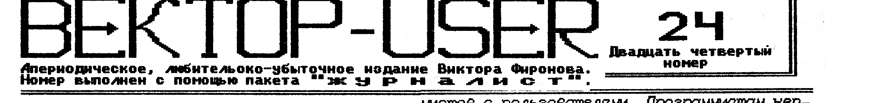
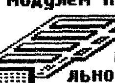
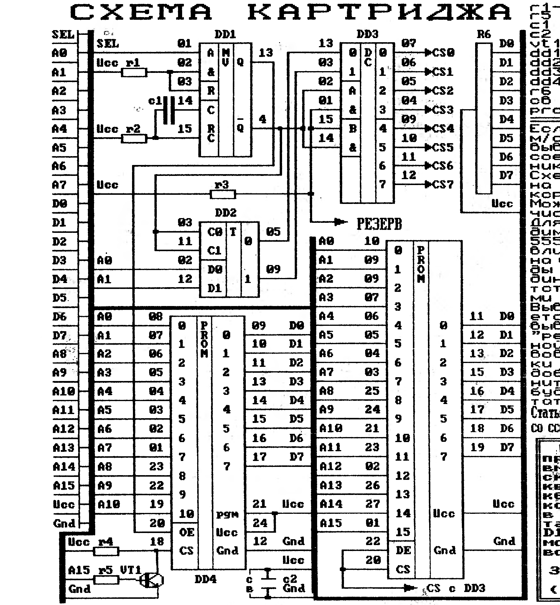

## Письма пользователей

"...прочитал шестое интервью рубрики "Цикл" и просто не выдержал. Хочу чтобы на мое письмо обратили внимание, или хотя бы на некоторые моменты. ВО-ПЕРВЫХ - о каких "стульях" идет речь? Их просто нет! С того 1990г, когда я стал заниматься с Вектором как простой пользователь, и до настоящего времени ничего серьезного по системным файлам я для себя не нашел. Единственное, чем меня держит это "железо" - это **ASC.COM**, которым я пользуюсь для своего дела (базы данных и распечатка на принтере). Хотя это никакая не база данных и у этого редактора много недостатков, но это единственный редактор, который может что-то сделать с текстом и управлять принтером. **(ЗРЯ БЕРГИЧ БРОСИЛ ВЕКТОР)**. Вы скажете, а РЕБУС не база данных? Да, можно сказать так, но думаю, что ни один владелец Вектора не пользуется этой и другими программами-монстрами, так как они неудобны в работе. Сюда можно отнести и все редакторы текста (MARGO, MAR, VED и т.д.) Я бы хотел иметь хорошие программы: базу данных, редактор текста, которые просты и удобны, хорошо оформлены, имеют оконный интерфейс, вывод на принтер в диалоговом режиме. Вот когда это будет, тогда можно говорить о "стульях". ВО-ВТОРЫХ - во всех интервью программисты жалуются, что почти все созданное ими тиражируется без их ведома. Если честно, то пользователю абсолютно все равно кому платить за программы - учитывается только цена и скорость доставки. Понятно, что любой труд должен быть оплачен, но пользователь - то в чем виноват? Кто нас спрашивает какие программы нам нужны? И я предлагаю программистам заключать контракты с группами пользователей на заказанные ими программами, а уж потом требовать с заказчиков деньги. Естественно, предварительно договорившись о цене времени и о самой программе. Все это должно быть на доверии. Обманул, значит больше никаких дел. Вот и все вопросы. Но ведь и пользователи тоже теряют свои деньги. Думаю, что часть денег - в виде аванса - можно вложить в заранее заказанный продукт. Но опять же нужно доверие. Я, например, откликнулся на предложение бывшей "Системотехники". Как вы тогда писали, что это ММ-шина. В принципе так и получилось. Я надеялся, что эти программы будут созданы, но не дождался. Что мне теперь, плакать что-ли? Пусть будет это на совести этих людей. Понимаю, что все стараются урвать чужое, не заплатив ни рубля, но за себя могу поручиться, что программ не тиражирую и хочу знать, что можете предложить таким как я - "честным" пользователям? Лично я не знаю, что мне делать? Бросить все это хозяйство или ждать и на что-то надеяться? Никак не возьму в толк, должен ли я узнавать о наличии новых программ или мне должны об этом сообщить? Чтоб я спокойно мог выбрать что мне нужно и выполнить условия... В общем нужен нормальный диалог программистов с пользователями. Программистам неплохо бы знать, что нужно пользователям. Пользователям, которые вовремя платят деньги, уделять больше внимания. И ПОСЛЕДНЕЕ - пользователям не удобно обращаться напрямую к программистам. У каждого конкретного автора есть только то, что он и сделал, а у фирм и разных контор есть какой-то выбор. Требуется договоренность между ними. И неплохо было бы организовать рубрику "Какую программу я хочу". И побольше информации о новых разработках, а то тишина какая-то.

07.06.95. Сухарников С.А."

"...Получил печатку на эл.диск, контроллер, музыкалку - собрал (7часов) и ... все сразу заработало! Все запустилось без всяких подборок-регулировок (по сравнению с эл.диском на РУ7-х - Омск - весьма кропотливая подгонка емкостей и напряжения +5В). Так что спасибо за эту конструкцию. Мое личное мнение, не нужно было тратить целый разворот на публикацию фотошаблонов, желающих срисовывать не найдется, да и качество невысокое. Проще и дешевле эту плату приобрести. А вот о том что на 42 ногу надо подавать +128 не лишним будет и напомнить. ВГ93 нынче недешевы. Далее, где можно подробнее узнать о контроллере винчестера для Вектора-06Ц? Приказали долго жить и "Системотехника" и "Сотап", так что ваша таблица немного не соответствует. Про "пиратство" в номере 22 все верно написано и уже дает свои плоды - новых игровых программ больше нет, все проходит мимо ушей "тиражаторов". "Калява" - точно - на генном уровне - за спасибо и не более того. Давно знаком с Омским "Гепардом" и, насколько мне известно, все технические задумки делает не Шашков, а Дудкин. И писать под схемой музыкального сопроцессора "схема Шашкова", мягко говоря, не совсем точно. Системные часы, контроллер дисковода, эл.диск на РУ7 - это все Дудкин.

17.06.95. Смольяков С.В."

На вопросы, заданные Сухарниковым пользователям и программистам, ждем писем от тех и других. С некоторыми утверждениями "...нет хороших программ с 1990 г" трудно согласиться. Все зависит от желания и от того как каждый понимает свое удобство работы.

Двухдисковый пакет **"ЖУРНАЛИСТ"**, который можно приобрести за **75000** руб у нас (с учетом почтовых расходов и стоимости двух дискет) удовлетворит любого, у кого есть принтер и дисковый вариант "Вектор-06Ц". Ждем писем на тему: "Какую программу я хочу?". Фотошаблоны печатной платы публиковались для того, чтобы было видно, что она существует (забыли где живем?).

В отношении авторства - Дудкин читает наш выпуск и если до сих пор не возмутился, то все нормально. Подробнее о контроллере винчестера может рассказать только автор.

## Z80 и совместимость

Все более широкое распространение процессора Z80 среди владельцев Вектора позволяет предположить появление программ, использующих новые возможности. Однако, ввиду того, что метод установки Z80 не единственный, программист должен знать различия этих методов, если хочет обеспечить работоспособность своих программ на всех компьютерах с Z80. Существующие на сегодня варианты сведены в таблицу.

| СВОЙСТВО | КИШИНЕВ | ОМСК | ВЛАДИМИР | "ТУРБО+" |
|---|---|---|---|---|
| Использование эл.диска | Да | Да | Да | Да |
| Эмуляция ZX-Spectrum | Есть | Нет | Нет | Нет |
| Доп. режимы эл.диска | Есть | Нет | Нет | Нет |
| Команды обращения к электронному диску | PUSH POP | PUSH POP XTHL | PUSH RST POP RET XTHL R* | PUSH POP ? |
| Верное программирование палитры | Требует вниман. | Да | Да | Да |
| Простота установки (56) | 4 | 3 | 1 | 5 |
| Наличие схемы | Нет | Есть | Есть | ? |
| Ориентировочная цена($) | 20...29 | 9 | 4....6 | 130(*) |
| Серийное производство | Да | Да | Нет | ?Да |

(*) цена всего комплекта с дисководом.

**Вариант "Кишинев"** разработан В.Фроловым. Можно рассматривать этот вариант как стандартный. Устройство представляет собой собранную и отлаженную плату. Из представленных является наиболее просто устанавливаемой и обладает максимальными возможностями. К таковым относятся: аппаратная эмуляция ПК класса ZX-Spectrum (причем в дисковом варианте), дополнительные режимы работы с эл.диском; возможность очень просто перейти на 580-й процессор.

**Вариант "Владимир"** - разработка ТОО "Эдельвейс". От прочих отличается низкой ценой, но вместе с тем сложной установкой. Не предусмотрена даже плата и все вновь вводимые компоненты устанавливаются внутри ПК "верхом" на уже имеющиеся. К достоинствам относится то, что схема и метод установки были опубликованы ("Владимир-Вектор"-2, "Вектор-User"-18).

**Вариант "Омск"** разработан в СЦ "Гепард" и по своим техническим параметрам близок к варианту "Владимир", от которого отличается в основном простотой установки (схема выполнена на печатной плате) и возможностью сравнительно легко перейти назад на 580-й.

**Вариант "Турбо+"** также разработан в "Эдельвейсе", является законченным Вектор-совместимым компьютером на базе процессора Z80.0 нем была информация в упомянутых изданиях.

### Совместимость вариантов

Как видно из таблицы и комментариев, возможности схем установки Z80 различны. Программист, использующий, например, дополнительные возможности адаптера "Кишинев", должен предварительно каким-либо образом определить тип схемы. Это же относится и к командам обмена с эл.диском. Для обеспечения совместимости рекомендуется производить обмен, используя только команды PUSH и POP. Особенности программирования адаптера "Кишинев" даются в документации, поставляемой с ним. Также эта инфо публиковалась в "Вектор-User" NN 18,19. Адаптер "Кишинев" - единственный из рассматриваемых, имеющий управляющий порт (адреса 80h-8Fh, 0A0h-0AFh). Порт доступен только для записи. Рекомендуемый адрес обращения - 80h.

**Программирование палитры.** Если не принимать специальных мер, программирование палитр на Z80, из-за повышенного быстродействия, может не получиться. Поэтому все адаптеры, кроме "Кишиневского", требуют изменения схемы ПК. В адаптере "Кишинев" при программировании цвета необходимо программно включить режим нормального быстродействия установкой в 0 бита 6 управляющего порта (этот режим устанавливается после сброса ПК).

**Прерывания.** Все варианты корректно работают с прерываниями при исполнении обычных Векторовских программ. Сложности могут возникнуть при исполнении цепочных операций (типа OUTIR, INDR, LDDR, LDIR и т.п.), так как во время их выполнения запросы на прерывания не отрабатываются. Рекомендуется перед их использованием прерывания запрещать, а по окончании разрешать. Связано это с особенностями схемы Вектора и различных вариантов. Выполнение этого требования по крайней мере необходимо для варианта "Омск".

**Порты и внешняя шина.** При использовании адаптера "Владимир" на внешней шине часть портов будет недоступна. 2-ая проблема связана с ПК "Криста-2", удельный вес которой в некоторых местах значителен. Поэтому для нее в Омске была написана программа ADAPT, предназначенная для адаптации игр, стартующих не с адреса 100. Помимо прочего, ADAPT делал программу работоспособной на "Кристе", добавляя в начало команды настройки ее видеоадаптера. Поскольку порт управления последним имеет адрес 85h, и туда записывается, как правило, 0F0h, такая программа будет неработоспособной на адаптере "Кишинев". Для восстановления работоспособности достаточно удалить команды OUT 84 и OUT 85. 3-я проблема связана с устройством "ПЗУ-8", распространяемым СЦ "Гепард", где предусматривается установка в ПК Вектор м/схемы 2764. При этом производится модификация схемы машины для использования всех 8Кб одновременно. Другие 4Кб включаются по адресам 8000h-8FFFh. Побочным явлением является: во-первых - порты с адресами 80h-8Fh становятся недоступными на внешней шине; во-вторых: при обращении к ним в действительности происходит обращение к портам 00h-0Fh. Если в ПК установлен адаптер "Кишинев", то это не приведет ни к каким отрицательным последствиям. Но если "из соображений совместимости" программист захочет прописать порт 80h при отсутствии этого адаптера, в действительности будет прописан порт 00h - управляющий порт микросхемы интерфейса. Запись в управляющий порт приводит к установке в 0 всех выходных линий. Существенно, что при этом в регистре рулонного смещения также будет 0, что может привести к срыву изображения. Чтобы этот дефект не проявлялся, необходимо проверять тип адаптера или обращаться к управляющему порту по адресам 0A0h-0AFh. Другим выходом может быть модификация ПК - требуется соединить вывод 1 м/схемы D2 (155ИД4) с выводом 5 м/схемы D1 (580 ВА87).

Другой причиной неработоспособности программы на Z80 может быть заражение ее вирусом (Intel-1443), использующим недокументированные команды процессора 580, или наличие таких команд в самой программе. Из программ не работающих ни на какой версии адаптера, можно назвать Basic 2.5 и все его производные. Неправильно (кроме "Кишиневского" адаптера, но и там требуется настройка) работают автоопределители скорости в программах чтения ROM, т.е. перестают работать большинство копировщиков и загрузчиков ROM. Хочу надеяться, что эта информация поможет всем писать максимально корректные программы.

В.А.Шашков г.Омск

Далее в статье идет описание работы варианта "Омск", которое мы опускаем ввиду отсутствия схемы. Автор наверное не в курсе, что версия BASIC 2.5 для адаптера "Кишинев" существует, высылается вместе с изделием. Будет ли она работать на других вариантах неизвестно, но на адаптере "Кишинев" она работает. А насчет схемы адаптера "Кишинев" - в очень ближайшем будущем она будет опубликована и не только в наших информ. выпусках.

## Картридж для Вектора



Картридж (далее КВ) является интеллектуальным модулем ПЗУ, предоставляющим значительно большие возможности по сравнению с традиционными схемами. Использование КВ исключительно просто, если только в Вашем Векторе установлен усовершенствованный Начальный загрузчик. Годится любая версия: Кишиневская, СуперПЗУ Coman, Омская и т.д. При загрузке из КВ на экране появляется список программ, содержащихся в его сменном ПЗУ. Остается только подвести курсор к нужной программе, нажать `ВК` и программа запустится. Если будет нажата `ПС`, то программа будет загружена в память, но не запустится. Зачем? Иногда это необходимо, а когда - указано в описании на сменную м/сх ПЗУ. В КВ можно установить до 3-х сменных м/сх ПЗУ. Но это не предел. Добавив всего одну м/сх, можно устанавливать в КВ и 8 сменных ПЗУ. Вообще же схема позволяет иметь 65536 сменных ПЗУ. Возможно, пользователь захочет сам поместить в КВ программы. Для этого необходимо знать его устройство. КВ состоит из сл. блоков: зона сервисной программы, зона сменных ПЗУ, переключатель страниц, регистр режима. Для начального загрузчика КВ кажется состоящим только из зоны сервисной программы. Ее организация совпадает с Кишиневской схемой МППЗУ. Таким образом, при загрузке из КВ в память считывается сервисная программа. Ее задача - разобраться с содержимым сменных ПЗУ, вывести каталог, запустить нужную программу. Зона сменных ПЗУ разбита на страницы. Каждая страница соответствует одной сменной м/сх. Сервисная программа, поставляемая с КВ, рассчитана на 8 страниц. Выбор нужной страницы осуществляется переключателем страниц. Для того, чтобы получить доступ к зоне сменных ПЗУ, необходимо переключить режим работы КВ. Для этого служит регистр режима. Управляется регистр режима при помощи канала 0 таймера. В исходном состоянии таймер молчит, при этом регистр режима запрещает доступ к зоне сменных ПЗУ и разрешает - к зоне сервисной программы. Чтобы получить доступ к зоне сменных ПЗУ, необходимо запрограммировать таймер так, чтобы на его выходе были прямоугольные колебания частотой 500кГц и выше. При этом запрещается доступ к зоне сервисной программы и разрешается - к зоне сменных ПЗУ. Активная ПЗУ выбирается переключателем страниц. Запись значения в переключ. регистра режима происходит в момент переключ. регистра режима в исходное состояние. В Приложении приведены программы переключения режима и выбора активной ПЗУ. Для того, чтобы сервисная программа смогла разобраться с содержимым сменных ПЗУ, необходима информация о размещении программ в них. Разумеется, можно самостоятельно написать свою сервисную программу и разработать свой стандарт на разметку сменных ПЗУ. Но рекомендуем придерживаться разметки, поддерживаемой имеющейся сервисной программы.

**Рекомендуемый формат сменного ПЗУ:**

| БАЙТ | ОПИСАНИЕ |
|---|---|
| 76h | Идентификатор микросхемы |
| xx | Код производителя (00 - СЦ "Гепард") |
| xxxx | Имя ПЗУ (до 24-х знаков) |
| 00 | Признак начала информационной области |
| xxxxx | Программа |
| ... | Программа |

Каждая программа состоит из заголовка и тела.

**Формат заголовка:**

| БАЙТ | ОПИСАНИЕ |
|---|---|
| xx xx | Код программы |
| xx xx | Адрес загрузки в ОЗУ |
| xx xx | Длина тела программы |
| xx xx | Адрес старта программы |
| xxxxx | Поле связи |
| 00 | Имя программы (до 24-х знаков) |
| тело | Признак начала тела программы / Тело программы |

Поясним назначение некоторых полей.

Код программы - некоторое число, присваемое ей производителем сменной ПЗУ. Может принимать любое значение, кроме 0FFFFH. Код должен быть уникальным - никакие две программы одного производителя не должны иметь одинаковые коды. Значение 0FFFFH означает, что достигнут конец ПЗУ - далее программ нет. Загруженная программа будет запущена по адресу старта. Поле связи используется для того, чтобы разбить программу на несколько блоков, что бывает необходимым для загрузки, например, Монитора-Отладчика сразу по рабочим адресам. Каждый блок оформляется как отдельная программа. В поле связи указывают номер следующего блока (код программы). Загруженная программа будет запущена по адресу, записанному в поле адреса старта первого блока. Поле связи последнего блока содержит значение 0FFFFH. Имя указывают только в первом блоке; все последующие блоки должны быть с пустым именем. Сервисная программа будет искать блоки во всех установленных сменных ПЗУ того же производителя. Программа, состоящая только из одного блока, имеет, таким образом, в поле связи значение 0FFFFH.

**Приложение: подпрограммы управления КВ.**

```
; Переход в исходное состояние
STD:    MVI     A,16H   ;Кан.0,реж.3,только мл.байт
        OUT     8       ;Выв. в порт управления;од-
                         ;новременно останов таймера
        CALL    WAIT    ;Задержка для переключения
                         ;регистра режима КВ.
        RET

; Подпрограмма задержки
WAIT:   XRA     A
        DCR     A
        JNZ     $-1
        RET

; Подпрограмма включения зоны сменных ПЗУ
EXTRON: MVI     A,16H
        OUT     8
        MVI     A,2     ;Коэффициент деления для
        OUT     0BH     ;канала 0
        CALL    WAIT
        RET

; Подпрограмма выбора страницы (0..255)
;Вход: A = N страницы
SELEKT: PUSH    PSW
        CALL    EXTRON
        POP     PSW
        OUT     7
        CALL    STD
        RET

; Подпрограмма чтения байта из ПЗУ
;Вход: HL - адрес байта в ПЗУ
;Выход: A - считанный байт
;Предварительно выбрать страницу и включить
;зону сменных ПЗУ
GET:    MOV     A,L
        OUT     7
        MOV     A,H
        OUT     5
        IN      6

; Подпрограмма настройки параллельного интерфейса для связи с КВ.
TUNE:   MVI     A,82H   ;A,C - вывод, B - ввод
        OUT     4
        RET
```

## Схема картриджа



```
r1-r4   4,7 к
r5      1 к (примерно)
c1      4,7 нф
c2      47 x 5V
vt1     кт 315
dd1     555 АГ3
dd2     555 ТМ2
dd3     555 ИД4
dd4     573 РФ5
r6      HPI-8-2,2к
c6      47...150нф, 1-3шт
prom    27512
```

Если используется м/сх 27256, то ее вывод 1 необходимо соединить с источником питания-Ucc. Схема рассчитана на установку до 4 корпусов м/сх ПЗУ. Можно увеличить их число до восьми. Для этого необходимо еще одна м/сх 555ТМ2. Оно устанавливается "верхом" на имеющуюся. Выводы 3,7,11,14 соединяются с соответствующими выводами штатной м/сх. Вывод 2 подключается к сигналу А2, вывод 5 - к точке "резерв". В исходной схеме задействованы токовыборки CS0-CS3, после добавления дополнительной м/схемы будут также работать и CS4-CS7.

Статья и схема получены от Шашкова со ссылкой на "Гепард". (Прод.след.)

> Всего за 150 $ продаю "вектор" вместе с 2-мя дисководами "teac" квазидиском 256 кб, мощным блоком питания (все в одном корпусе) также принтером D100-М, цветным монитором 6106 и всеми дискетами.
>
> ЗВОНИТЬ ПО (095)321-90-29

| Наименование | Цена, руб |
|---|---|
| Контроллер винчестера вместе с дискетой программной поддержки | 175000 |
| Контроллер FDD, RAM-диск (РУ-7), "музыкалка" (на плате 12х18) | 165000 |
| -либо печатная плата | 38000 |
| Контроллер FDD, RAM-диск | 135000 |
| -либо две печатные платы размерами 9х15(FDD), 12х15(RAM) | 38000 |
| Адаптер Z80 (работа со Spectrum'дисками) с программной поддержкой | 135000 |
| Музыкальный сопроцессор - печатная плата | 10000 |
| Музыкальный сопроцессор - все, кроме AY8910 | 20000 |
| Музыкальный сопроцессор - готовый к работе | 35000 |
| Модем ADD1200 с поддержкой | 80000 |
| Модем/АОН с пр. поддержкой | 80000 |
| Программатор (заводской) | 95000 |
| Каталог (с ценами на П/О) | 4000 |

Указанные цены учитывают почтовую пересылку по России и действительны, пока за один доллар дают от четырех до пяти тысяч рублей.

Этот номер является последним из объявленных нами ранее. На следующие шесть номеров, апериодичность которых будет еще более непредсказуема, принимаем деньги из расчета 2000 рублей за один номер без стоимости конверта, 3000 рублей в наших конвертах.

Адрес для писем и переводов изменился:

**117335 МОСКВА А/Я 101 до востребования Фиронов В.П.**

В следующих номерах: схема и описание работы программатора, окончание статьи по Картриджу, наиболее интересные письма пользователей, продолжение Цикла, описания новых и старых игровых и системных программ и т.д. Если есть ЧТО сказать, ПИШИТЕ.
