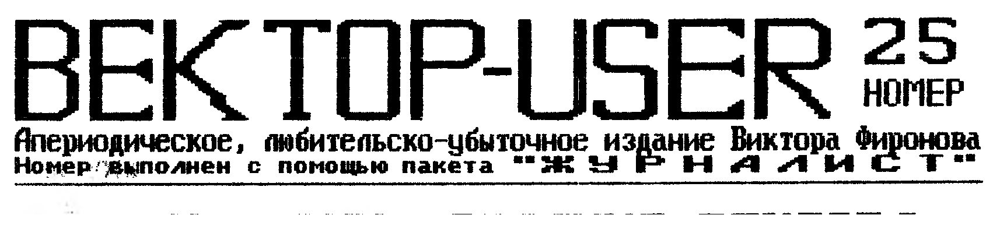

## Из истории создания Вектора

(Данные почерпнуты из разговоров с разными людьми).

В самый разгар перестройки, получив очередную взбучку на коллегии министерства (а может и повыше) за отставание перед буржуйским западом в части массового выпуска отечественных компьютеров, на ВДНХ зашел один из зам-министров тогда еще созного министерства электронной промышленности, одного из министерств получивших задание наладить такой выпуск. Теперь немного отвлечемся и напомним читателям, что в то время в сознании простого советского человека компьютер был сродни динозавру, хотя на западе компания "INTEL" начала производство 386-го процессора, а 8-ми битные машины уже уходили в прошлое. Только-только способом домашних технологий у нас начали появляться первые самодельные аналоги Sincler'а, собранные буквально на проводах и стоившие тогда немалые деньги. Видно именно это и подвигло тогдашние верхи на решение проблемы (комплектующие-то государству обходились в копейки, да и отчитаться можно быстро). Так вот, зашел зам-министра на ВДНХ и прямиком в павильон народного творчества, а там как раз проходил конкурс на лучший компьютер, в котором два кишиневца Тимиразов и Соколов выставили свое детище - "Вектор-06Ц", который тогда занял 2-е место после МС-1502. Увидев эту машину, зам-министра удивился, что завод его министерства ("Счетмаш" г.Кишинев) выставил этот ПК, а он - зам-министра об этом ничего не знает. "А подать сюда этих Тимиразова и Соколова!! Кто такие? Почему не знаю?" Что интересно, на самом Счетмаше тоже мало что знали про Вектор. "Ну работает Тимиразов на Счетмаше, ну и что?" В общем, после всех перепитий, по истечении нескольких месяцев посещения зам-министром ВДНХ, Кишиневский "Счетмаш" приступил к массовому выпуску ПК "Вектор-06Ц", а через полгода эту машину выпускали в Бресте и Астрахани, Минске и Волжском, Кирове и Волгограде и еще черт знает в каких городах. В голову приходит интересная мысль - а не пришел бы зам-министра на ВДНХ? А не было б в то время конкурса? А обратил бы он внимание, например, на Бакинский "Байт"? А не работал бы Тимиразов на Счетмаше? Слава, слава зам-министрам приходящим на ВДНХ. В 1991 году Кишиневский "Счетмаш" начинает выпуск ПК "Вектор-06Ц-02", в котором были исправлены все нелепости первой модели (инверсия, автозапуск, загрузчик, потребление питания и т.д.) и кто знает, может быть у нас все было бы как у IBM - начинали с ОЗУ 256 бит, а пришли к PENTIUM - если бы основные силы делающие Вектор, не оказались за границей. Тем более, что Тимиразов уже готовил к выпуску свою новую модель - IBM совместимый Вектор. Да и дело, наверное, не в том, что Молдова стала заграницей, структура производства подобной аппаратуры была разрушена и не было никакого смысла заниматься разработкой чего-нибудь нового во время постоянной инфляции и ежедневного увеличения цен. Вектором занимались на одном энтузиазме, имея, конечно, и какие-то материальные планы для себя. Но разбив лоб, люди отходили от этой машины. Оставшихся можно пересчитать по пальцам одной руки... Жаль.

Фиронов В.П. г.Москва

## Картридж (Окончание, начало в номере 24)

Пример программы, выводящей производителей первых 3-х сменных м/сх ПЗУ (работает под Монитором-Отладчиком, Space System или Эмулятором РК-86).

```
DEMO:   CALL    TUNE            ;Настроим интерфейс
        MVI     B,0

WORK:   MOV     A,B             ;Выбор микросхемы
        CALL    SELECT
        CALL    EXTROM          ;Включим зону сменных ПЗУ
        LXI     H,0
        CALL    GET             ;Читаем идентификатор микросхемы
        CPI     76H
        JNZ     NOROM           ;это нестандартное ПЗУ
        INX     H               ;читаем байт I
        CPI     0               ;00?
        JNZ     NOGP            ;Нет. Не "Гепард"
        JMP     GP              ;байт I = 0  "Гепард".

LOOP:   INR     B
        MOV     A,B
        CPI     3               ;три первые микросхемы проверены?
        JNZ     WORK            ;Нет. Продолжим.
        JMP     0

NOMER:  LXI     H, TEXT1        ;Вывод номера микросхемы
        PUSH    B
        CALL    0F818H
        POP     B
        PUSH    B
        MVI     A,'0'
        ADD     B
        MOV     C,A
        CALL    0F809H
        POP     B
        RET

NOROM:  CALL    NOMER
        PUSH    B
        LXI     H,NOROMT
        CALL    0F818H
        POP     B
        JMP     LOOP

NOGR:   CALL    NOMER
        PUSH    B
        LXI     H,NOGPT
        CALL    0F818H
        POP     B
        JMP     LOOP

GP:     CALL    NOMER
        PUSH    B
        LXI     H,GPT
        CALL    0F818H
        POP     B
        JMP     LOOP
```

```
TEXT1:   DB   10,13,"Сменная ПЗУ N",0

NOROMT:  DB   "Нестандартная или отсутствует",0

NOGPT:   DB   "Произведена не центром Гепард",0

GPT:     DB   "Произведена центром Гепард",0
```

**Дополнительная информация:**

Сервисная программа при своей работе размещается и использует область памяти по адресам: 0A000h - 0DFFFh.

Информация помещенная ниже была получена от Шашкова с пометкой "не для тиражирования". Но учитывая, что "Гепард" прекратил овое существование, мы ее публикуем.

**Описание подпрограмм сервисной ПЗУ, которые не будут изменяться:**

- **A003:** Рестарт сервисной программы
- **A006:** Вывод символа на экран. Вход: A = код символа в КОИ7 (20H - 7FH). Курсор не перемещается!
- **A009:** Вывод сообщения из ОЗУ на экран. Вход: HL - адрес сообщения (оканчивающегося 00). Курсор не перемещается!
- **A00C:** Вывод сообщения из ПЗУ на экран. Аналогично A009H
- **A00F:** Очистка экрана. Очищает экран, устанавливает курсор в левый верхний угол, программирует палитру.
- **A012:** Курсор вверх. Перемещает курсор вверх.
- **A015:** Курсор вниз. Перемещает курсор вниз.
- **A018:** Опрос клавиатуры. Возвращает код нажатой клавиши: 2 = `ПС`, 4 = `ВК`, 8 = `ЗБ`, 10H = Влево, 20H = Вверх, 40H = Вправо, 80H = Вниз. При нажатии `ТАБ` управление передается на адрес A024.
- **A01B:** Меню. Вход: ячейка AE03 - число позиций меню. Первая строка меню располагается по координатам 0C3E0H. Выход: ячейка AE06 - номер текущей позиции (начиная с 0). ZF = Z, если была нажата `ПС`, иначе была нажата `ВК`. При нажатии `ЗБ` очищается память, затем управление передается на адрес A024.
- **A01E:** Загрузка. Вход: DE - код загружаемой программы; ячейка AE05 - число установленных м/сх ПЗУ; ячейка AE07 - код производителя текущей ПЗУ; ячейки AE08 и AE09 содержат 0FFH; по адресу A800 находится список установленных м/сх. Выход: ячейки AE08 и AE09 - адрес старта загружаемой программы. Если программа не найдена, управление передается на адрес A024.
- **A021:** Поиск программы в текущем ПЗУ. Вход: HL указывает на какую-нибудь программу или содержит 0000 - искать с начала ПЗУ. DE содержит код программы или FFFF - искать любую программу. Выход: HL спозиционирована на найденную программу, ZF=NZ. Если ZF = Z, то программа не найдена.
- **A024:** Пользовательский рестарт сервисной программы. По умолчанию показывает на A003.
- **A027:** Инициализация интерфейса ВВ55.
- **A030:** Выбор активной ПЗУ. Вход: A = номер выбираемой ПЗУ.
- **A033:** Отключение зоны сменных ПЗУ.
- **A036:** Чтение байта из ПЗУ. Вход: HL - адрес байта в ПЗУ; Выход: A - прочитанный байт.
- **A039:** Программирование палитры в стандарте Дос. Вход: D - цвет фона, E - цвет изображения.

**Список адресов ячеек:**

| Ячейка | Описание |
|---|---|
| w.AE00 | Координаты курсора (адрес в ПЗУ экрана) |
| b.AE02 | Номер текущей выбранной ПЗУ (записывается п/п A030) |
| b.AE03 | Число позиций в меню |
| b.AE04 * | Номер рабочей ПЗУ |
| b.AE05 * | Число микросхем ПЗУ |
| b.AE06 | Позиция курсора в меню |
| b.AE07 * | Код изготовителя рабочей ПЗУ |
| w.AE08 | Адрес старта загружаемой программы |
| w.AE0A | Адрес старта последнего загружаемого блока |
| A800 * | Список номеров установленных сменных ПЗУ |

Ячейки, помеченные звездочкой (*), при запуске пользовательской программы содержат корректные значения.

**Последовательность запуска пользовательской программы:**

1. Очищается область памяти 0C000H - 0DFFFH (если нажата `ВК`);
2. Загружается программа;
3. Включается палитра ДОС - синие символы на белом фоне;
4. Отключается зона сменных ПЗУ;
5. Устанавливается вершина стека на 0DCF0H+;
6. Загружаемой программе передается управление.

Во время работы сервисной программы стек установлен на 0BFFFH. Зона по адресам 0B000H - 0BFFFH используется только как стек. Реально свободна память по адресам 0B000H - 0BF00H.

Шашков В.А. г.Омск

## Графика из МикроДОС (3,1) на экране

Экран располагается по адресам A000 - DFFF (40 - 56 кб). То есть работают две плоскости -> 4 цвета, но для более четкого изображения создателям этой версии пришлось использовать режим 512 x 256 точек (00 - 8A), следовательно 16 Кб на одну экранную плоскость, т.е. один цвет. Но не пробуйте сразу же, узнав что экран располагается в адресах A000-DFFF, что-то пытаться вывести туда, так как затроните и электронный диск. Электронный диск в операционной системе работает в режиме "АДРЕСНОСТЬ", вместо 2-й и 3-й области используется область электронного диска A000-DFFF. Микропроцессор работает с ней как с ОЗУ, за исключением того, что при записи информации в экранную плоскость, происходит ее вывод на экран монитора, а при записи в электронный диск этого не происходит. Поэтому, когда необходимо вывести сообщение на экран, ДОС (или любая другая программа) отключает на это время электронный диск (управляющее слово - 0) и производит запись в экранную область. Вывод на монитор осуществляется постоянно видеоконтроллером компьютера, поскольку он работает независимо от электронного диска. Пользователь даже не замечает, когда процессор работает с электронным диском на адресах экранной области.

Сейчас рассмотрим п/п стирания экрана в ДОС:

```
        MVI     A,0             ;Отключаем ЭД.
        OUT     10H
        LXI     H,A000H         ;Начало области (экрана)
RO:     MVI     M,0             ;Стираем байт
        INX     H               ;Переход к следующему байту
        MOV     A,H             ;Проверяем не достигнут ли конец (экрана)
        CPI     E0H
        JNZ     RO              ;Перейти к RO если нет
        MVI     A,23H           ;Переход в нормальное состояние в ДОС
        OUT     10H
        JMP     0000            ;Выйти в ДОС
```

Теперь поговорим о выводе картинки и изменении палитры. При выводе картинки из Микродос ничего сложного нет, только надо учитывать следующие правила:

1. Картинка должна быть нарисована в 1-й плоскости (E000H-FFFFH)
2. Для того чтобы изображение картинки сделать плотным, а не раздробленным на точки, следует картинку пробить по двум плоскостям (A000H - BFFFH, C000H - DFFFH) - это третья и вторая плоскости.

Теперь о палитре цветов: Микродос использует один цвет фона и один цвет изображения. Адреса, где хранятся номера цветов даны ниже:

Фон: FFBFH

Цвет изображения: FFC0H

То есть, если вы решили написать программу под Микродос, например: утилиту, упаковщик и т.д, то советую менять по своему усмотрению палитру, а при выходе восстановить стандартные цвета.

```
B FFBF - 00H
B FFC0 - 28H
```

Это касается Микродос версии 3,1. Так как в других версиях ДОС адреса фона и цвета изображения другие.

Федин Д.А. г.Москва

## Какую программу я хочу?

Печатаем структурный алгоритм программы "База данных", присланный нам Сухарниковым С.А. из Нижегородской губернии, вместе с его же комментариями.

"БД" состоит из трех режимов.

1) Каталог всех "БД".
2) Поиск данных.
3) Создание новой базы (формат, ввод данных и т.д.)

В подрежиме "формат базы" желательно бы иметь 10 стандартных форматов баз (на все случаи жизни) - это приведет к стандартизации данных (свободный обмен данных). Для тех, кто хочет создать свой формат базы, пожалуйста, создавай в "Редакторе форматов". В "Редакторе форматов" для создания формата базы (колонок, окон) лучше всего использовать режим работы "Карандаша", где есть масштабирование прямоугольника по заданным заранее координатам. В "Редакторе текстов" (ввод данных) лучше всего использовать систему работы "RETEX"а, введя некоторые изменения в переводе курсора, учет количества окон и т.д. Например: если формат базы состоит из 2-х и более окон, то курсор должен перемещаться в другое окно на эту же строку, со 2-го окна в следующую и т.д. Количество символов в строке должно быть 64, размер символа 8 точек (64/8), кодировка ASCII (RETEX). Предусмотреть печать в режимах: двойной, расширенной, уплотненной, качественной печати, возможность форматирования текста и т.д.

Насчет пароля (кода). Думаю, что он нужен, так как "БД" могут пользоваться несколько человек. У каждого из них есть своя "БД" и, введя пароль для конкретной базы данных, посторонний человек не сможет ее просмотреть. Если эту базу защищать не надо, то не надо и вводить код "пароль". Система должна определить: если для конкретной "БД" код "пароль" не введен, то его запроса не происходит, если введен, то запросить. В принципе мой вариант похож на "Журналист" и использует все приемы известных программ.

### 1-й режим работы

Диаграмма переходов между экранами режима "РЕЖИМ" (выбор действия), "КАТАЛОГ" баз данных и просмотра/редактирования записей выбранной базы ("БД" на примере базы "РЕЦЕПТЫ"):

```
Экран "БД" (БАЗА ДАННЫХ | РЕЖИМ)
  пункты меню: КАТАЛОГ БАЗ, ПОИСК, СОЗДАНИЕ БАЗЫ
  клавиши: Help F4 | ← | → | ↑ | ↓ | ВК | Quit Ар2
  --> Выход в ДОС
  --> (по ВК на пункте, через ввод кода "пароль") экран КАТАЛОГ

Экран КАТАЛОГ (БАЗА ДАННЫХ | КАТАЛОГ)
  список баз: РЕЦЕПТЫ, ТЕЛЕФОН, ТРАНЗИСТОР, БИБЛИОТЕКА, И Т.Д.
  клавиши: Help F4 | Copy F1 | Disk F2 | и т.п. | ВК | Quit Ар2
  --> Выход в меню "РЕЖИМ"
  --> по ВК: "Введите код "ПАРОЛЬ" ----00000---- ВК"
        не совпал --> назад к экрану "БД" (РЕЖИМ)
        совпал --> экран РЕЦЕПТЫ (список записей)

Экран РЕЦЕПТЫ, список (БАЗА ДАННЫХ | РЕЦЕПТЫ)
  записи: 1.КОМПОТЫ, 2.(...) - ВК -, 3.ВАРЕНЬЯ, ...И ТАК ДАЛЕЕ
  клавиши: Help F4 | F1 | F2 | F3 | и т.д. | ПС | Quit Ар2
  --> Выход в меню "КАТАЛОГ БАЗ"
  --> Поиск по слову --> экран РЕЦЕПТЫ, содержимое записи
  --> "пароль": ввод кода "пароль", изменить код, стереть код --> 00000 ВК

Экран РЕЦЕПТЫ, содержимое записи (БАЗА ДАННЫХ | РЕЦЕПТЫ)
  например: суп гороховый: (информация); суп рыбный: (информация); и т.д.
  клавиши: Help F4 | copy F1 | F2 | ПС | ТАБ | F5 | Quit Ар2
  --> ввод имени "супы" ВК; поиск по символу
  --> ввод кода "пароль": изменить код, стереть код
  --> печать; выход в каталог данных меню
```

3-й режим работы: не будем останавливаться на 2-м РЕЖИМЕ (ПОИСК), а приведем алгоритм самого навороченного 3-го РЕЖИМА работы "БАЗЫ ДАННЫХ".

```
Экран "БД" (БАЗА ДАННЫХ | РЕЖИМ)
  пункты меню: КАТАЛОГ БАЗ, ПОИСК, СОЗДАНИЕ (выделено)
  клавиши: Help F4 | ← | → | ↑ | ↓ | ВК | Quit Ар2
  --> Выход в ДОС
  --> по ВК --> список: 1.РЕЦЕПТЫ, 2.ТРАНЗИСТОР, 3.БИБЛИОТЕКА, 4.АОН, 5.УЛИЦЫ, 6., 7.И Т.Д., 8.
        --> "Введите имя данных "ЭСТРАДА" ВК" --> экран РЕД.ТЕКСТОВ

Экран РЕД.ФОРМАТОВ (БАЗА ДАННЫХ | ФОРМАТ)
  пункты: РЕД.ФОРМАТОВ, РЕД.ТЕКСТА
  клавиши: Help F4 | copy F1 | F2 | F3 | СТР | F5 | Quit
  --> "Введите имя новой "БД" "КАССЕТА" ВК" --> экран РЕД.ФОРМАТА

Экран РЕД.ТЕКСТОВ (БАЗА ДАННЫХ | РЕД.ТЕКСТОВ)
  содержимое: газмансв (инфо) <- ВК
  клавиши: Help F4 | F1 | F2 | F3 | F5 | СТР | Quit Ар2
  --> Выход в меню "ФОРМАТ"
  --> Вывод информации на принтер

Экран РЕД.ФОРМАТА (БАЗА ДАННЫХ | РЕД.ФОРМАТА)
  оси Y/X с прямоугольниками формата базы (масштабирование)
  клавиши: Help F4 | copy F1 | F2 | F3 | СТР | F5 | Quit
  --> ввод кода "пароль", изменить код, стереть код
        --> Записать или стереть на диске код "пароль" для базы данных "КАССЕТА"
  --> печать
```

Пакет "БД" будет предложен для создания ряду программистов, а в следующем номере напечатаем результаты этих предложений. Подобных систем нет ни на одной 8-ми битной машине. Имеющие принтер и занимающиеся каким-либо систематизированием - это для вас.

## Вокруг Вектора

- Максим Алюдин бросил заканчивать свою многоуровневую, многофайловую "СПЕЦГРУППУ" и занялся бизнесом;
- приказали долго жить Кишиневский Центр "Компьютер", Кировский "Байт", Омский сервисный центр "Гепард", сожалеем;
- появился "ALARM" - новый вестник информации по Вектору, вышло пять номеров, издает Руслан Костиневич (г.Борисов);
- в Кишиневе появилась группа вектористов Сергея Артемьева;
- Дмитрий Федин наскоро слепил игрушку "COMBAT RABBITS" и предложил ее нам для распространения, любителей кроликов и каратэ просьба присылать по пять тысяч, в нашем каталоге игра на ++;
- после рекламы в "Радиолюбителе" получили массу писем (> 200) и только в полутора десятках из них был интерес к играм переносимым с ZX Spectrum. Дальнейшая работа автором прекращена;
- от Федора Пересадова ничего нет, на письма не отвечает;

## Программы для МикроДОС

ДАС представляет пользователям ПК "Вектор" пакет программ под общим названием "View graphics" предназначенный для просмотра графической и текстовой информации. Для Вектора было создано несколько гр. редакторов - Карандаш, Рембрандт, Draw, Pensilno утилит, позволяющих оперативно просматривать графику этих редакторов нет. Пакет позволяет это делать. Что в пакете?

- **Viewbsv** - просмотр файлов, содержащих копию экрана ПК Вектор
- **Viewpcx** - просмотр файлов формата PCX с IBM PC
- **Viewrbr** - просмотр файлов графического редактора "Рембрандт"
- **Viewsor** - просмотр файлов графического редактора "Карандаш"
- **Viewspr** - просмотр файлов графического редактора "Draw"
- **Viewszx** - просмотр файлов содержащих копию экрана ПК Spectrum
- **Viewtxt** - просмотр текстовых файлов - вперед, назад, влево, вправо

Кроме этого в пакет входят 28 картинок, 19 из которых в формате PCX (IBM). Каждая утилита откликается на /?. В будущем планируется создать универсальный конвертор гр.форматов один в другой. Автор готов поделиться опытом переноса графики с IBM PC на Вектор. Звоните во Владимир (09222)1-73-78.

Дмитрий Камшилин.

## Маленькое сообщение

Функция 8 ДОС, предназначенная для тестирования квазидиска, при использовании ее на диске собранном на РУ7-х приводит к порче тех файлов, которые расположились на адресных границах банков памяти квазидиска. Это обуславливается некоторой аппаратной несовместимостью м/схем (РУ5 и РУ7). Проявляется не на всех версиях ДОС. Создатели различных версий ДОС не учли возможность появления диска на РУ7. Другие тесты электронного диска прекрасно здесь работают, пользуйтесь ими. Для большинства владельцев квазидиска на РУ7-х это сообщение будет неприятной новостью, но пугаться не стоит - ПРОСТО НЕ ПОЛЬЗУЙТЕСЬ ЭТОЙ ФУНКЦИЕЙ, для этого существуют другие программы. Таким способом тестировать квазидиск - это все равно, что заливать в самолет 76-й бензин.

> "Журналист" - 75 000 р.
> адаптер HDD - 175 000 р.
> FDD + RAM + AY8910 - 165 т.руб.
>
> Вектора все кончились.
>
> ☎ -1287318
