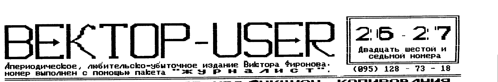
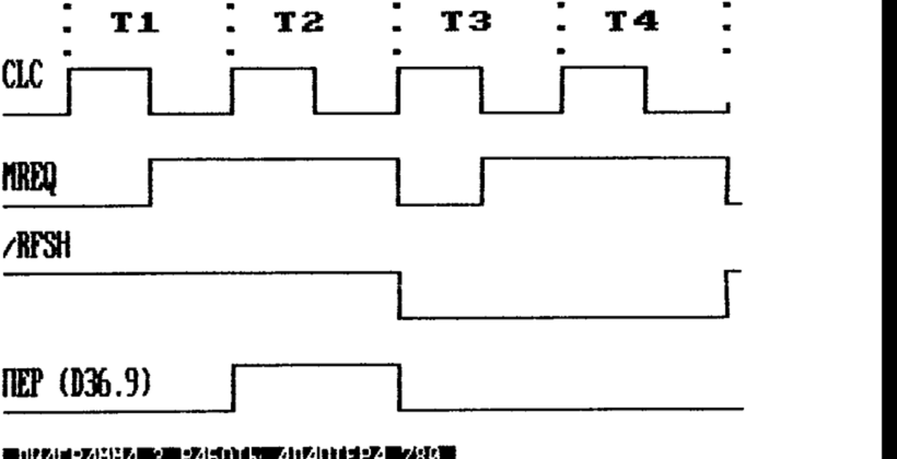
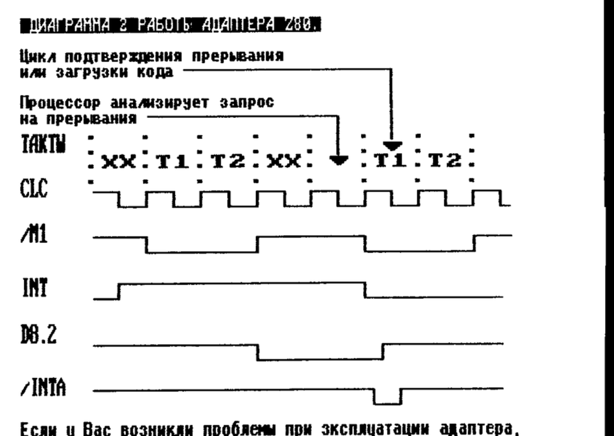
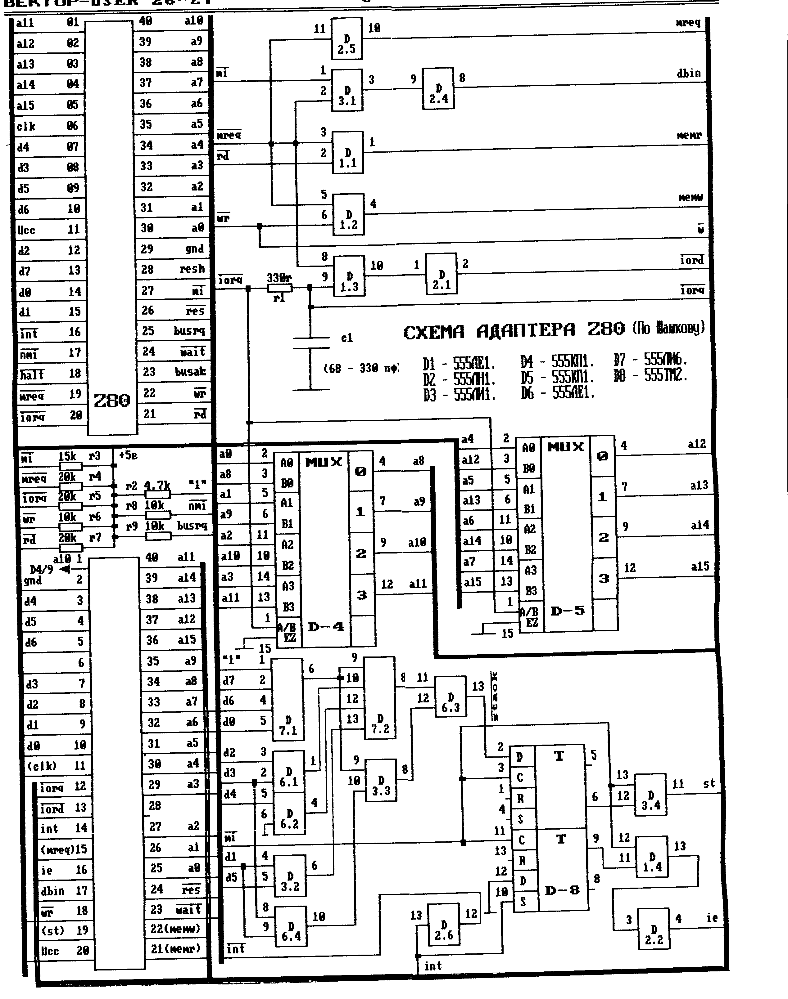
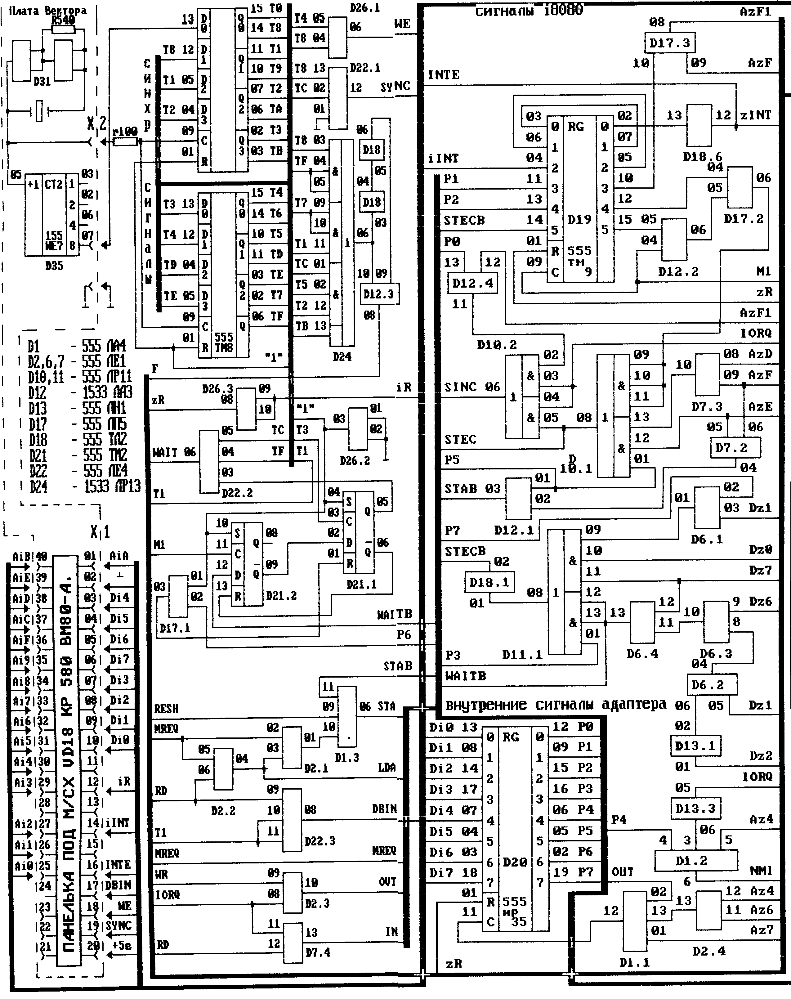
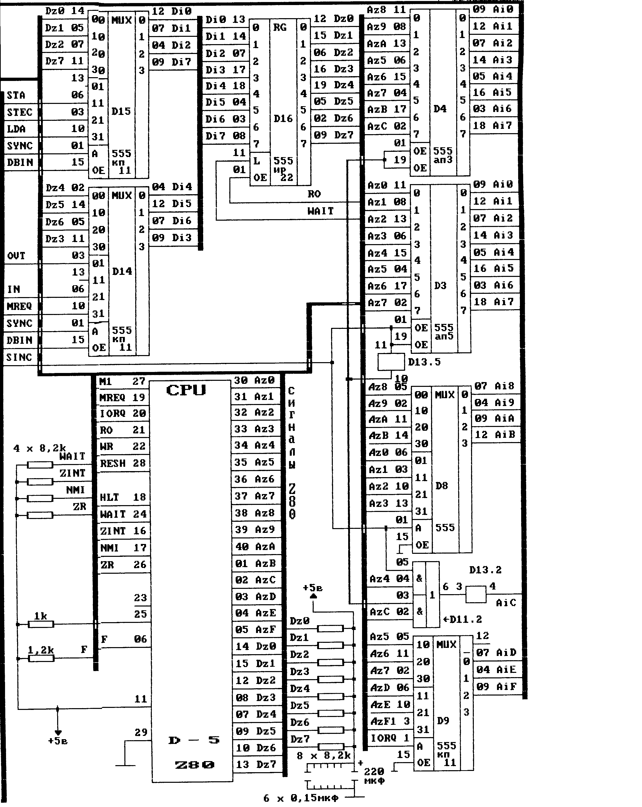

## Защита программ от несанкционированного копирования

Материал дан в общеописательном виде. Рассматриваются идеи, а не конкретные реализации. Кто захочет - сможет сам реализовать эти идеи в своих программах.

Прежде, чем перейти дальше, определим направление защиты. Защищать можно:

1) данную копию программы, т.е. дискету или кассету. Программа будет работать, если запущена с данного носителя независимо от пользователя и особенностей его компьютера;
2) копия может настраиваться на данный компьютер или пользователя, а на других ПК и у других пользователей работать не будет. Пример - дистрибутивные (инсталляционные) диски;
3) гибридный вариант - защищенная копия программы + "электронный ключ".

### 1. Внутренняя защита программ

Если у Вашей программы можно в любой момент перехватить управление, сделать снимок "памяти", посмотреть как и что работает, а затем снова продолжить выполнение программы, то никакая внешняя защита Вам уже не поможет. Нет никакого смысла заниматься защитой в этом случае. Поэтому прежде, чем заниматься внешним видом защищаемой программы, нужно позаботиться об ее внутреннем содержании. Комплекс мероприятий в этой области называется процессом создания "внутренней защиты". Идея ясного и понятного "структурного программирования" постепенно отживает свой век там, где дело касается борьбы с несанкционированным копированием. Сегодня авторам нужно руководствоваться принципом "мне - понятно, а другим и понимать не надо".

При разработке внутренней защиты уделите в первую очередь внимание существующим программным и аппаратным методам снятия памяти. Здесь нужно выяснить, что нарушается или теряется при использовании этих методов и строить систему защиты на основе этих нюансов. Например, может портиться содержимое некоторых ячеек ОЗУ. Тогда имеет прямой смысл разместить в этих ячейках особо важные для работы программы данные, любое изменение которых блокирует выполнение программы. Может портиться или теряться содержимое некоторых портов - храните данные в этих портах или контролируйте их содержимое. Могут изменяться регистры микропроцессора - тем лучше! Используйте этот момент. Если портится содержимое счетчика команд, то у взломщика встанет проблема определения адреса запуска вспомогательной программы. Если портится содержимое регистра стека или же самого стека, то можно подвязаться по этим значениям. При попытке взлома может измениться состояние прерываний - запрещены/разрешены. Маловероятно, чтобы при "снятии" памяти ничего не нарушалось. Но если это так, то защитить кассетную версию практически нельзя.

Можно попытаться затруднить взлом, если на каждом уровне подгружать новый участок программы. Но взломщик может снять программу столько раз, сколько имеется уровней. Можно вместе с программой поставлять блочок с ПЗУ, подключаемый через принтерный разъем. Такая система защиты называется "электронный ключ". Вместо ПЗУ, содержимое которого легко скопировать, в таком ключе лучше использовать ПЛМ. Но тут тоже есть свои проблемы: технологичность, стоимость, степень защищенности ключа и др.

Можно, наконец, поставлять инсталляционную версию программы. Эта версия (изначально нерабочая) будет после запуска подвязываться к каким-либо особенностям конкретного компьютера, настраиваться на него и выгружать на ленту (диск) рабочую версию, которая будет работать только на данном ПК и ни на каком больше.

В тех местах, содержимое которых портится при попытке взлома методом "фотографии" ОЗУ, нужно располагать особо важные данные, в частности "ключи". "Ключи" - это данные, которые используются либо для дешифрации каких-то участков программы, либо для вычисления адресов, либо для хранения флагов (признак "я работу сделал, результат такой-то"). А теперь разберемся, как сделать программу трудночитаемой постороннему глазу.

Первый момент состоит в том, что программа в ОЗУ должна находиться в частично закодированном виде. Т.е. все модули (подпрограммы) в программе делятся на активные и пассивные. Активные модули работают как обычно, пассивные же закодированы и могут находиться как в ОЗУ, так и где-то еще (диск, ПЗУ и т.д.) Перед работой пассивного модуля, он загружается и декодируется с использованием каких-то ключей. После работы он или стирается из памяти или шифруется.

Если взломщик "снимет" ОЗУ во время работы Вашей программы, то при дизассемблировании он будет постоянно наталкиваться на зашифрованные участки, которые сможет декодировать, только если знает ключи шифрования. Как и где хранить ключи, мы уже рассмотрели.

Аналогично можно использовать неявные обращения к подпрограммам. Зачем нам нужно простое и ясное CALL, если можно вычислить адрес обращения с помощью хитрых манипуляций, в том числе используя ключи дешифрации. Можно вообще выделить одну подпрограмму для вычисления адресов обращений. На вход такой подпрограммы будет поступать код, на основе которого подпрограмма вычислит адрес обращения, обратится по вычисленному адресу и вернет управление в точку вызова. Сочетание такого подхода с шифрацией/дешифрацией пассивных подпрограмм способно серьезно затруднить дизассемблирование программы.

Следующий момент касается контроля над целостностью программы. Как правило при взломе пират старается идти легким путем - что-то изменил, запустил, посмотрел. Или же запускает программу под отладчиком. Автором должны быть приняты меры противодействия этому. Сделайте перекрестный контроль между наиболее важными участками программы. Проверять можно целостность участка программы (путем подсчета КС, сравнение с образцом, использование части команд как данных и т.д.) или же "следы" работы этого участка (наличие каких-то ключей, меток, флагов, массива данных сгенерированного участка кодов и т.д.). С отладчиком бороться гораздо труднее, чем с дизассемблером. Но и здесь есть несколько нюансов, за которые можно зацепиться.

1. Отладчик занимает часть ОЗУ. Значит, если осуществлять контроль за памятью, можно помешать использовать отладчик. Контроль возможен в следующих формах: подсчет КС - использование этой памяти под хранение данных (в статичной и динамичной формах). Необязательно хранить данные в этой области подряд. Можно - через 3, 5, 7, ...17 и т.д. байт или же с использованием RND.
2. Если же отладчик при работе использует стек пользователя - тот стек, который использует взламываемая программа - то он вносит изменение в область стека. Эти изменения можно проконтролировать. Очень яркий пример в этой области следующий. Стек назначается по адресу "реальный конец участка программы + глубина стека". При работе процессор последовательно выполняет команды программы, двигаясь от младших адесов к старшим. При работе в стек постоянно откладываются данные и не извлекаются оттуда. Эти данные представляют собой самогенерируемый участок программы. При этом указатель стека движется от старших адресов к младшим. В какой-то момент оба указателя встречаются и программа плавно переходит на только что созданный участок команд.

Луппов Г.Б. г.Киров

(продолжение следует)

## Z80 на Векторе (по Мащкову)

Описываемое устройство (далее - адаптер) предназначено для замены штатного 580-го процессора на более мощный и производительный Z80. Все программы, корректно написанные для вм80 (кроме тех, которые используют его особенности) сохраняют работоспособность. Совместимость с ПК Spectrum на аппаратном уровне этот адаптер не обеспечивает.

Адаптер состоит из микропроцессора Z80, схемы формирования сигналов шины управления (Д1.1 - Д1.3; Д3.1; Д2.1; Д2.4; Д2.5), коммутатора шины адреса (Д4 и Д5), предиката сигнала "стек" (Д6; Д7; Д3.2-Д3.4; Д8.1) и формирователя сигнала /INTA (Д8.2; Д1.4; Д2.2).

Формирователь сигналов шины управления формирует сигналы чтения памяти, записи памяти, чтения портов. Из сигналов /IN и /IORQ элементом Д15.2 компьютера формируется сигнал записи портов. Сигнал DBIN формируется как из инверсии сигнала /RD (чтение), так и инверсии сигнала /М1 (последний принимает значение 0 во время циклов загрузки кода команды и циклов подтверждения прерывания, причем в последнем случае ни одно устройство не оказывается выбранным, и на шину данных процессора приходит код FF) и управляет направлением передачи информации через буфер Д19 компьютера. Сигнал MREQ принимает значение лог.1 при обращении процессора к памяти. Более подробно этот процесс отражен на диаграмме 1.



Коммутатор шины адреса необходим для нормальной работы команд обращения к портам ввода/вывода. Дело в том, что 580-й процессор при обращении к портам выставляет один и тот же код как на старшую, так и на младшую половину шины адреса (хотя это и не документировано фирмой INTEL). Z80 никогда не выставляет на старшую половину шины адреса адрес порта - там выставляется либо содержимое аккумулятора (команды IN A,& и OUT A,&) либо содержимое регистра В (все остальные команды работы с портами). Коммутаторы Д4 и Д5 обеспечивают формирование адреса в стандарте 580-го процессора. Цепочка R1C1 нужна для компенсации задержки переключения коммутаторов. В авторском экземпляре адаптера устойчивая работа достигалась при варьировании емкости конденсатора C1 от 62 пф. до 330 пф. так что RC-цепочка не вносит нестабильности в работу.

На выходе элемента Д6.3 формируется нулевой уровень при наличии на шине данных кодов, соответствующих командам PUSH, POP и XTHL. Положительным фронтом сигнала /М1 прописывается триггер Д8.1. В дальнейшем до появления отрицательного фронта /М1 с выхода Д3.4 снимается сигнал STACK, прохождение которого блокируется при М1=0, предупреждая загрузку кода команды из ОЗУ электронного диска.

Формирование сигнала /INTA реализовано в адаптере нестандартно. Не используется сигнал процессора /INTA. После поступления запроса на прерывание процессор имеет право выполнить одну команду. После этого запрос снимается. Если прерывания были разрешены, процессор начнет обработку запроса (значит запрос надо снять). Если же были запрещены - запрос надо снять иначе, поскольку на плате ПК запрос на прерывания запоминается в триггере Д26.2, прерывания может произойти сразу же после его разрешения в процессоре, то есть не вовремя. Подробнее этот процесс описан на диаграмме 2.



### Установка адаптера в Вектор-06Ц

1. Удалить м/с Д18 (КР580ВМ80А) и Д20 (155ТМ8).
2. Удалить конденсатор С19 (рядом с м/с Д23).
3. Перерезать дорожки идущие к Д83/5, Д26/6, Д15/3.
4. Подсоединить адаптер.

| сигнал | подать | сигнал | подать на | сигнал | подать на |
|---|---|---|---|---|---|
| A0* | Д18/25 | A14 | Д18/39 | GND | AC01 |
| A1* | Д18/26 | A15 | Д18/36 | MREQ | Д23/5(15) |
| A2* | Д18/27 | D0 | Д18/10 | DBIN | Д18/17 |
| A3* | Д18/49 | D1 | Д18/09 | MEMR | Д20/15(21) |
| A4* | Д18/50 | D2 | Д18/08 | MEMW | Д22/4(22) |
| A5* | Д18/31 | D3 | Д18/07 | /W | Д18/18 |
| A6* | Д18/32 | D4 | Д18/03 | /IORD | Д20/11(13) |
| A7* | Д18/33 | D5 | Д18/04 | /IORQ | Д20/06(12) |
| A8 | Д18/34 | D6 | Д18/05 | ST | Д20/02(19) |
| A9 | Д18/35 | D7 | Д18/06 | IE | Д18/16 |
| A10 | Д18/01 | CLK | Д8/5(11) | INT | Д18/14 |
| A11 | Д18/40 | /RES | Д17/5(24) | | |
| A12 | Д18/37 | /WAIT | Д18/23 | | |
| A13 | Д18/38 | +5 | AC02 | | |

(*) Их следует соединять отдельно, либо перерезать соответствующие дорожки у м/с Д18 и установить панельку, подав на нее эти сигналы, либо удалить контакты с платы CPU и развести эти сигналы отдельно. В последнем случае сохраняется возможность легко вернуться на 580-й.

5. Соединить вывод 14 Д37 с общим проводом. Однако встречаются варианты плат Вектора, на которых указанный провод соединен с выводом 3 м/сх Д36. В этом случае с общим проводом соединять не 14-й, а 15-й вывод Д37.
6. Перерезать дорожки, идущие к выв. 2 м/сх Д32 и Д39 (РУ2).
7. Если при работе программ наблюдается самопроизвольное изменение цвета, увеличить емкость конденсатора С1.

Обозначения: AC01 - 1-й контакт разъема "ВУ"; Д18/6 - 6-й вывод м/сх Д18; сигналы, обозначение которых начинается с "/", на схеме обозначены горизонтальной чертой сверху.

На плате адаптера все сигналы выведены на 40-контактную колодку. Ее контакты соответствуют расположению выводов 580-го процессора, за исключением тех сигналов, которые отмечены цифрами в скобках в таблице. Эти цифры - номера контактов колодки, на которые указанные сигналы выведены.

В случае машины Вектор-06Ц-02 методика установки иная.

1. Удалить м/с Д68 (ТМ9) и Д1 (ВМ80).
2. Перерезать дорожки, идущие к Д63/5,6,7,8; Д90/1,2,3; Д75/2; Д82/2.
3. Соединить выводы Д63/3 с Д68/15, а Д63/8 с Д68/7.
4. Подать сигналы:

| сигнал | подать на | сигнал | подать на |
|---|---|---|---|
| MREQ | Д68/5; /IORQ | Д57/9; |
| MEMR/ | Д68/12; | ST | Д68/2; |
| MEMW | Д63/5; | CLC | Д73/5; |
| /IORD | Д68/9; | /RES | AC41; |

5. Соединить Д90/1 с Д89/6, Д90/2 с Д82/3, Д90/3 с Д82/2.

В процессе анализа работы примерно 20 плат выяснилось: адаптер работает очень неустойчиво, если в компьютере удален конденсатор С79 (06Ц) или С80 (06Ц-02). Как правило, это не оказывает влияния на работу 580-го процессора. Для нормальной работы адаптера емкость этого конденсатора должна быть в пределах 270-330 пф. Он установлен между вывод.3 и общим проводом Д73 (06Ц-02) и Д8 (06Ц). Неустойчивость работы проявляется прежде всего при работе в ДОС и Мониторе-Отладчике: большинство игр и монитор ПЗУ8 продолжают нормально работать.

Схема адаптера Z80 приведена ниже; при установке в Вектор-06Ц-02 (часть третья) подключение соответствует специфике этой платы, устройство не может использоваться в других компьютерах без переработки.



Принцип работы. Сигналы адаптера условно разделены на четыре части: шина i8080, шина Z80, синхронизирующие сигналы, внутренние сигналы. В шине i8080 присутствуют сигналы, необходимые для эмуляции работы микросхемы, а в шине Z80-сигналы нового процессора. Их обозначения общепринятые. Триггеры Д23 и Д25, тактируемые кварцевым генератором, синхронизируют работу Вектора и адаптера. Каждый выходной сигнал микросхем Т1-ТF восемь тактов кварцевого генератора подряд принимает значение логической единицы, а остальные восемь тактов - нуля. Сигналы Т с соседними номерами сдвинуты друг относительно друга на такт: Т2 задерживается относительно Т1, Т3 - относительно Т2 на такт относительно Т2 и т.д. Предложенное решение позволяет получить синхронные с Вектором сигналы любой формы с периодичностью 16 тактов генератора, дополнительно используя лишь элементарную логику. Так, сигнал WE формируется элементом Д26.1, SYNC - Д22.1, WAIT - Д22.2, и т.д.

Более сложный тактовый сигнал процессора Д5-F (В) формируется Д26. Микросхемы Д18.2, Д18.3, Д12.3 задерживают задний фронт тактового сигнала процессора F. Этот сигнал не является строго периодичным с частотой 3 Мгц, как у i8080 в непеределанном Векторе. Более высокая тактовая частота применяемого процессора Д5-Z80A(B) - 4(6) Мгц по сравнению с 3-мя Мгц i8080 позволяет удлинить отдельные такты процессора, в данном случае связанные с обращением к ОЗУ. Мультиплексирование данных и слова состояния, применяемые в i8080, выполнено на Д14, Д15. Элементарная логика Д1.3, Д2.1, Д2.2, Д2.3, Д7.4 формирует необходимое слово состояния (сигналы STA, STEC, LDA, OUT, IN, MREQ). Регистр Д16 обеспечивает прием данных в циклах чтения. Адрес, передаваемый на панельку i8080 (сигналы Ai0 - AiF) элементами Д3, Д4, Д8, Д9, Д11.2, Д13.2, существенно отличается от адреса Z80 (сигналы Az0 - AzF).

Можно выделить три основные случая адресации:

1. Обращение к памяти в режиме Вектора (IORQ=1, SINC=1). Сигналы адреса Z80(Az0 - AzF) без изменений транслируются в сигналы адреса i8080(Ai0 - AiF).
2. Обращение к внешним устройствам (IORQ=0, SINC=1). Сигналы адреса Az0 - Az7 передаются на Ai8 - AiF.
3. Обращение к памяти в режиме "синклеровский экран" (IORQ=1, SINC=0). Сигналы адреса транслируются сложным образом, часть из них инвертируется. Необходимость такого режима связана с различием строения синклеровского и векторовского экранов.

В последнем случае адресации, при работе синклеровских программ, черно-белая графика заносится на экранную плоскость Вектора по координатам, соответствующим положению на синклеровском экране. Применение этого режима решает основную часть проблем, связанных с эмуляцией работы синклеровских программ.

На регистре Д20 и элементарной логике Д1.1 и Д2.4 собран встроенный в адаптер порт вывода с адресом 80h. Порт управляет некоторыми режимами работы компьютера. После включения или аппаратного сброса компьютера все биты порта (сигналы P0 - P7) устанавливаются в ноль, что соответствует режиму работы непеределанного Вектора. Кратко назначение битов порта:

1. Изменение адресного пространства (сигналы P0, P1) - включение синклеровского экрана (сигнал SINC м/схемы Д10.2). Инверсия старшего бита (посредством элемента Д17.3).
2. Формирование сигнала STEC (сигналы Р2, Р3, Р5, Р7). Соответствующий сигнал вырабатывается 18080 в операциях обращения к стеку (в мультиплексированном с данными виде) и используется в некоторых случаях работы внешнего ОЗУ для включения последнего. Адаптером этот сигнал формируется существенно более сложным образом, что позволяет использовать всю внешнюю память так же активно, как и внутреннюю.
3. Немаскируемое прерывание (активно при Р4 = 1) позволяет оперативно вмешиваться в обращения к портам ввода/вывода при работе не векторовских программ. Подпрограмма по адресу 66h должна идентифицировать чужеродное устройство, к которому идет обращение, и переадресовать его к векторовским устройствам.
4. Замедление выполнения некоторых команд Z80 до времени их выполнения на i8080 происходит при Р6 = 0 благодаря триггерам Д21 для более полной совместимости с непеределанным Вектором.

Сигналы битов порта Р1 и Р2 задерживаются регистром Д19, тактируемым сигналом М1 основного цикла процессора Z80. Обратите внимание - обычно применяемое мгновенное переключение ОЗУ таит в себе немало неприятностей: команда переключения (OUT...) должна находиться вне области, которая переключается. В противном случае продолжение программы, к которой перейдет управление после OUT..., должно быть подготовлено в строго определенном месте в новом блоке ОЗУ. Реализованное применение задержки сигналов Р1 и Р2 на одну команду Z80 (обычно применяется команда PCHL-перехода) позволяет одновременно с изменением в строении ОЗУ сделать и переход на продолжение программы в новом блоке ОЗУ. Аппаратные возможности адаптера позволили создать программу ZX320 - эмулятор Spectrum 48, что даже принципиально является не тривиальным по причине существенных аппаратных отличий Вектора и Spectrum'а. Программа позволяет работать с синклеровскими программами без дополнительных переделок в компьютере - в цвете, со звуком, без замедления быстродействия. Обмен информацией происходит через векторовский дисковод или магнитофон в синклеровском формате. Более подробную информацию по адаптеру и другим устройствам можно получить у автора по телефону в Кишиневе - (0422) 73-88-64, Владимир Фролов.





## Z80 на Векторе (Владимир) - ответ недоброжелателям

В 24-ом номере "Вектор-User" была опубликована статья В.А.Мащкова, посвященная различным вариантам подключения микропроцессора Z80 на ПК Вектор-06Ц. В этой статье были допущены значительные неточности в описании владимирской схемы, в частности, там было написано, что эта схема на внешний разъем (XS1) подает неполную шину адреса ВВ, что не верно. Владимирская версия не только позволяет адресовать все 256 портов, но и предоставляет значительно больше чем другие опубликованные схемы времени между появлением адреса порта на шине и сигналом ЧТПВ или ЗПIВ, что позволяет без каких-либо подстроек подключать любые внешние устройства.

Далее в статье говорится, что все варианты установки Z80 неправильно работают с прерываниями во время выполнения команд LDIR, LDDR и других блоковых пересылок. Так вот, владимирская схема лишена этого недостатка, прерывания в ней выполняются нормально при любых командах. Надо сказать, что в других вариантах подключения Z80 неправильно выполняются не только во время LDIR'ных команд, но и всех команд с префиксами DC, ED, DD, FD, где вырабатывается два цикла М1. Кроме этого во владимирской схеме устранена недоработка схемы Вектора, которая проявляется при работе с палитрой. После переделки при программировании цветов достаточно только один раз дать команду OUT (0CH), и данные запишутся правильно. Таким образом не нужно тормозить процессор для правильного программирования цветов (что применяется в кишиневском адаптере).

Единственным недостатком владимирской схемы является несколько большая, по сравнению с другими схемами, трудоемкость сборки. Но и этот недостаток может быть сведен к минимуму, если нам удастся наладить выпуск печатных плат. Многих отталкивает от выбора нашей схемы применение в ней ПЗУ, что сделано для большей совместимости при выработке сигнала STEK, но опыт показывает, что для правильной работы всех программ достаточно, чтобы этот сигнал формировался только в командах PUSH, POP и EX (SP), HL. Поэтому есть два варианта схемы, как с ПЗУ, так и без нее. Схему подключения и рекомендации по сборке можно получить по следующему адресу: 601240 Владимирская обл., г.Судогда, ул.Буденного, дом 24, кв.2

Кузнецов Владимир Владимирович

## Киров-диск (новая модель квазидиска)

Данная модель квазидиска полностью сохраняет все технические характеристики кишиневской схемы, обладает большей надежностью и меньшим количеством микросхем.

1. Оставлены м/сх 565 РУ5, так как стоимость 4 м/сх РУ5 дешевле, чем стоимость 1 м/сх РУ7, кроме того невозможно добиться устойчивой работы м/сх РУ7 не вскрывая Вектор, в Омске это доказали. (А в Москве и Кишиневе?)
2. Заменена м/сх 155 РЕ3, так как 50% квазидисков в моей практике выходили из строя именно из-за нее. Не соблюдалась технология процесса программирования и отсутствовала их термотренировка.
3. Элементарная логика 155 ЛП5 и 155 ЛА3, которые использовались в качестве шинного буфера, заменены на 555 АП5 для обеспечения высокой нагрузочной способности.
4. Сокращено количество м/сх за счет использования более интегрированных микросхем.

Путем переключения перемычек на плате, можно иметь:

а) точную копию кишиневского квазидиска;
б) квазидиск с расширенным доступом к нему как к ОЗУ;

Обращение квазидиска к стеку остается без изменений. Для управления расширенным доступом используются биты 6 и 7 порта 10Н (доступны только для записи). Биты D0 и D1 как и в старой модели выбирают банк доступа к квазидиску как к ОЗУ. Бит D5 разрешает обращение к квазидиску как к ОЗУ.

| D7 | D6 | D5 | |
|---|---|---|---|
| X | X | 0 | Доступ к квазидиску как к ОЗУ запрещен |
| 0 | 0 | 1 | Доступ к квазидиску как к ОЗУ с A000H по DFFFH |
| 0 | 1 | 1 | Доступ к квазидиску как к ОЗУ с A000H по FFFFH |
| 1 | 0 | 1 | Доступ к квазидиску как к ОЗУ с 8000H по DFFFH |
| 1 | 1 | 1 | Доступ к квазидиску как к ОЗУ с 8000H по FFFFH |

Виктор Саттаров г.Киров

## Кировская и Омская версии "музыкалки" (совместимость)

Обнаружена маленькая несовместимость между Омским и Кировским вариантами схем музыкального сопроцессора AY8910. Заключается она в том, что в Омском варианте чтение регистров AY8910 возможно только через порт 15h, как это и документировано. А в Кировской версии возможно чтение и через порт 14h, что не документировано. Из-за этого на Омской плате не работают, например, индикаторы в программах MAN и INDIANA. Устранить дефект можно следующим:

1. Перерезать дорожку между выводом 9 м/схемы ИД7 (Д2) и выводом 4 м/схемы ЛА4 (Д4).
2. Далее соорудить вот такой монтаж:

```
к 9/ИД7  <----|>|----+---[резистор]---> к 4/ЛА4
```

Диоды любые (Д9, кд522 и т.п.), резистор 1...10 ком.

Вячеслав Мащков г.Омск

## Советы начинающим

Некоторые микропроцессоры, сюда входит и 580ВМ80А, имеют коды команд, дающие неопределенный результат. Не всех это устраивает и начинается исследование этих неопределенных команд. Программисты устанавливают что делают эти команды и используют их в своих программах. В итоге сейчас на ПК Вектор существует ряд программ, зависящих от таких недокументированных команд. Очень любят использовать недокументированные команды в Кирове и Астрахани, балуются этим и в Кишиневе. А что получаем в результате? При замене процессора 580ВМ80 на Z80 эти программы виснут. Так что "...тщательней надо, ребята", если хотите чтобы ваши программы увидели все. Правильно применяйте систему команд микропроцессора. Избегайте применять команды, которые дают вам нужный результат лишь как побочный продукт каких-либо других операций. Если есть несколько команд, очищающих флаг переноса, то пользуйтесь самой простой из них. Неправильное применение команд затрудняет также отладку программы. Каждый, наверное, сидел перед листингом чужой программы и думал "какой м... это делал?" Даем полный перечень документированных команд 580ВМ80А:

| засылка константы | | чтение / запись | | аккумулятор с регистром | | переход | |
|---|---|---|---|---|---|---|---|
| 06 | MVI B, | 0A | LDAX B | A8 | XRA B | C3 | JMP |
| 0E | MVI C, | 1A | LDAX D | A9 | XRA C | C2 | JNZ |
| 16 | MVI D, | 2A | LHLD Adr | AA | XRA D | CA | JZ |
| 1E | MVI E, | 3A | LDA Adr | AB | XRA E | D2 | JNC |
| 26 | MVI H, | 02 | STAX B | AC | XRA H | DA | JC |
| 2E | MVI L, | 12 | STAX D | AD | XRA L | E2 | JPO |
| 36 | MVI M, | 21 | SHLD Adr | AE | XRA M | EA | JPE |
| 3E | MVI A, | 31 | STA Adr | AF | XRA A | F2 | JP |
| | | | | | | FA | JM |
| | | | | | | E9 | PCHL |

| пересылка регистров | | стек | | аккумулятор с константой (D8) | | возврат | |
|---|---|---|---|---|---|---|---|
| 40-47 | MOV B,B/C/D/E/H/L/M/A | C5 | PUSH B | C6 | ADI | C9 | RET |
| 48-4F | MOV C,B/C/D/E/H/L/M/A | D5 | PUSH D | CE | ACI | C0 | RNZ |
| 50-57 | MOV D,B/C/D/E/H/L/M/A | E5 | PUSH H | D6 | SUI | C8 | RZ |
| 58-5F | MOV E,B/C/D/E/H/L/M/A | F5 | PUSH PSW | DE | SBI | D0 | RNC |
| 60-67 | MOV H,B/C/D/E/H/L/M/A | C1 | POP B | E6 | ANI | D8 | RC |
| 68-6F | MOV L,B/C/D/E/H/L/M/A | D1 | POP D | EE | XRI | E0 | RPO |
| 70-77 | MOV M,B/C/D/E/H/L/M/A | E1 | POP H | F6 | ORI | E8 | RPE |
| 78-7F | MOV A,B/C/D/E/H/L/M/A | F1 | POP PSW* | FE | CPI | F0 | RP |
| | | E3 | XTHL | | | F8 | RM |
| | | F9 | SPHL | | | | |

| ввод-вывод | | управление | | вызов (D16, Adr) | | спец.вызов | |
|---|---|---|---|---|---|---|---|
| D3 | OUT (D8) | 00 | NOP | CD | CALL | C7 | RST 0 |
| DB | IN (D8) | 76 | HLT | C4 | CNZ | CF | RST 1 |
| | | F3 | DI | CC | CZ | D7 | RST 2 |
| | | FB | EI | D4 | CNC | DF | RST 3 |
| | | | | DC | CC | E7 | RST 4 |
| | | | | E4 | CPO | EF | RST 5 |
| | | | | EC | CPE | F7 | RST 6 |
| | | | | F4 | CP | FF | RST 7 |
| | | | | FC | CM | | |

| аккумулятор с регистром (сложение/сравнение) | | инкремент** | | декремент** | | 16-разр.+сложение | |
|---|---|---|---|---|---|---|---|
| 80-87 | ADD B/C/D/E/H/L/M/A | 04 | INR B | 05 | DCR B | 09 | DAD B |
| 88-8F | ADC B/C/D/E/H/L/M/A | 0C | INR C | 0D | DCR C | 19 | DAD D |
| 90-97 | SUB B/C/D/E/H/L/M/A | 14 | INR D | 15 | DCR D | 29 | DAD H |
| 98-9F | SBB B/C/D/E/H/L/M/A | 1C | INR E | 1D | DCR E | 39 | DAD SP |
| A0-A7 | ANA B/C/D/E/H/L/M/A | 24 | INR H | 25 | DCR H | | |
| | | 2C | INR L | 2D | DCR L | | |
| | | 34 | INR M | 35 | DCR M | | |
| | | 3C | INR A | 3D | DCR A | | |
| | | 03 | INX B | 0B | DCX B | | |
| | | 13 | INX D | 1B | DCX D | | |
| | | 23 | INX H | 2B | DCX H | | |
| | | 33 | INX SP | 3B | DCX SP | | |

| прочие | | операторы | |
|---|---|---|---|
| EB | XCHG | (,) | циклы, сдвиг |
| 27 | DAA* | *, /, MOD, SHL, SHR | |
| 2F | CMA | +, - | |
| 37 | STC+ | NOT | |
| 3F | CMC+ | AND | |
| | | OR, XOR | |

Обозначения: D8, D16 - константа или арифметическо-логическое выражение, имеющее своим значением 8-ми или 16-ти разрядную величину. Adr - 16-ти разрядный адрес. * - устанавливаются все флаги, то есть C, Z, S, P, AC. + - устанавливается только флаг С. ** - устанавливаются все флаги, кроме С.

Формат байта флагов в стеке (биты 7 6 5 4 3 2 1 0): S Z 0 AC 0 P 1 C

Таблицу подготовил Фиронов В.П.

## Программы для МикроДОС

**3D ПОВЕРХНОСТИ (SURFACE): 4 файла - 60 Кб.**

Данная программа осуществляет построение поверхности в 3-х мерном пространстве по заданной функции. Главной ее особенностью является задание координат источника света и соответствующая окраска поверхности в зависимости от расположения к нему. Номер указывает функцию, применяемую для построения поверхности. Функций всего 14. Масштаб задает дискретность построения. При указании масштаба порядка 70-100 можно получать сплошную поверхность. Недостатком при этом будет большое время построения - до 1 часа. При достаточном терпении можно получать изображения, демонстрирующие большие графические возможности Вектора. Программа была написана на языке Фортран-80 с применением графической библиотеки PPCLIB. Автор может поделиться опытом написания программ на этом языке и на ассемблере, в том числе и с применением библиотеки PPCLIB.

| Файл | Описание |
|---|---|
| OSD101.COM | Операционные системы Микродос v.3.1 BIOS v.D1.00 для 580-го |
| OSD100.COM | и v.D1.01 для Вектора с Z80. |

(09222)1-73-78 Дмитрий Камшилин г.Владимир

## Внимание - новинка

**"CD-PACMAN" - это вещь!** Настоящая игра для ПК "Вектор". 16 цветов и стереозвук под AY8910, 330 килобайт на диске. Распространяется всем желающим по дилерским ценам. Что это значит? Стоимость дискеты с игрой и пересылкой по России составляет 45 000 рублей. Игра без защиты и любой ее купивший становится дилером со всеми вытекающими правами. Неверящим высылаем демонстрационную версию при получении от них дискеты и 5 000 рублей на почтовые расходы. Описание игры будет публиковаться в следующем номере.

Хочешь иметь классные игры завтра? Поддержи программиста сегодня. Категория игры по нашему каталогу ++++

## Вокруг Вектора

- в Омске разработана методика переноса на Вектор музыкальных модулей с ZX, созданных программой Advanced Sound Master (ASM). Пока только для "Вектора" с Z80, т.к. каждый модуль содержит свой проигрыватель, а универсальный проигрыватель не написан. Качество звука выше чем в STM-ках.
- в Кишиневе соорудили плату ввода/вывода телевизионного сигнала PAL с наложением на него текстовой и графической информации. Энергонезависимая память собрана на статическом ОЗУ (22256). Накопитель - винчестер. Незаменимая вещь для кабельных видеостудий.
- во Владимире начали переносить игры с ПК "Spectrum" на Вектор, но на Вектор с Z80.
- слухи о смерти Кировского "Байт"а не подтвердились. Поменялся только адрес и люди тамошние: 610011 Киров а/я 326 Шустов А.М.

## Мы предлагаем для Вектора

| Наименование | Цена, руб |
|---|---|
| 2-х дисковый пакет "ЖУРНАЛИСТ" | 75 000 |
| Пакет "БАЗА ДАННЫХ" (не сразу) | 50 000 |
| Супер-игра "CD-PACMAN" | 45 000 |
| Контроллер винчестера (HDD) | 175 000 |
| Только у нас на одной плате разведены RAM-диск (РУ7), контроллер дисковода и AY8910 | 165 000 |
| Эта самая плата размером 12x18 | 38 000 |
| На двух платах RAM (РУ5) и FDD | 135 000 |
| Либо только две эти платы | 38 000 |
| Адаптер Z80 (эмуляция Sinkler) | 135 000 |
| Программатор (заводской) | 95 000 |
| Каталог с ценами на П/О | 8 000 |
| Музыкальный сопроцессор на AY8910 (схема Мащкова В.А.), готовый к работе | пока нет. |
| Музыкальный сопроцессор без AY8910 | 20 000 |
| Музыкальный сопроцессор, печатная плата | 10 000 |

☎ (095) 128-73-18

117335 МОСКВА А/Я 101 ДО ВОСТРЕБОВАНИЯ ФИРОНОВ В.П.
