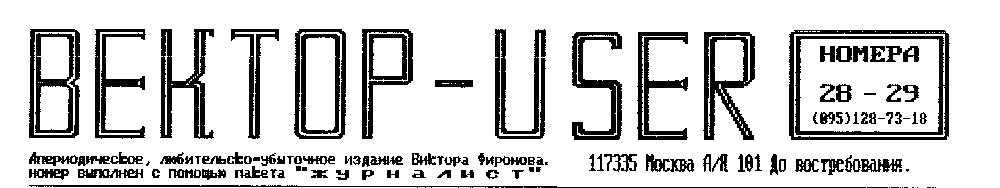
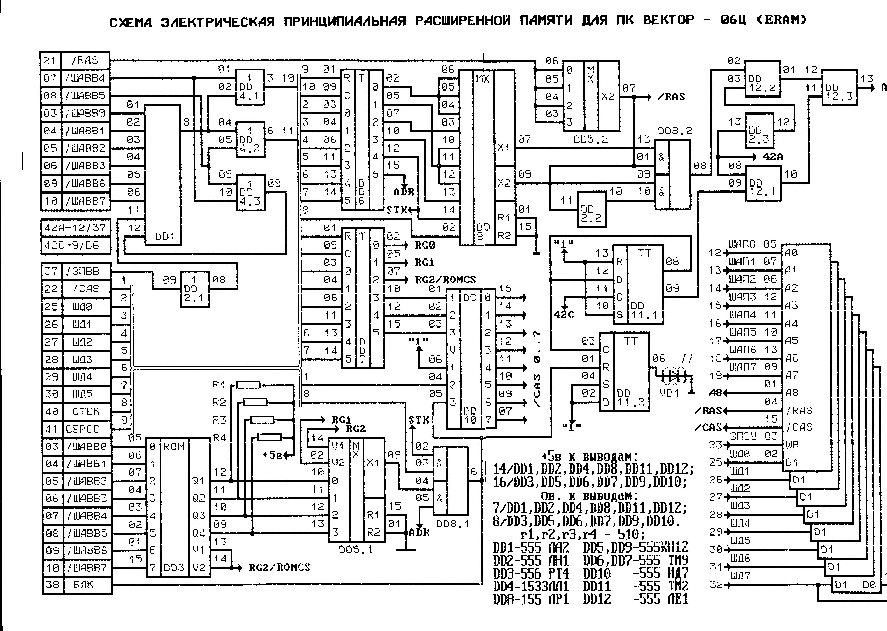
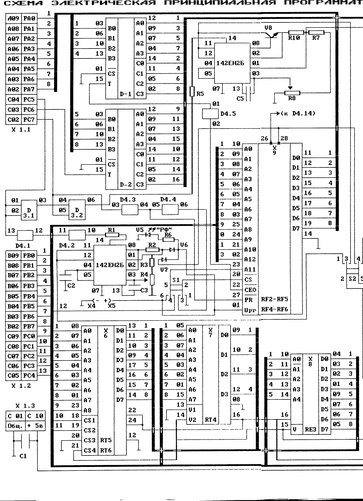
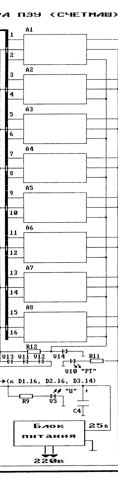
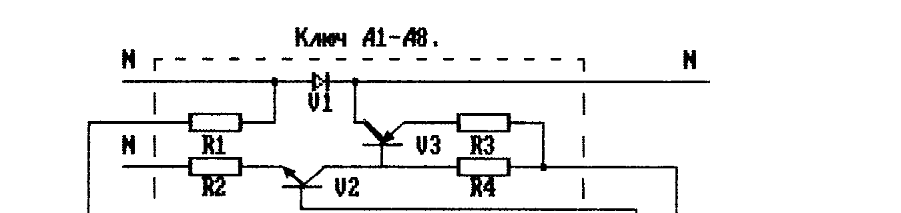
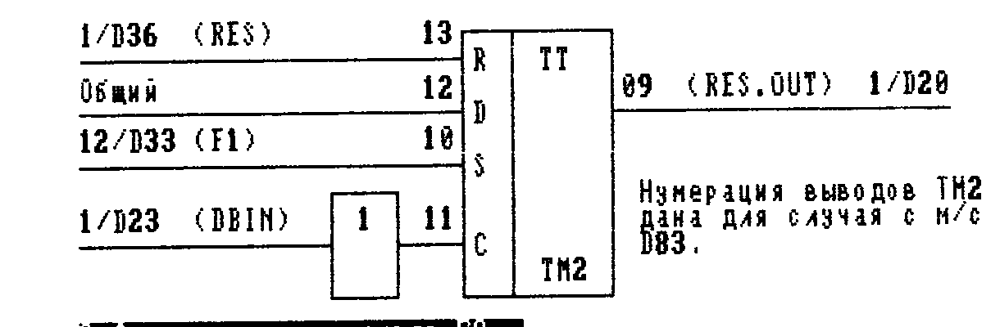
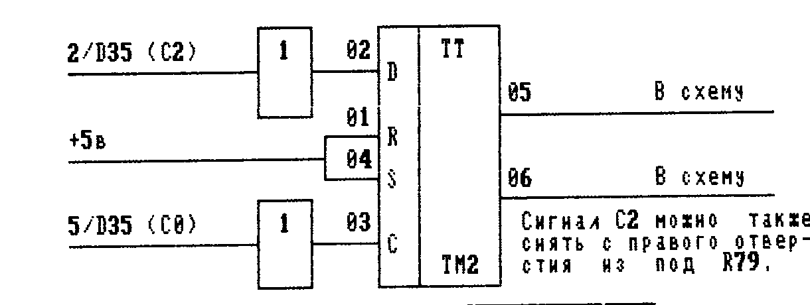
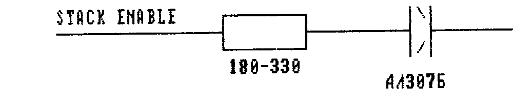
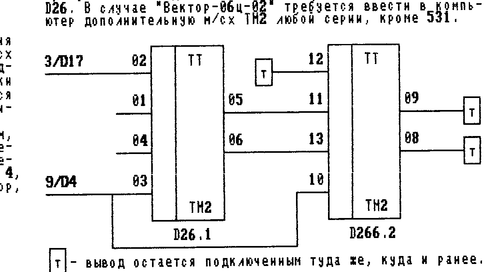
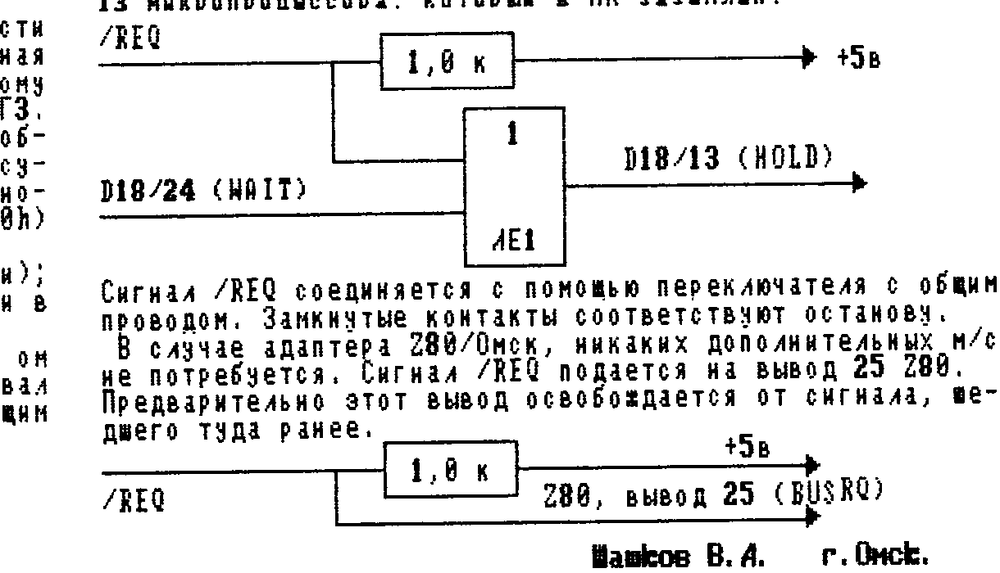

## Расширенная память для ПК Вектор-06Ц (Extended RAM)

Расширенная память (ERAM) представляет собой стандарт расширения памяти для ПК Вектор, позволяющий МП i8080 преодолеть границу в 64 кб. Функционально память разбивается на сегменты по 256 кб, а каждый из сегментов на четыре страницы по 64 кб. Различные режимы ERAM'а позволяют подменять часть ОЗУ (или полностью заменять его), что позволяет хранить и исполнять в ОЗУ программы, выходящие за границу в 64 кб. Минимальный объем дополнительной памяти - 256 кб, с посегментным наращиванием до 2 Мб (8 сегментов). Стандарт квазидиска "Микродос" является подмножеством ERAM и все программное обеспечение использующее квазидиск будет работать с дополнительной памятью. ERAM при управлении дополнительной памятью внутри сегмента использует все режимы квазидиска (адресация стеком, режим подмены экранной области)+дополнительные режимы (подмена 16,32,64 кб ОЗУ и др). Тип контроллера дисковода (Микродос или Comap) не имеет значения. При наличии контроллера "Микродос" работают все версии МикроДОС и все программы, использующие квазидиск. Появляется возможность создания программ более эффективно, по сравнению со стандартным квазидиском Микродос, использующих дополнительную память, а также возможность увеличения квазидиска до 2 Мб. Для контроллера Comap создано системное П/О, позволяющее полностью использовать возможности расширенной памяти. Для КД Comap также могут быть адаптированы все версии МикроДОС при замене в них драйверов дисковода. При этом будут работать все программы, написанные под эту ОС (ASC, BASIC-COLOR, Micro-EDIT и др). В комплект утилит системной дискеты входит адаптированная версия МикроДОС 3.1.

### ОС CP/M-59

CP/M-59 полностью совместима с CP/M v2.20. Размер TPA 59 кб. Режимы экрана 80 х 25 и 40 х 25 символов. Кодировка КОИ-8 и КОИ-7. Требует наличие КД Comap и ERAM или квазидиска Микродос. Система работает со следующими форматами дисков:

1) Микродос 800 кб (диски всех форматов могут быть системными).
2) Robotron 810 кб (доступны все форматы одновременно).
3) Comap 640 кб, а также ПЗУ-диск 128 кб.

### Изменения в Векторе

Изменения в Векторе, необходимые для установки ERAM, минимальны: заменить D36 (РЕ3) и вывести с платы Вектора на ERAM два проводника. Для работы CP/M-59 необходима замена универсального загрузчика (РПЗ2).

### Печатная плата

Печатная плата для ERAM разведена под 512 кб. В качестве ОЗУ использованы м/с 565 РУ7. Микросхемы управления - мелкая логика, ПЗУ РТ4 (256 байт). Собранное устройство подключается к разъему "ВУ". Конструктивно м/с памяти (2 линейки по м/сх) располагаются над разъемом, а м/с управления - под ним. Плата не мешает подключению в разъем ПУ других устройств (принтер, ПЗУ и т.д.). ПРЕДУПРЕЖДЕНИЕ! Существует несколько версий схем, реализующих стандарт ERAM. Со времени изготовления печатных плат вышли новые, более простые в реализации версии, из-за чего наблюдается некоторое несоответствие между схемой и печатной платой. Но все доделки, а они минимальны, описываются при заказе. Все это нисколько не снижает надежность устройства, хотя незначительно усложняет его сборку. Сборка устройства доступна любому человеку, умеющему держать в руке паяльник. Правильно собранное устройство не нуждается в наладке.

### Универсальный загрузчик (СУПЕР ПЗУ-2)

Для работы CP/M-59 необходимо установить новый загрузчик (РПЗ2), созданный на основе СУПЕР-ПЗУ Comap. Все старые функции (чтение с МЛ, печать экрана, загрузка CP/M-53, чтение ROM-ДИСКА) сохранены. Добавлена возможность загрузки систем CP/M-59 и Микродос. Формат системной дискеты (800 кб или 640 кб) значения не имеет. Можно обойтись без замены РПЗ2 и запускать CP/M-59 из другой ОС (например CP/M-53) в виде командного файла. В набор утилит системной дискеты входит файл для запуска CPM59.COM

### Короткий комментарий

Предлагаемая схема (см. схему ниже) страничного ОЗУ использует конструктивные особенности ПК Вектор и не может быть перенесена на другие типы ПК без изменений. Для нормальной работы ОЗУ необходим дисковый вариант Вектора на i8080 (580 ВМ80, 580 ВМ1) либо Z80 процессоре. Тип контроллера дисковода не имеет значения. Схема полностью совместима с квазидиском "Микродос" (все команды квазидиска являются подмножеством ERAM). Управление осуществляется через порты 10h (для совместимости с Микродос) и 20h. Как уже говорилось, функционально ERAM разбита на сегменты по 256 кб, а каждый сегмент - на страницы по 64 кб. Назначение битов порта 10h полностью совпадает со стандартом квазидиска Микродос. 20h используется для выбора сегментов и размера окон для режима адресности.

Назначение битов следующее:

- 0 - выбор вида окна (режима подмены ОЗУ);
- 1 - зависит от значения 5-го бита порта 10h;
- 2 - 0: режим подмены зависит от 0-го и 1-го битов; 1: полная подмена ОЗУ (0-FFFFh);
- 3, 4, 5 - выбор номера 256-го сегмента, то есть максимально 8 сегментов;
- 6 - резерв;
- 7 - резерв.

Страница, в которой происходит подмена ОЗУ, выбирается соответствующими битами порта 10h. Битами 0 и 1 задаются четыре варианта подмены ОЗУ:

| Биты 0,1 | Диапазон подмены |
|---|---|
| 0 | A000 - DFFF |
| 1 | 8000 - DFFF |
| 2 | 8000 - FFFF |
| 3 | 0100 - 7FFF |

а также полная подмена ОЗУ (0-FFFF) установкой второго бита в 1. Схема содержит двенадцать м/сх управления. Память на 565 РУ7. Желательно использовать быстрые модификации (РУ7А или В, оптимально РУ7К). Остальные м/с серий 1533 или 555. Питание устройства - от ПК.

/RAS берется с вывода DD5.2. /CAS для каждого сегмента - с выходов 0..7 DD10. На каждый незадействованный выход следует подать +5В через резистор 10...15 ком. Например, для ERAM емкостью 512 кб, /CAS 0-го сегмента подается с выхода 15, а /CAS 1-го сегмента - с выхода 14, и на эти выводы устанавливаются два резистора, через которые подается +5В. Выводы незадействованных сегментов "висят" в воздухе. Также необходимо подать +5В на выводы 9,10,11,12/DD3 через резисторы номиналом 510 ом. Сигналы логической единицы подаются с +5В через резисторы 1...1,5 ком.

Изменения в Векторе предполагают привести два проводника с платы Вектора на плату ERAM, и каждый волен делать это по-своему. На схеме для этого использованы незадействованные контакты разъема "ВУ" - 42А и 42С. На контакт 42А через резистор 47...100 ом подается сигнал с 12/D37, на контакт 42С - сигнал с 9/D6. Про новую РЕ3 мы уже говорили. И еще: сигнал, идущий в Векторе на 11/D33, обрезать и подключить его к 01/D33.

Системная дискета (формат Comap 640 кб) содержит следующие программы:

| Файл | Описание |
|---|---|
| CP/M59.COM | отладочная версия CP/M-59 для запуска из ОС |
| SYS256.COM | генератор системы (память 256) |
| SYS512.COM | генератор системы (память 512) |
| SYS768.COM | генератор системы (память 768) |
| FORMAT.COM | новая программа форматирования |
| MDOS.COM | адаптированная под КД Comap версия МикроДОС 3.1 |
| SYSGEN.COM | стандартный генератор МикроДОС |
| TEXTAS.COM / TEXTAS.OVL / TEXTAS.HLP | версия текстового редактора для работы с квазидиском, адаптирована обзором статьи |
| CPM59.DOC | полное руководство пользователя CP/M-59 |
| MDOS.DOC | описание МикроДОС |
| \*\*\*\*\*\*.ASM | набор драйверов дисковода для контроллера дисковода Comap |

Алексей Синицин, г. Москва.

Небольшой комментарий к статье: ERAM в большей мере предназначен для КД Comap и полностью устраняет невозможность работы этого КД с квазидиском. Но ERAM также работает и с КД Микродос, и отличие от стандартного эл. диска - это возможность оперировать памятью до 2 Мб при изменении драйверов работы с квазидиском. После замены D36 (для работы с ERAM) не гарантируется работа адаптера Z80 и контроллера HDD.



## Защита программ от несанкционированного копирования (окончание)

Выражение "реальный конец программы" подчеркивает, что далее могут располагаться любые данные, в том числе и просто для отвлечения внимания. Если кроме того, использовать содержимое стека как набор данных для шифрации/дешифрации либо по другому назначению, то малейшее изменение области стека повлечет за собой нарушение процесса выполнения программы. (Этот способ широко используется в системах защиты на IBM). Нужно только учесть взаимодействие с прерываниями по адресам, на которых меняется содержимое области стека.

3. Любой отладчик позволяет использовать два различных режима отладки: запуск программы с возвратом в отладчик по RET и установку точки прерывания. В первом случае текст программы не меняется. Отладчик запоминает в стеке адрес возврата в себя и передает управление подпрограмме. Если подпрограмма изменит адрес стека или же просто проконтролирует, "а не выходит ли адрес возврата за пределы рабочей области программы", то отладчик будет блокирован. Здесь также можно определиться со стеком: стек отладчика или стек пользователя? В первом случае можно подвязаться под адрес стека, во втором - под содержимое стека. Использование сразу обоих вариантов серьезно затруднит работу с отладчиком (учтите, что это верно, если подпрограмма достаточно сложна для визуального исследования).

Во втором случае (он используется при пошаговом режиме и при установке точек прерывания) текст программы меняется. Отладчик записывает в точку прерывания переход на самого себя, а затираемые байты запоминает в области данных. Затем он передает управление программе, а после возврата управления восстанавливает затертые байты. Это особенно удобно использовать в конце циклов или в конце логически самостоятельных участков программы, то есть в момент передачи управления на другой функциональный участок. С этим можно бороться, если в ходе выполнения программы (в частности циклов) контролировать такие "критические точки", используя их как данные в работе.

Самым пиком в борьбе с работой отладчика является "стелс-технология". Вы в курсе, что половина всего компьютерного мира (имеются в виду пользователи) трепещет перед страшными стелс-вирусами? Они знамениты тем, что после заражения очередной программы текст вируса не меняется. В двух программах, зараженных одним стелс-вирусом, текст вируса абсолютно различен, хотя функциональное назначение остается прежним. Это несколько осложнит работу антивирусов, так как нельзя использовать привязку к строке стандартных для этого вируса байтов. Этот же принцип можно использовать для борьбы с отладчиком. Представьте себе подпрограмму, которая в цикле многократно изменяет саму себя, в том числе и адрес выхода в программу, не нарушая при этом своей работы! Здесь нельзя уже использовать отладчик в легких вариантах (выполнение подпрограмм с возвратом в отладчик и установку точек прерывания при выходе в программу), так как точки прерывания будут затерты (или вообще не будут использоваться), а адрес возврата изменится. Остается только пошаговое выполнение подпрограммы. Ну, а если цикл повторяется 200 или 1000 раз? И ведь нельзя этот процесс автоматизировать, так как отладчик сам не сможет догадаться, когда управление будет передано в подпрограммы. Кроме того, нужно следить, чтобы отладчик не был затерт и обнаружен. Естественно, придумать такую подпрограмму - труд не из легких. Но если Вы хотите получить нераскалываемый участок программы, то нужно поработать. Казалось бы - очень сильно закручено, более нельзя. Но нет, можно еще более усилить защиту.

Представим ситуацию критическую: у пирата хватило терпения пройти все циклы нашего стелс-участка, или же появился супер-отладчик, который, используя дополнительное ОЗУ, дисковод и т.д., эмулирует все доступное микропроцессору ОЗУ (64 Кб), программу выполняет в режиме интерпретации, то есть выступает в роли микропроцессора, контролирует операции с памятью и стеком (выход за определенные границы, обращения к каким-то участкам памяти и др.) и т.д. Казалось бы все, не защититься. Но не падайте духом, автор защиты! Режим интерпретации (да и выполнение программы пошагово) очень замедляет работу программы. Значит, контролируя время выполнения определенных подпрограмм или модулей, можно сказать, есть кто-то наверху или нет. Основной вопрос философии, что первично - сознание или материя, заменяется на основной вопрос программной защиты, что первично - наша программа или кто-то сверху, дергающий за веревочки.

Проконтролировать время просто, и это можно реализовать тремя способами:

1) музыкальный процессор имеет три независимых 16-х счетчика. Перед выполнением подпрограммы, зависящей от времени, запишите в счетчик (счетчики) какое-либо число. Счетчик тут же начнет вничать из этого числа по единичке с определенной тактовой частотой. В конце работы программы она читает состояние счетчика и сравнивает с заданным, либо использует его косвенным образом. Более крутой вариант предполагает либо чтение "на лету" счетчика во время работы подпрограммы и использования этих данных каким-либо образом (для той же дешифрации, например);
2) если нет музыкального процессора, то всегда есть регистр регенерации, состояние которого также циклически изменяется. Использовать его можно способом, аналогичным вышеописанному;
3) прерывание по адресу (обозначим его ХХ). Оно возникает с твердо заданной частотой и подходит на роль таймера. Идеально было бы иметь по этому адресу произвольную подпрограмму пользователя. При прерывании происходят следующие действия:
   - процессор довыполняет текущую команду! (то есть время между прерываниями равное, а вот между передачей управления по ХХ адресу зависит от времени выполнения текущей команды)
   - затем он сохраняет в стеке адрес следующей команды!
   - передает управление по ХХ адресу!
   - подпрограмма прерывания сохраняет состояние регистра в стеке!
   - затем он выполняет свою задачу!
   - восстанавливает регистры!
   - передает управление в точку вызова прерывания.

Пункты, отмеченные "!", можно использовать для косвенной проверки результатов прерывания. Вспомним вышеописанный пример дешифрации, когда указатель стека и указатель команд двигались друг другу навстречу. В какой-то момент происходит прерывание. Содержимое области стека заменяется содержимым регистров микропроцессора и адресом возврата из подпрограммы обработки прерываний! Если данные в стеке использовались для шифрации/дешифрации, то мы получим смену ключей дешифрации, причем эти ключи зависят от времени. Естественно, любой жесткий контроль со стороны отладчика приведет к замедлению работы программы и нарушению процесса ее выполнения.

Кроме всего прочего, для запутывания потенциального взломщика можно применить следующие трюки:

1. Использование редких, недокументированных команд или команд, результат которых неочевиден.
2. Использование многобайтных команд для создания вложенных друг в друга участков подпрограмм. Например, команда 8000 JMP: младший байт с адреса 8000Н будет выглядеть как JMP, а с адреса 8001Н - уже по-другому. То есть при достаточно тонком программировании мы получим с 8000Н одну подпрограмму с каким-то определенным назначением, а с адреса 8001Н - другую подпрограмму с другим целевым назначением, хотя они обе используют одну и ту же область памяти.
3. Аналогично, можно таким образом подобрать набор текста/данных, чтобы внутри можно было спрятать функционирующий участок кодов. Но беда, что при этом будут использоваться команды-пустышки, то есть не имеющие отношения к выполняемой задаче и не влияющие на это выполнение. Таким образом можно защитить текстовую рекламу автора и его фирмы от коррекции.

Еще несколько слов о ключах. Ключи - это данные, которые используются для шифрации/дешифрации, выбора управления и т.д. Они могут располагаться в ячейках ОЗУ, в портах (ВИ55), в регистрах микропроцессора, то есть в тех местах, которые портятся при попытке взлома или за которыми трудно проследить. Ключи нужно использовать неявно. Например, подсчитав КС, не надо сравнивать ее с образцом, лучше на основе ее значения вычислить адрес перехода. А еще лучше сохранить ее на время в какой-нибудь ячейке и проконтролировать позднее. Не задавайте явный адрес ключа, так как по нему очень легко отследить все обращения к данному ключу. Лучше адрес ключа получить серией арифметико-логических операций. Ключам, кстати, необязательно быть неизменными. Они вполне могут динамично изменяться в ходе выполнения программы. Это дополнительно усложнит задачу взломщика. Самый лучший ключ сегодня - это дистрибутивная дискета. Но это потом...

### 2) Внешняя защита программ

Под внешней защитой мною понимается способ записи информации на магнитный носитель, препятствующий копированию этой информации существующими программными и аппаратными средствами.

Для использования внешней защиты достаточно поменять способ записи на МЛ: изменить кодирование бита, изменить кодирование байта, поменять формат записи на МЛ и т.д. Естественно, чтобы загрузить закодированную таким образом программу, нужно запустить ЗАГРУЗЧИК, который "знает", как и что загрузить. Сам ЗАГРУЗЧИК должен быть в стандартном для ПЭВМ формате записи. Чтобы по содержимому ЗАГРУЗЧИКА нельзя было узнать о формате, в котором записана основная программа, его лучше закодировать, а впереди поместить ДЕКОДЕР. ДЕКОДЕР и ЗАГРУЗЧИК могут быть совмещены. Для того, чтобы взломщик не вскрыл ДЕКОДЕР, используйте все методы, описанные в разделе 1. Если взломщик не вскроет ДЕКОДЕР с ЗАГРУЗЧИКОМ, он не сумеет снять защиту.

Итак, структура защиты: ЗАГРУЗЧИК+ПРОГРАММА в нестандартном формате. ЗАГРУЗЧИК=ДЕКОДЕР+БЛОК ЗАГРУЗКИ.

Для затруднения взлома можно использовать следующие трюки:

1) скользящая смена формата записи на МЛ: загружается порция информации, которая корректирует ЗАГРУЗЧИК или перехватывает его управление и настраивается на другой формат, отличный от первоначального.
2) при работе модуля загрузки должны устанавливаться определенные параметры - "следы" работы ЗАГРУЗЧИКА, которые можно проконтролировать в дальнейшем.
3) передача управления загруженной программе должна быть нестандартной и очевидной.
4. используйте блочный формат загрузки: вся программа поделена на блоки, в начале которых располагается информация об адресе загрузки и длине загрузочной информации.

Если все меры предосторожности приняты, то взломщик не сможет снять защиту с Вашей программы. Но это не значит, что он ее не сможет скопировать с магнитофона на магнитофон или через компаратор. Тут, правда, возникнет вопрос о качестве копии, числе копий и трудоемкости процесса копирования. Но теоретически копию любой магнитной записи сделать можно.

Здесь имеется один интересный момент. Чистая заводская пленка практически не дает шума. А вот если по ней пройтись магнитной головкой в режиме записи, пусть даже на нее не подан сигнал, то уровень шумов резко повышается. То есть, если в перерыве между загружаемыми блоками оставить участок чистой пленки, то затем при загрузке можно попытаться подвязаться к уровню шумов в этом участке и на этой основе судить о том, копировали программу или нет. Но практически реализация этого метода представляется проблематичной из-за старения пленки, плохого качества техники, истирания магнитной головки и т.д. В общем проблема формируется так: пометить участок пленки так, чтобы его можно было достаточно легко и надежно идентифицировать и невозможно скопировать. Может быть найдутся светлые головы и придумают соответствующую технологию. Более современной в настоящее время является защита программ с помощью дистрибутивных или ключевых дискет.

### 3. Ключевые дискеты (чисто обзорно)

Под ключевыми дискетами понимаются просто труднокопируемые дискеты, помеченные особыми некопируемыми метками. Для работы с ключевыми дискетами Вам понадобится знание контроллера НГМД, в частности: подпрограмм записи/чтения сектора/дорожки, подпрограмм перемещения по дискете, подпрограмм чтения адресов, поиск нужной дорожки, формат дискеты, поведение контроллера в критических ситуациях и т.д. В общем все. Но зато в конце учения Вы сможете получить ключевую дискету и осуществить достаточно надежный вариант защиты.

Рассмотрим несколько методов создания дистрибутивной или ключевой дискеты:

1. Запись информации в нестандартные участки на дискете: в служебные сектора или на технологич. цилиндры (с номером за 80). Легко обходится полным копированием всей дискеты.
2. Может быть, Вы в курсе, что все данные на дискете делятся на служебные и информационные? В информационных участках находится собственно содержимое программ, каталога и т.д. Служебные участки определяют формат дискеты: структуру дорожки, структуру сектора (сколько секторов, с какой длиной, с каким логическим номером и т.д.). При обычном копировании контроллер выдает содержимое информационных участков, оставляя всю служебную информацию невидимой. То есть копируется только видимая часть диска. Таким образом, если мы запишем что-то в служебную область, стандартные копировщики не смогут скопировать дискету один к одному.
3. Можно применять на некоторых дорожках нестандартный формат. Можно записать нестандартный сектор с нестандартной длиной или номером. Можно играть с чередованием секторов, с межсекторной длиной или с количеством пробелов в конце дорожки и т.д.
4. Очень интересную защиту можно реализовать простой иголкой. Возьмите иголку и проткните ею дискету. Если Вы попали в сектор, то у Вас получится плохой нечитаемый сектор. Место дефекта можно определить с точностью до байта. Записав эту информацию куда-нибудь в защищенную программу, вы сможете реализовать последующую проверку "истинности" дискеты. Программа копирования (даже плата побитового копирования на IBM) сможет повторить все, даже нестандартный формат, но не сможет, грубо говоря, "ткнуть иголкой в то же место".
5. Самым шиком на Западе сейчас считается защита "плавающими" битами. Она реализуется специальными аппаратными методами, и в домашних условиях ее использование проблематично. Суть защиты в том, что создается бит с уровнем сигнала не 0 и не 1, а где-то между. При этом он может семь раз из десяти считаться как 1, а три раза как 0. Таким образом, реализуется случайный статистический закон распределения, и скопировать его один к одному достаточно сложно.

Вот вкратце основные методы создания ключевых дискет. Теперь поговорим о реакции на попытку снятия защиты. Здесь можно выделить разные идеологии: по времени (сразу после обнаружения факта взлома или потом), и по реакции (пассивная реакция - программа просто загибается и перестает работать, а активная реакция - программа портит дискету, шифрует данные на диске, запускает вирус-вредитель и т.д.). Какой метод выбрать - дело вкуса. Каждый из них имеет свои плюсы и минусы. Но я бы советовал выбрать метод шифрации информации на дискете (потом можно, при желании, восстановить при соответствующем вознаграждении) с паузой между обнаружением и реакцией (по времени и по числу запусков).

### 4. Другие методы защиты

1. К программе прилагается руководство либо описание в объеме и виде, сложном для ксерокопирования. Программа же периодически запрашивает: введите N-ое слово в J-ой строке на I-ой странице Вашего описания. Конечно, тут без руководства не поработать. Но защита эта хороша до тех пор, пока какой-нибудь упорный обладатель руководства не пройдет всю программу и не составит небольшой списочек-файл кодовых слов, который затем пойдет гулять по рукам. Дополнительно усилить защиту можно, применив случайный запрос ключевого слова из достаточно большого справочника ключевых слов. Тогда один проход программы не сможет гарантировать знание всего списка слов. Но с другой стороны, почему бы не набрать все руководство?
2. Бухгалтерские программы можно подвязывать к названию организации, в которую они проданы. Название организации присутствует в отчетной документации, и для других фирм такой документ не подходит. Попытка же изменить название приводит к зависанию программы.
3. Юридический метод. Оформите авторское свидетельство на свою программу. Тогда Вы сможете пригрозить судом нелегальным продавцам Вашей программы. Правда, только если эти продавцы - достаточно крупные фирмы или магазины. Ребятам с радиотолкучек Вы ничего сделать не сможете.
4. Метод предоплаты. Разошлите рекламу на свою программу с просьбой прислать определенную сумму для получения копии, но с условием: высылать будете, если наберется NN-ое количество заказов, иначе деньги будут возвращены. После этого все будет зависеть от Вашей рекламы и действия ее на потенциальных покупателей.

В заключение хочется заметить, что защиту программ можно рассматривать как отдельное направление в программировании. На IBM этим занимаются профессионально целые коллективы программистов, создавая системы защиты, имеющие коммерческую ценность.

Луппов Г.Б. г.Киров.

Данная статья была написана для журнала ZX-РЕВЮ, и все, что касается программных решений, дано для микропроцессора Z80. Нам статья показалась интересной, и мы ее печатаем с устного разрешения автора.

## По следам очепяток

"Вектор-User" N18.

"Переделка Comap-Микродос". Добавить пункт 16:

...16. Отсоединить от монтажа выводы 5 и 6 м/сх ВГ93 и соединить их с АС02 и АС03 соответственно.

В пункте 12: D14 - К155 ЛП9.

В пункте 15: выводы 8 и 9 м/сх ЛН1 поменять местами.

Опечатки возникли по вине автора.

"Установка микропроцессора Z80 на Вектор-06ц". Добавить пункт 9:

...9. Выводы 12-19 ВА87 соединить с 37-30 Z80 (младшая ШД). Комбинацию D7 (12) следует понимать как 12-й вывод м/сх D7 Вектора, а D7 (13) как 7-й разряд ШД (13-й вывод процессора Z80).

Машков В.А. г.Омск

## Вокруг Вектора

- Начаты эксперименты по подключению к Вектору видеопроцессора от игровой приставки DENDY. Что это дает? Разгрузка основного МП от рутинной работы обмена с видеоОЗУ (быстродействие этого обмена возрастет в десятки раз), возможность запуска картриджей с DENDY на Векторе, а также перевод игр с DENDY на дискеты Вектора.
- Ф. Пересадов осуществляет перенос на Вектор игры "CIVILIZATION".
- Дмитрий Зарихта обещался сделать вторую часть игры CD-PACMAN. Как мы уже писали, эта игра содержит музыку и спецэффекты для музыкального сопроцессора как и R-Sound, так и Sound Treacer.

А теперь печатаем первые двенадцать паролей игры CD-PACMAN:

| Стадия | Пароль | Стадия | Пароль | Стадия | Пароль |
|---|---|---|---|---|---|
| 01 | "ВК" | 05 | "КОСМОС" | 09 | "КИРПИЧ" |
| 02 | "ОБЛАКО" | 06 | "ИКС" | 10 | "МУЖИК" |
| 03 | "ЗАМОК" | 07 | "БЕРЕГ" | 11 | "ШЛАНГ" |
| 04 | "КАМНИ" | 08 | "АЛМАЗ" | 12 | "РЕКА" |

## Схема программатора ПЗУ (Счетмаш)







Положение контактов S1: для м/схем РФ4 и РФ6 - 5-4;2-1. Для м/схем РФ2 и РФ5 - 5-6;2-3 и смещение микросхемы относительно Х9 вправо.

Возможности программатора:

- вывод информации с эталона;
- вывод информации с клавиатуры ПК Вектор-06Ц;
- вывод информации с диска и на диск;
- контроль ОЗУ;
- входной контроль;
- выходной контроль;
- идентификация.

Работу ПРОГРАММАТОРА, все обращения и формирование всех сигналов обеспечивает системный блок ПК Вектор-06Ц.

Номинал деталей:

| Элемент | Номинал | Элемент | Номинал | Элемент | Номинал |
|---|---|---|---|---|---|
| R1 | 820 ом (1/8) | R7 | 4,7 ком (1/8) | D1 | 589 АП26 |
| R2 | 10 ком (1/8) | R8 | 1,0 ком (1/4) | D2 | 589 АП26 |
| R3 | 4,7 ком (1/8) | R9 | 10 ком (1/8) | D3 | 555 ЛА3 |
| R4 | 1,0 ком (1/4) | R10 | 0,5 ом (1/8) | D4 | 555 ЛН1 |
| R5 | 820 ом (1/8) | R11 | 3,3 ком (1/8) | D5 | 142 ЕН2Б |
| R6 | 6,8 ком (1/8) | R12 | 820 ом (1/8) | D6 | 142 ЕН2Б |

| Элемент | Номинал |
|---|---|
| C1 | 0,047 мкф |
| C2 | 0,1 мкф |
| C3 | 0,1 мкф |
| C4 | 40x220 мкф |
| C5 | 0,1 мкф |
| S1, S2 | тумблер |
| X1 | вилка для разъема "ПУ" |
| X4, X5 | гнездо контрольное |
| X6 | панелька на 24 вывода |
| X7, X8 | панелька на 16 выводов |
| X9 | панелька на 28 выводов |

| Элемент | Номинал |
|---|---|
| V1-V4 | КД 243А |
| V5 | АЛ 307Б |
| V6, V7 | КД 522Б |
| V8 | КТ 817Б |
| V9, V10 | АЛ 307Б |
| V11-V13 | КД 243А |
| V14 | КС 133А |

Диоды V1-V4 (КД 243А) находятся в блоке питания - на схеме не указаны.

Номинал деталей ключей (А1-А8): V1 - КД 522Б; V2 - КТ 315Б; V3 - КТ 3107Б; R1 - 2,2 ком (1/8); R2 - 330 ом (1/8); R3 - 10 ом (1/8); R4 - 220 ом (1/8).

## Опять про ASC.COM

Как сделать, чтобы правое окно сразу показывало бы DRIVE C, было описано в 13-м номере. Теперь попробуйте изменить в этой оболочке цвета и убрать из нее самую досадную особенность: непроизвольную вставку пустых строк во встроенном редакторе при записи текста на диск.

Для подбора цветов загрузите программу в отладчик (SID) и с адреса 2654Н меняете что там есть на следующее: 40Н,40Н,07Н,07Н,38Н,38Н,F7Н,F7Н,40Н,40Н,07Н,07Н,38Н,38Н,F7Н,F7Н.

Любителям других расцветок данные естественно другие. Для устранения другого недостатка надо открыть программу в отладчике, дав команду А9СС (вк) и набить то, что здесь написано справа от этого текста. После чего, себя проконтролировав, нет ли ошибок - грузите на диск по адресу: 0100Н......4100Н. Спасибо Руслану Костиневичу из Борисова, а также Диме Зарихта из Минска.

```
09CC   DCX   H
09CD   CPI   FF
09CF   JZ    0A17
09D2   CPI   0D
09D4   JNZ   09E1
09D7   INX   D
09D8   MOV   A,D
09D9   CPI   1
09DB   JZ    0A0D
09DE   MVI   A,0
09E0   STAX  D
09E1   (вк)
```

(По материалам ALARM-02-04)

## Усовершенствование Вектора

### 1. Формирование сигнала "Очистка слова состояния"

Адресовано: "Вектор-06ц", КР580ВМ80А.

В оригинальной схеме очистка слова состояния осуществляется двумя способами: либо сигналом RES, снимаемым с вывода 1 м/сх D36, либо отрицательным фронтом сигнала DBIN микропроцессора. Последнее сделано для правильной очистки регистра слова состояния при операции с портами. Однако при этом вывод DBIN оказывается явно перегруженным: он нагружен на 5 входов м/сх серии 155, что недопустимо. Кроме того, сигнал DBIN проходит RC-цепочку, что также не может положительно отражаться на устойчивости работы машины. Предлагается установить дополнительный формирователь сигнала очистки. Потребуется установить в компьютер дополнительно любую инвертирующую м/сх любой ТТЛ серии (кроме 531-ой) и, если второй элемент м/сх D83 занят, то м/сх ТМ2 также любой ТТЛ серии. Удалить R53 и C19, перерезать дорожку у вывода 1 м/сх D36, но так, чтобы нагрузочный резистор остался подключенным к ней. Резистор R53 установлен рядом с клавиатурным разъемом, C19 - рядом с D23.



### 2. Формирование сигнала F2

Адресовано: "Вектор-06ц", Кр580ВМ80, Z80/Омск.

Для компенсации задержек сигналов в шине управления тактовый сигнал F2 задерживается одновибратором на м/сх D8.1. Поскольку параметры м/сх ТМ2 по входным и выходным токам не являются прецизионными, величина задержки плавает с прогревом компьютера, что плохо сказывается на устойчивости работы. Особенно плохая ситуация возникает при использовании Омского варианта адаптера Z80. Предлагается заменить аналоговый одновибратор цифровым, путем перевода триггера D8.1 в синхронный режим. Потребуется дополнительно установить в компьютер любую инвертирующую ТТЛ м/сх (кроме 531-ой серии). Выводы 2, 3, 4 м/сх D8 отсоединить от монтажа, резистор и конденсатор, стоящие рядом с этой м/сх, удалить (это - R79 и C79).



### 3. Индикатор обращения к электронному диску

Адресовано: всем.

Работа с электронным диском станет удобнее, если ввести в него индикатор обращения. Первоначально разработанная мной схема корректно определяла обращения к электронному диску, но требовала введения дополнительной м/сх К155АГ3. Предлагаемый вариант не совсем корректно показывает обращения, но, если система работает нормально, это не существенно. Суть способа состоит во введении светодиодного индикатора сигнала STACK ENABLE (разряд D4 порта 10h). Этот сигнал снимается со следующих выводов:

- вывод 1 м/сх АИ1 в Омском варианте ЭД (обе модели);
- вывод 14 м/сх КП2 в Кишиневском варианте (РУ5) и в Московском варианте на РУ7 (Фиронов).

Указанный сигнал через резистор сопротивлением 180-330 ом подается на анод светодиода любого типа (я использовал АЛ370Б и АЛ310Б). Катод светодиода соединяется с общим проводом.



### 4. Доработка схемы программирования цветов

Адресовано: "Вектор-06ц", Z80/Омск и Владимир.

При установке процессора Z80 по Омской и Владимирской схемам на многих типах телевизоров и мониторов наблюдается неустойчивая синхронизация по вертикали, а на цветных телевизорах (в частности, УПИМЦТ) также снижается яркость. Предлагается выполнить доработку следующим образом:

1) Выводы 2 м/сх D32, D39 освободить от монтажа. Между выводом 2 одной из этих м/сх и +5в припаять резистор сопротивлением 1...4,7 кОм. Соединить выводы 2 этих м/с между собой.
2) Припаять к выводам 2 м/сх D32, D39 по в/ч диоду любого типа (Д9, КД503 и т.п.), анодами ("стрелочками") к D32, D39.
3) Катод ("палочку") одного из диодов припаять к выводу 3 той же м/сх, катод второго - к дорожке той же м/сх (или к выводу 6/D3).
4) Заменить резистор R19 кремниевым в/ч диодом (КД503, КД521, КД522), катодом к центру платы (11/D31).

### 5. Обработка прерываний

Адресовано: "Вектор-06ц", "Вектор-06ц-02", Z80/Омск.

Подтверждение прерываний и синхронизация их с ходом развертки - общая беда процессора Z80 во всех вариантах. Разные варианты решают эту проблему по-разному. Никто не смог решить эту проблему абсолютно корректно. Хуже всех дело обстоит с Омским вариантом в базовой схеме подключения. При выполнении команд с префиксом прерывание может быть потеряно. Однако, как показывают расчеты, достаточно корректную работу можно получить, вообще отказавшись от подтверждения прерывания, а просто ограничив длительность запроса величиной, равной 32-м тактам процессора. Требуется переделать схему подключения адаптера (в сам адаптер никаких изменений вносить не надо). Требуется освободить от монтажа выв. 2,3,4,6,10,11 м/сх D26. В случае "Вектор-06ц-02" требуется ввести в компьютер дополнительную м/сх ТН2 любой серии, кроме 531.



Т - вывод остается подключенным туда же, куда и ранее.

В модели "06-02" элемент D26.1 соответствует вновь введенной м/сх ТН2. D26.2-D65.2. 3/D17-5/D83. 9/D4-6/D77.

### 6. Кнопка "Пауза"

Адресовано: "Вектор-06ц", КР580ВМ80А, Z80/Омск.

Эта кнопка позволяет в любой момент времени приостановить выполнение программы. Суть способа заключается в переводе процессора в состояние ожидания (Hold mode). В случае процессора ВМ80 требуется дополнительная м/сх ЛЕ1 любой ТТЛ серии, кроме 531. Требуется отсоединить вывод 13 микропроцессора, который в ПК заземлен.

Сигнал /REQ соединяется с помощью переключателя с общим проводом. Замкнутые контакты соответствуют останову. В случае адаптера Z80/Омск никаких дополнительных м/с не потребуется. Сигнал /REQ подается на вывод 25 Z80. Предварительно этот вывод освобождается от сигнала, шедшего туда ранее.



Машков В.А. г.Омск.

(автозапуск, пауза, очистка слова состояния... что еще можно повесить на "пустой" элемент м/сх D83?)

## Об операционной системе Т34

По скорости вывода символов ей нет равных (такую скорость можно увидеть только у машин с аппаратным формированием символов); зависания из-за ошибок дисковода действительно исключены, как и утверждают авторы; дисковод, который в других системах громко и противно скрипит, в ОС Т-34 еле слышно поскрипывает; символы выглядят на редкость "причесанными". Хотя переключение регистров одной клавишей `СС` без фиксации и с фиксацией кажется мне неудобным, но это уже дело привычки. Вот фиксацию клавиши "ЭС" можно было и не делать - иногда это мешает, тем более, что индикация фиксации этой клавиши не предусмотрена. Увеличение, относительно других систем, объема доступной пользователю оперативной памяти - это, конечно, неплохо. Однако обращаться к BIOS системы необходимо по другим адресам, что делает многие программы неработоспособными в этой (Т34) системе. Например, не идет весьма удобная программа "SERVANT". Большое спасибо авторам системы за твердый знак, появившийся на месте забоя в русском регистре, хотя без забоя как-то неуютно. Переключение `РУС/LAT` действует почему-то не только на ввод символов с клавиатуры, но и на вывод на экран. Но главная достопримечательность системы - ее надстройка. Авторы утверждают, что она полный аналог NORTON COMMANDER. Насчет полноты можно поспорить, но эта надстройка действительно наиболее близка к оригиналу. Для полноты не хватает самой малости - оконной системы. Впрочем, не только. В оригинальной NORTON COMMANDER нужный диск в любую панель можно вывести не входя в эту панель, в надстройке Т34 - только в активной; при групповом копировании не указываются имена файлов - только номера, если какой-то файл не считается, трудно понять какой именно; при удалении имена файлов тоже не показываются, и запрос на подтверждение удаления по каждому файлу не выводится; метки файлов по окончании копирования не исчезают, их приходится удалять вручную. Встречаются в надстройке и ошибки.

Скопированные файлы иногда исчезают с панели, хотя система считает их существующими, и с командной строки их можно запустить; при стирании бывает, что файл, исчезнувший из окна надстройки, в каталоге по-прежнему числится существующим; иногда по неведомой причине портится содержимое системных дорожек; при групповом копировании после сбоя в каком-либо файле выводится сообщение, что следующий файл уже существует, хотя он еще не скопирован. Очень жаль, что нельзя объявить какой-нибудь другой редактор кроме MEDIT для запуска по цифровым клавишам. Впрочем, когда я переименовал пименовский редактор ED в MEDIT, он по цифре все равно не работал. Почему-то при запуске по цифровым клавишам в командную строку вставляются лишние пробелы, не все программы считают такую строку правильной. А свойство надстройки запоминать 16 последних командных строк и выдавать их по кольцу при нажатии `F3`, хотелось бы видеть свойством самой системы. Но на это может не хватить памяти. Тем не менее я считаю Т-34 лучшей системой из существующих для Вектора. Файлов .EXT, где записана реакция на расширение файлов - обязательной части NORTON COMMANDER любой версии - нет ни у одной другой векторовской надстройки, равно как и системы пользовательского меню, и файла сохранения параметров надстройки. Весьма удобна возможность просмотра текстовых файлов на экране, сильно напоминающая нортоновскую утилиту просмотра. Удобна и встроенная перекодировка, хотя при переключении в режим КОИ-7 встречаются строчные буквы.

В.А.Кузьмин г.Воронеж

## О процедурах умножения

В системе команд процессора КР580 отсутствуют команды умножения, поэтому при необходимости приходится применять соответствующие процедуры. Например, можно воспользоваться процедурой из стандартного описания ассемблер-редактора (стр.96). Необходимо только исправить опечатку: вместо `JC DONE` должно быть `JZ DONE`. Но предпочтительней использовать вариант, описанный в "В-U"1. Для удобства привожу его.

Исходный текст:

```
MPL:  LXI  H,Q        ; вход: DE - множимое
      MVI  B,8        ;       A  - множитель
L1:   DAD  H           ; выход: AHL - произведение
      RAL              ;        B  = 8
      JNC  DEC         ;        C  не изменяется
      DAD  D           ;        DE не изменяется
      ACI  0
DEC:  DCR  B
      JNZ  L1
```

Конечно, при использовании в качестве подпрограммы, в конце нужно ставить RET. Эта процедура работает быстрее, занимает меньше места в памяти, имеет большие возможности (произведение 16-ти разр. на 8-ми разряд. вместо 8-ми разрядного на 8-ми разрядное). Следует отметить, что и в "В-U"1, в редакционном комментарии была допущена ошибка: произведение располагается не только в HL, а в AHL, то есть старший бит произведения при умножении больших чисел будет в А. Быстродействие процедуры зависит только от множителя, записываемого в А, а вернее - от количества единичных битов в нем. Каждый такой бит "отнимает" 20 тактов. Процедуру можно ускорить (если не нужен рег. С): `MVI B,8` заменить на `LXI B,8`; `ACI 0` заменить на `ADC C`. Тогда на каждый единичный бит будет приходиться 16 тактов.

Конкретные цифры таковы:

| A | исх.вариант | модифициров. вариант |
|---|---|---|
| 0 0 0 0 0 0 0 0 | 404 | 408 |
| 1 1 1 1 1 1 1 1 | 564 | 536 |

(404+8×20=564)  (408+8×16=536)

Наибольшее число, которое можно получить с помощью этой процедуры - 16711425(D) или FEFF01(H) при умножении соответственно 65535×255 или FFFF×FF. Для обладателей Z80 на Векторе можно порекомендовать заменить:

```
DCR B      ->  DJNZ L1
JNZ L1
```

и `JNC DEC` на `JR NZ,DEC` - это несколько сократит процедуру, ускорит ее и сделает релоцируемой.

И.Городецкий г.Уфа

## Новые программы

**GRED** - полноэкранный 16-ти цветный оконный графический редактор, требующий наличие на Векторе МГZ80. Что может: перо, резинка, смена текущего цвета, перекрашивание точек в окне, закрашивание замкнутой области, линия, линза, зеркало вертикальное и горизонтальное, печать символов, установка признака записи при выходе, создание окна (на весь экран тоже), копирование и стирание окна, отмена режима, выход в ДОС. Запись и чтение запакованных образов невозможна, редактор работает с файлами формата BSV - копия видеоОЗУ Вектора. Есть возможность загрузки палитры для обрабатываемого файла, которая хранится в файле PAL. Для работы редактора требуется не менее 48кб ОЗУ.

**ASM.COM** - прослушиватель музыкальных модулей с ПК Sinclair на Векторе. Качество звука действительно лучше чем в STM-ках. Модулей - целая дискета.

**РДС v2.00** - скорость вывода символов на экран увеличена, улучшена работа драйверов диска, введена автоматическая обработка ошибок, введены две новые утилиты - TEST (квазидиска) и REST (сброс подсистемы), команда DIR выдает информацию о занятости диска, введена возможность переназначать консоль ввода/вывода в файл, стало возможным из любой программы вызывать команды ОС. И самое главное - использование BAT-файлов, в которые можно записывать необходимые параметры, задаваемые в момент запуска. Также улучшена работа VECTOR COMMANDER, которая теперь не уступает CO.COM.

**БАЗА ДАННЫХ** - пока готова сырая версия. Многоуровневая система каталогов с конечным выходом на текстовую информацию, которая готовится встроенным редактором либо фрагментом из "ЖУРНАЛИСТА". Древовидная система каталогов (20 символов в строке), защита и каталога, и необходимой информации паролем, ввод текстов латинским и русским шрифтом, встроенный драйвер печати двух типов, возможность входа в оболочку редакторов "ЖУРНАЛИСТ" и т.д. Создание оболочки управления файлами БД (СОУФ) задерживает распространение этого пакета программ.
