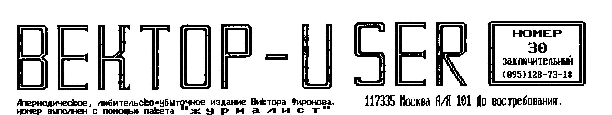
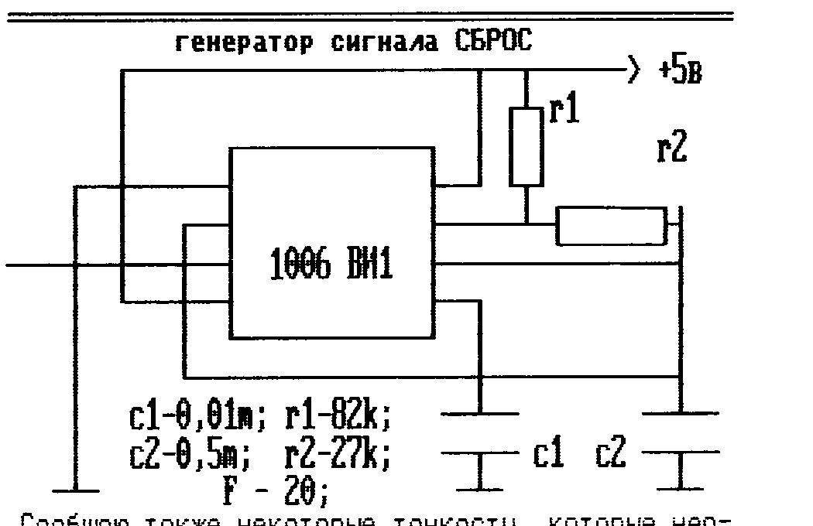
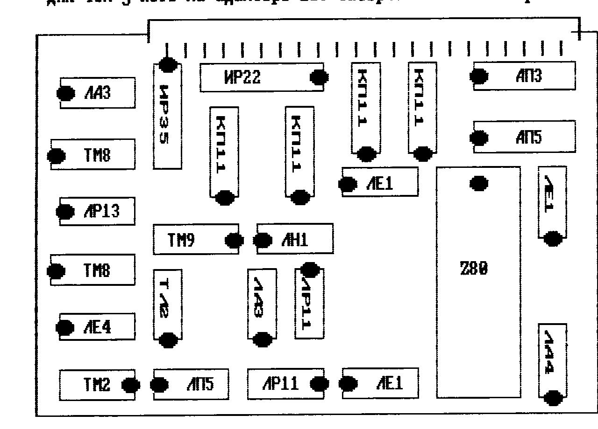

## О мышах и их подключении к Вектору

Мышь предназначена для ввода графической информации и представляет собой неплохую альтернативу клавиатуре. Это особенно ярко проявляется в настоящее время для IBM-совместимых. Оболочка Windows, например, позволяет практически полностью отказаться от клавиатуры. Даже использовать графический редактор с мышью значительно удобнее, чем с клавиатурой. А некоторые игры просто созданы для мыши. В дальнейшем под мышью будет подразумеваться мышь "Марсианка". Для того, чтобы использовать мышь, необходимо определиться в способе подключения. Их существует несколько вариантов: 1. Выделение для мыши своего адреса. 2. Использование адреса джойстика.

Кроме того мышь указывает только направление перемещения, а не сам факт перемещения в указанном направлении. Для использования мыши проще всего использовать ее в качестве аналога джойстика, для минимальной доработки существующего программного обеспечения. Подключить мышь в этом случае достаточно просто, причем вариант подключения не зависит от схемы подключения джойстика, так как мышь является его полным аналогом - ну по крайней мере "с точки зрения компьютера". Из анализа работы джойстика известно, что в исходном состоянии во всех разрядах порта устанавливается 0. У мыши в исходном состоянии во всех разрядах установлен 0, а при перемещении устанавливается 1 в том разряде, в какую сторону произошло перемещение. У джойстика, если отпустить рукоятку, в порту установится 1, а у мыши разряды так и останутся, а сброс в исходное состояние произойдет только по сигналу СБРОС от компьютера (что требует доработок существующего П/О) или от специального генератора сигнала СБРОС. Следовательно, чтоб превратить мышь в джойстик необходимо проинвертировать сигналы с мыши и собрать генератор сигнала СБРОС. Как произвести инвертирование сигнала при помощи 6-ти инверторов, думаю, говорить нет смысла. Вот о конструкции генератора надо сказать несколько подробнее: его схема может быть любой, регулируемая частота (5-25 Гц), минимальные габариты и потребление тока. Мой генератор собран на таймере 1006ВИ1 по схеме мультивибратора на маленькой плате вместе с инвертором на 133ЛН1. Все это поместилось в корпусе мыши, где было просверлено малое отверстие для резистора подстройки частоты сигнала сброс. Частота зависит от индивидуальных особенностей компьютера, программы и пользователя.

Теперь о подключении к Вектору IBM-овской мыши.

Подключение этих мышей представляет собой актуальную задачу из-за большого их распространения. Здесь также можно использовать такой же путь подключения, как и для "Марсианки". А вся задача сводится к преобразованию интерфейсов. Можно конечно поступить радикально - удалить из мыши все "лишнее", а то, что необходимо для работы, сделать самостоятельно. Но это не выход из положения. Я предлагаю другой путь, который кроме того позволяет использовать и клавиатуру от IBM без всяких доработок схем как клавиатуры, так и компьютера. Также не потребуется никаких доработок программного обеспечения. Этот путь заключается в использовании в качестве преобразователя интерфейса микроконтроллера KP1816BE51. Он содержит 4 параллельных порта ввода/вывода, из которых понадобятся 3, а 4-й будет использоваться в альтернативном режиме. Этот режим позволяет использовать встроенный последовательный интерфейс микросхемы. Кроме того она содержит в своем составе ОЗУ на 128 байт, ПЗУ на 4кб и синхрогенератор, частота которого определяется внешним кварцем на 12 Мгц. Все это позволяет использовать эту микросхему с минимальным "обрамлением". При помощи эмулятора этой м/с (который отличается от KP1816BE51 наличием выводов для подключения внешнего ПЗУ) не задействуя для этих целей выводов портов, как для KP1816BE31 - она не имеет внутреннего ПЗУ - мне удалось подключить и клавиатуру и мышку. Но учитывая, что эмулятор малодоступен, схему я не привожу. Даю только техническую идею.

1. Настраиваем последовательный порт на прием (формат данных, скорость передачи).
2. Принимаем байт и записываем его ячейку памяти.
3. Для клавиатуры - сигнал опроса матрицы принимается портом 0 контроллера; для мыши - расшифровываем байт и выставляем соответствующие сигналы в порт 2, который соединен с портом джойстика. Все последующие этапы будут связаны с клавиатурой.
4. Расшифровываем байт из ячейки памяти и в момент совпадения сканирующего сигнала (0 в нужном разряде) выдаем сигнал в 0 соответствующий разряд порта 1.

Например: если принят код клавиши "0", то при сканирующем сигнале F8H выдается код F0. Все остальные клавиши - аналогично.



Сообщаю также некоторые тонкости, которые необходимо использовать при программировании м/сх для мышей фирмы MICROSOFT.

Формат данных: двухкнопочные мыши Microsoft Mouse используют 3-х байтный формат данных со скоростью 1200 бит/сек, 7-бит данных без контроля четности, 1-бит стоповый. Если мышь неподвижна и кнопки не нажаты то информация не передается. При изменении состояния мыши она передает свое состояние в виде 3-х байтового пакета информации.

| Байт | 7 | 6 | 5 | 4 | 3 | 2 | 1 | 0 |
|---|---|---|---|---|---|---|---|---|
| 1-й байт (признак 1-го байта) | - | 1 | лк | пк | y7 | y6 | x7 | x6 |
| 2-й байт | - | 0 | x5 | x4 | x3 | x2 | x1 | x0 |
| 3-й байт | - | 0 | y5 | y4 | y3 | y2 | y1 | y0 |

Биты пакета y0...y7, x0...x7 показывают, насколько изменилось положение мыши с момента посылки предыдущего пакета. Смещение передается в дополнительном коде и составляет от -128 до +128 единиц (шагов мыши). Эта информация приводится на упаковке. Мышь Septom LE150 имеет разрешение 250 точек на дюйм - 250 dot per inch, а ее шаг составляет 1/250 дюйма. Биты x7 и y7 определяют направление; положительное число - вправо или вниз, отрицательное - влево или вверх. Байты 2 и 3 для реализации интерфейса мышь-Вектор не нужны. Наличие сигнала дает информацию об изменении состояния мыши или ее кнопок.

Анализ 1-го байта:

- 6 бит - 1 выделен 1-байт, 0-й байт не первый;
- 5 бит - нажата левая кнопка;
- 4 бит - нажата правая кнопка;
- 3 бит - перемещение (вверх или вниз);
- 2 бит - не анализируется;
- 1 бит - перемещение (вправо или влево);
- 0 бит - не анализируется.

Кроме контроллера KP1816BE51 можно применить и контроллеры фирмы Zilog, семейства Z8. В частности м/сх Z86E04, позволяющая замуммировать свои выводы как на ввод так и на вывод информации и имеющая два таймера/счетчика, ОЗУ 144 байта, ПЗУ 1к и все это в корпусе с 18 выводами. По моему убеждению эта м/сх прекрасно справилась бы с обязанностями контроллера мыши, но к моему сожалению мне она недоступна.

Далее для информации привожу адреса портов как самого Вектора, так и основной периферии.

| Устройство | Адреса портов |
|---|---|
| Вектор | 00-03, 04-07, 08-0B, 0C-0F либо 0C-0D |
| Джойстики | 0E-0F |
| Квазидиск | 10 |
| Контроллер дисковода | 18-1B, 1C |
| Часы | 20, 21 |
| AY8910 | 14, 15 |
| Винчестер | 50-5F |
| Z80 | 80 |

Просьба ко всем придерживаться данных адресов.

Брескин М.Ю. Оренбургская область.

## Графика в Turbo-Pascal для Z80

Turbo-Pascal, работающий на Векторе, был перенесен с компьютера "Robotron-1715". Видимо, этот компьютер не имел графики, так что пользователи Вектора, работая в пусть устаревшей, но все же удобной турбо-среде, могут вывести символ в любое место экрана, а вот график, диаграмма, не говоря уже о чем-то более сложном, им недоступны. Из этого положения как минимум два выхода. Первый - это подключение к программам на паскале внешней графической библиотеки. Например, можно использовать библиотеку PPCLIB. Параметры подпрограммам придется передавать через зарезервированную область памяти: MEM[адрес]:=параметр, а подпрограммы объявлять как внешние: PROCEDURE PLOT; EXTERNAL ADPEC (как передаются параметры между процедурами в самом паскале в описании не написано). Библиотеку придется загружать в рабочие адреса ОЗУ либо из внешнего файла, либо из самой программы с помощью процедуры MOVE. При этом после инициализации библиотеки пользоваться собственным вводом/выводом паскаля (write/read) станет невозможно. Кроме того, для сохранения возможности работы с файлами часть операционной системы, находящейся не на квазидиске, придется сохранять где-нибудь в неиспользуемой части ОЗУ.

Второй способ - использование средств самого Турбо-паскаля. В нем имеются средства работы с памятью. Адреса видеоОЗУ, соответствующие точкам экрана легко вычислить. Надо только учесть, что область данных Турбо-паскаля находится в самых дальних адресах ОЗУ, доступного пользователю и при запрете обращения к квазидиску, открывающем доступ к видеоОЗУ, она исчезнет из адресного пространства процессора и программа потеряет работоспособность. Чтобы этого не случилось, компиляцию необходимо производить в COM-файл, а конечный адрес доступного компилятору ОЗУ установить ниже экранной области (например 9FFF). Для этого необходимо войти в режим установок, нажав в ответ на приглашение >"О", затем выбрать компиляцию в COM-файл, нажав "C". Нажав "E", установить конечный адрес, и, нажав "Q", выйти из режима установок. Процедура вывода на экран точки в режиме низкого разрешения (256 x 256) может выглядеть так:

```pascal
PROCEDURE RLOT(X,Y,C: INTEGER);
VAR ADR: INTEGER;
    MASKA, BTE: BYTE;
BEGIN
  ADR:=$C000+((X DIV 8)*256+Y)           {вычисление адреса}
  MASKA:=$80;MASKA:=MASKA SHR (X MOD 8)  {установка бита}
  PORT[$10]:=0;                          {отключение квазидиска}
  BTE:=MEM[ADR];                         {чт. байта из видеоОЗУ}
  IF C=1 THEN BTE:=BTE OR MASKA          {по параметру C}
         ELSE BTE:=BTE AND (NOT MASKA)   {устан/стереть точку}
  MEM[ADR]:=BTE;                         {зап. байта в видеоОЗУ}
  PORT[$10]:=$23;                        {разрешение работы RAM}
END;
```

По горизонтали эта процедура расставляет точки через небольшие промежутки, т.к. экран Вектора при работе в МикроДОС работает в режиме высокого разрешения. Для вывода 512 точек по горизонтали необходимо работать сразу с двумя плоскостями видеоОЗУ:

```pascal
PROCEDURE PLOTH(X,Y,C: INTEGER);
VAR H,ADR: INTEGER;
    MASKA,BTE: BYTE;
BEGIN
  IF (X MOD 2)=0 THEN H:=$C000   {четные точки ставятся в верхней}
                 ELSE H:=$A000;  {плоскости, нечетные - в нижней}
  X:=X DIV 2;
  ADR:=H+((X DIV 8)*256+Y);
  MASKA:=$80;MASKA:=MASKA SHR (X MOD 8);
  PORT[$10]:=0;
  BTE:=MEM[ADR];
  IF C=1 THEN BTE:=BTE OR MASKA
         ELSE BTE:=BTE AND (NOT MASKA)
  MEM[ADR]:=BTE;
  PORT[$10]:=$23;
END;
```

Для рисования линий по двум заданным произвольным точкам можно использовать уравнение прямой. Единственным случаем, когда такой способ не подходит - построение вертикальной линии, когда горизонтальные координаты точек равны. Такой случай можно учесть и нарисовать линию по другому. В универсальной процедуре должны учитываться оба случая.

```pascal
PROCEDURE LINE(X1,Y1,X2,Y2: INTEGER);
VAR B,X,Y: INTEGER;
    K: REAL;
BEGIN
  IF X2=X1 THEN                                          {для случая вертикальных линий}
    IF Y1<Y2 THEN BEGIN FOR Y:=Y1 TO Y2 DO PLOT(X1,Y,1); EXIT END
             ELSE BEGIN FOR Y:=Y2 TO Y1 DO PLOT(X1,Y,1); EXIT END;
  {для всех остальных случаев}
  K:=(Y2-Y1)/(X2-X1);                                    {вычисление коэффициента наклона}
  B:=(Y1*X2-Y2*X1) DIV (X2-X1);                          {выч. смещения от оси координат}
  IF X1<X2 THEN FOR X:=X1 TO X2 DO BEGIN Y:=ROUND(K*X)+B; PLOT(X,Y,1) END
           ELSE FOR X:=X2 TO X1 DO BEGIN Y:=ROUND(K*X)+B; PLOT(X,Y,1) END;
END;
```

Рисование прямоугольников не представляет никакой сложности - это всего лишь четыре линии.

```pascal
PROCEDURE RECT(X1,Y1,X2,Y2: INTEGER);
BEGIN
  LINE(X1,Y1,X2,Y1);
  LINE(X2,Y1,X2,Y2);
  LINE(X2,Y2,X1,Y2);
  LINE(X1,Y2,X1,Y1);
END;
```

В этой процедуре прямоугольник строится по двум узлам - верхнему левому и нижнему правому.

Такой способ рисования довольно медленный и пригоден лишь для "деловой" графики - диаграмм, графиков, самое большее - заставок, кроме того он позволяет рисовать только монохромные картинки. Однако он полностью совместим с собственным вводом/выводом Паскаля и работа с файлами не отличается от таковой без графики.

Кузьмин В.А. г.Воронеж

## Еще об операционной системе Т-34

Кто использует на "Векторе" операционную систему Т-34 знает, что при холодном старте ОС пытается прочитать с диска C: файл initial.sub и если его нет, то переходит в командный режим. После этого Вам придется самим запускать командную оболочку co.com.

Чтобы избавиться от этого "ручного труда", загрузите Т-34 в отладчик (SID) и измените код по адресу 02BBH с 03 на 01, тем самым Вы заставите при холодном старте читать файл initial.sub не с диска C:, а с диска А:.

Модифицировав таким образом ОС (Вы можете также изменить имя файла initial.sub на autoexec.bat) Вы сохраните ее изменив имя файла, например OS на OSD. Теперь если Вы при инициализации новой дискеты будете записывать на системные дорожки эту ОС, то при каждом холодном старте загрузка командной оболочки будет происходить автоматически, и, как Вы знаете, co.com перепишет на диск C: все файлы указанные в файле д.zgr, в том числе и "старый" вариант ОС Т-34. При последующей перезагрузке Вектора ОС будет читаться с диска C: и затем читать файл initial.sub тоже с диска C:.

Еще хочу поделиться возможностью модификации текстового процессора word star. Одно время у меня этот редактор "пылился" на дискете, а теперь это основной текстовый редактор в котором я набираю тексты.

Вся модификация заключается в изменении определенных байтов с адреса 680Н в файле ws.com редактора. Здесь располагаются эквиваленты управляющих кодов принтера, то есть тех кодов, которые начинаются с ^P. Причем кодовая последовательность начинается с байта, в котором указано число управляющих кодов следующих непосредственно после него. На каждый управляющий код есть своя последовательность. Например, кодовая последовательность для подчеркивания имеет вид: 03 1B 2D 01 (включает подчеркивание), 03 1B 2D 00 (выключает подчеркивание).

Модифицировав некоторые последовательности я исключил операцию переключения цвета ленты и вместо нее ввел последовательность расширенной печати. Также изменил код переключения таблиц с КОИ7-Н0 на КОИ7-Н1.

Таким образом, можно настроить текстовый процессор word star на любой тип принтера, модифицировав коды в указанной области.

Пользуясь случаем, хочу предложить пользователям Вектора несколько авторских программ.

**psc.com и pvc.com** - сохраняют и восстанавливают директорию диска.

**ptf.com** - перекодировщик текстовых файлов, поддерживает семь кодовых таблиц.

**graph.crl** - графическая библиотека для языка программирования BDS C.

Шестаков А.А. г. Ростов-на-Дону.

## Пишите им по этим адресам

- Шестакову А.А. - 344016 г.Ростов-на-Дону, ул.Гагринская 9/2 кв.7
- Брескину М.Ю. - 461500 ст.Донгузская Оренбургской обл, ул.Воронова д.22 кв.37
- Вьюнову В.А. - 184291 п.Ревда Мурманской области ул.Кузина д.7/3 кв.71
- Нагаеву А.А. - 610020 г.Киров а/я 1810 (просьба указывать конфигурацию Вектора)

## Резидентная дисковая система 2.0 и выше (выдержки из описания)

### 2. Системные ячейки

РДС предоставляет программисту 62,5 кб в режиме 0 (полностью совместимом с CP/M) и 64 кб в режиме 1. При этом в обоих режимах задействованы системные ячейки, которые находятся в нулевой системной странице памяти (адреса с 0 по 0100h). Как известно в ОС CP/M в этой области памяти зарезервированы следующие адреса:

| Адрес | Назначение |
|---|---|
| 0-2 | "горячий" старт ОС |
| 3 | байт конфигурации |
| 4 | номер текущего диска и области пользователя |
| 5-7 | переход на диспетчер функций BDOS |
| 38h-3Ah | переход на обработку прерывания по кадровому импульсу (в Вектор 06Ц) |
| 5Ch-7Fh | зарезервированы под БУФ файла |
| 80h-0FFh | зарезервированы под область DMA |

В РДС добавлены следующие ячейки:

| Адрес | Назначение |
|---|---|
| 8-0Ah | переход на диспетчер функций BDOS, добавлен для короткого вызова BDOS командой RST 1 и для др. |
| 08h-0Dh | признак РДС (три байта в КОИ-8 - "РДС"), для определения, что программа работает именно в РДС |
| 0Eh | версия РДС, старшая тетрада - номер версии, младшая - номер коррекции |
| 0Fh | слово включения резидентной части РДС, байт выводимый в порт 10h. В данной версии ОС, РДС находится в нулевой зоне квазидиска, соответственно слово включения будет - 20h |
| 3Bh | копия порта 10h, используется при обращении к резидентной части РДС |
| 3Ch | слово возврата из резидентной части РДС, после холодного старта и для полной CP/M-совместимости установлено в 23h, но может быть изменено (например, если его установить в 0, то по адресам с 4000h по 0DEFFh будут находиться 2 и 3 экранные плоскости) |
| 3Dh | коды ошибок BIOS, если при обмене с диском не было ошибок, устанавливается в 0. Для режима 1 РДС |
| 3Eh | номер текущего режима РДС (биты 0-6), в данной версии используются только режимы 0 и 1, бит 7 зарезервирован для переключения режимов |
| 3Fh | номер режима обработки ошибок BIOS при обмене информацией с дисками. Номера 0 и 2 используются только в режиме 0 РДС, номер 1 - в любом |
| 40h-5Bh | зарезервированы в режиме номер 1 |

Кроме того, в сегменте РДС (то есть в данной версии зона 0) по адресу 04000h находятся три слова, которые содержат адреса частей РДС интересных для программиста. По адресу 04000h - адрес начала кода BIOS, 04002h - адрес начала BIOS дисплея (РКконсоль) и 04004 - адрес начала знакогенератора.

### 3. Переключение режимов

Режим номер 1 в РДС есть то, ради чего и была написана эта ОС, этот режим предоставляет пользователю все 64 кб ОЗУ Вектора, и предназначен для создания ВЕКТОРовских программ для ДОС. Именно он позволяет использовать полноцветную графику и дисковые функции BDOS одновременно, без всяких проблем. Я не случайно упомянул про дисковые функции, дело в том, что в режиме 1 функции работы с консолью BDOS не работают, ведь подразумевается, что программа для того и выходит из него, чтобы использовать нестандартные векторовские функции работы с экраном, поэтому эта программа должна их в себе содержать. Кстати, для своей работы программа пользователя может использовать знакогенератор РДС, который содержит 256 знаков с матрицей 6х10 точек (10 байт на знак). Кроме того возможно использование программы обработки "дисплейного" прерывания (RST 7) и подпрограмм работы с клавиатурой. Теперь приведу пример переключения режимов. Представим программу, которой требуется после загрузки перейти в режим 1, использовать 16-цветную графику и работу с дисками, а после окончания работы, скажем по желанию пользователя, выйти в ОС. Ниже приведен пример структуры такой программы.

ВНИМАНИЕ! По сравнению с v.1.XX переключение из режима в режим стало более удобным - не обязательно после каждого переключения "сбрасывать" дисковую подсистему.

```asm
START:  LXJ  SP,0
        DI
        XRA  A
        STA  3CH        ;По адр.04000h-0DFFFh должно быть экранн. ОЗУ
        MVI  A,81H
        STA  3EH         ;Переходим в режим 1, бит 7-признак переключ.
        MVI  C,0
        CALL 5           ;Используем для этого функцию 0 или RST 1.
                         ;После этого РДС установит режим обработки
                         ;дисковых ошибок 1 и запишет 0C9h (RET) в 38h
        LDA  4
        STA  TDISK       ;Возьмем номер текущего диска
        LXI  H,INT0
        SHLD 1           ;Установим адрес перехода по БЛК+СБР
        LXI  H,INT7
        SHLD 39H         ;и адрес дисплейного прерывания
        MVI  A,0C3H
        STA  38H
        EI               ;Разрешаем прерывания.
        ...........................
        ; Далее текст программы пользователя...
        ; Здесь выход в РДС.
EXIT:   DI
        MVI  A,80H
        STA  3EH         ;В режим номер 0.
        MVI  C,0
        CALL 5           ;После этого РДС установит режим
                         ;обработки ошибок 0 и запишет 23h
                         ;по адресу 3Ch
        LDA  TDISK
        STA  4           ;Установим текущий прежний диск.
        JMP  0
        END
```

### 6. Новые функции BDOS

Начиная с v2.00 в BDOS РДС введены новые функции, которые вызываются с занесением в регистр C значения 80h, а в регистр B - номер новой функции.

**Функция 0.** Тест квазидиска, параметры отсутствуют. При обнаружении ошибки выводится сообщение с указанием NN дорожки и сектора.

**Функция 1.** Сообщение о занятости текущего диска. Входных параметров нет, на выходе в HL - количество занятых файлами килобайт, в DE - всего килобайт на диске.

**Функция 2.** Переназначение ввода с клавиатуры на файл, в DE БУФ файла. На выходе A=0FFh если ошибка, иначе A=0.

**Функция 3.** Установка вывода в файл выводимых на экран символов, в DE БУФ файла. При норме на выходе A=0.

**Функция 4.** Закрытие файла вывода символов. Без параметров.

**Функция 5.** Запуск BAT-файла, в DE БУФ по адресу 80h - параметры для BAT-файла в том же формате, в котором они передаются Consol Command Processor'ом (CCP) COM-файлу. Параметры должны быть разделены пробелом. На выходе, если все нормально, A=0.

**Функция 6.** Получение очередного символа из BAT-файла. На выходе - A=очередной символ или 1Ah, если достигнут конец файла.

**Функция 7.** Получение параметров BAT-файла, в DE адрес следующей структуры: 1-байт - номер параметра, 2 и 3-й байты - адрес, куда переслать параметр.

**Функция 8.** Статус BAT-файла, A=0 - не активен, A=1 - активен.

**Функция 9.** Вызов функции BIOS, в DE адрес следующей структуры: 1-й байт - номер функции (номер 0 - активность клавиатуры), 2 и 3-й байты - передаваемые параметры.

**Функция 10.** Передача команд основному CCP РДС - файлу COMMAND.SYS по адресу 80h - до 128 символов команд, разделенных 0Dh и 0Ah и заканчивающихся символом 1Ah.

**Функция 11.** Установка активности альтернативного CCP в DE БУФ файла с обязательным указанием диска.

**Функция 12.** При E=0 - деактивизация альтернативного CCP, возвращение активности основному; при E=1 - получение статуса альтернативного CCP, при A=0 - не активен, при A=1 - активен.

**Функция 13.** Проверка текущего диска на статус Read only, если он установлен, то происходит сброс текущего диска.

ПРИМЕЧАНИЕ: Все параметры-адреса должны находиться (в новых функциях) вне диапазона 04000h - 0DFFFh.

### 7. Установка и работа альтернативного CCP

В версиях РДС до 2.00 была возможность подмены основного CCP методом замены файла COMMAND.SYS, но начиная с версии 2.00 появляется более элегантное решение этой проблемы. С помощью новых функций BDOS NN 10, 11, 12 возможна одновременная работа и основного CCP и альтернативного. К примеру, оболочка типа Vector Commander с помощью новой функции 0B80h, устанавливает себя в качестве активного (загружаемого после каждого "горячего" старта) CCP и, при необходимости, передает с помощью функции 0A80h команды основному CCP. После вызова этой функции необходимо сделать "горячий" старт, то есть JMP 0. После этого временно, до конца выполнения последней переданной команды, становится активным основной CCP, а затем снова передается управление альтернативному.

И последнее, новый ПКК после запуска COM-файла по адресу 4Ch оставляет БУФ запущенного файла. Таким образом программа может узнать под каким именем и с какого диска она загружена.

Вьюнов В.А. Мурманская область.

## Для тех у кого на адаптере Z80 затёрты номиналы микросхем



## Программы для МикроДОС

**РДС v2.0 и выше** - появились версии для квазидиска на РУ7-х и версия для HDD вместе с новой оболочкой VC-3, а также и новая версия для стандартного квазидиска (РУ5).

**DIZZY, LEMMINGS** - версии известных игровых программ созданы и для Вектора. Игры из серии "на всю дискету", судя по "демонстрашкам", смотрятся лучше оригинальных. Заказы на эти игры просьба направлять Нагаеву А.А. (адрес дан).

**GR.PAS** - графическая оболочка для пакета TURBO-PASCAL (описание дано в этом номере).

**ADVICE** - навороченная версия ASC.COM, куда добавлены еще утилиты форматирования, тестирования и "систенирования" дискет, интерфейс тот же, довольно удобная.

## А также и новый эмулятор для PC

Вот что о нем пишет автор - Вьюнов В.А.

Для работы эмулятора требуется VGA карта (или выше), FDD 5'25, способный работать с дискетами Вектора, процессор 386 (чем мощней, тем лучше). Программа имеет следующие ключи:

`/0[:filename.fdi] или [#[0 или 1]]` - ключ для привода А: `/1[...]` - ключ для привода B:,

где filename - имя файла-образа дискеты Вектора, а параметр # указывает какой привод PC будет подключен к указанному приводу Вектора: 0 - привод A:, 1 - привод B:.

`/LXXXX` - где XXXX шестнадцатеричное число, указывающее задержку эмуляции 580-го процессора для быстрых машин. Можно указать имя файла с Векторовской программой, после этого эмулятор будет ее выполнять, иначе запустится начальный загрузчик. Пример:

```
emvector /0:00work.fdi /1#0 r2.com
```

На винчестере можно создать файлы-образы дискет Вектора, тогда можно будет не жонглировать дискетами при работе в какой-либо ОС Вектора. Создаются fdi-файлы программой CRVD.COM, нужно указать имя создаваемого файла. Формат имени следующий: первые два символа - две десятичные цифры, служащие его номером, остальные символы могут служить для идентификации содержимого файла. Пример:

```
crvd 19games.fdi
crvd 00word.fdi
```

Во время работы эмулятора можно менять подключенные fdi-файлы. Для этого нужно нажать `F4` или `F5` для устройств A: и B: соответственно, а после этого ввести две цифры номера подключаемого файла. Если ввести несуществующий номер, то устройства отключатся и старый файл. К примеру, при запуске назначили FDD приводу B:, но теперь можно, нажав `F5`, подключить к нему какой-либо fdi-файл, а введя несуществующий номер снова вернуться к работе с дискетами. Эмулятор позволяет записывать и считывать содержимое квазидиска (`F2` и F8), меняет режим эмуляции звука (F12), есть выход в MsDos (F10) и т.д.

## В последний раз

В 1996 году в разных изданиях по ПК (Ваш компьютер) был опубликован ряд статей С.Веременко касающихся игровой приставки Dendy и возможности использования ее видеопроцессора в Spectrum'е. Вот и мне тоже захотелось (в последний раз) продлить жизнь Вектора. Собрать промежуточную плату между Dendy и Вектором, которая переносила бы содержимое картриджа Dendy на носители Вектора - имея такое количество информации было не очень трудно, хотя помучиться пришлось. Вопрос был в написании обслуживающих эту плату программ. Что получилось? Получилось то же, что и с Базой Данных (приславшие деньги на Базу Данных могут получить их обратно, либо заказать картридж "КАРТЫ", либо еще чего-нибудь на эту сумму) - нормальные с виду ребята из Pioner Soft'а решили "кинуть" Вас, уважаемые пользователи. Большой Вам Fuck, неуважаемые Павленко и Недосек. Так вот, никто не захотел писать эти программы в долг, даже самые лучшие знакомые. Всем нужны деньги сразу. А я уже научен. Любительски написана программа считывания с картриджа содержимого определенного формата (32кб) в промежуточное ОЗУ и переброски этого содержимого на дискету Вектора. Так как форматов картриджей оказалось многовато, парень бросил эту работу.

Вот и причина задержки выхода 30-го номера. Хотелось посвятить его полностью новому аппаратному расширению. Номер этот последний, но тем кто пришлет уже адресованный конверт с литерой "А" будет выслана новая интересная информация (если появится, конечно). Вообще то уже появились - мне прислали "демонстрашки" игры DIZZY и Базы Данных (алгоритм составлен по описанию в "В-U" 24). Довольно неплохо выглядит Dizzy на Векторе, даже получше оригинальной версии. Так что, пищите Нагаеву в Киров, тем более что у него на выходе и Lemmings. При таких делах будет лучше с любой стороны, чтобы автор сам распространял бы свои программы. Немного об Эмуляторе Вьюнова: после запуска эмулятора можно вставить векторовскую дискету и побегут квадраты, запустится ОС, то есть перед Вами Вектор. Кстати, векторовский "Kings Bounty" смотрится на IBM превосходно, да и работает побыстрее. Также от Вьюнова пришел переделанный ASC.COM, который обслуживает Векторовский винчестер (в командной строке появилась возможность набирать команды для HDD) и версия Эмулятора для IBM, которая поддерживает на IBM векторовский винчестер. Спасибо тебе, Виталий, что не бросаешь Вектор, даже имея более мощную машину.

Ну и напоследок прошу не судить строго о содержании тех 18-ти выпусков, которые я выпустил с июня 1994 года, но хочу заметить, что ряд материалов (статьи Вячеслава Шошкова и Владимира Фролова) был напечатан в приложении журнала "Радиолюбитель" - "Ваш компьютер".

Чуть пониже новые цены на оставшиеся товары.

| Товар | Цена, руб. |
|---|---|
| Дисковод TEAC 720 | 170000 |
| Винчестер (40) IDE | 300000 |
| Контроллер HDD (с дискетой программной поддержки) | 185000 |
| Контроллер НГМД (9х15) + RAM на РУ5 (12х15) | 145000 |
| Или их платы | 45000 |
| Модем ADD1200 (с дискетой программной поддержки) | 80000 |
| Адаптер Z80 (с дискетой программной поддержки) | 145000 |
| Шлейф для НГМД | 25000 |
| Универс. загрузчик | 12000 |
| Каталог | 12000 |
| Музыкалка с AY8910 | 70000 |
| ...без AY8910 | 30000 |
| ...голая плата | 15000 |

Вот и все, что осталось, цены даны без почтовых расходов, которые составляют 11% от стоимости заказа исключая стоимость программного обеспечения, но не менее 8000 р. При заказе только программ: почта по России - 8000, в СНГ - 18000. Заказное письмо с "В-U": по России - 8000, в СНГ - 18000.

Фиронов В.П. г.Москва
