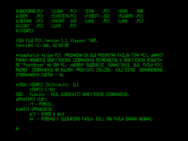

# Пакет программ «View graphics»



ДАК представляет пользователям ПК «Вектор» пакет программ «View graphics», предназначенный для просмотра графической и текстовой информации.
В свое время для ПК «Вектор» было создано несколько графических редакторов - «Карандаш», «Рембрант» и «Draw».
Но для этих редакторов отсутствовали утилиты, позволяющие оперативно осуществить просмотр графических файлов.
Наш пакет решает эту проблему.

Значительные графические возможности ПК «Вектор» позволяют осуществить перенос и демонстрацию графики с других типов ПК.
В нашей стране, помимо ПК «Вектор», получили распространение компьютеры типа «Spectrum» и IBM PC.
В пакете «View graphics» присутствуют две утилиты, позволяющие осуществлять просмотр графики с ПК «Spectrum» (копии графического экрана) и с IBM PC (файлы PCX).

## Утилиты пакета

- `Viewbsv` - утилита просмотра файлов, содержащих копию экрана ПК «Вектор».
- `Viewpcx` - утилита просмотра файлов формата PCX с IBM PC.
- `Viewrbr` - утилита просмотра файлов графического редактора «Рембрант».
- `Viewscr` - утилита просмотра файлов графического редактора «Карандаш».
- `Viewspr` - утилита просмотра файлов графического редактора «Draw».
- `Viewszx` - утилита просмотра файлов, содержащих копию экрана ПК «Spectrum».
- `Viewtxt` - утилита просмотра текстовых файлов.

## Дополнительные файлы

Кроме набора утилит, пакет содержит ряд дополнительных файлов:

- `Backgrnd.pcx`, `Lake.pcx`, `Light.pcx`, `Lush.pcx`, `Oldmill.pcx`, `Tiger.pcx` - графические файлы с IBM PC.
- `Oko.rbr`, `Ter.rbr` - файлы формата «Рембрант». Автор Малинин А.В., г. Владимир.
- `Surface1.bsv` - файл формата BSV (копия графического экрана ПК «Вектор»), `Surface1.pal` - палитра к нему.
- `Finest1.szx`, `Red.szx` - графические файлы с ПК «Spectrum».
- `Viewgrph.hlp` - данное руководство.

## Использование

Каждая утилита откликается на ключ `/?`, выдавая подсказку.
Для запуска утилиты достаточно указать имя графического файла в командной строке.
Если имя задано неявно, то можно просмотреть все файлы, соответствующие этой маске.
Переход на следующий файл осуществляется клавишей `<ВК>`.
Расширение указывать не обязательно - по умолчанию ищется файл с соответствующим расширением.

Например:

```
viewrbr oko
```

Происходит поиск и вывод на экран графического файла `oko.rbr` с текущего диска.

```
viewpcx *
```

Происходит поиск и последовательный вывод на экран всех файлов с расширением `pcx` на текущем диске.
Переход к следующему файлу осуществляется нажатием клавиши `<ВК>`.

```
viewspr a:b*
```

Происходит поиск и последовательный вывод на экран всех файлов, начинающихся с буквы `b` и с расширением `spr` на диске `A:`.
Переход к следующему файлу осуществляется нажатием клавиши `<ВК>`.

Утилита просмотра файла, содержащего копию графического экрана ПК «Вектор», кроме имени файла должна содержать имя файла палитры (расширение - `pal`).
Если имя палитры не будет задано в командной строке, то будет происходить поиск файла палитры с именем, соответствующем имени файла экрана.
Если требуется задать стандартную палитру Бейсика v2.5, то достаточно указать в командной строке ключ `/P`.
Поиск файла палитры осуществляться не будет - палитра автоматически установится.
Для просмотра копий экрана в режиме 512x256 необходимо задать ключ `/H`.
Остальные правила использования `viewbsv` аналогичны другим утилитам пакета «View graphics».

Пример:

```
viewbsv screen/p
```

Происходит поиск и вывод на экран файла `screen.bsv`. Палитра установится в стандарте Бейсик v2.5.

```
viewbsv color abc/h
```

Происходит поиск и вывод на экран файла `color.bsv` с палитрой `abc.pal`.
Экран установится в режиме высокого разрешения - 512x256.

## Просмотр текста (viewtxt)

Наряду с утилитами просмотра графических файлов, в пакет входит утилита просмотра текстовой информации - `viewtxt`.
Эта утилита позволяет осуществить просмотр текстовых файлов длиной до 8-ми мегабайт со строками до 256 символов.
Задание командной строки аналогично графическим утилитам.

Для передвижения по тексту используются следующие клавиши управления:

- Стрелка вправо - смещение по тексту вправо на 8 символов.
- Стрелка влево - смещение по тексту влево на 8 символов.
- Стрелка вверх - смещение на одну строку к началу текста.
- Стрелка вниз - смещение на одну строку к концу текста.
- `СС` + стрелка вверх - смещение на 1-ну страницу к началу текста.
- `СС` + стрелка вниз - смещение на 1-ну страницу к концу текста.
- `BK` - переход к следующему тексту, если в командной строке имя текстового файла задано неявно.
- `АР2` - выход в ОС.

Если `viewtxt` не отзывается на клавиши или неправильно их исполняет - убедитесь, что коды, выдаваемые курсорными стрелками, соответствуют МикроДОС.
В версиях МикроДОС BIOS Fx.x и Dx.x в этом случае следует нажать клавиши `<CC>+<F1>` или дать команду ОС - «0 0 K».
Если в вашей ОС при скроллинге текста вверх-вниз или вправо-влево на экране остается мусор - это значит, что в вашей ОС нестандартное расположение знакомест.
В этом случае вам следует приобрести ОС из серий BIOS Fx.x или Dx.x (последний вариант более предпочтителен).

## Планы

В будущем планируется выпустить универсальный конвертор (преобразователь) графических форматов один в другой.
Автор будет рад получить отклики о своем пакете.
Автор готов поделиться опытом переноса графических изображений с ПК «Spectrum» и IBM PC на «Вектор».

С уважением, Камшилин Дмитрий.

P.S. Если вы хотите быть в курсе последних аппаратных и программных разработок для ПК «Вектор» - заказывайте информационный выпуск «Вектор-Владимир».
Если вы хотите узнать о ПК «Вектор турбо плюс» - выписывайте «Вектор-Владимир».
«Вектор турбо плюс» полностью совместим с ПК «Вектор 06Ц».
Он оснащен 12 МГц процессором Z80, обладает 1..2 МБ памяти и сногсшибательной графикой с 4096 цветами палитры.
Вертикальные, горизонтальные скроллинги и другие «глюки» обеспечены.
Хотите увидеть одновременно на экране 1024 цветов?

## Состав

| Файл | Описание |
|---|---|
| `viewgrph.fdd` | Образ диска с пакетом программ |
| `viewgrph.png` | Скриншот |
| `original.7z` | Оригинальная документация в исходной кодировке |
