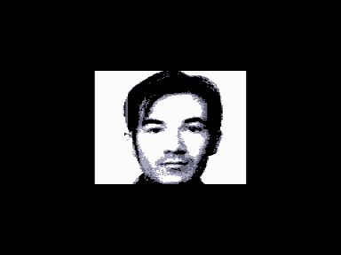

Утилита анимации MFI-файлов (Microfilm)

Утеряны анимационные файлы: 1X3.MFI, GLOBUS.MFI.

Файлы с расширением MFI (принят следующий стандарт на август 1998 года):

Файлы формата MFI можно условно разделить на 2 части:
1. Заголовок (фиксированная длина - 256 байт)
2. Видеоданные (длина от 2 до 192 Кб, в зависимости от числа кадров)

В заголовке
1. Палитра (16 байт), цвета по порядку, от 0 до 15.
2. Байт, определяющий цвет бордюра (младшие 4 бита) и режим экрана (бит 4, 0-256x256/1-512x256). Т.е. это то, что будет записано в порт 2, за исключением моментов опроса клавиатуры.
3. Байт, определяющий задействованные плоскости экрана:
бит 0 - E000-FFFF
бит 1 - C000-DFFF
бит 2 - A000-BFFF
бит 3 - 8000-9FFF
4. Дальше идут двухбайтные пары - номер кадра и пауза после кадра. Единица измерения паузы - 30004 такта (примерно 10 мс) на Векторе с КР580. В конце последовательности номеров кадров и пауз ставится байт FF (признак того, что нужно начать показ кадров сначала).
Видеоданные
Возможны 3 варианта размера кадра, в зависимости от количества задействованных экранных плоскостей
1 плоскость - 2 Кб (в файле может быть до 96 кадров)
2 плоскости - 4 кб (в файле может быть до 48 кадров)
3 или 4 плоскости - 8 кб (в файле может быть до 24 кадров)
Нужно отметить, что при использовании кадров, состоящих из 3х плоскостей из за особенностей организации чтения с диска и расчета адресов кадров в программе VMFI последние 2 Кб кадра из 8 не будут выводиться на экран, но должны присутствовать в файле MFI.

Строение кадра
Данные кадра читаются из памяти в прямом порядке (от меньших адресов к большим). Кадр выводится по "двухстрочным блокам" сверху вниз.
"Двухстрочный блок" - фрагмент размером 128x2 точки (в режиме 256x256) или 256x2 точки (в режиме 512x256). Подробно соответствие адресов байт в кадре и их расположения на экране описано в прилагаемом файле "Строение кадров MFI.xls".

Описание составил [Иван Городецкий](../../authors/ivagor) (iig1@mail.ru), 26.02.2009

