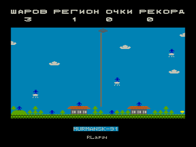

Вы — шпион-инопланетянин на планете Земля, пытаетесь переправить воздушный шарик с анализом из изувеченной коровы на свою летающую тарелку.
Обстановка крайне неблагоприятная: на тучках сидят гигантские человекоподобные роботы, свободные тучки накачаны добела атмосферным электричеством, порывистый ветер того и гляди занесет шарик в тучку, а неопытный пилот тарелки нервничает и хаотично молотит лазером.
Еще никогда вы не были так близки к провалу.

