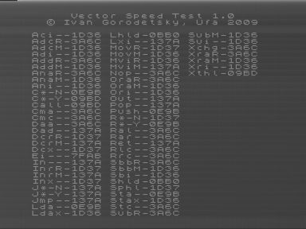

Тест скорости для Вектора-06Ц и подобных (Вектор-старт 1200, Криста-2, ПК-6128Ц) компьютеров.
Исходный текст прилагается.
Подсчитывается, сколько команд КР580ВМ80 всех основных групп будет выполнено за время между прерываниями.

Прилагается снимок экрана реального Вектора-06Ц с результатом теста.

Не тестируются команды di, pchl, rst, hlt.

См. также [Vector Speed Test (ВИ53)](../vstvi53) — аналогичный тест, пользующийся для измерений таймером ВИ53.

Чтобы загрузить тест на реальный компьютер через магнитофонный вход, его нужно преобразовать в wav-файл с использованием утилиты ROM2WAV (для Вектора-06Ц, Вектора-старт 1200, ПК-6128Ц) или ROM2WAV for Krista-2 (Криста-2).
Эти утилиты можно найти на сайте Александра Тимошенко [http://vector06c.narod.ru/&nbsp](http://vector06c.narod.ru/&nbsp);в разделе "Эмуляторы".
Если у Вас есть возможность, пришлите результаты мне (iig1@mail.ru) или приведите их на форуме zx.pk.ru -> Отечественные компьютеры -> Вектор.

Очень интересуют результаты компьютеров Вектор-старт 1200, Криста-2, ПК-6128Ц, Векторов с адаптерами Z80 разных вариантов.

Максимальная тактовая частота, до которой (включительно) тест будет корректно определять быстродействие всех команд - 5,7 МГц.

Максимальная тактовая частота, до которой (включительно) тест будет сохранять работоспособность - 7,25 МГц.

