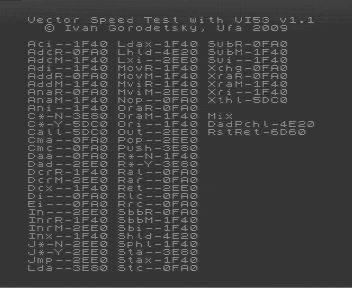

Vector Speed Test with VI53 v1.4.

Тест быстродействия для Вектора-06Ц и подобных (ПК-6128Ц) компьютеров. Исходный текст прилагается.

Подсчитывается сколько тактов таймера пройдет при выполнении 2000 команд процессора.
Тестируются все команды, кроме halt.

См. также [Vector Speed Test](../vst) — аналогичный тест, пользующийся для измерений кадровым прерыванием.

