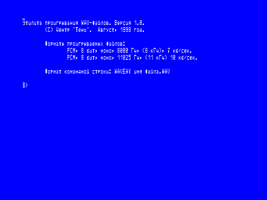
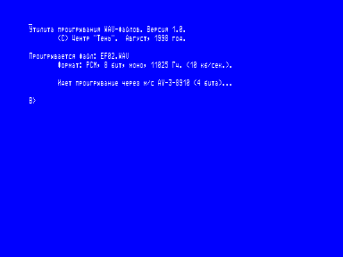

Данная программа предназначена для проигрывания WAV-файлов компьютера IBM на ПК «Вектор-06Ц».
В качестве звукового устройства используется плата музыкального контроллера «Sound-Tracker» (м/с AY-3-8910).

Форматы проигрываемых файлов:

PCM, 8 бит, моно, 8000 Гц, (8 кГц), 7 кб/сек.

PCM, 8 бит, моно, 11025 Гц, (11 кГц) 10 кб/сек.

Рекомендуется запускать из OS-T34 или [T-72](../os_t72), при этом будут корректно отображаться сообщения программы на русском языке (КОИ-8).

Исходники на ASM.

