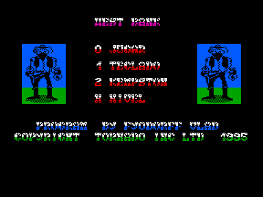
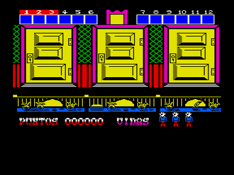

Адаптация игры с ZX Spectrum.

Вы — кассир западного банка и вам необходимо отстреливаться из-за прилавка от бандитов, пытающихся  вас ограбить.
Одновременно вам надлежит  принимать  вклады от лояльных граждан,  которых  не всегда можно отличить от налетчиков.
Перед вами 3 двери, и в каждой может возникнуть фигура вкладчика или бандита.
Кроме этого, есть еще и карлик, который носит одновременно семь шляп.
В перерывах между перестрелками и денежными операциями вы должны улучить момент и заработать несколько очков,  сбив пулями его шляпы одну за другой.
Под  самой нижней  шляпой лежит либо денежный мешок, либо бомба, которая лишает вас первой жизни.

Всего имеется 10 дверей, которые можно осматривать по очереди, и когда знак доллара над всеми дверьми начинает мигать, это значит,что вы приняли от выживших клиентов достаточную сумму денег для перехода в следующий уровень игры.
Но перед этим Вы должны уложить в перестрелке трех зловещих типов, или они пошлют вас к праотцам.
На следующих уровнях двери открываются чаще, причем на их порогах появляется все больше и больше бандитов и все меньше добрых вкладчиков.

West Bank — еще одна версия электронного тира, но если ваши запросы не исчерпываются проверкой  реакции  на предел возможного,  вас ждет разочарование.

